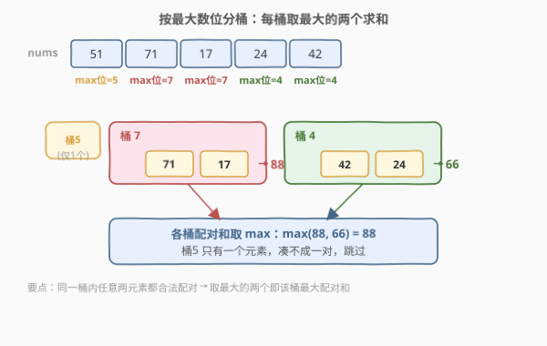
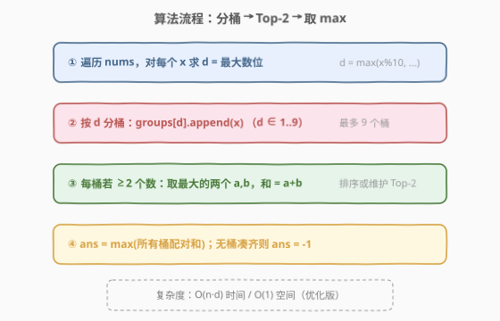
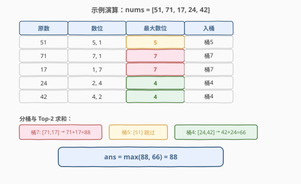

# 数组中的最大数对和

- **题目名称**：数组中的最大数对和
- **链接**：[2815. 数组中的最大数对和](https://leetcode.cn/problems/max-pair-sum-in-an-array/)
- **难度**：简单
- **标签**：数组、哈希表

## 1. 题目概述

给你一个下标从 **0** 开始的整数数组 `nums`。请你从 `nums` 中找出和 **最大** 的一对数，且这两个数**数位上最大的数字相等**。

返回最大和，如果不存在满足题意的数字对，返回 `-1`。

**示例 1**：

```text
输入：nums = [51,71,17,24,42]
输出：88
解释：
i = 1 和 j = 2，nums[i] 和 nums[j] 数位上最大的数字相等，且这一对的总和 71 + 17 = 88。
i = 3 和 j = 4，nums[i] 和 nums[j] 数位上最大的数字相等，且这一对的总和 24 + 42 = 66。
可以证明不存在其他数对满足数位上最大的数字相等，所以答案是 88。
```

**示例 2**：

```text
输入：nums = [1,2,3,4]
输出：-1
解释：不存在数对满足数位上最大的数字相等。
```

**约束条件**：

- $2 \le \text{nums.length} \le 100$
- $1 \le \text{nums[i]} \le 10^4$

> 💡 本题核心是「**按最大数位分组 + 桶内取 Top-2 求和**」。关键词「数位上最大的数字相等」天然地把元素聚成 1–9 共 9 个桶；要求「和最大的一对」等价于在**同一个桶里取最大的两个数**。本质是哈希分组 + 贪心取极值，承接 [274. H 指数](https://leetcode.cn/problems/h-index/) 的计数分桶思想与 [448. 找到所有数组中消失的数字](../0401-0500/448_找到所有数组中消失的数字.md) 的值域哈希。

---

## 2. 解题思路

### 2.1 暴力思路：枚举所有数对

双重循环枚举所有 $(i, j)$ 对（$i < j$），对每对分别求两个数的「最大数位」，若相等就用两数之和更新答案。时间 $O(n^2 \cdot d)$（$d$ 为数位长度，$\le 5$）。$n \le 100$ 时约 $10^4$ 量级，能过。

> ⚠️ 暴力法的硬伤：① $O(n^2)$ 重复计算同一元素的最大数位多次；② 没有利用「**只有同一最大数位的元素才可能配对**」这一结构，做了大量无用比较。正解只需一次遍历即可分组。

### 2.2 核心观察：按最大数位分桶 + 桶内 Top-2

关键观察：两个数能配对，当且仅当它们的**最大数位相等**。最大数位取值只有 $1 \sim 9$（共 9 种），因此可以：

1. 对每个数算出最大数位 $d \in [1, 9]$；
2. 按 $d$ 分桶（哈希表 / 大小为 10 的数组）；
3. 每个桶内若有 $\ge 2$ 个数，取**最大的两个**之和——同一桶里最大的两个数之和，就是该桶能贡献的最大配对和；
4. 所有桶的最大配对和取 $\max$，若没有任何桶凑齐一对则返回 $-1$。



> 💡 **为什么取 Top-2 就够？** 配对只要求「最大数位相等」，不限制下标关系或数值大小，所以同一桶内任意两个数都合法。要求和最大，自然取最大的两个。这就是 [53. 最大子数组和](../0001-0100/53_最大子数组和.md) 里「贪心取极值」思想在分组场景的复用。

### 2.3 算法流程图



**完整步骤**：

1. **建桶**：`groups = map<int, list>`（key = 最大数位 1–9）
2. **遍历**：对每个 `x ∈ nums`：
   - 算 $d = \max\text{Digit}(x)$
   - `groups[d].append(x)`
3. **取极值**：`ans = -1`；对每个桶 `groups[d]`：
   - 若桶内元素数 $< 2$，跳过（凑不成一对）
   - 否则取最大的两个 $a, b$，`ans = max(ans, a + b)`
4. **返回** `ans`

### 2.4 示例演算

以 `nums = [51,71,17,24,42]` 为例：



| 原数 | 数位 | 最大数位 | 入桶 |
|------|------|----------|------|
| 51 | 5,1 | **5** | 桶 5 |
| 71 | 7,1 | **7** | 桶 7 |
| 17 | 1,7 | **7** | 桶 7 |
| 24 | 2,4 | **4** | 桶 4 |
| 42 | 4,2 | **4** | 桶 4 |

分桶结果与取 Top-2：

| 桶(最大数位) | 元素 | Top-2 | 配对和 |
|--------------|------|-------|--------|
| 7 | [71, 17] | 71, 17 | 88 |
| 5 | [51] | — | 凑不成对，跳过 |
| 4 | [24, 42] | 42, 24 | 66 |

$\max(88, 66) = 88$，最终返回 `88`，与示例 1 一致。

> 💡 示例 2 `[1,2,3,4]` 中每个数的最大数位各不相同（1/2/3/4），每个桶只有 1 个元素，没有桶能凑齐一对，故返回 $-1$。

---

## 3. 参考代码

### C++

```cpp
class Solution {
    int maxDigit(int x) {
        int d = 0;
        for (; x; x /= 10) d = max(d, x % 10);
        return d;
    }
public:
    int maxSum(vector<int>& nums) {
        unordered_map<int, vector<int>> groups;
        for (int x : nums) groups[maxDigit(x)].push_back(x);
        int ans = -1;
        for (auto& [d, arr] : groups) {
            if (arr.size() < 2) continue;          // 凑不成一对
            sort(arr.rbegin(), arr.rend());         // 降序，取最大的两个
            ans = max(ans, arr[0] + arr[1]);
        }
        return ans;
    }
};
```

### Python

```python
class Solution:
    def maxSum(self, nums: List[int]) -> int:
        from collections import defaultdict
        groups = defaultdict(list)
        for x in nums:
            d = max(int(c) for c in str(x))   # 最大数位
            groups[d].append(x)
        ans = -1
        for arr in groups.values():
            if len(arr) < 2:
                continue
            arr.sort(reverse=True)            # 降序，取最大的两个
            ans = max(ans, arr[0] + arr[1])
        return ans
```

> 💡 C++ 用**算术取模**求最大数位（`x % 10` / `x /= 10`），体现底层功底；Python 借 `str(x)` 直接遍历字符更简洁。两版核心逻辑一致：分桶 → 桶内降序取前两个求和 → 全局取最大。

---

## 4. 复杂度分析

| 维度 | 复杂度 | 说明 |
|------|--------|------|
| **时间复杂度** | $O(n \cdot d + n \log n)$ | 每个数求最大数位 $O(d)$（$d \le 5$，因 $\text{nums[i]} \le 10^4$）；桶内排序总体 $O(\sum n_k \log n_k) \le O(n \log n)$ |
| **空间复杂度** | $O(n)$ | 哈希表存全部元素 |

> ⚠️ 因 $n \le 100$，排序开销可忽略。若用第 5 节的「桶内只留 Top-2」优化，空间可降到 $O(1)$（仅 9 个桶各存 2 个），时间降到 $O(n \cdot d)$，无需排序。

---

## 5. 扩展：桶内只维护 Top-2（$O(1)$ 空间）

最大数位只有 $1 \sim 9$ 共 9 种，每个桶只需记住「最大」和「次大」两个值即可，无需存全部元素。遍历时实时维护：

```cpp
class Solution {
    int maxDigit(int x) {
        int d = 0;
        for (; x; x /= 10) d = max(d, x % 10);
        return d;
    }
public:
    int maxSum(vector<int>& nums) {
        int first[10]{};   // 各桶最大值
        int second[10]{};  // 各桶次大值
        for (int x : nums) {
            int d = maxDigit(x);
            if (x >= first[d]) {            // 刷新最大，原最大降为次大
                second[d] = first[d];
                first[d] = x;
            } else if (x > second[d]) {     // 仅刷新次大
                second[d] = x;
            }
        }
        int ans = -1;
        for (int d = 1; d <= 9; d++) {
            if (second[d] > 0)              // 次大>0 说明该桶至少 2 个数(nums[i]>=1)
                ans = max(ans, first[d] + second[d]);
        }
        return ans;
    }
};
```

要点：

- `x >= first[d]` 用 `>=` 而非 `>`：当出现与当前最大相等的值（如两个 71）时也能正确把其中一个降为次大，凑齐一对。
- 用 `second[d] > 0` 判断「至少 2 个元素」成立，前提是 $\text{nums[i]} \ge 1$（本题满足）。
- 单次遍历 $O(n \cdot d)$，空间 9 个桶 × 2 = $O(1)$，无需排序。

> 💡 这是「**值域有限 → 用数组代替哈希表**」的典型套路，与 [448. 找到所有数组中消失的数字](../0401-0500/448_找到所有数组中消失的数字.md) 的下标当哈希键同源：值域小且已知时，定长数组比 `unordered_map` 更快更省。

---

## 6. 面试要点

1. **为什么同一桶里取最大的两个就最优？**

   - 配对条件只要求「最大数位相等」，对下标、数值无任何额外限制，所以同一桶内任意两元素都构成合法对。要求和最大，自然贪心取最大的两个——把「枚举所有对」降为「每桶取 Top-2」。

2. **最大数位为什么只有 1–9？**

   - $\text{nums[i]} \ge 1$，故每位至少有 1 个非零数位，最大数位 $\ge 1$；而数位是十进制单字符，最大为 9。所以桶数固定为 9，可用定长数组代替哈希表。

3. **维护 Top-2 时为什么用 `>=` 而不是 `>`？**

   - 处理与当前最大值相等的元素时（如桶里已有 71，又来一个 71），用 `>` 会漏掉次大值，导致这一对本可配对却被判为「不足两个」。`>=` 能把原最大正确下移为次大，凑齐一对。

4. **如何判断一个桶「凑不齐一对」？**

   - 存全部元素时看 `size() < 2`；只维护 Top-2 时看 `second[d] > 0`（依赖 $\text{nums[i]} \ge 1$）。两种判据等价。

5. **`nums[i]` 可能为 0 时该注意什么？**

   - `second[d] > 0` 的判据会失效（0 也是合法值）。此时需额外维护 `count[d]` 计数，或用 `has_second[d]` 布尔标记，避免把「值为 0」误判为「没有次大」。

> 💡 **一句话总结**：2815 是哈希分桶的入门题——按最大数位（1–9）把元素归入 9 个桶，每桶取最大的两个求和，全局取最大即为答案。$O(n \cdot d)$ 时间、$O(1)$ 空间（优化版）。

---

## 7. 同类练习题

- [274. H 指数](https://leetcode.cn/problems/h-index/)：按引用数分桶计数，值域有限用数组代替哈希，同源思想
- [448. 找到所有数组中消失的数字](../0401-0500/448_找到所有数组中消失的数字.md)：下标当哈希键的原地标记，值域哈希的姊妹题
- [136. 只出现一次的数字](https://leetcode.cn/problems/single-number/)：按值分组的极简场景（出现次数），异或取极值
- [347. 前 K 个高频元素](https://leetcode.cn/problems/top-k-frequent-elements/)：分桶后取 Top-K 的进阶版（堆 / 桶排序）
- [258. 各位相加](https://leetcode.cn/problems/add-digits/)：数位运算入门题，熟悉按位取数的基本功
