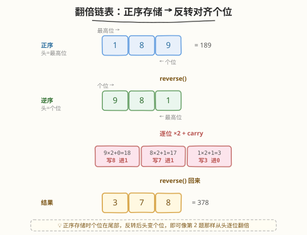
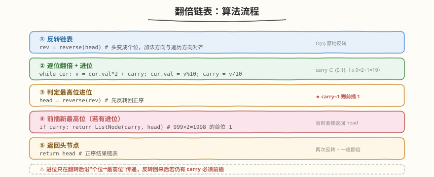
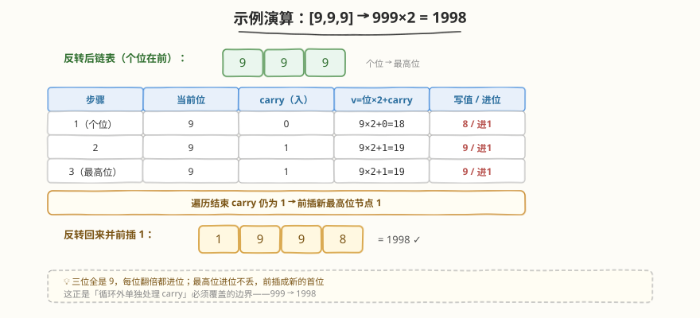

# LeetCode 翻倍以链表形式表示的数字 题解

## 1. 题目概述

- **标题 / 题号**：翻倍以链表形式表示的数字（#2816，medium）
- **链接**：https://leetcode.cn/problems/double-a-number-represented-as-a-linked-list/
- **难度**：中等
- **标签**：栈、链表、数学

**题意**：给你一个**非空**链表的头节点 `head`，表示一个**不含前导零**的非负整数。每位数字按**正序方式存储**（头节点是最高位）。将该链表表示的数字**翻倍**后，返回头节点 `head`。

**示例 1**：

```text
输入：head = [1,8,9]
输出：[3,7,8]
解释：链表表示数字 189，翻倍后 189 × 2 = 378，返回链表 3 → 7 → 8。
```

**示例 2**：

```text
输入：head = [9,9,9]
输出：[1,9,9,8]
解释：链表表示数字 999，翻倍后 999 × 2 = 1998，返回链表 1 → 9 → 9 → 8。
```

**约束**：

- 链表中节点数目在范围 `[1, 10^4]` 内
- `0 <= Node.val <= 9`
- 生成的输入满足：链表表示一个不含前导零的数字，除了数字 `0` 本身

> 💡 这是一道链表题，但本质仍是**模拟竖式运算**。与 [2. 两数相加](../0001-0100/2_两数相加.md) 的关键区别在于**存储方向**：第 2 题是逆序存储（头=个位），加法方向天然与遍历方向一致；本题是**正序存储**（头=最高位），翻倍的进位要从个位（尾部）向最高位（头部）传递，方向与遍历方向相反。如何"从低位开始处理"是本题的破题点。

## 2. 解题思路

### 2.1 暴力思路：转整数翻倍再转链表（会溢出）

最直白的想法：遍历链表还原成整数 `num`，翻倍 `num *= 2`，再逐位拆成新链表。

```text
num = 0; 遍历 head: num = num * 10 + val
num *= 2
if num == 0: return ListNode(0)
while num > 0:
    前插 ListNode(num % 10); num //= 10
```

> ⚠️ 致命缺陷：链表最长 $10^4$ 位，而 `int64` 仅约 19 位十进制，`C++/Java` 必然溢出。即便 `Python` 大整数不溢出，"转数字"也偏离了**链表逐节点操作**的本意，面试官不会认可。正确做法是直接在链表上模拟。

### 2.2 核心观察：反转链表对齐个位

翻倍（乘法）的进位规则与加法相同：**从最低位（个位）开始逐位处理，进位向高位传递**。但本题正序存储，个位在**尾部**——遍历方向（从头=高位）与进位方向（从尾=低位→头）相反。

**破题关键**：把链表**反转**一次，头就变成个位，此时遍历方向与进位方向一致，即可像 [第 2 题](../0001-0100/2_两数相加.md) 那样从头逐位翻倍。处理完再反转回来即可。



上图展示了示例 1 `[1,8,9]`（189）的完整流程：

- 反转后 `[9,8,1]`，头是个位 9
- 个位 `9×2+0=18`，写 8 进 1
- 十位 `8×2+1=17`，写 7 进 1
- 百位 `1×2+1=3`，写 3 进 0
- 反转回来得 `[3,7,8]` = 378

> 💡 **关键洞察**：正序存储的难点只是"加法方向与遍历方向相反"。一次 $O(n)$ 反转就把它降维成第 2 题的逆序存储——这是所有"正序链表逐位运算"题（[445 两数相加 II](https://leetcode.cn/problems/add-two-numbers-ii/)、[369 给单链表加一](https://leetcode.cn/problems/plus-one-linked-list/)）的通用钥匙。除反转外，**栈**或**递归**也能达到"从低位访问"的效果，但反转是 $O(1)$ 额外空间的唯一通用解。

**两个细节**：

1. **进位范围**：每位 `val` 为 `0~9`，`val×2 ∈ 0~18`，加上低位进位至多 `19`，故 `carry ∈ {0, 1}`，永远不会超过 1。
2. **最高位仍有进位**：遍历完所有位后若 `carry == 1`（如示例 2 的 `999×2=1998`），需在反转后的结果**前插**一个值为 1 的新节点作为新最高位。

### 2.3 算法流程图



**完整步骤**：

1. **反转链表**：`rev = reverse(head)`，头节点变为个位。
2. **逐位翻倍**：`cur = rev`，`carry = 0`，遍历每一位：`v = cur.val * 2 + carry`，`cur.val = v % 10`，`carry = v / 10`，`cur = cur.next`。
3. **反转回来**：`head = reverse(rev)`，恢复正序。
4. **判定最高位进位**：若 `carry == 1`，返回 `ListNode(1, head)`（前插新最高位）；否则返回 `head`。

> ⚠️ 第 3、4 步顺序不能反：必须**先反转回来**再判定 `carry` 前插。若先在反转表尾部追加节点再反转，逻辑等价但容易在边界出错；前插法最直接——新节点天然是正序结果的最高位。

### 2.4 示例演算

以 `head = [9,9,9]`（示例 2，999）为例，翻转后链表仍为 `[9,9,9]`（回文），从个位逐位翻倍：



| 步骤 | 当前位 | carry（入） | `v = 位×2 + carry` | 写值 | carry（出） |
|------|--------|------------|---------------------|------|------------|
| 1（个位） | 9 | 0 | `9×2+0=18` | 8 | 1 |
| 2 | 9 | 1 | `9×2+1=19` | 9 | 1 |
| 3（最高位） | 9 | 1 | `9×2+1=19` | 9 | 1 |
| 收尾 | — | 1 | — | 前插 1 | 0 |

反转回来后 `[9,9,8]` 再前插进位 `1`，得 `[1,9,9,8]` = 1998。

> 💡 第 3 步最高位翻倍 `9×2+1=19` 仍产生进位，遍历结束后 `carry == 1` 不为零，必须前插。这是"循环外单独处理 `carry`"必须覆盖的边界——三位全是 9 是最坏情况，每位都进位，且最高位进位不丢。

## 3. 参考代码

### C++

```cpp
// 翻倍以链表形式表示的数字.cpp —— 反转链表 + 逐位翻倍 + 反转回来
// 编译: g++ -O2 -std=c++17 翻倍以链表形式表示的数字.cpp -o double_it
struct ListNode {
    int val;
    ListNode* next;
    ListNode() : val(0), next(nullptr) {
    }
    ListNode(int x) : val(x), next(nullptr) {
    }
    ListNode(int x, ListNode* n) : val(x), next(n) {
    }
};

class Solution {
    ListNode* reverse(ListNode* h) {
        ListNode* prev = nullptr;
        while (h) {
            ListNode* nxt = h->next;
            h->next = prev;
            prev = h;
            h = nxt;
        }
        return prev;
    }

  public:
    ListNode* doubleIt(ListNode* head) {
        ListNode* rev = reverse(head);   // 反转：头变个位，进位方向与遍历方向一致
        ListNode* cur = rev;
        int carry = 0;
        while (cur) {
            int v = cur->val * 2 + carry;
            cur->val = v % 10;            // 当前位写值
            carry = v / 10;               // 向高位进位
            cur = cur->next;
        }
        head = reverse(rev);             // 反转回正序
        if (carry) {                     // 最高位仍有进位，前插新最高位
            return new ListNode(carry, head);
        }
        return head;
    }
};
```

### Python

```python
from typing import Optional


class ListNode:
    def __init__(self, val=0, next=None):
        self.val = val
        self.next = next


class Solution:
    def doubleIt(self, head: Optional[ListNode]) -> Optional[ListNode]:
        def reverse(h):
            prev = None
            while h:
                h.next, prev, h = prev, h, h.next
            return prev

        rev = reverse(head)              # 反转：头变个位
        cur = rev
        carry = 0
        while cur:
            v = cur.val * 2 + carry
            cur.val = v % 10             # 当前位写值
            carry = v // 10               # 向高位进位
            cur = cur.next
        head = reverse(rev)             # 反转回正序
        if carry:                       # 最高位仍有进位，前插新最高位
            return ListNode(carry, head)
        return head
```

> 💡 两种语言结构完全对应。`reverse` 是 [206. 反转链表](https://leetcode.cn/problems/reverse-linked-list/) 的标准三指针模板，原地 $O(1)$ 空间。注意 Python 的元组解包写法 `h.next, prev, h = prev, h, h.next`：右侧先整体求值再赋值，等价于 C++ 的三步交换，避免引入临时变量。

## 4. 复杂度分析

| 维度 | 复杂度 | 说明 |
|------|--------|------|
| **时间复杂度** | $O(n)$ | 两次反转各一趟 + 一趟翻倍遍历，共 3 趟线性扫描，`n` 为链表长度 |
| **空间复杂度** | $O(1)$ | 反转为原地指针操作，只用 `carry`、`cur` 等 `O(1)` 辅助变量；不计返回链表本身 |

> ⚠️ 本解法额外空间为 $O(1)$。若改用**栈**（把节点压栈再出栈处理），空间为 $O(n)$，代码更直观但常数更大。面试中优先给反转解法展示 $O(1)$ 空间，再提栈解法作为备选。

## 5. 扩展：一趟遍历前瞻法（$O(1)$ 空间一趟）

上述反转解法走了 3 趟。本题有个针对"翻倍"的特殊技巧，可**一趟完成、$O(1)$ 额外空间**，无需反转。

**观察**：翻倍时，当前位 `i` 收到的进位来自低位 `i+1` 的翻倍结果是否 $\geq 10$。而进位只可能取 `0` 或 `1`：

- `i+1` 位的原值 `val` 翻倍为 `val×2`（取值 `0~18`），加上它自身的进位至多 `19`。
- **`val×2 ≥ 10` 当且仅当 `val ≥ 5`**（`5×2=10`），且无论该位自身是否再收到进位，`carry` 输出恒为 `1`（因为 `val ≤ 4` 时 `val×2+1 ≤ 9` 也不进位）。

因此，**当前位收到的进位 = 1 当且仅当其后继节点的原值 ≥ 5**。从左到右遍历时，由于只修改当前 `cur.val` 而后继 `cur.next.val` 尚未被改动，读到的都是原值，前瞻判断成立：

```text
若 head.val >= 5:               # 最高位翻倍会产生进位，前插一个 0 节点（将变成 1）
    head = ListNode(0, head)
cur = head
while cur:
    carry = 1 if (cur.next 且 cur.next.val >= 5) else 0
    cur.val = (cur.val * 2 + carry) % 10
    cur = cur.next
return head
```

以 `[1,8,9]` 验证（不前插，因 `head.val=1 < 5`）：

- `1` 的后继 `8 ≥ 5` → carry=1 → `1×2+1=3`
- `8` 的后继 `9 ≥ 5` → carry=1 → `8×2+1=17 → 7`
- `9` 无后继 → carry=0 → `9×2=18 → 8`
- 结果 `[3,7,8]` ✓

以 `[9,9,9]` 验证（`head.val=9 ≥ 5` 前插 0 → `[0,9,9,9]`）：

- `0` 的后继 `9 ≥ 5` → carry=1 → `0×2+1=1`
- 三次 `9`：后继 `≥5` 或无后继依次得 `9,9,8`
- 结果 `[1,9,9,8]` ✓

```cpp
class Solution {
  public:
    ListNode* doubleIt(ListNode* head) {
        if (head->val >= 5) {                   // 最高位翻倍会进位，前插 0 节点
            head = new ListNode(0, head);
        }
        for (ListNode* cur = head; cur; cur = cur->next) {
            int carry = (cur->next && cur->next->val >= 5) ? 1 : 0;
            cur->val = (cur->val * 2 + carry) % 10;
        }
        return head;
    }
};
```

> 💡 这是"翻倍"专属的优雅解法——只对乘数 2 成立（因为 $2 \times 9 + 1 = 19$，进位恒为 0 或 1，且阈值 5 整齐）。若改成"乘以 3"或一般加法，进位范围扩大、阈值不再单调，前瞻法失效，仍需回到反转/栈。面试中可先给通用反转解法，再点出此特化技巧，体现对问题结构的深入理解。

## 6. 面试要点

1. **本题与第 2 题的核心区别是什么？**

   - 存储方向不同。第 2 题（[两数相加](../0001-0100/2_两数相加.md)）是**逆序存储**（头=个位），进位方向与遍历方向天然一致，直接从头逐位相加即可。本题是**正序存储**（头=最高位），进位要从个位（尾部）传向最高位（头部），方向相反，需要先反转/入栈/递归来对齐低位。

2. **为什么选反转而不是栈或递归？**

   - 反转是 $O(1)$ 额外空间，栈和递归都是 $O(n)$ 空间。反转后逻辑与第 2 题完全一致，可复用"逐位运算 + carry"模板。递归在 $10^4$ 节点时有栈溢出风险，最不推荐。

3. **最高位的进位如何处理？为什么不在循环里统一？**

   - 正序存储下，最高位是原链表头部。反转后它在尾部，循环能覆盖它的翻倍；但翻倍后若仍产生进位（如 `9×2+1=19`），这个 `carry` 没有更高位可写，必须在循环外单独前插一个新节点。前插法直接 `ListNode(carry, head)` 最简洁。

4. **进位 carry 会超过 1 吗？**

   - 不会。每位 `val ∈ [0,9]`，翻倍 `val×2 ∈ [0,18]`，加低位进位至多 `19`，`carry = v / 10 ∈ {0, 1}`。数学上保证 `carry` 恒为 0 或 1，所以前插节点值固定为 1。

5. **前瞻法为什么只对"乘 2"有效？**

   - 乘 2 时进位恒为 0/1，且"是否进位"仅由后继原值是否 $\geq 5$ 决定，与更低位无关，可一趟前瞻判定。乘 3 时进位可达 2，且阈值随进位链变化，前瞻失效，只能用反转/栈。技巧是问题的结构特化，不可强行推广。

> 💡 **一句话总结**：正序链表翻倍，本质是"对齐个位再逐位进位"。通用解法是反转链表 + 逐位翻倍 + 反转回来，$O(n)$ 时间、$O(1)$ 空间；进位只取 0/1，最高位进位前插新节点。掌握后可迁移到 [445 两数相加 II](https://leetcode.cn/problems/add-two-numbers-ii/)、[369 给单链表加一](https://leetcode.cn/problems/plus-one-linked-list/) 等所有"正序链表逐位运算"题。

## 同类练习题

| # | 题目 | 与本题的关联 |
|---|------|-------------|
| 2 | [两数相加](https://leetcode.cn/problems/add-two-numbers/) | 逆序存储的逐位加法，对照本题的正序存储，体会存储方向如何决定是否需要反转 |
| 445 | [两数相加 II](https://leetcode.cn/problems/add-two-numbers-ii/) | 正序存储两数相加，同样需反转/栈对齐低位，本题的单数翻倍是其退化情形 |
| 206 | [反转链表](https://leetcode.cn/problems/reverse-linked-list/) | 本解法的核心子操作，三指针原地反转模板 |
| 369 | [给单链表加一](https://leetcode.cn/problems/plus-one-linked-list/) | 正序链表加一，进位逻辑与本题一致（⚠️ 付费题） |
| 415 | [字符串相加](https://leetcode.cn/problems/add-strings/) | 字符串模拟竖式加法，"逐位运算 + carry"内核的数组版本 |
