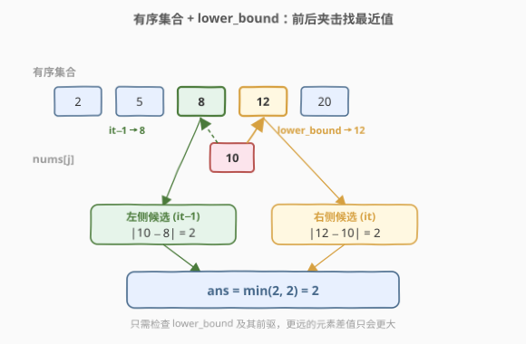
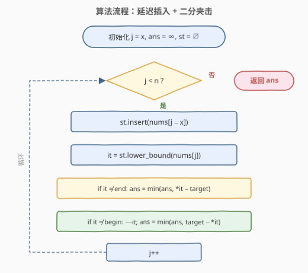
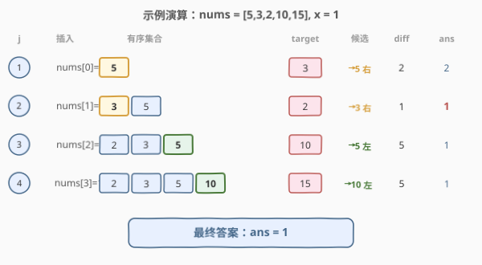

# 限制条件下元素之间的最小绝对差

- **题目名称**：限制条件下元素之间的最小绝对差
- **链接**：[2817. 限制条件下元素之间的最小绝对差](https://leetcode.cn/problems/minimum-absolute-difference-between-elements-with-constraint/)
- **难度**：中等
- **标签**：数组、二分查找、有序集合

## 1. 题目概述

给你一个下标从 **0** 开始的整数数组 `nums` 和一个整数 `x`。请你找到数组中下标距离至少为 $x$ 的两个元素的**差值绝对值**的**最小值**。

换言之，找到两个下标 $i$ 和 $j$，满足 $\text{abs}(i - j) \ge x$ 且 $\text{abs}(\text{nums}[i] - \text{nums}[j])$ 的值最小。返回该最小值。

**示例 1**：

```text
输入：nums = [4,3,2,4], x = 2
输出：0
解释：选择 nums[0] = 4 和 nums[3] = 4，下标距离 |0−3| = 2 ≥ 2，差值绝对值为 0。
```

**示例 2**：

```text
输入：nums = [5,3,2,10,15], x = 1
输出：1
解释：选择 nums[1] = 3 和 nums[2] = 2，下标距离 |1−2| = 1 ≥ 1，差值绝对值为 1。
```

**示例 3**：

```text
输入：nums = [1,2,3,4], x = 3
输出：3
解释：选择 nums[0] = 1 和 nums[3] = 4，下标距离 |0−3| = 3 ≥ 3，差值绝对值为 3。
```

**约束条件**：

- $1 \le \text{nums.length} \le 10^5$
- $1 \le \text{nums[i]} \le 10^9$
- $0 \le x < \text{nums.length}$

> 💡 本题核心是「**有序集合 + 二分查找最近值**」。下标约束 $\text{abs}(i - j) \ge x$ 意味着对每个 $j$，合法的 $i$ 落在 $[0, j - x]$ 中——这是一个随 $j$ 右移而**单调扩张**的候选集。维护该集合为**有序集合**（C++ `std::set` / Python `SortedList`），每次用 `lower_bound` 二分定位与 $\text{nums}[j]$ 最接近的值即可，将暴力的 $O(n^2)$ 降到 $O(n \log n)$。

---

## 2. 解题思路

### 2.1 暴力思路：枚举所有数对

双重循环枚举所有 $(i, j)$ 对（$i < j$），仅当 $j - i \ge x$ 时计算 $\text{abs}(\text{nums}[i] - \text{nums}[j])$ 并更新最小值。

```text
for j in x..n-1:
    for i in 0..j-x:
        ans = min(ans, abs(nums[i] - nums[j]))
```

时间 $O(n^2)$。当 $n = 10^5$ 时约 $10^{10}$ 次比较，**必然超时**。

> ⚠️ 暴力法的硬伤：对每个 $j$，从 $0$ 到 $j - x$ **线性扫描**所有候选值，没有利用「候选集是单调增长的」这一结构——每个新加入的 $\text{nums}[j - x]$ 只需插入一次，后续所有 $j$ 都能复用。

### 2.2 核心观察：有序集合 + 二分找最近值

关键观察来自**对称化简 + 候选集单调扩张**：

1. **对称化简**：$\text{abs}(i - j) \ge x$ 是对称的，不妨只考虑 $i < j$（即 $j - i \ge x$）。
2. **候选集扩张**：对每个 $j \ge x$，合法的 $i$ 范围是 $[0, j - x]$。当 $j$ 从 $x$ 递增到 $n - 1$ 时，每次只有一个新元素 $\text{nums}[j - x]$ 加入候选集——**只增不减**。
3. **有序维护**：将候选集存入**有序集合**（平衡 BST），插入 $O(\log n)$，查找 $O(\log n)$。
4. **二分定位最近值**：对 $\text{nums}[j]$，用 `lower_bound` 找到集合中 $\ge \text{nums}[j]$ 的第一个元素 `it`：
   - `*it` 是 $\ge \text{nums}[j]$ 的最近值，检查 $\text{abs}(*\text{it} - \text{nums}[j])$；
   - `*(it - 1)` 是 $< \text{nums}[j]$ 的最近值（若 `it` 非首元素），检查 $\text{abs}(\text{nums}[j] - *(\text{it}-1))$。
   - **最近值必然是这两个之一**（lower_bound 前后夹击）。



> 💡 **为什么只查 lower_bound 前后两个就够？** 有序集合中的元素已排序。`lower_bound(nums[j])` 返回第一个 $\ge \text{nums}[j]$ 的位置，它本身和它的前驱，分别是从右侧和左侧最接近 $\text{nums}[j]$ 的值。再往左或往右的元素距离只会更大，无需检查。这与 [704. 二分查找](../0701-0800/704_二分查找.md) 的闭区间模板一脉相承，也是 [220. 存在重复元素 III](../0201-0300/220_存在重复元素III.md) 中「有序集合找窗口内最近值」的同款套路。

### 2.3 算法流程图



**完整步骤**：

1. **初始化**：`ans = INF`，`st = set()`（空有序集合）。
2. **遍历** $j$ **从** $x$ **到** $n - 1$：
   - **插入**：`st.insert(nums[j - x])`（延迟 $x$ 步，确保集合中元素的下标均 $\le j - x$）。
   - **二分**：`it = st.lower_bound(nums[j])`。
   - **右侧候选**：若 `it != st.end()`，更新 `ans = min(ans, *it - nums[j])`。
   - **左侧候选**：若 `it != st.begin()`，令 `--it`，更新 `ans = min(ans, nums[j] - *it)`。
3. **返回** `ans`。

### 2.4 示例演算

以 `nums = [5, 3, 2, 10, 15]`, `x = 1` 为例：



| $j$ | 插入 $\text{nums}[j-1]$ | 有序集合 | $\text{nums}[j]$ | lower_bound 指向 | 右侧候选 | 左侧候选 | 本轮最小 | ans |
|-----|-------------------------|----------|-------------------|------------------|----------|----------|----------|-----|
| 1 | $\text{nums}[0] = 5$ | $\{5\}$ | 3 | 5 | $|5 - 3| = 2$ | 无 | 2 | 2 |
| 2 | $\text{nums}[1] = 3$ | $\{3, 5\}$ | 2 | 3 | $|3 - 2| = 1$ | 无 | 1 | **1** |
| 3 | $\text{nums}[2] = 2$ | $\{2, 3, 5\}$ | 10 | end() | 无 | $|10 - 5| = 5$ | 5 | 1 |
| 4 | $\text{nums}[3] = 10$ | $\{2, 3, 5, 10\}$ | 15 | end() | 无 | $|15 - 10| = 5$ | 5 | 1 |

最终 `ans = 1`，与示例 2 一致。

> 💡 $j = 2$ 时，集合 $\{3, 5\}$ 中 `lower_bound(2)` 指向 3（第一个 $\ge 2$ 的元素），前驱不存在（3 是首元素），故只查右侧 $|3 - 2| = 1$。这正是全表最小差。

---

## 3. 参考代码

### C++

```cpp
class Solution {
public:
    int minAbsoluteDifference(vector<int>& nums, int x) {
        int n = nums.size();
        int ans = INT_MAX;
        set<int> st;
        for (int j = x; j < n; j++) {
            st.insert(nums[j - x]);              // 延迟 x 步插入，保证下标距离 >= x
            int target = nums[j];
            auto it = st.lower_bound(target);     // 第一个 >= target 的元素
            if (it != st.end())
                ans = min(ans, *it - target);     // 右侧最近值
            if (it != st.begin()) {
                --it;
                ans = min(ans, target - *it);     // 左侧最近值
            }
        }
        return ans;
    }
};
```

### Python

```python
from sortedcontainers import SortedList

class Solution:
    def minAbsoluteDifference(self, nums: List[int], x: int) -> int:
        sl = SortedList()
        ans = float('inf')
        for j in range(x, len(nums)):
            sl.add(nums[j - x])                   # 延迟 x 步插入
            target = nums[j]
            idx = sl.bisect_left(target)           # 第一个 >= target 的位置
            if idx < len(sl):
                ans = min(ans, sl[idx] - target)   # 右侧最近值
            if idx > 0:
                ans = min(ans, target - sl[idx - 1])  # 左侧最近值
        return ans
```

> 💡 C++ 用 `std::set` 的 `lower_bound` 做 $O(\log n)$ 查找；Python 用 `SortedList.bisect_left` 等效。两版逻辑完全一致：**延迟 $x$ 步插入 → 二分定位 → 前后夹击取最近值**。`std::set` 自动去重不影响正确性——最近值查找只关心值的大小关系，重复值不会改变最小绝对差。

---

## 4. 复杂度分析

| 维度 | 复杂度 | 说明 |
|------|--------|------|
| **时间复杂度** | $O(n \log n)$ | 遍历 $n - x$ 个 $j$，每次 `insert` + `lower_bound` 各 $O(\log n)$ |
| **空间复杂度** | $O(n)$ | 有序集合最多存 $n - x$ 个元素 |

> ⚠️ $n = 10^5$ 时 $O(n \log n) \approx 1.7 \times 10^6$，远低于暴力 $O(n^2) = 10^{10}$。Python 若用 `bisect` + 普通 `list`，插入为 $O(n)$（需搬移元素），总 $O(n^2)$ 会超时，故必须用 `SortedList`。

---

## 5. 扩展：滑动窗口 + 延迟删除（候选集有上限时）

若题目改为「下标距离**恰好**为 $x$ 以内」（即 $\text{abs}(i - j) \le x$），候选集变为**滑动窗口**——需要边插入边删除超出窗口的元素。此时有序集合要支持删除：

```cpp
// 窗口版示意（对应 220 题模式）
for (int j = 0; j < n; j++) {
    st.insert(nums[j]);
    if (j > x) st.erase(st.find(nums[j - x - 1]));  // 移除超出窗口的元素
    // ... lower_bound 查最近值
}
```

> 💡 本题是「窗口只增不缩」的特殊情况，因此**无需删除**，实现更简洁。这与 [220. 存在重复元素 III](../0201-0300/220_存在重复元素III.md) 的「窗口固定大小需删除」形成对比——理解何时需要删除是面试高频考点。

---

## 6. 面试要点

1. **为什么要延迟 $x$ 步插入？**

   - $j$ 从 $x$ 开始遍历，每次插入 $\text{nums}[j - x]$。这样当处理 $j$ 时，集合中恰好包含 $\text{nums}[0..j-x]$，即所有满足 $i \le j - x$（也即 $j - i \ge x$）的元素。若提前插入 $\text{nums}[j]$ 本身，就会违反下标约束。

2. **为什么只查 lower_bound 的前后两个元素？**

   - 有序集合中元素已排序。`lower_bound(target)` 指向第一个 $\ge \text{target}$ 的位置，该位置及其前驱分别是从右、左两侧最接近 `target` 的值。更远的元素差值只会更大。这是「**二分夹击找最近值**」的标准技巧。

3. **`std::set` 去重会影响结果吗？**

   - 不会。最小绝对差只取决于「值的大小关系」：若集合中存在与 `target` 相等的值，`lower_bound` 直接命中，差为 0；若不存在，最近值仍由 `lower_bound` 前后确定。重复值不会引入更近的值。

4. **Python 为什么不能用 `bisect` + `list`？**

   - `list.insert()` 是 $O(n)$（需搬移后续元素），$n = 10^5$ 时总 $O(n^2)$ 超时。`SortedList` 底层为分块数组，插入和查找均为 $O(\log n)$ 级别，是 LeetCode Python 环境的标准选择。

5. **如果 $x = 0$ 怎么办？**

   - $x = 0$ 时下标约束 $\text{abs}(i - j) \ge 0$ 恒成立，等价于在**全数组**中找最小差值。算法不变：$j$ 从 $0$ 开始，每次插入 $\text{nums}[j - 0] = \text{nums}[j]$ 再查——实际上等于「对每个元素在已见集合中找最近值」，正确返回全局最小绝对差。

> 💡 **一句话总结**：2817 是有序集合 + 二分的招牌题——候选集随 $j$ 右移单调扩张，维护为有序集合后用 `lower_bound` 前后夹击找最近值，$O(n \log n)$ 一趟搞定。

---

## 7. 同类练习题

- [220. 存在重复元素 III](https://leetcode.cn/problems/contains-duplicate-iii/)：有序集合 + 滑动窗口找窗口内最近值，需删除超窗元素，本题的「固定窗口」进阶版
- [719. 找出第 K 小的数对距离](https://leetcode.cn/problems/find-k-th-smallest-pair-distance/)：数对距离 + 二分答案 + 双指针计数，同为「数对差值」主题
- [704. 二分查找](https://leetcode.cn/problems/binary-search/)：闭区间二分母题，`lower_bound` 的基础
- [378. 有序矩阵中第 K 小的元素](https://leetcode.cn/problems/kth-smallest-element-in-a-sorted-matrix/)：二分值域 + 计数验证，二分思维的另一种应用
- [875. 爱吃香蕉的珂珂](https://leetcode.cn/problems/koko-eating-bananas/)：二分答案 + 贪心验证，二分答案的经典模板
