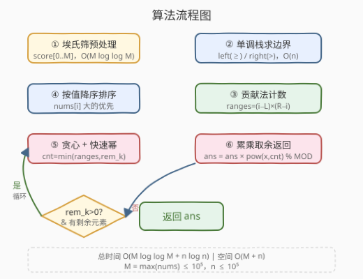
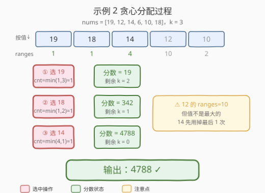

# 操作使得分最大

- **题目名称**：操作使得分最大
- **链接**：[2818. 操作使得分最大](https://leetcode.cn/problems/apply-operations-to-maximize-score/)
- **难度**：困难
- **标签**：栈、贪心、数组、数学、数论、排序、单调栈

## 1. 题目概述

给你一个长度为 `n` 的正整数数组 `nums` 和一个整数 `k`。一开始你的分数为 `1`，可以进行以下操作**至多 `k` 次**：

1. 选择一个**之前没有选择过的非空子数组** `nums[l, ..., r]`。
2. 从该子数组中选择一个**质数分数最高**的元素 `x`；若有多个元素质数分数相同且最高，选**下标最小**的那个。
3. 将你的分数乘以 `x`。

一个整数的**质数分数**等于它**不同质因子**的数目。例如 $300 = 2^2 \times 3 \times 5^2$，质数分数为 $3$（不同质因子为 $2, 3, 5$）。

返回进行至多 `k` 次操作后可得到的**最大分数**，结果对 $10^9 + 7$ 取余。

**示例 1**：

```text
输入：nums = [8,3,9,3,8], k = 2
输出：81
解释：
- 选子数组 nums[2,...,2]，唯一元素 9，分数 = 1 × 9 = 9
- 选子数组 nums[2,...,3]，9 和 3 质数分数均为 1，取下标更小的 9，分数 = 9 × 9 = 81
```

**示例 2**：

```text
输入：nums = [19,12,14,6,10,18], k = 3
输出：4788
解释：
- 选 nums[0,...,0]，分数 = 1 × 19 = 19
- 选 nums[5,...,5]，分数 = 19 × 18 = 342
- 选 nums[2,...,3]，14 和 6 质数分数均为 2，取下标更小的 14，分数 = 342 × 14 = 4788
```

**约束条件**：

- $1 \leq \text{nums.length} = n \leq 10^5$
- $1 \leq \text{nums[i]} \leq 10^5$
- $1 \leq k \leq \min(n(n+1)/2,\; 10^9)$

---

## 2. 解题思路

### 2.1 暴力思路：枚举子数组

朴素地枚举所有 $O(n^2)$ 个子数组，对每个子数组找到质数分数最高的元素（下标最小），然后按值从大到小贪心地选 `k` 个子数组相乘。但子数组数量高达 $O(n^2)$（$n = 10^5$ 时约 $5 \times 10^9$ 个），直接枚举完全不可行。

> ⚠️ 暴力法的核心困难不在选子数组的组合数，而在于**无法快速知道每个元素被选中的次数**。如果能对每个元素 $i$ 快速算出"有多少个子数组会选 $i$"，就能把问题转化为**贡献法**——每个元素贡献 $x^{\text{次数}}$，再按值贪心分配 $k$ 次操作。

### 2.2 核心观察：贡献法 + 单调栈 + 贪心快速幂

本题可拆为三个子问题，每个都有经典套路：

**子问题一——质数分数**：对每个 `nums[i]`，求其不同质因子数目。由于 `nums[i] ≤ 10^5`，用**埃氏筛变体**预处理：对每个质数 $p$，给 $p$ 的所有倍数 `score[j] += 1`，$O(M \log \log M)$ 一次算清（$M = 10^5$）。

**子问题二——每个元素被选中的子数组数（贡献法 + 单调栈）**：元素 `nums[i]` 在子数组 `[l, r]` 中被选中，当且仅当：

- $i \in [l, r]$
- `s[i]` 是 `[l, r]` 中质数分数的**严格最大值**，或并列最大但 $i$ 是其中**下标最小**的

![贡献法：每个元素被选中的子数组数 = (i−left[i]) × (right[i]−i)](../images/p2818_concept_overview.svg)

关键在于**如何去重**——保证每个子数组恰好被一个元素"认领"。技巧是**左右边界用不对称的比较**：

- `left[i]`：$i$ 左侧最近的满足 $s[j] \geq s[i]$ 的下标 $j$（$\geq$，左侧同分者抢走 $i$ 的资格）
- `right[i]`：$i$ 右侧最近的满足 $s[j] > s[i]$ 的下标 $j$（$>$，右侧同分者不抢 $i$ 的资格，因为 $i$ 下标更小）

这样，对于满足 $\text{left}[i] + 1 \leq l \leq i \leq r \leq \text{right}[i] - 1$ 的所有子数组 `[l, r]`，元素 $i$ 都是被选中的那个。于是：

$$\text{ranges}[i] = (i - \text{left}[i]) \times (\text{right}[i] - i)$$

`left[i]` 和 `right[i]` 均可用**单调栈** $O(n)$ 求出。

![单调栈求 left[i] 和 right[i]：左取 ≥ 右取 > 的不对称设计保证不重不漏](../images/p2818_monotonic_stack.svg)

**子问题三——贪心分配 + 快速幂**：每个元素最多贡献 `ranges[i]` 次，总操作次数上限为 `k`。要使乘积最大，应**优先乘以值最大的元素**。将所有元素按 `nums[i]` **值降序**排序，依次贪心：每个元素使用 $\min(\text{ranges}[i],\; \text{remaining\_k})$ 次，分数乘以 $\text{nums}[i]^{\text{cnt}} \bmod (10^9+7)$。用**快速幂**计算 $a^b \bmod p$，每次 $O(\log b)$。

### 2.3 算法流程图



**完整步骤**：

1. **预处理质数分数表**：埃氏筛变体，对每个质数 $p$ 给其所有倍数 `+1`，得到 `score[0..M]`。
2. **取各元素质数分数**：`s[i] = score[nums[i]]`。
3. **单调栈求 `left[i]`**：从左到右扫描，维护**单调递减栈**（栈底到栈顶质数分数递减），栈中存下标。`left[i]` = 栈顶（若栈非空）否则 $-1$。弹出所有 $s[\text{栈顶}] < s[i]$ 的元素后压入 $i$。
4. **单调栈求 `right[i]`**：从右到左扫描，维护单调递减栈。`right[i]` = 栈顶若非空否则 $n$。弹出所有 $s[\text{栈顶}] \leq s[i]$ 的元素后压入 $i$（注意右侧用 $\leq$）。
5. **算 `ranges[i]`**：$(i - \text{left}[i]) \times (\text{right}[i] - i)$。
6. **按值降序排序**，贪心 + 快速幂累乘。

> ⚠️ **左右不对称的本质**：题目要求并列时取**下标最小**的元素。因此左侧同分元素（下标更小）会"抢走" $i$ 的资格（用 $\geq$ 排除），右侧同分元素（下标更大）不会抢走 $i$ 的资格（用 $>$ 排除）。这种"左闭右开"式的不对称恰好保证每个子数组恰好被一个元素认领——不重不漏，$\sum \text{ranges}[i] = n(n+1)/2$。

### 2.4 示例演算

以示例 2 `nums = [19, 12, 14, 6, 10, 18]`，`k = 3` 为例：

**第一步——质数分数**：

| 下标 | 0 | 1 | 2 | 3 | 4 | 5 |
|------|---|---|---|---|---|---|
| nums[i] | 19 | 12 | 14 | 6 | 10 | 18 |
| 分解 | 19 | $2^2 \times 3$ | $2 \times 7$ | $2 \times 3$ | $2 \times 5$ | $2 \times 3^2$ |
| s[i] | 1 | 2 | 2 | 2 | 2 | 2 |

**第二步——单调栈求 `left[i]`（$\geq$）和 `right[i]`（$>$）**：

| i | s[i] | left[i] | right[i] | ranges[i] |
|---|------|---------|----------|-----------|
| 0 | 1 | -1 | 1 | $(0+1)\times(1-0)=1$ |
| 1 | 2 | -1 | 6 | $(1+1)\times(6-1)=10$ |
| 2 | 2 | 1 | 6 | $(2-1)\times(6-2)=4$ |
| 3 | 2 | 2 | 6 | $(3-2)\times(6-3)=3$ |
| 4 | 2 | 3 | 6 | $(4-3)\times(6-4)=2$ |
| 5 | 2 | 4 | 6 | $(5-4)\times(6-5)=1$ |

验证：$\sum = 1+10+4+3+2+1 = 21 = 6 \times 7 / 2$ ✓

**第三步——按值降序排序**：19→18→14→12→10→6



**第四步——贪心累乘**：

| 轮次 | 元素 | ranges | cnt=min(ranges,rem_k) | 分数 | 剩余 k |
|------|------|--------|------------------------|------|--------|
| ① | 19 | 1 | 1 | $1 \times 19 = 19$ | 2 |
| ② | 18 | 1 | 1 | $19 \times 18 = 342$ | 1 |
| ③ | 14 | 4 | 1 | $342 \times 14 = 4788$ | 0 |

输出：$4788$ ✓

> 💡 注意示例 2 中 $12$ 的 `ranges` 高达 10，但因为值不是最大的，贪心策略不会优先选它——值更大的 14 先用掉最后一次操作。这正是贪心正确性的体现：**单位操作乘上的数越大，最终乘积越大**。

---

## 3. 参考代码

### C++

```cpp
class Solution {
public:
    int maximumScore(vector<int>& nums, int k) {
        const int MOD = 1e9 + 7;
        int n = nums.size();

        // 第一步：埃氏筛变体预处理质数分数表
        int M = *max_element(nums.begin(), nums.end());
        vector<int> score(M + 1, 0);
        for (int i = 2; i <= M; i++) {
            if (score[i] == 0) {           // i 是质数
                for (int j = i; j <= M; j += i)
                    score[j] += 1;
            }
        }

        // 第二步：单调栈求 left[i]（>=）和 right[i]（>）
        vector<int> s(n);
        for (int i = 0; i < n; i++) s[i] = score[nums[i]];

        vector<int> left(n, -1), right(n, n);
        stack<int> stk;
        for (int i = 0; i < n; i++) {
            while (!stk.empty() && s[stk.top()] < s[i]) stk.pop();
            left[i] = stk.empty() ? -1 : stk.top();
            stk.push(i);
        }
        while (!stk.empty()) stk.pop();
        for (int i = n - 1; i >= 0; i--) {
            while (!stk.empty() && s[stk.top()] <= s[i]) stk.pop();
            right[i] = stk.empty() ? n : stk.top();
            stk.push(i);
        }

        // 第三步：贡献计数 + 按值降序排序
        vector<int> idx(n);
        iota(idx.begin(), idx.end(), 0);
        sort(idx.begin(), idx.end(), [&](int a, int b) {
            return nums[a] > nums[b];
        });

        // 第四步：贪心 + 快速幂
        long long ans = 1;
        long long rem = k;
        for (int i : idx) {
            if (rem <= 0) break;
            long long cnt = min((long long)(i - left[i]) * (right[i] - i), rem);
            ans = ans * powmod(nums[i], cnt, MOD) % MOD;
            rem -= cnt;
        }
        return ans;
    }

private:
    long long powmod(long long base, long long exp, int mod) {
        long long res = 1;
        base %= mod;
        while (exp > 0) {
            if (exp & 1) res = res * base % mod;
            base = base * base % mod;
            exp >>= 1;
        }
        return res;
    }
};
```

### Python

```python
class Solution:
    def maximumScore(self, nums: List[int], k: int) -> int:
        MOD = 10**9 + 7
        n = len(nums)

        # 第一步：埃氏筛变体预处理质数分数表
        M = max(nums)
        score = [0] * (M + 1)
        for i in range(2, M + 1):
            if score[i] == 0:               # i 是质数
                for j in range(i, M + 1, i):
                    score[j] += 1

        # 第二步：单调栈求 left[i]（>=）和 right[i]（>）
        s = [score[nums[i]] for i in range(n)]
        left = [-1] * n
        right = [n] * n
        stk = []
        for i in range(n):
            while stk and s[stk[-1]] < s[i]:
                stk.pop()
            left[i] = stk[-1] if stk else -1
            stk.append(i)
        stk = []
        for i in range(n - 1, -1, -1):
            while stk and s[stk[-1]] <= s[i]:
                stk.pop()
            right[i] = stk[-1] if stk else n
            stk.append(i)

        # 第三步：贡献计数 + 按值降序排序
        idx = sorted(range(n), key=lambda i: -nums[i])

        # 第四步：贪心 + 快速幂
        ans = 1
        rem = k
        for i in idx:
            if rem <= 0:
                break
            cnt = min((i - left[i]) * (right[i] - i), rem)
            ans = ans * pow(nums[i], cnt, MOD) % MOD
            rem -= cnt
        return ans
```

> 💡 两版结构一致：筛法预处理 → 单调栈求左右边界 → 贡献法计数 → 按值降序贪心 + 快速幂。注意 Python 内置 `pow(base, exp, mod)` 已是快速幂，C++ 需手写 `powmod`。左侧用 `<` 弹栈（留 $\geq$）、右侧用 $\leq$ 弹栈（留 $>$），这一步的不对称是全题最易错处。

---

## 4. 复杂度分析

| 维度 | 复杂度 | 说明 |
|------|--------|------|
| **时间复杂度** | $O(M \log \log M + n \log n)$ | 筛法 $O(M \log \log M)$；单调栈 $O(n)$；排序 $O(n \log n)$；快速幂总计 $O(n \log k)$ |
| **空间复杂度** | $O(M + n)$ | 质数分数表 $O(M)$；`left`/`right`/`s`/`idx` 各 $O(n)$ |

> ⚠️ $M = \max(\text{nums}) \leq 10^5$，筛法约 $10^5$ 量级操作；$n \leq 10^5$，排序 $O(n \log n) \approx 1.7 \times 10^6$，总体轻松 AC。`k` 可达 $10^9$，但每个元素只产生一次快速幂调用（$cnt$ 一次性取 $\min$），故快速幂总调用次数 $\leq n$，总复杂度 $O(n \log k)$ 而非 $O(k \log k)$。

---

## 5. 扩展：线性筛替代埃氏筛

埃氏筛变体已足够本题使用（$M \leq 10^5$）。若 $M$ 更大（如 $10^7$），可换**线性筛**（欧拉筛）预处理质数分数，做到严格 $O(M)$：

```python
def prime_score_linear(M):
    score = [0] * (M + 1)
    primes = []
    for i in range(2, M + 1):
        if score[i] == 0:           # i 是质数，score[i]=0 → 实际质数分数=1
            primes.append(i)
            score[i] = 1
        for p in primes:
            if i * p > M:
                break
            if i % p == 0:
                score[i * p] = score[i]   # p 已经是 i 的因子，不增
                break
            else:
                score[i * p] = score[i] + 1   # 新质因子
    return score
```

> 💡 线性筛的关键在于 `i % p == 0` 时 `p` 已是 `i` 的因子（`i*p` 的质因子集不变），否则 `p` 是新质因子（`+1`）。每个合数只被最小质因子筛一次，严格 $O(M)$。本题 $M$ 小，埃氏筛更简洁。

---

## 6. 面试要点

1. **为什么左右边界用不对称的比较（左 $\geq$ 右 $>$）？**

   - 题目要求并列时取**下标最小**的元素。左侧同分元素下标更小，会"抢走" $i$ 的资格——所以 `left[i]` 要挡住 $\geq$ 的元素。右侧同分元素下标更大，不会抢走 $i$ 的资格（$i$ 下标更小）——所以 `right[i]` 只挡 $>$ 的元素。这种"左闭右开"保证每个子数组恰被一个元素认领，不重不漏。

2. **贡献法 $\sum \text{ranges}[i]$ 为什么等于 $n(n+1)/2$？**

   - 非空子数组总数为 $\binom{n}{2} + n = n(n+1)/2$。由于不对称设计保证每个子数组恰好被一个元素认领（不重不漏），所有元素的 `ranges[i]` 之和必等于子数组总数。这是验证单调栈正确性的快速 sanity check。

3. **为什么按值降序贪心是正确的？**

   - 要使乘积最大，应优先乘以最大的数。每次操作独立地乘上一个元素值，不改变后续可选的元素集合（每个子数组互不相同，但元素可被多个子数组选中）。因此按值降序贪心等价于"把有限的操作次数分配给最大的底数"，这是标准的最优化贪心——与零钱兑换中优先用大面值同构。

4. **`k` 高达 $10^9$，为什么不会超时？**

   - 快速幂 $a^b \bmod p$ 的时间为 $O(\log b)$。关键是每个元素**一次性**取 $cnt = \min(\text{ranges}[i], \text{rem})$，只产生**一次**快速幂调用，而非逐次乘。总调用次数 $\leq n \leq 10^5$，每次 $O(\log k) \approx 30$，总计 $3 \times 10^6$ 操作，远低于时限。

5. **质数分数表为什么用筛法而非逐个分解？**

   - 逐个对 `nums[i]` 做 $O(\sqrt{\text{nums[i]}})$ 分解，总时间 $O(n \sqrt{M}) \approx 10^5 \times 316 \approx 3 \times 10^7$，勉强可行但不优雅。筛法变体一次预处理 $O(M \log \log M) \approx 10^5$，之后每次查表 $O(1)$，更适合 $M$ 值域有限的情况。当 `nums[i]` 值域大但元素少时，逐个分解更优。

> 💡 **一句话总结**：2818 是「质数分数（筛法）+ 贡献法计数（单调栈）+ 贪心快速幂」三段式组合题。核心观察是**用左右不对称的单调栈把"每个元素被选中的子数组数"转化为 $O(1)$ 的贡献公式**，从而把 $O(n^2)$ 的子数组枚举降为 $O(n)$ 的贡献统计。

---

## 7. 同类练习题

- [907. 子数组的最小值之和](https://leetcode.cn/problems/sum-of-subarray-minimums/)：贡献法 + 单调栈的母题，求每个元素作为子数组最小值的次数，与本题"每个元素被选中的次数"同构
- [2104. 子数组范围和](https://leetcode.cn/problems/sum-of-subarray-ranges/)：单调栈贡献法求子数组 max−min 之和，左右不对称去重技巧与本题一脉相承
- [1856. 子数组最小乘积的最大值](https://leetcode.cn/problems/maximum-subarray-min-product/)：单调栈找左右边界 + 贡献法，同样是"每个元素作为极值的子数组范围"问题
- [50. Pow(x, n)](https://leetcode.cn/problems/powx-n/)：快速幂模板，本题快速幂的直接基础
