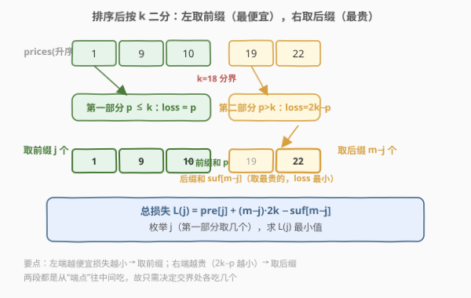
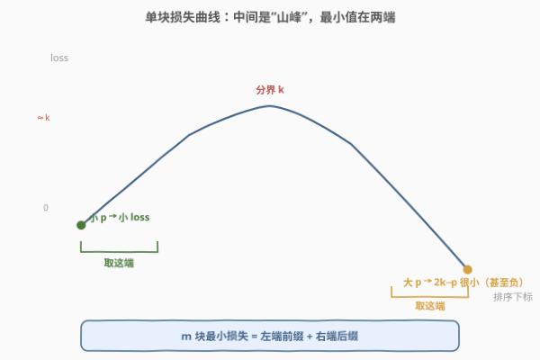
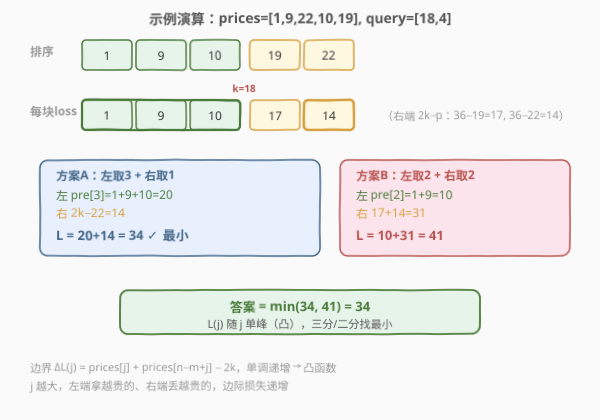

# 购买巧克力后的最小相对损失

- **题目名称**：购买巧克力后的最小相对损失
- **链接**：[2819. 购买巧克力后的最小相对损失](https://leetcode.cn/problems/minimum-relative-loss-after-buying-chocolates/)
- **难度**：困难
- **标签**：数组、二分查找、前缀和、排序

## 1. 题目概述

> ⚠️ 本题为 LeetCode 付费题（Plus 会员专享），官方题面不可见。以下题意、约束与示例输出根据官方提供的 `jsonExampleTestcases`（三组示例输入）、五条 `hints` 以及标签 `Array / Binary Search / Prefix Sum / Sorting` 重建，**可能与官方题面有出入**。核心算法（排序 + 按 $k$ 二分 + 前后缀和 + 凸函数二分）由 hints 明确给出，可放心学习。

给定整数数组 `prices`，其中 `prices[i]` 是第 $i$ 块巧克力的价格；再给定二维整数数组 `queries`，其中 `queries[i] = [k_i, m_i]`。

对每个查询，需要从所有巧克力中**恰好购买 $m_i$ 块**，使**相对损失之和最小**。一块价格为 $p$ 的巧克力在阈值 $k$ 下的相对损失定义为：

$$
\text{loss}(p,k)=
\begin{cases}
p, & p \le k \\
2k-p, & p > k
\end{cases}
$$

- 当 $p \le k$（便宜）：损失就是售价 $p$，**越便宜损失越小**。
- 当 $p > k$（昂贵）：损失为 $2k-p$，**越贵损失越小**（甚至为负，即反过来赚）。

为每个查询返回最小相对损失之和。损失可能为负，结果用 64 位整数。

**示例 1**（根据官方测试用例推算输出）：

```text
输入：prices = [1,9,22,10,19], queries = [[18,4],[5,2]]
排序后 prices = [1,9,10,19,22]
输出：[34,-21]
解释：
  query [18,4]：取 [1,9,10]（左端3块）+ [22]（右端1块），损失 = 1+9+10 + (36−22) = 34
  query [5,2] ：取 [19,22]（右端2块），损失 = (10−19)+(10−22) = −21
```

**示例 2**（推算输出）：

```text
输入：prices = [1,5,4,3,7,11,9], queries = [[5,4],[5,7],[7,3],[4,5]]
排序后 prices = [1,3,4,5,7,9,11]
输出：[4,16,7,1]
```

**示例 3**（推算输出）：

```text
输入：prices = [5,6,7], queries = [[10,1],[5,3],[3,3]]
输出：[5,12,0]
```

**约束条件**（重建）：

- $1 \le \text{prices.length} \le 10^5$
- $1 \le \text{queries.length} \le 10^5$
- $1 \le \text{prices}[i],\ k_i \le 10^9$
- $1 \le m_i \le \text{prices.length}$
- 答案保证 64 位整数范围内

---

## 2. 解题思路

### 2.1 暴力思路

对每个查询 $[k, m]$，枚举从 $n$ 块里选 $m$ 块的所有 $\binom{n}{m}$ 组合，逐组合算损失求最小。组合数爆炸，且查询数 $q$ 可达 $10^5$，完全不可行。

退一步：即使不枚举组合，对单个查询若只对每块算损失后排序取最小的 $m$ 个，复杂度 $O(n \log n)$ 每查询，$q$ 次仍达 $O(qn\log n)$，$10^{10}$ 级别，超时。需要把每查询降到 $O(\log n)$。

### 2.2 核心观察：排序 + 双端取最小（前缀 + 后缀）

第一步按 hint 1 **排序** `prices`。排好序后，单块损失随下标呈一个有趣的形状：

- **第一部分**（$p \le k$，即左段）：损失 $=p$，随下标**递增**（越靠右越贵）。
- **第二部分**（$p > k$，即右段）：损失 $=2k-p$，随下标**递减**（越靠右越贵，损失越小）。

两段在分界 $k$ 处都接近 $k$，因此整条损失曲线是**中间高、两端低**的“山峰”：左端（最便宜）损失小，右端（最贵，$2k-p$ 很小甚至负）损失也小。

> 💡 **关键洞察**：要选 $m$ 块损失最小，就是从这条山峰曲线的两端“往里吃”——左端取一个**前缀**（最便宜），右端取一个**后缀**（最贵）。这正是 hint 4：“第一部分取前缀，第二部分取后缀”。



所以问题被压缩到**一个自由度**：左端前缀取几块（设为 $j$）？则右端后缀取 $m-j$ 块。一旦确定 $j$，取法唯一确定（前 $j$ 个 + 末 $m-j$ 个），总损失：

$$
L(j)=\underbrace{\text{pre}[j]}_{\text{左前缀和}} + \underbrace{(m-j)\cdot 2k - \text{suf}[m-j]}_{\text{右后缀的 }2k-p\text{ 之和}}
$$

其中 $\text{pre}[j]$ 为前 $j$ 个的前缀和，$\text{suf}[t]$ 为末 $t$ 个的后缀和（用全局前/后缀和数组即可，因为第二段就在数组尾部）。



### 2.3 为什么能二分：$L(j)$ 是凸函数

hint 5 说“对第一部分做二分”。可行性来自 $L(j)$ 的**离散凸性**。考察相邻差分：

$$
\Delta L(j) = L(j+1)-L(j) = \text{prices}[j] + \text{prices}[n-m+j] - 2k
$$

- 随 $j$ 增大，$\text{prices}[j]$ **递增**（左端拿的越来越贵）；
- $\text{prices}[n-m+j]$ 也**递增**（右端被“吐出”的越来越贵）。

两项都单调递增，故 $\Delta L(j)$ **单调递增** $\Rightarrow$ $L(j)$ 是（下凸的）单峰函数。于是可二分找到 $\Delta L$ 由负转正的转折点，即 $L$ 的最小值位置，每查询 $O(\log n)$。

> ⚠️ **注意 $j$ 的合法区间**：左段只有 $\text{idx}$ 块（$\text{idx}=\text{upper\_bound}(k)$），右段有 $n-\text{idx}$ 块。故 $j$ 须满足
> $j \le \min(m,\text{idx})$ 且 $m-j \le n-\text{idx}$，即 $j \in [\max(0,\,m-(n-\text{idx})),\ \min(m,\text{idx})]$。可证当 $m\le n$ 时该区间非空。

### 2.4 算法流程图

```text
排序 prices
预处理 pre[0..n]（前缀和）、suf[0..n]（后缀和，suf[t]=末t个之和）
对每个查询 [k, m]:
 │  idx = upper_bound(prices, k)        // 第一部分 prices[:idx]
 │  lo  = max(0, m-(n-idx))             // 右段不够时左段至少取这么多
 │  hi  = min(m, idx)                   // 左段最多这么多
 │  在 [lo, hi-1] 二分找首个 ΔL(j)≥0 的位置 pos
 │      ΔL(j) = prices[j] + prices[n-m+j] - 2k   (单调递增)
 │  答案 = min(L(pos), L(pos-1))（边界 clamp）
 └─ 收集答案
```

### 2.5 示例演算

以示例 1 的 `query=[18,4]` 为例，排序后 `prices=[1,9,10,19,22]`，$k=18$：

- 分界 $\text{idx}=3$（$19,22>18$），第一部分 $[1,9,10]$，第二部分 $[19,22]$。
- 每块损失：$[1,\ 9,\ 10\ |\ 17,\ 14]$（右端 $36-19=17,\ 36-22=14$）。
- 方案 A（$j=3$，左取 3 + 右取 1）：$L=20+14=34$；方案 B（$j=2$，左取 2 + 右取 2）：$L=10+31=41$。
- $\min=34$。$\Delta L(2)=10+19-36=-7<0$，故 $L$ 仍在下降，最小在 $j=3$（区间右端）。



---

## 3. 参考代码

### Python

```python
from bisect import bisect_right


class Solution:
    def minimumRelativeLosses(self, prices, queries):
        prices.sort()
        n = len(prices)
        # pre[j] = 前 j 个之和；suf[t] = 末 t 个之和
        pre = [0] * (n + 1)
        for i in range(n):
            pre[i + 1] = pre[i] + prices[i]
        suf = [0] * (n + 1)
        for t in range(1, n + 1):
            suf[t] = suf[t - 1] + prices[n - t]

        ans = []
        for k, m in queries:
            idx = bisect_right(prices, k)          # 第一部分 = prices[:idx]
            lo = max(0, m - (n - idx))             # 右段不够，左段兜底
            hi = min(m, idx)                       # 左段上限

            def loss(j):
                return pre[j] + (m - j) * 2 * k - suf[m - j]

            # ΔL(j) 单调递增，二分找首个 >=0 的转折点
            pos, l, r = hi, lo, hi - 1
            while l <= r:
                mid = (l + r) // 2
                # ΔL(mid) = prices[mid] + prices[n-m+mid] - 2k
                if prices[mid] + prices[n - m + mid] - 2 * k >= 0:
                    pos = mid
                    r = mid - 1
                else:
                    l = mid + 1
            best = loss(pos)
            if pos - 1 >= lo:
                best = min(best, loss(pos - 1))
            ans.append(best)
        return ans
```

### C++

```cpp
#include <vector>
#include <algorithm>
#include <climits>
using namespace std;

class Solution {
public:
    vector<long long> minimumRelativeLosses(vector<int>& prices, vector<vector<int>>& queries) {
        sort(prices.begin(), prices.end());
        int n = prices.size();
        vector<long long> pre(n + 1, 0), suf(n + 1, 0);
        for (int i = 0; i < n; ++i) pre[i + 1] = pre[i] + prices[i];
        for (int t = 1; t <= n; ++t) suf[t] = suf[t - 1] + prices[n - t];

        vector<long long> ans;
        for (auto& q : queries) {
            long long k = q[0];
            int m = q[1];
            int idx = upper_bound(prices.begin(), prices.end(), (int)k) - prices.begin();
            int lo = max(0, m - (n - idx));
            int hi = min(m, idx);

            auto loss = [&](int j) -> long long {
                return pre[j] + (long long)(m - j) * 2 * k - suf[m - j];
            };

            int pos = hi, l = lo, r = hi - 1;
            while (l <= r) {
                int mid = l + (r - l) / 2;
                long long dL = (long long)prices[mid] + prices[n - m + mid] - 2 * k;
                if (dL >= 0) { pos = mid; r = mid - 1; }
                else l = mid + 1;
            }
            long long best = loss(pos);
            if (pos - 1 >= lo) best = min(best, loss(pos - 1));
            ans.push_back(best);
        }
        return ans;
    }
};
```

---

## 4. 复杂度分析

| 维度 | 复杂度 | 说明 |
|------|--------|------|
| 时间 | $O((n+q)\log n)$ | 排序 $O(n\log n)$；预处理 $O(n)$；每查询二分 $O(\log n)$，共 $q$ 次 |
| 空间 | $O(n)$ | 前缀和 `pre` 与后缀和 `suf` 数组 |

每查询 $O(\log n)$ 是本题能通过 $n,q\le10^5$ 的关键。

---

## 5. 扩展：也可用三分搜索

既然 $L(j)$ 是离散凸函数，同样可用**整数三分搜索**直接求极小值，无需推导 $\Delta L$：

```python
l, r = lo, hi
while r - l > 2:
    m1 = l + (r - l) // 3
    m2 = r - (r - l) // 3
    if loss(m1) < loss(m2): r = m2
    else: l = m1
best = min(loss(j) for j in range(l, r + 1))
```

三分更直观（不用手推差分），但对带平顶的凸函数要靠末尾的线性扫描兜底。二分 $\Delta L$ 则更贴合 hint 5 的“对第一部分二分”，常数更优。

---

## 6. 面试要点

- **为什么从两端取？** 排序后单块损失曲线是“中间高两端低”的山峰：便宜块损失小（左端），贵块 $2k-p$ 也小（右端）。最小 $m$ 块必然分布两端，故只需决定交界处左、右各取几块。
- **$L(j)$ 为什么是凸的？** 相邻差分 $\Delta L(j)=\text{prices}[j]+\text{prices}[n-m+j]-2k$，两项均随 $j$ 单调递增，故 $\Delta L$ 单调增 $\Rightarrow$ $L$ 下凸单峰，可二分。
- **为什么用全局后缀和 `suf` 就够？** 第二部分是排序数组尾段，其“最大 $t$ 个”正是全局末 $t$ 个，所以 $\text{suf}[t]$（末 $t$ 个之和）直接复用，不必对每段单独建表。
- **$j$ 的合法区间怎么定？** 左段只有 $\text{idx}$ 块、右段 $n-\text{idx}$ 块，故 $j\le\min(m,\text{idx})$ 且 $m-j\le n-\text{idx}$；$m\le n$ 时区间非空。
- **负损失合法吗？** 合法。$p>2k$ 时 $2k-p<0$，总损失可能为负（理解为倒赚），故用 64 位整数且不可截断为非负。

---

## 7. 同类练习题

- [881. 救生艇](https://leetcode.cn/problems/boats-to-save-people/)：排序 + 双端双指针贪心配对，与本题“从两端取”同源。
- [2141. 同时运行 N 台电脑的最长时间](https://leetcode.cn/problems/maximum-running-time-of-n-computers/)：排序后用前缀和 + 后缀和优化，前后缀技术最接近本题。
- [2563. 统计公平数对的数目](https://leetcode.cn/problems/count-the-number-of-fair-pairs/)：排序 + 双指针/二分计数，排序后线性/对数处理的同类套路。
- [410. 分割数组的最大值](https://leetcode.cn/problems/split-array-largest-sum/)：二分答案 + 贪心验证，“二分求最优”的同类思想。
