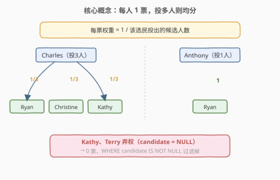
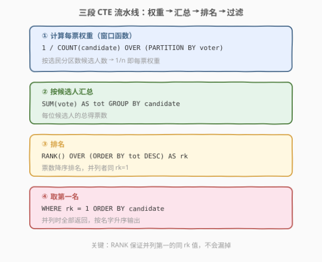

# 选举结果

- **题目名称**：选举结果
- **链接**：[2820. 选举结果](https://leetcode.cn/problems/election-results/)
- **难度**：中等
- **标签**：数据库、SQL、窗口函数

## 1. 题目概述

> ⚠️ 本题为 LeetCode 付费题，题意描述根据官方示例用例与外部资料重建，可能与官方题面有出入。

**表结构**：`Votes`

| 列名 | 类型 |
|------|------|
| voter | varchar |
| candidate | varchar |

- `(voter, candidate)` 为该表主键。
- 每行记录一位选民及其投出的候选人。`candidate` 可能为 `NULL`，表示该选民**弃权**。

**选举规则**：每人拥有 **1 票**。若一位选民投票给多个候选人，则该票在这些候选人之间**均分**。例如投 2 人则各得 $0.5$ 票，投 3 人则各得 $\frac{1}{3}$ 票。弃权者（`candidate = NULL`）不产生任何票数。

**目标**：写一条 SQL 查询，找出得票最多的候选人。若多人票数并列第一，则**全部返回**，并按 `candidate` **升序**排列。

**示例 1**：

```text
输入：Votes 表
+----------+-----------+
| voter    | candidate |
+----------+-----------+
| Kathy    | null      |
| Charles  | Ryan      |
| Charles  | Christine |
| Charles  | Kathy     |
| Benjamin | Christine |
| Anthony  | Ryan      |
| Edward   | Ryan      |
| Terry    | null      |
| Evelyn   | Kathy     |
| Arthur   | Christine |
+----------+-----------+

输出：
+-----------+
| candidate |
+-----------+
| Christine |
| Ryan      |
+-----------+
```

**解释**：
- Kathy、Terry 弃权，产生 0 票。
- Charles 投了 3 人（Ryan、Christine、Kathy），每人各得 $\frac{1}{3} \approx 0.33$ 票。
- Benjamin、Arthur、Anthony、Edward、Evelyn 各投 1 人，各得 1 票。
- 汇总：Ryan $= \frac{1}{3} + 1 + 1 = 2.33$，Christine $= \frac{1}{3} + 1 + 1 = 2.33$，Kathy $= \frac{1}{3} + 1 = 1.33$。
- Ryan 与 Christine 并列第一，按名字升序输出 Christine、Ryan。

---

## 2. 解题思路

### 2.1 暴力思路：直接 COUNT 计票

最直觉的做法是 `GROUP BY candidate, COUNT(*)` 统计每位候选人收到的票数，取最大值即为胜者。但这完全错误——它忽略了"**一人一票均分**"的核心规则。Charles 投了 3 人，每人应只得 $\frac{1}{3}$ 票，而非各 1 票。直接 COUNT 会把 Charles 的 3 行各算 1 票，等于凭空多出了 2 票。

> ⚠️ 暴力法的唯一硬伤：把"每行 = 1 票"误当真。实际上每行 = $\frac{1}{\text{该选民投出的人数}}$ 票，必须先按选民分区算出分母，再算每票的权重。

### 2.2 核心观察：窗口函数算权重 + RANK 取第一

整个解法分三步，每步用一个标准 SQL 技巧：

**第一步——窗口函数算每票权重**。对每条非空投票记录，用 `COUNT(candidate) OVER (PARTITION BY voter)` 算出该选民投了几人，则每票权重 $= \frac{1}{\text{该计数}}$。窗口函数的优势在于**不改变行数**：每行都带上自己选民的计数值，无需先 GROUP BY 再 JOIN 回来。



**第二步——按候选人 SUM 汇总**。把上一步算出的每票权重按 `candidate` 分组求和，得到每位候选人的总票数。

**第三步——RANK 排名取第一**。用 `RANK() OVER (ORDER BY tot DESC)` 对总票数降序排名，并列第一的候选人都会得到 `rk = 1`，最后 `WHERE rk = 1` 全部取出，按 `candidate` 升序输出。

> 💡 **为什么用 RANK 而不是 ROW_NUMBER？** `ROW_NUMBER` 会强行给并列者分配不同序号（1, 2, ...），只取 `rn = 1` 会漏掉并列者。`RANK` 对相同值分配相同名次，并列第一都是 `rk = 1`，天然满足"并列全返回"的要求。`DENSE_RANK` 也能用，但 `RANK` 更语义化。

### 2.3 算法流程图



**完整步骤**：

1. **计算每票权重**：`WHERE candidate IS NOT NULL` 过滤弃权，`COUNT(candidate) OVER (PARTITION BY voter)` 算每人投出的人数，`1 / 该计数` 即每票权重。
2. **按候选人汇总**：`GROUP BY candidate`，`SUM(vote)` 得总票数 `tot`。
3. **排名**：`RANK() OVER (ORDER BY tot DESC)` 降序排名，并列者同 `rk`。
4. **取第一名**：`WHERE rk = 1`，`ORDER BY candidate` 升序输出。

> ⚠️ 内层查询必须先 `WHERE candidate IS NOT NULL`，否则弃权行会参与 `COUNT` 导致分母变大、权重变小。过滤在前、窗口函数在后，顺序不能反。

### 2.4 示例演算

以示例 1 为例，过滤掉 Kathy、Terry 的弃权行后，8 条有效投票记录的权重如下：

| voter | candidate | vote |
|-------|-----------|------|
| Charles | Ryan | 1/3 |
| Charles | Christine | 1/3 |
| Charles | Kathy | 1/3 |
| Benjamin | Christine | 1 |
| Anthony | Ryan | 1 |
| Edward | Ryan | 1 |
| Evelyn | Kathy | 1 |
| Arthur | Christine | 1 |

按候选人 SUM 汇总后：

| candidate | total |
|-----------|-------|
| Ryan | 2.33 |
| Christine | 2.33 |
| Kathy | 1.33 |

Ryan 与 Christine 并列 2.33 票（`rk = 1`），Kathy 为 1.33 票（`rk = 3`），取 `rk = 1` 并按名字升序 → **Christine, Ryan**。


> 💡 Charles 一人贡献了 3 行，但总权重仍为 $3 \times \frac{1}{3} = 1$ 票——这正是一人一票的体现。反观 Anthony 只投 1 人，权重 $1 \times 1 = 1$ 票。不同投票方式下每位选民的总贡献恒为 1，均分只改变分配方向。

---

## 3. 参考代码

### MySQL

```sql
# Write your MySQL query statement below
WITH
    T AS (
        SELECT candidate, SUM(vote) AS tot
        FROM (
            SELECT
                candidate,
                1 / (COUNT(candidate) OVER (PARTITION BY voter)) AS vote
            FROM Votes
            WHERE candidate IS NOT NULL
        ) AS t
        GROUP BY 1
    ),
    P AS (
        SELECT
            candidate,
            RANK() OVER (ORDER BY tot DESC) AS rk
        FROM T
    )
SELECT candidate
FROM P
WHERE rk = 1
ORDER BY 1;
```

> 💡 三个 CTE 层层嵌套：内层子查询算每票权重（窗口函数保持行级粒度），中层 `T` 按候选人 SUM 汇总，外层 `P` 用 RANK 排名，最终 `WHERE rk=1 ORDER BY 1` 过滤输出。`GROUP BY 1` 是 `GROUP BY candidate` 的简写。

---

## 4. 复杂度分析

| 维度 | 复杂度 | 说明 |
|------|--------|------|
| **时间复杂度** | $O(n \log n)$ | 内层窗口函数 `COUNT OVER` 需按 `voter` 分区排序 $O(n \log n)$；中层 `GROUP BY` 排序 $O(n \log n)$；外层 `RANK OVER` 排序 $O(m \log m)$（$m$ 为候选人数 $\le n$） |
| **空间复杂度** | $O(n)$ | 各 CTE 中间结果集大小与投票行数同阶 |

> ⚠️ $n$ 为 `Votes` 表行数。实际上 LeetCode SQL 题数据量不大，上述操作均在毫秒级完成。瓶颈在于窗口函数的排序开销，但相比 GROUP BY 的排序是独立的两轮，无法合并。

---

## 5. 扩展：不用窗口函数的 GROUP BY + JOIN 写法

窗口函数 `COUNT OVER (PARTITION BY voter)` 可以等价替换为先 `GROUP BY voter` 算出每位选民投了几人，再 JOIN 回原表。适合不支持窗口函数的老版 MySQL（< 8.0）或面试中展示"不用窗口函数也能做"的功底：

```sql
-- 不使用窗口函数的等价写法
WITH
    voter_cnt AS (
        SELECT voter, COUNT(candidate) AS cnt
        FROM Votes
        WHERE candidate IS NOT NULL
        GROUP BY voter
    ),
    weighted AS (
        SELECT v.candidate, 1 / vc.cnt AS vote
        FROM Votes v
        JOIN voter_cnt vc ON v.voter = vc.voter
        WHERE v.candidate IS NOT NULL
    ),
    totals AS (
        SELECT candidate, SUM(vote) AS tot
        FROM weighted
        GROUP BY candidate
    )
SELECT candidate
FROM (
    SELECT candidate, RANK() OVER (ORDER BY tot DESC) AS rk
    FROM totals
) AS p
WHERE rk = 1
ORDER BY 1;
```

> 💡 两种写法的核心逻辑完全一致：先算每人投几人（窗口函数 vs GROUP BY+JOIN），再取倒数作为权重，再 SUM 汇总，再 RANK 取第一。窗口函数版更简洁（一行搞定分母），GROUP BY 版更底层直观。面试中推荐先写窗口函数版，再口述等价改写。

---

## 6. 面试要点

1. **为什么不能直接 COUNT 计票？**

   - 直接 `COUNT(*)` 把每行当 1 票，忽略了"一人一票均分"规则。Charles 投 3 人，每人应只得 $\frac{1}{3}$ 票，而非各 1 票。必须先用 `COUNT(candidate) OVER (PARTITION BY voter)` 算出该选民投了几人，再取倒数作为每票权重，保证每位选民的总贡献恒为 1 票。

2. **窗口函数 COUNT OVER 和 GROUP BY 有什么区别？**

   - `GROUP BY voter` 会把同选民的行**折叠**成一行，丢失行级候选信息；`COUNT(candidate) OVER (PARTITION BY voter)` 是窗口函数，**不改变行数**——每行都带上自己选民的计数值，可直接在同一行里算 `1 / count` 作为权重，无需 JOIN 回原表。窗口函数保持粒度、附加信息，GROUP BY 折叠粒度、聚合信息。

3. **为什么用 RANK() 而不是 ROW_NUMBER()？**

   - `ROW_NUMBER` 强行给并列者分配不同序号（1, 2, 3...），只取 `rn = 1` 会漏掉并列第一的候选人。`RANK` 对相同值分配相同名次，并列第一者都是 `rk = 1`，`WHERE rk = 1` 天然全部返回。`DENSE_RANK` 也能用但语义是"密集排名"，`RANK` 更直观表达"名次相同"。

4. **WHERE candidate IS NOT NULL 的位置为什么重要？**

   - 弃权行（`candidate = NULL`）不应参与计票。若不提前过滤，`COUNT(candidate) OVER (PARTITION BY voter)` 会把弃权行也算进分母（虽然 `COUNT(candidate)` 不计 NULL 值，但 `COUNT(*)` 会），导致权重变小。放在窗口函数之前过滤，确保只有有效投票参与计算。

5. **如果要求并列时只返回一人（如按名字最小），怎么改？**

   - 把 `RANK() OVER (ORDER BY tot DESC)` 改为 `ROW_NUMBER() OVER (ORDER BY tot DESC, candidate ASC)`，这样并列时按名字升序只取第一人。或者保留 `RANK` 但加 `LIMIT 1`（配合 `ORDER BY candidate`）。核心区别：`RANK` 保留并列、`ROW_NUMBER` 强制唯一。

> 💡 **一句话总结**：2820 是「窗口函数算权重 + RANK 取第一」的经典 SQL 题。关键洞察是"一人一票均分"——用 `COUNT OVER (PARTITION BY voter)` 算分母、取倒数做权重、SUM 汇总、RANK 取并列第一。$O(n \log n)$ 时间、$O(n)$ 空间。

---

## 7. 同类练习题

- [574. 获胜候选人](https://leetcode.cn/problems/winning-candidate/)：从 Candidate + Vote 两表联查得票最多的候选人，本题的"无均分"简化版
- [184. 部门最高薪水的员工](https://leetcode.cn/problems/department-highest-salary/)：GROUP BY + 找每组最大，窗口函数或 JOIN 均可
- [185. 部门工资前三高的所有员工](https://leetcode.cn/problems/department-top-three-salaries/)：DENSE_RANK 窗口函数取 Top-N，与本题 RANK 取 Top-1 对照
- [569. 员工薪水中位数](https://leetcode.cn/problems/median-employee-salary/)：窗口函数 ROW_NUMBER 排名取中位，同属"窗口函数 + 排名过滤"套路
