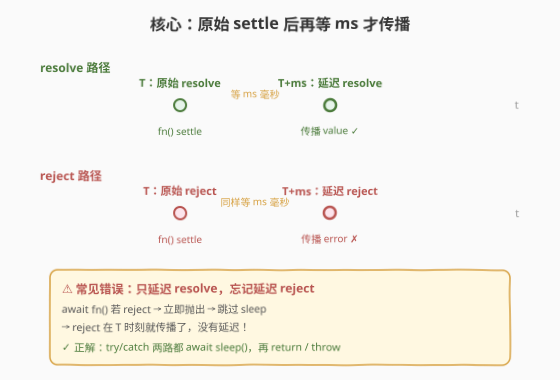
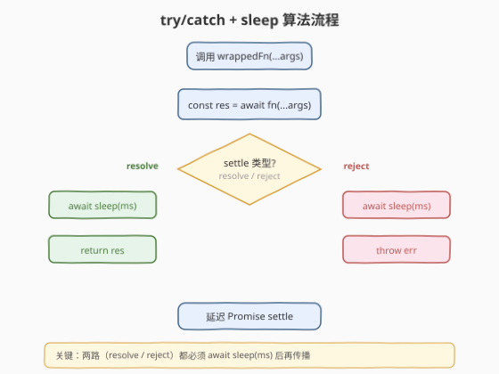
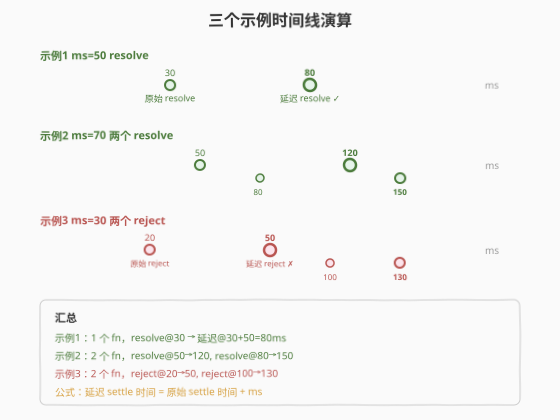

# LeetCode 延迟每个 Promise 对象的解析 题解

## 1. 题目概述

- **标题 / 题号**：延迟每个 Promise 对象的解析（#2821，medium）
- **链接**：https://leetcode.cn/problems/delay-the-resolution-of-each-promise/
- **难度**：中等
- **标签**：Promise、`async/await`、`setTimeout`、JavaScript

> ⚠️ 本题为 LeetCode 付费题，题意描述根据官方示例用例与 hints 重建，可能与官方题面有出入。

**题意**：给定一个**函数数组** `functions`，其中每个函数被调用时返回一个 `Promise`；再给定一个以毫秒为单位的延迟值 `ms`。

要求返回一个**新的函数数组**，数组中的每个新函数对应 `functions` 中的同名函数（保持顺序），但行为如下：调用新函数时，它会调用对应的原始函数得到一个 `Promise`，当该 `Promise` **settle**（resolve 或 reject）后，**再等待 `ms` 毫秒**，然后将同样的结果（resolve 的 value 或 reject 的 reason）传播出去。

换言之，每个 Promise 的解析（resolution）都被整体推迟了 `ms` 毫秒——**无论原始 Promise 是成功还是失败，延迟都生效**。

**示例 1**：

```text
输入：functions = [() => new Promise((resolve) => setTimeout(resolve, 30))], ms = 50
输出：[<delayed function>]
解释：原始 Promise 在 30ms 时 resolve；延迟后在 30+50=80ms 时 resolve。
```

**示例 2**：

```text
输入：functions = [
  () => new Promise((resolve) => setTimeout(resolve, 50)),
  () => new Promise((resolve) => setTimeout(resolve, 80))
], ms = 70
输出：[<delayed fn1>, <delayed fn2>]
解释：fn1 原始 50ms resolve → 延迟后 120ms resolve；
     fn2 原始 80ms resolve → 延迟后 150ms resolve。
```

**示例 3**：

```text
输入：functions = [
  () => new Promise((resolve, reject) => setTimeout(reject, 20)),
  () => new Promise((resolve, reject) => setTimeout(reject, 100))
], ms = 30
输出：[<delayed fn1>, <delayed fn2>]
解释：fn1 原始 20ms reject → 延迟后 50ms reject；
     fn2 原始 100ms reject → 延迟后 130ms reject。
```

**约束**：

- `functions` 是一个返回 `Promise` 的函数数组
- `1 <= functions.length <= 10`
- `20 <= ms <= 1000`

> 💡 本题是 LeetCode「30 天 JavaScript」系列，**仅提供 JavaScript / TypeScript 提交入口**。核心是「在 Promise settle 后插入固定延迟」，难点在**必须同时覆盖 resolve 和 reject 两条路径**——很多人只延迟了 resolve，忘了 reject 也要延迟。

## 2. 解题思路

### 2.1 暴力思路：只延迟 resolve

最直觉的写法是用 `async/await`：先 `await fn()` 拿到结果，再 `await` 一个 `setTimeout` 延迟，最后返回结果：

```javascript
var delayAll = function(functions, ms) {
    return functions.map(fn => async (...args) => {
        const res = await fn(...args);     // ← 陷阱在这里
        await new Promise(r => setTimeout(r, ms));
        return res;
    });
};
```

看起来没问题——**但只在 resolve 时正确**。如果 `fn(...args)` 返回的 Promise **reject** 了，`await fn(...args)` 会**立即抛出异常**，执行流直接跳到调用者的 catch（或变成 unhandled rejection），`await sleep(ms)` 那一行**根本不会执行**。结果是：reject 在原始时刻 `T` 就传播了，延迟完全失效。

这正是示例 3 要考察的点：**reject 也必须延迟**。暴力法在示例 3 上会失败。

### 2.2 核心观察：try/catch 双路延迟



关键洞察：**resolve 和 reject 是 Promise 的两条 settle 路径，延迟必须同时覆盖两者**。

把「等待 `ms` 毫秒」抽象成一个 `sleep` 函数，然后用 `try/catch` 分别处理两条路径：

- **`try` 块（resolve 路径）**：`await fn()` 成功拿到 `res` → `await sleep(ms)` → `return res`
- **`catch` 块（reject 路径）**：`await fn()` 抛出 `err` → `await sleep(ms)` → `throw err`

两条路径都先 `await sleep(ms)` 再传播结果，确保无论成功还是失败，延迟都生效。

> ⚠️ **核心陷阱**：`await` 表达式若 reject，后续语句被跳过。所以不能把 `sleep` 写在 `await fn()` 之后就完事——reject 路径需要 `catch` 块单独 `sleep`。这是本题唯一的考点，也是面试中最常被追问的点。

> 💡 **等价的 `then(onFulfilled, onRejected)` 写法**：也可不用 `try/catch`，而是用 `Promise.then` 的双参数形式，分别给 resolve 和 reject 各包一层 `setTimeout` 延迟。见 3.2 节。

### 2.3 算法流程图



流程概括为四步：

1. **map 包装**：对 `functions` 中每个 `fn`，返回一个新的 `async` 函数
2. **await 原始**：新函数被调用时，`await fn(...args)` 获取原始 Promise 的 settle 结果
3. **判断路径**：resolve 走 `try` 块、reject 走 `catch` 块
4. **双路延迟**：无论哪条路，都先 `await sleep(ms)`，再 `return res`（resolve）或 `throw err`（reject）

### 2.4 示例演算



| 示例 | ms | fn 原始 settle | 延迟后 settle | 类型 |
|------|----|-----------------|---------------|------|
| 1 | 50 | 30ms resolve | 30+50=**80ms** resolve | 绿色路径 |
| 2 | 70 | 50ms / 80ms resolve | **120ms** / **150ms** resolve | 绿色路径×2 |
| 3 | 30 | 20ms / 100ms reject | **50ms** / **130ms** reject | 红色路径×2 |

> 💡 公式很简单：**延迟 settle 时间 = 原始 settle 时间 + ms**。无论 resolve 还是 reject，延迟都在原始 settle 之后再叠加。

## 3. 参考代码

### 3.1 JavaScript（async/await + try/catch）

```javascript
/**
 * @param {Array<Function>} functions
 * @param {number} ms
 * @return {Array<Function>}
 */
var delayAll = function(functions, ms) {
    const sleep = () => new Promise(resolve => setTimeout(resolve, ms));
    return functions.map(fn => async (...args) => {
        try {
            const res = await fn(...args);
            await sleep();
            return res;
        } catch (err) {
            await sleep();
            throw err;
        }
    });
};
```

> 💡 `sleep` 提取到 `map` 外层只创建一次闭包（`ms` 不变），避免每个包装函数重复定义。`try/catch` 保证两条路径都经过 `sleep` 延迟。

### 3.2 JavaScript（then 双参数版）

```javascript
/**
 * @param {Array<Function>} functions
 * @param {number} ms
 * @return {Array<Function>}
 */
var delayAll = function(functions, ms) {
    return functions.map(fn => (...args) =>
        fn(...args).then(
            val => new Promise(resolve => setTimeout(() => resolve(val), ms)),
            err => new Promise((_, reject) => setTimeout(() => reject(err), ms))
        )
    );
};
```

> 💡 `then(onFulfilled, onRejected)` 的第二个回调处理 reject。两个回调都返回一个「`ms` 后 settle 的新 Promise」，实现延迟传播。与 `try/catch` 版等价，只是风格不同（Promise 链 vs async/await）。

### TypeScript

```typescript
type Fn = (...args: any[]) => Promise<any>;

function delayAll(functions: Fn[], ms: number): Fn[] {
    const sleep = () => new Promise<void>(resolve => setTimeout(resolve, ms));
    return functions.map(fn => async (...args: any[]) => {
        try {
            const res = await fn(...args);
            await sleep();
            return res;
        } catch (err) {
            await sleep();
            throw err;
        }
    });
};
```

### Python（概念等价）

> 本题 LeetCode 仅开放 JS/TS，Python 版作概念对照。用 `asyncio.sleep` 等价 `setTimeout` 延迟。

```python
import asyncio
from typing import Awaitable, Callable, Any


def delay_all(functions: list[Callable[..., Awaitable[Any]]], ms: int) -> list[Callable[..., Awaitable[Any]]]:
    delay = ms / 1000

    def wrap(fn: Callable[..., Awaitable[Any]]) -> Callable[..., Awaitable[Any]]:
        async def delayed(*args: Any) -> Any:
            try:
                res = await fn(*args)
                await asyncio.sleep(delay)
                return res
            except Exception as err:
                await asyncio.sleep(delay)
                raise err
        return delayed

    return [wrap(fn) for fn in functions]
```

> ⚠️ Python 的 `asyncio.sleep` 单位是秒，需把毫秒 `ms` 除以 1000。`try/except/raise` 与 JS 的 `try/catch/throw` 语义一致。

## 4. 复杂度分析

| 维度 | 复杂度 | 说明 |
|------|--------|------|
| 时间复杂度 | $O(n)$ | `map` 遍历 $n$ 个函数各包装一次，$O(n)$；每个包装函数运行时额外一次 `setTimeout`，$O(1)$ |
| 空间复杂度 | $O(n)$ | 返回 $n$ 个新函数的数组；每个函数闭包捕获 `fn` 和 `sleep` |

> 💡 本题无算法复杂度可言，本质是「正确处理 Promise 的两条 settle 路径」。真正考察的是对**异步控制流**与**错误传播**的理解。

## 5. 扩展：then 链 vs async/await & Promise.finally

### 5.1 能否用 `finally` 统一延迟？

直觉上，`finally` 在 settle 后无论成功失败都执行，似乎能避免重复写 `sleep`：

```javascript
// ❌ 错误：finally 无法拿到 value/err 传播
return functions.map(fn => async (...args) => {
    return fn(...args).finally(() => sleep(ms));
});
```

**不行**。`finally` 的回调**不接收** settle 的 value 或 reason，它只是在 settle 后执行副作用。`.finally()` 返回的 Promise **会等待** finally 回调中的 Promise（如果有），但最终传播的是**原始的 value/reason**，而非 finally 回调的返回值——所以 value/err 会在原始时刻就 settle，`finally` 中的 `sleep` 只拖延了「链上后续 `.then` 触发时机」，但 value/err 本身的 settle 时序并未改变。

> ⚠️ `Promise.prototype.finally` 的语义是「settle 后执行清理，不影响传播值」，它**不是**「延迟 settle」。要延迟 settle 本身，必须构造一个新的 Promise，在延迟结束后才 resolve/reject——这正是 `try/catch` 或 `then(onFulfilled, onRejected)` 的做法。

### 5.2 两种正确写法对比

| 维度 | `try/catch + sleep`（3.1） | `then(onFulfilled, onRejected)`（3.2） |
|------|----------------------------|----------------------------------------|
| 可读性 | 高，同步风格易理解 | 中，需理解 then 双回调 |
| 重复代码 | `sleep()` 写两次（try + catch） | `setTimeout` 写两次（resolve + reject） |
| 错误处理 | `catch` 块显式 `throw` | reject 回调显式 `reject` |
| 适用场景 | 通用异步包装 | 纯 Promise 链风格偏好 |

两者完全等价，选择取决于团队风格偏好。`async/await` 版在现代 JS 中更主流。

## 6. 面试要点

1. **为什么不能只 `await fn()` 后再 `sleep`？**

   > 如果 `fn()` reject，`await fn()` 会立即抛出，跳过后续 `sleep`——reject 在原始时刻就传播了，延迟失效。必须用 `try/catch` 在 catch 块里也 `sleep` 一次，或用 `then` 的第二个回调覆盖 reject 路径。

2. **`Promise.finally` 能否用来统一延迟？**

   > 不能。`finally` 不接收也不修改 settle 的 value/reason，它只在 settle 后执行清理副作用。`.finally(sleep)` 返回的 Promise 传播的是原始 settle 结果，延迟不作用于 value/err 本身的 settle 时序。要延迟 settle，必须构造新 Promise 在延迟后才 resolve/reject。

3. **`then(onFulfilled, onRejected)` 和 `then(onFulfilled).catch(onRejected)` 有何区别？**

   > 前者两个回调是**并列**的：resolve 走第一个、reject 走第二个，互不干扰。后者是**串行链**：`catch` 能捕获 `onFulfilled` 内部的错误。本题只需处理原始 Promise 的 settle，用双参数 `then` 更精确；若用 `.catch` 链，`onFulfilled` 内的 bug 也会被 catch 到，可能掩盖问题。

4. **`sleep` 函数为什么要提到 `map` 外层？**

   > `ms` 在整个 `delayAll` 调用中不变，把 `sleep` 定义在 `map` 外层只创建一次闭包，避免每个包装函数重复创建。这是微优化，但在面试中体现对闭包和作用域的理解。

5. **如果原始 Promise 永远不 settle 怎么办？**

   > 那 `await fn()` 永远不返回，`sleep` 不会执行，延迟 Promise 也永不 settle。本题约束所有测试用例的 Promise 都会在有限时间内 settle，无需处理超时。实际工程中可叠加 `Promise.race` + 超时来防止永久挂起（参考 2637 有时间限制的 Promise 对象）。

> 💡 **一句话总结**：2821 = 「`try` 里 `await fn()` 成功后 `sleep` 再 `return`，`catch` 里 `sleep` 后再 `throw`」。核心考点是**reject 路径也必须延迟**——`finally` 做不到，必须显式双路处理。

## 同类练习题

| # | 题目 | 与本题的关联 |
|---|------|-------------|
| 2621 | [睡眠函数](https://leetcode.cn/problems/sleep/) | 用 `setTimeout` 包成 `Promise`，`await` 后继续——是本题 `sleep` 函数的原型，定时器与异步语义一脉相承（[题解](../2601-2700/2621_睡眠函数.md)） |
| 2637 | [有时间限制的 Promise 对象](https://leetcode.cn/problems/promise-time-limit/) | 给 Promise 加超时取消，超时则 reject——与本题「延迟 settle」对照，一者是延后传播、一者是提前截断，都需处理 resolve/reject 双路径（[题解](../2601-2700/2637_有时间限制的Promise对象.md)） |
| 2715 | [执行可取消的延迟函数](https://leetcode.cn/problems/timeout-cancellation/) | `setTimeout` 句柄 + `clearTimeout` 闭包——同为「30 天 JS」闭包设计题，对照「定时器控制」的不同用法（[题解](../2701-2800/2715_执行可取消的延迟函数.md)） |
| 2723 | [两个 Promise 对象相加](https://leetcode.cn/problems/add-two-promises/) | `Promise.all` 等待多个 Promise 后求和——与本题「每个 Promise 独立延迟」对比，一个聚合、一个各自延迟（[题解](../2701-2800/2723_两个Promise对象相加.md)） |
| 2721 | [并行执行异步函数](https://leetcode.cn/problems/execute-asynchronous-functions-in-parallel/) | `Promise.all` 手写实现并行等待——与本题「每个 Promise 独立延迟」对比，一个聚合并发、一个各自延后，都需正确处理 resolve/reject 双路径（[题解](../2701-2800/2721_并行执行异步函数.md)） |
