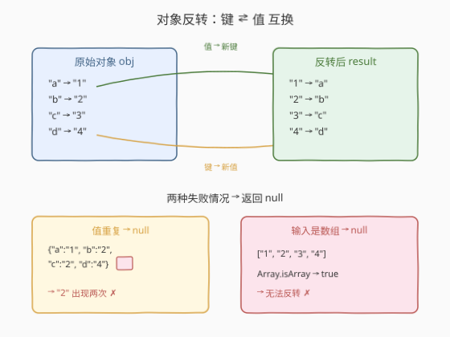
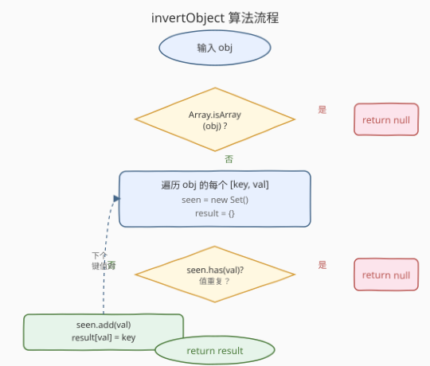
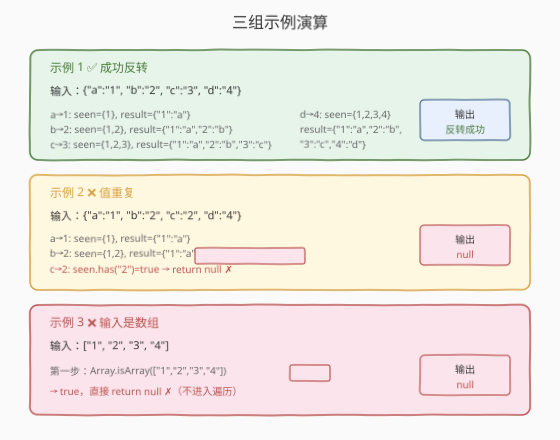

# LeetCode 对象反转 题解

## 1. 题目概述

- **标题 / 题号**：对象反转（#2822，easy）
- **链接**：https://leetcode.cn/problems/inversion-of-object/
- **难度**：简单
- **标签**：对象、哈希表、类型判定

> ⚠️ 本题为 LeetCode 付费题，题意描述根据官方示例用例与 hints 重建，可能与官方题面有出入。

**题意**：给定一个对象或数组 `obj`（`JSON.parse` 的输出），将其**反转**——即交换键与值：原对象的每个键值对 `(key, val)` 在结果中变为 `(val, key)`。

反转需满足以下规则：

- 若 `obj` 是**数组**，返回 `null`（数组无字符串键，不可反转）；
- 若 `obj` 是普通对象但存在**重复值**（两个不同键映射到同一值），返回 `null`（反转后会丢失信息，无法唯一确定）；
- 否则，返回反转后的新对象。

**函数签名**：

```javascript
/**
 * @param {Object|Array} obj
 * @return {Object|null}
 */
function invertObject(obj) { ... }
```

**示例 1**：

```text
输入：obj = {"a": "1", "b": "2", "c": "3", "d": "4"}
输出：{"1": "a", "2": "b", "3": "c", "4": "d"}
解释：所有值唯一，键值互换成功。
```

**示例 2**：

```text
输入：obj = {"a": "1", "b": "2", "c": "2", "d": "4"}
输出：null
解释：值 "2" 同时出现在键 "b" 和 "c" 中，反转后 "2" 无法唯一映射，返回 null。
```

**示例 3**：

```text
输入：obj = ["1", "2", "3", "4"]
输出：null
解释：输入是数组，不是可反转的普通对象，返回 null。
```

**约束**：

- `obj` 是一个有效的 JSON 值（`JSON.parse` 的输出）；
- 本题仅开放 JavaScript / TypeScript 提交。

> 💡 本题是 LeetCode「30 天 JavaScript」系列题目，核心考察**对象遍历 + 重复值检测 + 类型判定**。与 Lodash 的 `_.invert` 不同——`_.invert` 遇重复值时后者覆盖前者，本题要求遇重复直接返回 `null`。这一设计差异使本题从"遍历 + 赋值"升级为"遍历 + 去重检查"。

## 2. 解题思路

### 2.1 暴力思路：直接遍历赋值

最直觉的写法：遍历对象的所有键值对，直接 `result[val] = key`：

```javascript
function invertObject(obj) {
    const result = {};
    for (const key in obj) {
        result[obj[key]] = key;
    }
    return result;
}
```

示例 1 能通过。但这个写法有两个**致命缺陷**：

1. **未检查重复值**：示例 2 中 `"b" → "2"` 和 `"c" → "2"` 会让 `result["2"]` 被覆盖两次——先赋 `"b"` 再赋 `"c"`，最终 `"2"` 映射到 `"c"`，"b" 的信息丢失。题目要求此情况返回 `null`，而非静默覆盖。
2. **未拦截数组输入**：示例 3 传入数组时，`for...in` 遍历的是数组下标（`"0"`, `"1"`, ...），值是数组元素。虽然技术上能"反转"，但题目明确要求数组返回 `null`。

> 💡 对于本题的三个示例，暴力写法**无法通过示例 2 和 3**。核心遗漏是两道防线：数组拦截 + 重复值检测。

### 2.2 核心观察：两道防线 + 一次遍历



反转的本质是遍历对象，对每个 `(key, val)` 执行 `result[val] = key`。关键在于**两道防线**确保反转的合法性：

| 防线 | 判定条件 | 失败动作 | 对应示例 |
|------|----------|----------|----------|
| **第一道：类型拦截** | `Array.isArray(obj)` | 返回 `null` | 示例 3 |
| **第二道：重复值检测** | `seen.has(val)`（Set 查重） | 返回 `null` | 示例 2 |

通过两道防线后，遍历是安全的——每个值都是唯一的，反转不会丢信息。

> 💡 **为什么用 `Set` 而非检查 `result[val] !== undefined`？** 用 `result[val]` 查重有一个陷阱：若原对象某键的值恰好是 `undefined`（`JSON.parse` 不会产生，但 JS 运行时可能），`result[undefined]` 会被赋为字符串 `"undefined"`，后续查重会误判。`Set` 直接存储值本身，语义更清晰、更安全。此外 `Set.has` 是 $O(1)$，与对象属性查找同阶。

> ⚠️ **`for...in` vs `Object.keys`**：`for...in` 会遍历**原型链**上的可枚举属性，若 `obj` 的原型被污染（如 `Object.prototype.foo = "bar"`），会多出一个意外键。`Object.keys(obj)` 只返回**自有可枚举属性**，更安全。本题中 `obj` 是 `JSON.parse` 的输出，原型是 `Object.prototype`（未被污染），两种写法均可。但作为最佳实践，推荐 `Object.entries(obj)` 或 `Object.keys(obj)`。

### 2.3 算法流程图



流程是**线性遍历 + 两个前置判定**：

1. 判定 `Array.isArray(obj)`：是数组 → 返回 `null`
2. 初始化 `seen = new Set()`、`result = {}`
3. 遍历 `obj` 的每个 `[key, val]`
4. 判定 `seen.has(val)`：已存在 → 返回 `null`（重复值）
5. `seen.add(val)`、`result[val] = key`
6. 遍历结束 → 返回 `result`

> 💡 **早返回设计**：两道防线都采用"检测到即返回 `null`"的策略，无需遍历完整对象。在值重复出现在第一个键值对时就能立即短路退出，避免无用遍历。这是"快速失败"思想的体现。

### 2.4 示例演算



**示例 1** `obj = {"a":"1", "b":"2", "c":"3", "d":"4"}`：

| 步骤 | key | val | seen.has(val)? | seen（更新后） | result（更新后） |
|------|-----|-----|-----------------|----------------|------------------|
| 1 | a | "1" | 否 | {"1"} | {"1":"a"} |
| 2 | b | "2" | 否 | {"1","2"} | {"1":"a","2":"b"} |
| 3 | c | "3" | 否 | {"1","2","3"} | {"1":"a","2":"b","3":"c"} |
| 4 | d | "4" | 否 | {"1","2","3","4"} | {"1":"a","2":"b","3":"c","4":"d"} |

遍历结束，返回 `{"1":"a","2":"b","3":"c","4":"d"}` $\checkmark$。

**示例 2** `obj = {"a":"1", "b":"2", "c":"2", "d":"4"}`：

| 步骤 | key | val | seen.has(val)? | 动作 |
|------|-----|-----|-----------------|------|
| 1 | a | "1" | 否 | seen.add("1"), result["1"]="a" |
| 2 | b | "2" | 否 | seen.add("2"), result["2"]="b" |
| 3 | c | "2" | **是** | **return null** ✗ |

在步骤 3 检测到 `"2"` 已在 `seen` 中，立即返回 `null` $\checkmark$。键 `"d"` 未被遍历（早返回短路）。

**示例 3** `obj = ["1", "2", "3", "4"]`：

| 步骤 | 判定 | 结果 |
|------|------|------|
| 1 | `Array.isArray(["1","2","3","4"])` | `true` |

直接返回 `null`，不进入遍历 $\checkmark$。

## 3. 参考代码

### JavaScript / TypeScript（提交语言）

```javascript
/**
 * @param {Object|Array} obj
 * @return {Object|null}
 */
function invertObject(obj) {
    if (Array.isArray(obj)) return null;

    const result = {};
    const seen = new Set();

    for (const [key, val] of Object.entries(obj)) {
        if (seen.has(val)) return null;
        seen.add(val);
        result[val] = key;
    }
    return result;
}
```

TypeScript 版（带类型标注）：

```typescript
function invertObject(obj: Record<string, any> | any[]): Record<string, any> | null {
    if (Array.isArray(obj)) return null;

    const result: Record<string, any> = {};
    const seen = new Set<any>();

    for (const [key, val] of Object.entries(obj)) {
        if (seen.has(val)) return null;
        seen.add(val);
        result[val] = key;
    }
    return result;
}
```

### Python（概念等价）

> 本题 LeetCode 仅开放 JS/TS，Python 版作概念对照。⚠️ **核心差异**：Python 中字典的键可以是任意**可哈希**类型（字符串、数字、元组等），而 JS 对象键始终是字符串。Python 的 `dict` 不存在原型链问题，也无需 `Array.isArray` 判定（用 `isinstance(obj, list)` 即可）。

```python
def invert_object(obj):
    """
    概念等价实现。

    JS: Array.isArray(obj) → return null
    Python: isinstance(obj, list) → return None

    JS: Object.entries(obj) 遍历自有可枚举属性
    Python: obj.items() 遍历字典键值对
    """
    if isinstance(obj, list):
        return None

    result = {}
    seen = set()

    for key, val in obj.items():
        if val in seen:
            return None
        seen.add(val)
        result[val] = key

    return result


# 示例 1
print(invert_object({"a": "1", "b": "2", "c": "3", "d": "4"}))
# {'1': 'a', '2': 'b', '3': 'c', '4': 'd'}

# 示例 2
print(invert_object({"a": "1", "b": "2", "c": "2", "d": "4"}))
# None

# 示例 3
print(invert_object(["1", "2", "3", "4"]))
# None
```

> ⚠️ Python 中 `dict` 的 `in` 操作符检测键是否存在（`val in seen` 检测 `val` 是否在 `set` 中），与 JS 的 `seen.has(val)` 语义一致，都是 $O(1)$ 查找。

## 4. 复杂度分析

| 维度 | 复杂度 | 说明 |
|------|--------|------|
| 时间复杂度 | $O(n)$ | 遍历对象所有 $n$ 个键值对一次，每轮 `Set.has` / `Set.add` / 属性赋值均为 $O(1)$ |
| 空间复杂度 | $O(n)$ | `result` 和 `seen` 各存储 $n$ 个条目，总计 $O(n)$ |

> 💡 最坏情况下（所有值唯一），需完整遍历并存储所有键值对。若第一个键值对就重复（极小概率），可立即返回 `null`——但平均复杂度仍为 $O(n)$。

## 5. 扩展：Lodash `_.invert` 与本题的差异

Lodash 的 `_.invert(obj)` 遇重复值时采用**后者覆盖前者**策略：

```javascript
const _ = require('lodash');
_.invert({"a": "1", "b": "2", "c": "2", "d": "4"});
// → {"1": "a", "2": "c", "4": "d"}   ← "b" 的映射被 "c" 覆盖
```

而本题要求遇重复值直接返回 `null`，不允许信息丢失。两者的设计哲学不同：

| 维度 | Lodash `_.invert` | 本题 `invertObject` |
|------|-------------------|----------------------|
| **重复值策略** | 后者覆盖前者（静默丢失） | 返回 `null`（快速失败） |
| **数组输入** | 按下标反转（`{0:"0", 1:"1", ...}`） | 返回 `null`（拒绝反转） |
| **适用场景** | 容忍信息丢失的快速反转 | 要求值唯一的严格反转 |

> 💡 **"覆盖"还是"拒绝"是设计取舍**：覆盖策略不中断流程、吞吐高，但调用方可能不知情地丢失数据；拒绝策略显式报错、安全，但要求调用方保证值唯一。本题选择后者，强调**反转的可逆性**——若值不唯一，反转后再反转无法恢复原对象。

### 5.1 反转的可逆性

一个对象 `obj` 经反转得 `inv`，当且仅当 `obj` 的所有值**唯一且为字符串**时，对 `inv` 再次反转能恢复 `obj`：

$$
\text{invert}(\text{invert}(obj)) = obj \iff \text{所有值唯一}
$$

这是"双射"（bijection）的性质：键值互换要求原映射是双射，否则逆映射不存在。本题的"重复值返回 `null`"正是在验证这一数学前提。

## 6. 面试要点

1. **为什么用 `Set` 检测重复值，而不是检查 `result[val] !== undefined`？**

   > `result[val]` 查重有两个隐患：一是若 `val` 恰好是 `undefined`（JS 运行时可能，`JSON.parse` 不会），`result[undefined]` 会被赋为字符串 `"undefined"`，后续查重行为异常；二是 `result` 上可能有原型链继承的属性（如 `toString`），`result["toString"]` 不为 `undefined` 但并非我们赋的值。`Set.has(val)` 直接对值本身进行 $O(1)$ 查找，语义清晰、无歧义。

2. **`Object.entries` 和 `for...in` 的区别？本题应该用哪个？**

   > `for...in` 遍历对象自身及原型链上所有可枚举属性；`Object.entries` 只返回对象自身可枚举属性的 `[key, value]` 数组。本题 `obj` 来自 `JSON.parse`，原型是干净的 `Object.prototype`，两者结果一致。但 `Object.entries` 更安全（不受原型污染影响）且语义更明确，推荐使用。

3. **如果值不是字符串（如数字、布尔），反转后键会怎样？**

   > JavaScript 对象的键**始终是字符串**。若值是数字 `1`，赋值 `result[1] = key` 时键 `1` 会被自动转为字符串 `"1"`。这意味着 `{"a": 1, "b": "1"}`（一个数字 `1`、一个字符串 `"1"`）反转后会冲突——两个不同类型的 `1` 被视为同一键。本题的 `Set` 检测能正确区分它们（`Set` 中 `1 !== "1"`），因此会正确返回 `null`。但 `result[1]` 和 `result["1"]` 实际写入同一槽位，赋值会覆盖。对于 `JSON.parse` 的输出，值类型一致（同为字符串或同为数字），不会出现此问题。

4. **空对象 `{}` 的反转结果是什么？**

   > 空对象 `{}` 的反转结果是 `{}`——没有任何键值对可遍历，`result` 保持初始空对象，`seen` 保持空 Set，循环不执行，直接返回 `{}`。这是正确行为：空映射的逆映射仍是空映射。

5. **为什么数组要返回 `null` 而不是按下标反转？**

   > 数组的"键"是数字下标（`"0"`, `"1"`, ...），反转后值会变成数字字符串 `"0"`, `"1"` 作为新键，而下标对应的元素值作为新值。这在逻辑上可行，但题目明确要求数组返回 `null`——因为数组的语义是"有序序列"而非"键值映射"，对数组做"反转"在语义上无意义。这与 [2705 精简对象](../2701-2800/2705_精简对象.md) 中数组被视为"索引作键的对象"的设计不同：2705 递归精简时数组参与，本题反转时数组被拒绝。

> 💡 **一句话总结**：2822 = 「`Array.isArray` 拦截 + `Set` 查重 + `result[val] = key` 赋值」。核心是两道防线确保反转的合法性：数组不可反转、重复值不可反转。通过后遍历赋值即可，$O(n)$ 一次过。

## 同类练习题

| # | 题目 | 与本题的关联 |
|---|------|-------------|
| 2705 | [精简对象](https://leetcode.cn/problems/compact-object/)（[题解](../2701-2800/2705_精简对象.md)） | JS 30 天系列，对象递归遍历 + 类型分派，与本题同属 JS 原生对象操作族 |
| 2804 | [数组原型的 forEach 方法](https://leetcode.cn/problems/array-prototype-foreach/)（[题解](../2801-2900/2804_数组原型的forEach方法.md)） | JS 30 天系列，实现 `Array.prototype.forEach`，与本题同属 JS 语言特性系列 |
| 2634 | [过滤数组中的元素](https://leetcode.cn/problems/filter-elements-from-array/)（[题解](../2601-2700/2634_过滤数组中的元素.md)） | JS 30 天系列，实现 `filter`，共享遍历骨架，回调返回值决定元素去留 |
| 2704 | [相等还是不相等](https://leetcode.cn/problems/to-be-or-not-to-be/)（[题解](../2701-2800/2704_相等还是不相等.md)） | JS 30 天系列，考察闭包与 `expect` 语义，与本题同属 JS 语言特性系列 |
