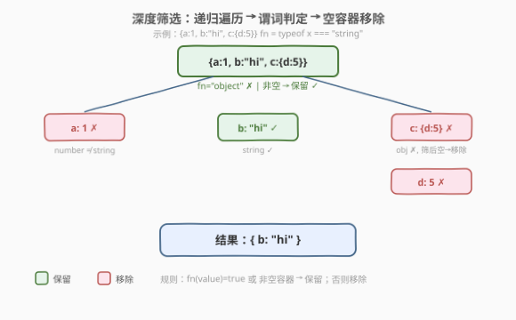
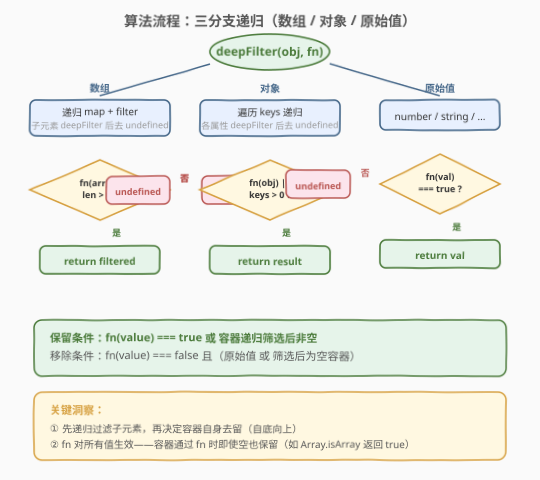
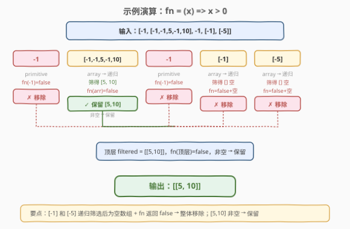

# 深度对象筛选

- **题目名称**：深度对象筛选
- **链接**：[2823. 深度对象筛选](https://leetcode.cn/problems/deep-object-filter/)
- **难度**：中等
- **标签**：递归、深度优先搜索、对象遍历

## 1. 题目概述

> ⚠️ 本题为 LeetCode 付费题，题意描述根据官方示例用例与 hints 重建，可能与官方题面有出入。

给定一个可能多层嵌套的对象或数组 `obj`，以及一个谓词函数 `fn`，对 `obj` 执行**深度筛选**：

- **递归遍历** `obj` 的所有层级（数组元素、对象属性值）
- 对每个值调用 `fn(value)`：
  - 若 `fn` 返回 `true`，保留该值
  - 若 `fn` 返回 `false`，移除该值（原始值直接移除，容器则递归筛完后若为空也移除）
- 返回筛选后的新对象/数组；若全部被移除则返回 `undefined`

**核心规则**（保留条件，满足任一即保留）：

$$
\text{keep}(v) = \text{fn}(v) = \text{true} \quad \lor \quad \bigl(v \text{ 是容器} \land \text{filtered}(v) \neq \emptyset\bigr)
$$

**示例 1**：

```text
输入：obj = [-5,-4,-3,-2,-1,0,1], fn = (x) => x > 0
输出：[1]
解释：仅 1 > 0 为 true，其余移除。
```

**示例 2**：

```text
输入：obj = {"a":1,"b":"2","c":3,"d":"4","e":5,"f":6,"g":{"a":1}}, fn = (x) => typeof x === "string"
输出：{"b":"2","d":"4"}
解释：b、d 的值是字符串，保留。g 的值 {"a":1} 递归筛后为空 {} 且 fn({})="object"≠"string" → 移除。
```

**示例 3**：

```text
输入：obj = [-1,[-1,-1,5,-1,10],-1,[-1],[-5]], fn = (x) => x > 0
输出：[[5,10]]
解释：[-1,-1,5,-1,10] 递归筛得 [5,10]，非空 → 保留。[-1] 和 [-5] 递归筛后为空 → 移除。
```

**示例 4**：

```text
输入：obj = [[[[5]]]], fn = (x) => Array.isArray(x)
输出：[[[[]]]]
解释：5 不是数组 → 移除。[5] 筛后为 []，但 fn([5])=true → 保留空数组 []。逐层向上，每层数组均通过 fn → 保留。
```

**约束条件**：

- `obj` 是有效的 JSON 值（对象、数组、数字、字符串、布尔值、`null`）
- 嵌套深度无上限（受调用栈限制）
- `fn` 是一元函数，返回布尔值

> 💡 本题考察**递归**与**引用类型判定**。关键洞察：容器（数组/对象）先递归筛子元素，再根据「fn 是否通过」或「筛后是否非空」决定自身去留。注意 JavaScript 中 `typeof null === "object"`，需额外排除 `null`。

---

## 2. 解题思路

### 2.1 暴力思路：仅过滤顶层

最直觉的做法是对 `obj` 的直接子元素调用 `fn`，只保留返回 `true` 的——等价于 `arr.filter(fn)` 或 `Object.fromEntries(Object.entries(obj).filter(([k, v]) => fn(v)))`。

> ⚠️ 暴力法的硬伤：① 不递归，嵌套层级中的不满足元素无法被移除；② 不处理空容器移除，导致结果中残留空 `{}` / `[]`。例如示例 3 中 `[-1]` 会变成 `[]` 留在结果里，不符合预期。

### 2.2 核心观察：递归 + 谓词 + 空容器移除



关键观察有三点：

1. **先递归后判定**（自底向上）：对容器先递归筛子元素，再决定容器自身去留。只有递归后才知道容器是否为空，从而正确识别并移除空容器。

2. **fn 对所有值生效**：谓词函数不仅判原始值，也判容器本身。若 `fn(容器)` 返回 `true`，即使筛后为空也保留（如示例 4 的 `Array.isArray`）。若返回 `false`，则仅当筛后非空时才保留。

3. **三分支判定**：根据值类型走不同路径——数组（`Array.isArray`）、对象（`typeof === "object" && !== null`）、原始值（其余）。

> 💡 **为什么 fn 要对容器也生效？** 考虑 `fn = Array.isArray`：若 fn 只判原始值，所有原始值都会被移除（无一是数组），最终所有容器都变空被移除，结果恒为 `undefined`。让 fn 也判容器，才能实现「保留所有数组但移除数组内的非数组元素」这类需求。

### 2.3 算法流程图



**完整步骤**：

1. **判定数组**：`Array.isArray(obj)` 为 `true` → 进入数组分支
   - 对每个元素递归 `deepFilter`，过滤掉 `undefined`
   - 判定 `fn(obj) || filtered.length > 0`：是 → 返回 `filtered`；否 → 返回 `undefined`

2. **判定对象**：`obj !== null && typeof obj === "object"` → 进入对象分支
   - 遍历每个 key，递归 `deepFilter`，仅保留非 `undefined` 的
   - 判定 `fn(obj) || Object.keys(result).length > 0`：是 → 返回 `result`；否 → 返回 `undefined`

3. **原始值**：直接返回 `fn(obj) ? obj : undefined`

> ⚠️ `typeof null === "object"` 是 JavaScript 的历史遗留设计。判定对象时必须 `obj !== null` 前置，否则 `null` 会被误判为对象进入对象分支。

### 2.4 示例演算

以示例 3 `[-1,[-1,-1,5,-1,10],-1,[-1],[-5]]`，`fn = (x) => x > 0` 为例：



| 元素 | 类型 | 递归筛选结果 | fn(元素) | 决策 |
|------|------|-------------|----------|------|
| `-1` | 原始值 | — | `false` | ✗ 移除 |
| `[-1,-1,5,-1,10]` | 数组 | `[5,10]` | `false` | ✓ 非空 → 保留 `[5,10]` |
| `-1` | 原始值 | — | `false` | ✗ 移除 |
| `[-1]` | 数组 | `[]` | `false` | ✗ 空 + fn=false → 移除 |
| `[-5]` | 数组 | `[]` | `false` | ✗ 空 + fn=false → 移除 |

顶层 `filtered = [[5,10]]`，`fn(顶层) = false`，非空 → 保留。最终输出 `[[5,10]]`。

> 💡 注意 `[-1]` 和 `[-5]` 的区别于 `[-1,-1,5,-1,10]`：前者递归筛后为空数组 `[]` 且 `fn` 返回 `false` → 整体移除；后者筛后非空 → 保留筛后结果 `[5,10]`。

---

## 3. 参考代码

### JavaScript

```javascript
/**
 * @param {Object|Array} obj
 * @param {Function} fn
 * @return {Object|Array|undefined}
 */
deepFilter = function(obj, fn) {
    if (Array.isArray(obj)) {
        const filtered = obj
            .map(item => deepFilter(item, fn))
            .filter(item => item !== undefined);
        if (fn(obj) || filtered.length > 0) {
            return filtered;
        }
        return undefined;
    }
    if (obj !== null && typeof obj === 'object') {
        const result = {};
        for (const key in obj) {
            const filtered = deepFilter(obj[key], fn);
            if (filtered !== undefined) {
                result[key] = filtered;
            }
        }
        if (fn(obj) || Object.keys(result).length > 0) {
            return result;
        }
        return undefined;
    }
    return fn(obj) ? obj : undefined;
};
```

### Python

```python
class Solution:
    def deepFilter(self, obj, fn):
        if isinstance(obj, list):
            filtered = [v for v in (self.deepFilter(item, fn) for item in obj) if v is not None]
            if fn(obj) or len(filtered) > 0:
                return filtered
            return None
        if isinstance(obj, dict):
            result = {}
            for key, value in obj.items():
                filtered = self.deepFilter(value, fn)
                if filtered is not None:
                    result[key] = filtered
            if fn(obj) or len(result) > 0:
                return result
            return None
        return obj if fn(obj) else None
```

> 💡 Python 版用 `None` 作为「移除」哨兵，JavaScript 原生有 `undefined` 更适合此角色。注意 Python 的 `isinstance(obj, list)` / `isinstance(obj, dict)` 分别对应 JS 的 `Array.isArray` 和 `typeof === "object" && !== null`。

---

## 4. 复杂度分析

| 维度 | 复杂度 | 说明 |
|------|--------|------|
| **时间复杂度** | $O(N)$ | $N$ 为所有值的总数（原始值 + 容器），每个值访问一次，`fn` 调用一次 |
| **空间复杂度** | $O(D)$ | $D$ 为最大嵌套深度，即递归栈深度；输出对象不计入辅助空间 |

> ⚠️ 递归栈深度受 JS 引擎限制（通常约 $10^4$ 层），题目数据量下不会触发。若需处理极深嵌套，可用栈模拟迭代（见第 5 节）。

---

## 5. 扩展：迭代写法（栈模拟）

递归写法简洁但受调用栈限制。可用**显式栈**模拟后序遍历：

1. **压栈**：将根节点入栈
2. **展开**：栈顶帧的子节点依次入栈（标记为「未处理」）
3. **回溯**：子节点全部处理完后，对当前帧执行筛选逻辑
4. **合并**：将筛选结果回传给父帧

核心难点在于**后序合并**：需等所有子节点处理完才能判定容器是否为空。可用 `Map` 缓存每个帧的处理状态（处理中 / 已完成 + 结果）。

> 💡 面试中建议先写递归版（简洁直观），再口述迭代思路（无栈溢出风险）。除非面试官明确要求手写迭代，否则不必展开完整代码。

---

## 6. 面试要点

1. **为什么先递归再判定，而不是先判定再递归？**

   - 容器是否为空只有在递归筛完子元素后才能确定。若先 `fn(容器)` 再递归，无法根据筛后是否为空做决策，会导致空容器残留。自底向上的顺序保证了空容器能被正确识别和移除。

2. **`fn(obj)` 对容器调用时传的是原始对象还是筛后对象？**

   - 传的是**原始对象**。`fn` 判定的是值本身的类型/属性，而非筛后状态。筛后状态仅用于「容器是否非空」的第二条保留条件。例如 `Array.isArray([5])` 永远为 `true`，无论筛后是否为空。

3. **如何处理 `null`？**

   - JavaScript 中 `typeof null === "object"` 是已知设计缺陷。判定对象时必须 `obj !== null && typeof obj === "object"`，否则 `null` 会被误判为对象进入对象分支。`null` 应走原始值分支：`fn(null) ? null : undefined`。

4. **示例 4 中 `[[[[5]]]]` 为什么结果是 `[[[[]]]]` 而不是 `[]`？**

   - `fn = Array.isArray` 对所有数组返回 `true`。`5` 不是数组 → 移除。`[5]` 筛后为 `[]`，但 `fn([5]) = true` → 保留空数组 `[]`。同理每层数组都通过 `fn`，所以结构保留，仅最内层的 `5` 被移除，替换为 `[]`。

5. **返回 `undefined` 和返回空对象 `{}` / `[]` 有什么区别？**

   - `undefined` 表示「该值被完全移除，父级不应包含它」。空对象/数组表示「该容器存在但为空」，会被保留在父级中。区分两者是本题的核心——空容器仅在 `fn` 返回 `true` 时才保留，否则被移除为 `undefined`。

> 💡 **一句话总结**：2823 的核心是「先递归筛子元素，再以 `fn(value) || 非空` 决定容器去留」。三分支（数组/对象/原始值）覆盖所有值类型，`undefined` 作移除哨兵逐层向上传播。$O(N)$ 时间、$O(D)$ 空间。

---

## 7. 同类练习题

- [2705. 精简对象](https://leetcode.cn/problems/compact-object/)：递归移除对象中 falsy 值，同为嵌套对象深度遍历 + 空容器移除
- [2700. 两个对象之间的差异](https://leetcode.cn/problems/differences-between-two-objects/)：深度递归比较两个对象并返回差异路径，同为嵌套对象遍历
- [341. 扁平化嵌套列表迭代器](https://leetcode.cn/problems/flatten-nested-list-iterator/)：递归/栈处理嵌套列表结构，提取原始值
- [133. 克隆图](https://leetcode.cn/problems/clone-graph/)：深度递归遍历 + 哈希记忆化，处理引用类型图结构
