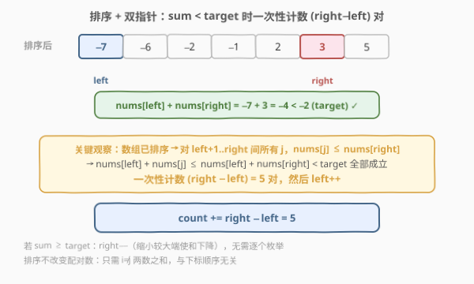

# LeetCode 统计和小于目标下标对数目 题解

## 1. 题目概述

- **标题 / 题号**：统计和小于目标下标对数目（#2824，easy）
- **链接**：https://leetcode.cn/problems/count-pairs-whose-sum-is-less-than-target/
- **难度**：简单
- **标签**：数组、双指针、二分查找、排序

**题意**：给你一个下标从 **0** 开始长度为 $n$ 的整数数组 `nums` 和一个整数 `target`，请你返回满足 $0 \le i < j < n$ 且 $\text{nums}[i] + \text{nums}[j] < \text{target}$ 的下标对 $(i, j)$ 的数目。

**示例 1**：

```text
输入：nums = [-1,1,2,3,1], target = 2
输出：3
解释：共有 3 个下标对满足条件：
- (0, 1)，nums[0] + nums[1] = 0 < 2
- (0, 2)，nums[0] + nums[2] = 1 < 2
- (0, 4)，nums[0] + nums[4] = 0 < 2
注意 (0, 3) 不计入答案，因为 nums[0] + nums[3] = 2 不严格小于 target。
```

**示例 2**：

```text
输入：nums = [-6,2,5,-2,-7,-1,3], target = -2
输出：10
```

**约束**：

- $1 \le \text{nums.length} = n \le 50$
- $-50 \le \text{nums}[i], \text{target} \le 50$

> 💡 本题核心是「**排序 + 双指针计数**」。关键词「和小于目标值」+「只计数不定位」天然允许排序——排序不改变任意两数之和，只需统计有多少对**不同元素**满足条件。这与 [1. 两数之和](../0001-0100/1_两数之和.md) 的「精确查找」截然不同：后者需要返回原始下标，不能排序；本题只计数，排序后用双指针一次扫描即可，是 [611. 有效三角形的个数](../0601-0700/611_有效三角形的个数.md) 计数型双指针模板的入门版。

## 2. 解题思路

### 2.1 暴力思路：枚举所有数对

双重循环枚举所有 $(i, j)$ 对（$i < j$），对每对检查 $\text{nums}[i] + \text{nums}[j] < \text{target}$，满足则计数。时间 $O(n^2)$。$n \le 50$ 时约 $2500$ 次比较，轻松通过。

> ⚠️ 暴力法的硬伤：没有利用「**排序后可以批量计数**」这一结构。当 $\text{nums}[\text{left}] + \text{nums}[\text{right}] < \text{target}$ 时，left 与 left+1 到 right 之间的**所有元素**配对都满足条件，无需逐个检查。正解利用这一单调性将 $O(n^2)$ 降为 $O(n \log n)$。

### 2.2 核心观察：排序 + 双指针批量计数

关键观察：题目只要求 $i < j$ 且 $\text{nums}[i] + \text{nums}[j] < \text{target}$，**不关心原始下标**，只数对数。而任意两个不同元素在原数组中必然存在一个 $i < j$ 的排列，所以**排序不改变配对数目**。

排序后，使用左右双指针 `left` 和 `right`：

1. 若 $\text{nums}[\text{left}] + \text{nums}[\text{right}] < \text{target}$：由于数组已排序，对 left+1 到 right 之间的所有 $j$，都有 $\text{nums}[\text{left}] + \text{nums}[j] \le \text{nums}[\text{left}] + \text{nums}[\text{right}] < \text{target}$。因此**一次性计数 $(\text{right} - \text{left})$ 对**，然后 `left++`。
2. 若 $\text{nums}[\text{left}] + \text{nums}[\text{right}] \ge \text{target}$：和太大，需要减小，`right--`（缩小较大端使和下降）。



> 💡 **为什么排序不影响答案？** 题目要求的是「下标对 $(i, j)$ 且 $i < j$」的**数目**，而非具体下标。排序后，任意两个不同元素仍能构成恰好一个有序对（较小的在前），所以满足「和小于 target」的元素对数量不变。这与 [1. 两数之和](../0001-0100/1_两数之和.md) 形成鲜明对照：后者要求返回原始下标，排序会打乱下标映射，只能用哈希表。

### 2.3 算法流程图


**完整步骤**：

1. **排序**：`sort(nums)`
2. **初始化**：`left = 0, right = n - 1, count = 0`
3. **循环** `while left < right`：
   - 若 `nums[left] + nums[right] < target`：`count += right - left`，`left++`
   - 否则：`right--`
4. **返回** `count`

### 2.4 示例演算

以示例 2 `nums = [-6,2,5,-2,-7,-1,3], target = -2` 为例。排序后得 `[-7, -6, -2, -1, 2, 3, 5]`：


| 步骤 | left | right | $\text{nums}[l]+\text{nums}[r]$ | $< \text{target}$? | 动作 | count |
|------|------|-------|----------------------------------|---------------------|------|-------|
| 1 | 0 | 6 | $-7+5=-2$ | 否（$-2 \not< -2$） | `right--` | 0 |
| 2 | 0 | 5 | $-7+3=-4$ | 是 ✓ | `count+=5, left++` | 5 |
| 3 | 1 | 5 | $-6+3=-3$ | 是 ✓ | `count+=4, left++` | 9 |
| 4 | 2 | 5 | $-2+3=1$ | 否 | `right--` | 9 |
| 5 | 2 | 4 | $-2+2=0$ | 否 | `right--` | 9 |
| 6 | 2 | 3 | $-2+(-1)=-3$ | 是 ✓ | `count+=1, left++` | 10 |
| 7 | 3 | 3 | — | $\text{left} \ge \text{right}$ | 停止 | 10 |

3 次「是」分别贡献 $5+4+1=10$ 对，3 次「否」仅移动 `right` 不计数，最终返回 `10`，与示例 2 一致。

> 💡 示例 1 `nums = [-1,1,2,3,1]` 排序后为 `[-1,1,1,2,3]`，`target = 2`。第一步 $\text{left}=0, \text{right}=4$：$-1+3=2 \not< 2$，`right--`；第二步 $\text{left}=0, \text{right}=3$：$-1+2=1 < 2$ ✓，`count += 3`，`left++`。之后 $\text{left} \ge \text{right}$，返回 `3`。

## 3. 参考代码

### C++

```cpp
class Solution {
public:
    int countPairs(vector<int>& nums, int target) {
        sort(nums.begin(), nums.end());
        int count = 0;
        int left = 0, right = nums.size() - 1;
        while (left < right) {
            if (nums[left] + nums[right] < target) {
                count += right - left;  // left 到 right 间所有配对都满足
                left++;
            } else {
                right--;                 // 和太大，缩小右端
            }
        }
        return count;
    }
};
```

### Python

```python
class Solution:
    def countPairs(self, nums: List[int], target: int) -> int:
        nums.sort()
        count = 0
        left, right = 0, len(nums) - 1
        while left < right:
            if nums[left] + nums[right] < target:
                count += right - left   # left 到 right 间所有配对都满足
                left += 1
            else:
                right -= 1               # 和太大，缩小右端
```

> 💡 两版核心逻辑完全一致：排序后双指针从两端向中间收缩。「是」时批量计数并左移 left，「否」时右移 right。整个循环每个元素最多被 left 或 right 访问一次，故扫描阶段为 $O(n)$。

## 4. 复杂度分析

| 维度 | 复杂度 | 说明 |
|------|--------|------|
| **时间复杂度** | $O(n \log n)$ | 排序 $O(n \log n)$ + 双指针扫描 $O(n)$，瓶颈在排序 |
| **空间复杂度** | $O(\log n)$ | 排序的递归栈空间（C++ `std::sort` 为内省排序）；若不计排序则为 $O(1)$ |

> ⚠️ 本题 $n \le 50$，暴力 $O(n^2)$ 同样可通过。但排序 + 双指针是此类「计数型两数之和」问题的标准解法，在 $n$ 更大时（如 $10^5$）优势明显，且为 [611. 有效三角形的个数](../0601-0700/611_有效三角形的个数.md)、[15. 三数之和](../0001-0100/15_三数之和.md) 等进阶题奠定模板基础。

## 5. 扩展：二分查找解法

排序后，对每个 `nums[i]`，在 `i+1` 到 `n-1` 的范围内二分查找满足 `nums[j] < target - nums[i]` 的最大 `j`，则 `j - i` 即为以 `i` 为较小下标的合法配对数。利用 C++ 标准库 `lower_bound` 可简洁实现：

```cpp
class Solution {
public:
    int countPairs(vector<int>& nums, int target) {
        sort(nums.begin(), nums.end());
        int count = 0, n = nums.size();
        for (int i = 0; i < n; i++) {
            int need = target - nums[i];
            // 在 [i+1, n) 中找第一个 >= need 的位置
            auto it = lower_bound(nums.begin() + i + 1, nums.end(), need);
            count += it - (nums.begin() + i + 1);
        }
        return count;
    }
};
```

时间复杂度同样为 $O(n \log n)$（排序 $O(n \log n)$ + $n$ 次二分各 $O(\log n)$），但常数因子略大于双指针（双指针扫描阶段为 $O(n)$，二分为 $O(n \log n)$）。两者思路相通——都依赖排序带来的单调性，只是「双指针利用两端收缩一次到位」更高效。

> 💡 双指针与二分是解决「有序数组计数」问题的两大利器。双指针适合**两端对向收缩**的场景（本题），二分适合**固定一端查找另一端**的场景。[719. 找出第 K 小的数对距离](https://leetcode.cn/problems/find-k-th-smallest-pair-distance/) 是二分答案 + 双指针计数的进阶组合。

## 6. 面试要点

1. **为什么排序不改变配对数？**

   - 题目只要求「$i < j$ 且和小于 target」的对的**数目**，不关心具体下标。排序后任意两个不同元素仍构成恰好一个有序对（值小的在前），满足条件的元素对数量不变。这与 [1. 两数之和](../0001-0100/1_两数之和.md) 需要返回原始下标不同——后者排序会打乱下标映射。

2. **为什么 sum < target 时可以一次性计数 right − left 对？**

   - 数组已排序，对 left+1 到 right 之间的任意 $j$，有 $\text{nums}[j] \le \text{nums}[\text{right}]$，故 $\text{nums}[\text{left}] + \text{nums}[j] \le \text{nums}[\text{left}] + \text{nums}[\text{right}] < \text{target}$ 全部成立。因此不必逐个检查，直接 `count += right - left`。

3. **sum ≥ target 时为什么移动 right 而不移动 left？**

   - 和太大需要减小。固定 left 时，$\text{nums}[\text{left}] + \text{nums}[\text{right}]$ 已是 left 能配对的最大和（right 最大），若仍 $\ge \text{target}$，则 left 与所有更大的 right 配对都 $\ge \text{target}$，只能 `right--` 换一个更小的右端。反之若移动 left，新的 left 更大，和只会更大，无意义。

4. **双指针法会遗漏或重复计数吗？**

   - 不会。每对 $(i, j)$ 恰好在 left 指向较小元素时被计入：当 $\text{nums}[\text{left}] + \text{nums}[\text{right}] < \text{target}$ 时，left 与 left+1 到 right 间所有元素配对被一次性计入，然后 `left++` 永不回头。每对只被数一次，且 left 扫过每个元素至多一次，right 同理。

5. **暴力法与最优解的适用场景？**

   - $n \le 50$ 时暴力 $O(n^2)$ 完全够用，代码更短不易出错。但面试官通常会追问「能否优化」或扩大数据范围（$n \le 10^5$），此时必须用排序 + 双指针 $O(n \log n)$。掌握双指针计数模板是关键。

> 💡 **一句话总结**：2824 是计数型两数之和的入门题——排序后双指针对向收缩，sum < target 时批量计数 $(\text{right} - \text{left})$ 对，sum ≥ target 时右移 right 缩小和。$O(n \log n)$ 时间、$O(1)$ 空间。

## 同类练习题

| # | 题目 | 与本题的关联 |
|---|------|-------------|
| 1 | [两数之和](../0001-0100/1_两数之和.md) | 精确查找两数之和等于目标，需返回原始下标，用哈希表不能排序——与本题「只计数可排序」形成对照 |
| 15 | [三数之和](../0001-0100/15_三数之和.md) | 排序 + 固定一个 + 双指针，三数之和等于零的经典题，双指针模板的进阶应用 |
| 611 | [有效三角形的个数](../0601-0700/611_有效三角形的个数.md) | 排序 + 固定最大边 + 双指针计数 $a+b>c$，与本题同模板的计数型招牌题 |
| 16 | [最接近的三数之和](../0001-0100/16_最接近的三数之和.md) | 排序 + 双指针维护最近和，双指针在「求最值」而非「计数」场景的变体 |
| 719 | [找出第 K 小的数对距离](https://leetcode.cn/problems/find-k-th-smallest-pair-distance/) | 二分答案 + 双指针计数，本题「计数」思想在二分答案框架中的进阶组合 |
