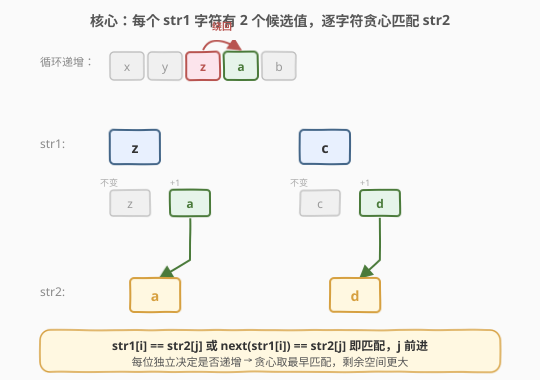
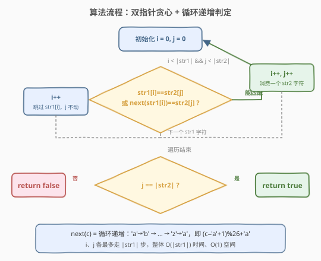
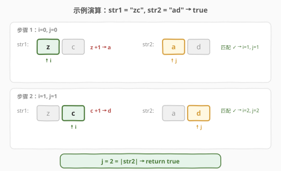

# LeetCode 循环增长使字符串子序列等于另一个字符串 题解

## 1. 题目概述

- **标题 / 题号**：循环增长使字符串子序列等于另一个字符串（#2825，medium）
- **链接**：https://leetcode.cn/problems/make-string-a-subsequence-using-cyclic-increments/
- **难度**：中等
- **标签**：双指针、字符串、贪心

**题意**：给你两个下标从 **0** 开始的字符串 `str1` 和 `str2`。一次操作中，你选择 `str1` 中的若干下标，对选中的每个下标 `i`，将 `str1[i]` **循环**递增为下一个字符——`'a'`→`'b'`、`'b'`→`'c'`、…、`'z'`→`'a'`。

如果执行以上操作 **至多一次** 可以让 `str2` 成为 `str1` 的子序列，返回 `true`，否则返回 `false`。

> **子序列**：从原字符串中删除一些（可以一个也不删）字符后、剩余字符按原本先后顺序组成的新字符串。

**示例 1**：

```text
输入：str1 = "abc", str2 = "ad"
输出：true
解释：选择下标 2，将 str1[2]='c' 循环递增得到 'd'，str1 变成 "abd"，str2="ad" 是其子序列。
```

**示例 2**：

```text
输入：str1 = "zc", str2 = "ad"
输出：true
解释：选择下标 0 和 1。str1[0]='z' 递增得 'a'，str1[1]='c' 递增得 'd'，str1 变成 "ad"，str2 是其子序列。
```

**示例 3**：

```text
输入：str1 = "ab", str2 = "d"
输出：false
解释：str1 中没有任何字符（无论是否递增）能变成 'd'，无法在至多一次操作下让 str2 成为子序列。
```

**约束**：

- $1 \le \text{str1.length} \le 10^5$
- $1 \le \text{str2.length} \le 10^5$
- `str1` 和 `str2` 只包含小写英文字母

> 💡 关键转化：操作允许**任选一组下标**，意味着每个 `str1[i]` 可以**独立决定**是「保持原值」还是「循环递增一次」。于是每个 `str1[i]` 恰好有 **2 个候选值**，问题退化为：能否用这些候选值保序匹配出 `str2`——即 [392. 判断子序列](../0301-0400/392_判断子序列.md) 的「放宽匹配条件」版。

## 2. 解题思路

### 2.1 暴力思路

枚举 `str1` 的所有下标子集（每个下标「递增 / 不递增」二选一），共 $2^{|str1|}$ 种方案，每种方案生成新串后再用双指针判定 `str2` 是否为子序列。$|str1| \le 10^5$ 时方案数是天文数字，完全不可行。问题在于「整体枚举」忽略了**每个字符的递增决策互不影响**这一结构。

### 2.2 核心观察：每个字符 2 个候选值 + 双指针贪心匹配



关键洞察有两条：

1. **决策可独立化**：操作是「任选一组下标各自递增」，每位是否递增彼此独立，不存在「递增了这个就必须递增那个」的耦合。因此判定 `str1[i]` 能否匹配 `str2[j]` 时，只需看 `str1[i]` 的两个候选值——原值或循环递增后的值——是否等于 `str2[j]`：

   $$\text{match}(i, j) \iff \text{str1}[i] = \text{str2}[j] \;\lor\; \text{next}(\text{str1}[i]) = \text{str2}[j]$$

   其中循环递增 $\text{next}(c) = (c - \text{'a'} + 1) \bmod 26 + \text{'a'}$，特别地 `'z'` 的下一个是 `'a'`（绕回）。

2. **贪心取最早匹配**：与 [392](../0301-0400/392_判断子序列.md) 同构——对 `str2` 的每个字符，在 `str1` 中尽量靠前地匹配。**越早匹配，`str1` 剩余部分越长，后续字符可行域是「选更晚」情形的超集**，不会更差。

两个指针 `i`（扫 `str1`）和 `j`（扫 `str2`）同步推进：

- 若 `str1[i]` 能匹配 `str2[j]`（原值或递增值等于 `str2[j]`）→ `j++`（消费一个 `str2` 字符）；
- 无论是否匹配，`i++`（`str1` 总前进，一个字符最多匹配一个 `str2` 字符）。

`j` 走到 `str2` 末尾即成功；`i` 先耗尽而 `j` 未走完则失败。

> ⚠️ **为什么「至多一次操作」不增加难度？** 因为这次操作允许一次性修改任意子集，且每个被选下标只递增一次。这等价于「给每个 `str1[i]` 一个二选一的候选值」，不需要规划「先递增 A 再递增 B」的时序，因此贪心仍然正确——每个字符的两次候选值都即时可用。

### 2.3 算法流程图



流程概括为三步：

1. **初始化**：`i = 0`、`j = 0`；
2. **遍历 `str1`**：判定 `str1[i]` 原值或递增值是否等于 `str2[j]`，是则 `i++`、`j++`（匹配），否则只 `i++`（跳过）；
3. **收尾**：`j == |str2|` 返回 `true`，否则 `false`。

### 2.4 示例演算



以示例 2 `str1 = "zc"`、`str2 = "ad"` 为例，逐步追踪双指针：

| 步骤 | i | j | str1[i] | str2[j] | 不变 | next(+1) | 匹配 | 动作 |
|------|---|---|---------|---------|------|----------|------|------|
| 1 | 0 | 0 | z | a | z | a | ✓（递增） | i=1, j=1 |
| 2 | 1 | 1 | c | d | c | d | ✓（递增） | i=2, j=2 |

`j = 2 = |str2|`，`str2` 全部匹配，返回 `true`。

> 💡 注意 `z` 的递增值是 `a`（绕回），`c` 的递增值是 `d`——两位都靠「递增」而非「原值」匹配。这正是「循环」特性的体现，也是示例 3 失败的根因：`str1 = "ab"` 中 `a`→`b`、`b`→`c`，没有任何候选值能等于 `str2[0]='d'`。

## 3. 参考代码

### C++

```cpp
class Solution {
public:
    bool canMakeSubsequence(string str1, string str2) {
        int i = 0, j = 0, n = str1.size(), m = str2.size();
        while (i < n && j < m) {
            char c = str1[i];
            char nxt = (c - 'a' + 1) % 26 + 'a';
            if (c == str2[j] || nxt == str2[j]) j++;
            i++;
        }
        return j == m;
    }
};
```

### Python

```python
class Solution:
    def canMakeSubsequence(self, str1: str, str2: str) -> bool:
        i = j = 0
        n, m = len(str1), len(str2)
        while i < n and j < m:
            c = str1[i]
            nxt = chr((ord(c) - ord('a') + 1) % 26 + ord('a'))
            if c == str2[j] or nxt == str2[j]:
                j += 1
            i += 1
        return j == m
```

> 💡 循环递增用取模实现：`(c - 'a' + 1) % 26 + 'a'`，`'z'` 自然绕回 `'a'`，无需特判。判定写成「原值相等 **或** 递增值相等」的短路或，一次比较即可决定 `j` 是否前进。

## 4. 复杂度分析

| 维度 | 复杂度 | 说明 |
|------|--------|------|
| 时间复杂度 | $O(n)$ | `i`、`j` 各最多走 $n = |str1|$ 步，每步 $O(1)$（两次字符比较 + 一次取模），合计单趟线性扫描 |
| 空间复杂度 | $O(1)$ | 仅用两个指针与若干字符变量，原地处理不复制字符串 |

> 💡 暴力枚举子集是 $O(2^n \cdot n)$，不可行；本题能线性解决，全靠「每位决策独立」把指数枚举降维成逐位贪心。

## 5. 扩展：与子序列判定家族的关系

本题是 [392. 判断子序列](../0301-0400/392_判断子序列.md) 的「匹配条件放宽」变体：

| 题目 | haystack | pattern | 匹配条件 | 能否改 pattern |
|------|----------|---------|----------|----------------|
| 392 判断子序列 | `t` | `s` | 严格相等 | 否 |
| 2825 本题 | `str1` | `str2` | 原值相等 **或** 循环递增后相等 | 否（只能改 haystack 候选值） |
| 2486 追加字符 | `s` | `t` | 严格相等 | 只能向 `s` 末尾追加 |

三者共享同一套**双指针贪心骨架**——「在 haystack 中尽量靠前匹配 pattern 的每个字符」，差异仅在「何谓匹配」与「允许的修改操作」。本题的特殊之处在于：修改操作（循环递增）作用在 **haystack（`str1`）** 上且**每位独立**，因此可以把「是否递增」融入匹配判定，无需真正修改字符串。

> ⚠️ 若题目改为「只能递增一个**连续区间**」或「递增有代价求最小操作数」，决策就不再独立，贪心失效，需另寻策略（如区间 DP 或带权匹配）。

## 6. 面试要点

1. **为什么「任选一组下标」等价于「每位独立二选一」？**

   > 操作允许一次性选择任意下标集合，被选者各递增一次。集合选择没有耦合约束（不像「选了 i 就必须选 i+1」），因此对每个 `str1[i]` 而言，它要么保持原值、要么取循环递增值，两种候选即时可用，可逐位独立判定。

2. **贪心为何正确？**

   > 与 392 同理：若 `str1[i]` 能匹配 `str2[j]`，尽早匹配让 `str1` 剩余部分更长，后续 `str2[j+1..]` 的可行域是「延后匹配」的超集，不会更差。形式化地，若存在一组延后匹配的可行解，把首个匹配点前移到 `i` 仍可行。

3. **`'z'` 的递增值为什么是 `'a'`？怎么实现？**

   > 题目规定循环递增，`'z'` 的下一个绕回 `'a'`。用取模实现：`next(c) = (c - 'a' + 1) % 26 + 'a'`，`'z'-'a'=25`，`(25+1)%26=0`，得 `'a'`，无需 if 特判。

4. **如果 `str2` 比 `str1` 长怎么办？**

   > 必然 `false`：子序列要求 `str2` 每个字符都在 `str1` 中找到一个不同位置匹配，`str2` 更长则 `i` 会先耗尽而 `j` 未走完。代码中 `i < n && j < m` 的循环条件和 `j == m` 的收尾判定天然覆盖此情况，无需特判。

5. **和 [2486. 追加字符以获得子序列](../2401-2500/2486_追加字符以获得子序列.md) 的区别？**

   > 2486 只能向 `s` **末尾追加**字符（不能改已有字符），求需追加的最少字符数；本题只能对 `str1` 已有字符**循环递增**（不能新增字符），判定能否匹配。前者关注 pattern 的「未匹配尾部长度」，后者关注 pattern 能否整体消化进 haystack 的候选值中。

## 同类练习题

| # | 题目 | 与本题的关联 |
|---|------|-------------|
| 392 | [判断子序列](https://leetcode.cn/problems/is-subsequence/)（[题解](../0301-0400/392_判断子序列.md)） | 双指针贪心判定子序列的母题，本题是其「匹配条件放宽为原值或循环递增值」的变体 |
| 2486 | [追加字符以获得子序列](https://leetcode.cn/problems/append-characters-to-string-to-make-subsequence/)（[题解](../2401-2500/2486_追加字符以获得子序列.md)） | 同骨架双指针，对比「只能末尾追加」与本题「只能循环递增已有字符」的修改操作差异 |
| 28 | [找出字符串中第一个匹配项的下标](https://leetcode.cn/problems/find-the-index-of-the-first-occurrence-in-a-string/)（[题解](../0001-0100/28_找出字符串中第一个匹配项的下标.md)） | 连续子串匹配（KMP），对比「连续 vs 可跳过」与「严格相等 vs 允许递增」 |
| 792 | [匹配子序列的单词数](https://leetcode.cn/problems/number-of-matching-subsequences/) | 批量判定多个 pattern 是否为同一 haystack 的子序列，392 的进阶批量查询版 |
| 1055 | [Shortest Way to Form String](https://leetcode.cn/problems/shortest-way-to-form-string/) | 用源串的多个子序列拼出目标串的最少份数，子序列匹配的计数变体（付费题） |
