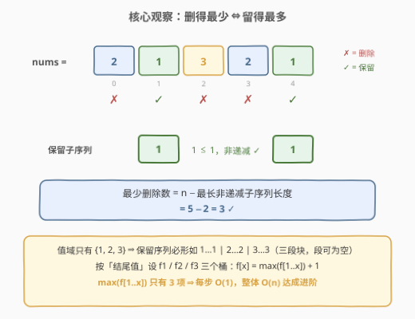
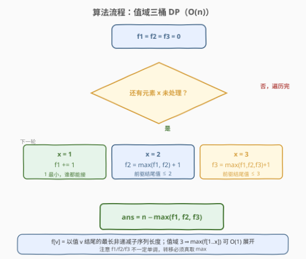
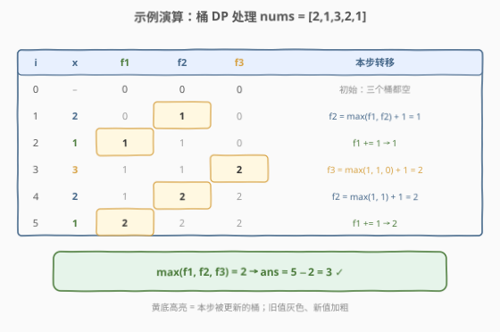

# 将三个组排序

- **题目名称**：将三个组排序
- **链接**：[2826. 将三个组排序](https://leetcode.cn/problems/sorting-three-groups/)
- **难度**：中等
- **标签**：数组、动态规划、二分查找

## 1. 题目概述

给你一个下标从 **0** 开始的整数数组 `nums`，其中 `nums` 的每个元素是 `1`、`2` 或 `3`。每次操作中，你可以删除 `nums` 中的一个元素。返回使 `nums` 成为**非递减**顺序所需操作数的**最小值**。

**示例 1**：

```text
输入：nums = [2,1,3,2,1]
输出：3
解释：其中一个最优方案是删除 nums[0]、nums[2] 和 nums[3]，剩下 [1,1]，非递减。
```

**示例 2**：

```text
输入：nums = [1,3,2,1,3,3]
输出：2
解释：其中一个最优方案是删除 nums[1] 和 nums[2]，剩下 [1,1,3,3]。
```

**示例 3**：

```text
输入：nums = [2,2,2,2,3,3]
输出：0
解释：nums 已是非递减顺序的。
```

**约束条件**：

- $1 \le \text{nums.length} \le 100$
- $1 \le \text{nums[i]} \le 3$

**进阶**：你能使用 $O(n)$ 时间复杂度的算法解决吗？

> 💡 关键转化：删除不改变剩余元素的相对顺序，所以「删完之后剩下的数组」一定是原数组的**子序列**。于是**最少删除 ⇔ 最多保留 ⇔ 最长非递减子序列**——[300. 最长递增子序列](../0201-0300/300_最长递增子序列.md) 的非严格版，且值域只有 $\{1,2,3\}$，恰好可以 $O(n)$ 解决。

---

## 2. 解题思路

### 2.1 暴力思路

枚举每个元素「删 / 不删」，共 $2^n$ 种方案，逐一检查剩余数组是否非递减并取最小删除数。$n = 100$ 时方案数是天文数字，完全不可行。问题在于整体枚举忽略了「保留的元素只需保序且非递减」这一结构——这正指向**最长非递减子序列（LIS 非严格版）**。

顺带一提：$n \le 100$ 允许 $O(n^2)$ 的平方 DP（`dp[i]` = 以 `nums[i]` 结尾的最长非递减子序列长度，`dp[i] = max(dp[j]) + 1`，其中 `j < i` 且 `nums[j] <= nums[i]`）直接过，但进阶要求 $O(n)$，下文给出。

### 2.2 核心观察：删得最少 ⇔ 留得最多 ⇔ 最长非递减子序列



关键洞察有三条：

1. **删除保序**：不管删哪些元素，剩下的元素相对顺序不变，因此「操作后得到的数组」⇔「原数组的某个子序列」。反过来，任何一个非递减子序列都可以通过删掉其余元素得到。于是：

   $$\text{最少删除数} = n - \text{最长非递减子序列长度}$$

2. **值域只有 $\{1,2,3\}$**：保留序列非递减且每个元素 $\in \{1,2,3\}$，它必形如 $1\cdots1\,2\cdots2\,3\cdots3$ 的**三段块**（每段可为空）。这提示按「结尾值」设 3 个桶做 DP。

3. **桶 DP**：设 $f_v$ = 「以值 $v$ 结尾的最长非递减子序列」的长度（$v \in \{1,2,3\}$）。处理元素 $x$ 时，非递减序列中 $x$ 的**前驱结尾值必须 $\le x$**，故：

   $$f_x \leftarrow \max(f_1, \dots, f_x) + 1$$

   具体展开成三个 $O(1)$ 分支：

   - $x=1$：$f_1 \mathrel{+}= 1$（$1$ 最小，只能接在结尾值为 $1$ 的序列后）
   - $x=2$：$f_2 \leftarrow \max(f_1, f_2) + 1$
   - $x=3$：$f_3 \leftarrow \max(f_1, f_2, f_3) + 1$

   最终答案为 $n - \max(f_1, f_2, f_3)$。$\max(f_{1..x})$ 只有至多 3 项，每步 $O(1)$，整体 $O(n)$，达成进阶要求。

> ⚠️ **$f_1/f_2/f_3$ 并不单调**。例如 `nums = [1,1,1]` 处理完后 $f_1 = 3 > f_2 = 0$，因此转移必须老老实实对 $f_{1..x}$ 取 max，不能想当然地取 $f_{x-1}$。

### 2.3 算法流程图



流程概括为三步：

1. **初始化**：$f_1 = f_2 = f_3 = 0$（空序列是合法基底）；
2. **单趟扫描**：对每个 $x$ 按值三分支更新对应的桶；
3. **收尾**：$\text{ans} = n - \max(f_1, f_2, f_3)$。

### 2.4 示例演算



以示例 1 `nums = [2,1,3,2,1]` 为例，逐步追踪三个桶：

| 步骤 $i$ | $x$ | $f_1$ | $f_2$ | $f_3$ | 本步转移 |
|------|-----|-----|-----|-----|----------|
| 0 | – | 0 | 0 | 0 | 初始：三个桶都空 |
| 1 | 2 | 0 | **1** | 0 | $f_2 = \max(f_1,f_2)+1 = 1$ |
| 2 | 1 | **1** | 1 | 0 | $f_1 \mathrel{+}= 1$ |
| 3 | 3 | 1 | 1 | **2** | $f_3 = \max(1,1,0)+1 = 2$ |
| 4 | 2 | 1 | **2** | 2 | $f_2 = \max(1,1)+1 = 2$ |
| 5 | 1 | **2** | 2 | 2 | $f_1 \mathrel{+}= 1$ |

$\max(f_1, f_2, f_3) = 2$，即最长非递减子序列长度为 2（如 $[1,1]$ 或 $[2,3]$），故 $\text{ans} = 5 - 2 = 3$，与示例一致。

> 💡 用示例 2 `nums = [1,3,2,1,3,3]` 自行验证：最终 $f_1=2, f_2=2, f_3=4$，$\text{ans} = 6 - 4 = 2$ ✓。最长保留序列即 $[1,2,3,3]$（下标 0、2、4、5）。

---

## 3. 参考代码

### C++（值域三桶 DP，$O(n)$）

```cpp
class Solution {
public:
    int minimumOperations(vector<int>& nums) {
        int f1 = 0, f2 = 0, f3 = 0;   // f[v]：以值 v 结尾的最长非递减子序列长度
        for (int x : nums) {
            if (x == 1) {
                f1 += 1;
            } else if (x == 2) {
                f2 = max(f1, f2) + 1;
            } else {
                f3 = max({f1, f2, f3}) + 1;
            }
        }
        return (int)nums.size() - max({f1, f2, f3});
    }
};
```

### Python（贪心 + 二分，$O(n \log n)$ 通用 LIS 写法）

```python
from bisect import bisect_right

class Solution:
    def minimumOperations(self, nums: List[int]) -> int:
        g = []  # g[k] = 长度为 k+1 的非递减子序列的最小结尾值
        for x in nums:
            pos = bisect_right(g, x)  # 非递减：找第一个 > x 的位置
            if pos == len(g):
                g.append(x)
            else:
                g[pos] = x
        return len(nums) - len(g)
```

> 💡 两种写法的分工：桶 DP 是**值域敏感**的极致优化（值域 3 ⇒ 手工展开 $O(1)$ 转移）；贪心 + 二分是值域无关的通用模板（300 题标准解）。本题值域只有 3，`g` 长度恒 $\le 3$，二分实际退化为 $O(1)$，因此两个版本在本题都是 $O(n)$。
>
> ⚠️ 非递减（允许相等）必须用 `bisect_right` / `upper_bound`（找第一个 $> x$ 的位置）；严格递增才用 `bisect_left` / `lower_bound`。用反了会把相等的元素错误地「续接」或「丢弃」——这是 LIS 家族的高频考点。

---

## 4. 复杂度分析

| 维度 | 复杂度 | 说明 |
|------|--------|------|
| 时间（桶 DP） | $O(n)$ | 单趟扫描，值域 3 ⇒ $\max(f_{1..x})$ 常数时间展开，每步 $O(1)$ |
| 空间（桶 DP） | $O(1)$ | 仅 $f_1/f_2/f_3$ 三个变量 |
| 时间（贪心+二分） | $O(n \log L)$ | $L$ 为 `g` 的长度；本题值域 3 ⇒ $L \le 3$，实际就是 $O(n)$ |
| 空间（贪心+二分） | $O(L)$ | `g` 数组，本题至多 3 个元素 |

> 💡 暴力枚举是 $O(2^n \cdot n)$ 不可行；平方 LIS DP 是 $O(n^2)$ 可过但不达进阶；桶 DP 借「值域只有 3」把 LIS 做到线性。

---

## 5. 扩展：三分段枚举视角与值域放大后怎么办

**三分段枚举（官方 hints 的视角）**：保留序列形如三段块，等价于把下标区间切成 $[0,i) \cup [i,j) \cup [j,n)$，三段分别保留值为 $1/2/3$ 的元素。用前缀计数 $\text{cnt}_v[i]$（前 $i$ 个中值为 $v$ 的个数），保留数 $= \text{cnt}_1(i) + (\text{cnt}_2(j) - \text{cnt}_2(i)) + (\text{cnt}_3(n) - \text{cnt}_3(j))$。枚举 $(i,j)$ 是 $O(n^2)$；注意到固定 $j$ 时只需 $\max_{i \le j}\{\text{cnt}_1(i) - \text{cnt}_2(i)\}$，可随 $j$ 递增维护前缀 max，优化到 $O(n)$。这与桶 DP 殊途同归——两者本质上都在求最长非递减子序列。

**值域放大后**：若值域是 $1..k$，桶 DP 的转移 $\max(f_{1..x})$ 朴素要 $O(k)$，总计 $O(nk)$。$k$ 大时要么回到贪心 + 二分 $O(n \log n)$，要么用**树状数组按值维护前缀 max** 做到 $O(n \log k)$。本题 $k = 3$ 正是手工展开的甜区。另可对照 [1824. 最少侧跳次数](../1801-1900/1824_最少侧跳次数.md)：同样是「3 个状态 + 按值转移」的滚动 DP 骨架，只是那题维护的是最小代价，本题维护的是最大保留数。

---

## 6. 面试要点

1. **为什么最少删除数 = $n$ − 最长非递减子序列长度？**

   > 删除不改变剩余元素的相对顺序，所以「删完之后剩下的」一定是子序列；反之，任何非递减子序列都能通过删掉其余元素实现。两者一一对应，删除数 $= n -$ 子序列长度，最小化删除 ⇔ 最大化保留。

2. **非递减与严格递增的 LIS 在写法上差在哪？**

   > 贪心 + 二分中，非递减（允许相等）用 `upper_bound` / `bisect_right`——找第一个 $> x$ 的位置替换；严格递增用 `lower_bound` / `bisect_left`——找第一个 $\ge x$ 的位置。本题是非递减，必须用前者，否则相等的元素无法重复接龙（如 `[2,2,2]` 会算错）。

3. **桶 DP 的 $f_x = \max(f_{1..x}) + 1$ 为什么正确？$f$ 具有单调性吗？**

   > 非递减序列中，$x$ 的前驱结尾值只能 $\le x$，所以以 $x$ 结尾的最长子序列 = 「结尾值 $\le x$ 的最长子序列」$+ 1$；结尾值 $> x$ 的桶对 $x$ 无贡献。$f$ **不单调**（如 `[1,1,1]` 后 $f_1 = 3 > f_2 = 0$），转移必须真取 max，不能取 $f_{x-1}$。

4. **$f_1/f_2/f_3$ 初始为 0 有什么含义？**

   > $f_v = 0$ 表示「还没有任何以 $v$ 结尾的子序列」，即空序列是合法基底。首个值为 $v$ 的元素会把 $f_v$ 变成 1：$\max(f_{1..v})$ 至少包含 $f_v = 0$ 自身，加 1 即得。

5. **如果值域是 $1..k$ 且 $k$ 很大，怎么保持高效？**

   > 桶 DP 朴素 $O(nk)$ 会退化。用树状数组按值域维护前缀 max，转移 $O(\log k)$，总体 $O(n \log k)$；或直接用贪心 + 二分的通用 LIS，$O(n \log n)$。思路依然是「值域敏感用桶，值域大用二分/树状数组」。

---

## 7. 同类练习题

- [300. 最长递增子序列](https://leetcode.cn/problems/longest-increasing-subsequence/)（[题解](../0201-0300/300_最长递增子序列.md)）：LIS 母题；本题是其「非递减 + 最少删除计数」变体，体会 `bisect_right` 与 `bisect_left` 的差异
- [2111. 使数组 K 递增的最少操作次数](https://leetcode.cn/problems/minimum-operations-to-make-the-array-k-increasing/)（[题解](../2101-2200/2111_使数组K递增的最少操作次数.md)）：按模 $k$ 拆出子序列后，对每条套用同款「$n$ − 非递减 LIS」计数
- [1824. 最少侧跳次数](https://leetcode.cn/problems/minimum-sideway-jumps/)（[题解](../1801-1900/1824_最少侧跳次数.md)）：三车道滚动 DP，与本题 $f_1/f_2/f_3$ 三桶转移同构，对照「最小代价 vs 最大保留」两种目标
- [354. 俄罗斯套娃信封问题](https://leetcode.cn/problems/russian-doll-envelopes/)（[题解](../0301-0400/354_俄罗斯套娃信封问题.md)）：LIS 贪心 + 二分的二维变形，巩固 `upper_bound` 的使用场景
- [1691. 堆叠长方体的最大高度](https://leetcode.cn/problems/maximum-height-by-stacking-cuboids/)（[题解](../1601-1700/1691_堆叠长方体的最大高度.md)）：排序后 LIS 求「最多保留」，与本题「留最多」的目标一致
