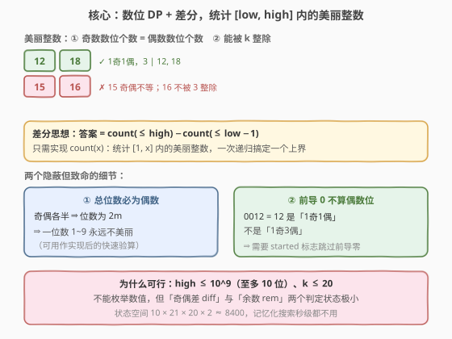
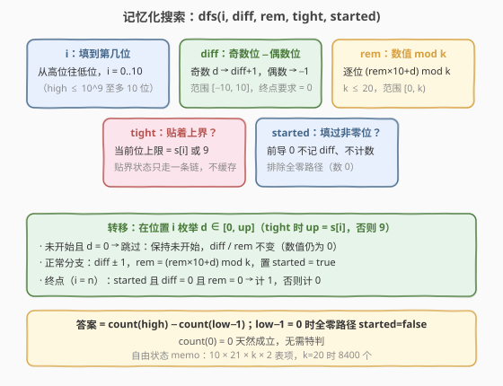
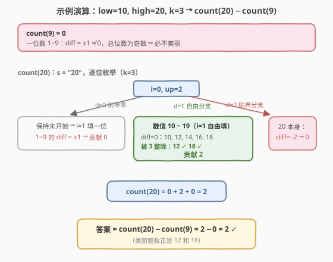

# 范围内美丽整数的数目

- **题目名称**：范围内美丽整数的数目
- **链接**：[2827. 范围内美丽整数的数目](https://leetcode.cn/problems/number-of-beautiful-integers-in-the-range/)
- **难度**：困难
- **标签**：数学、动态规划、数位 DP

## 1. 题目概述

给你正整数 `low`、`high` 和 `k`。如果一个整数满足以下两个条件，那么它是**美丽的**：

1. 偶数数位的数目与奇数数位的数目相同；
2. 这个整数可以被 `k` 整除。

请你返回范围 $[low, high]$ 中美丽整数的数目。

**示例 1**：

```text
输入：low = 10, high = 20, k = 3
输出：2
解释：给定范围中有 2 个美丽整数：[12, 18]
- 12 有 1 个奇数数位和 1 个偶数数位，且可被 3 整除 ✓
- 16 不能被 3 整除 ✗；15 的奇偶数位数目不等 ✗
```

**示例 2**：

```text
输入：low = 1, high = 10, k = 1
输出：1
解释：给定范围中有 1 个美丽整数：[10]
- 10 有 1 个奇数数位和 1 个偶数数位，且可被 1 整除
```

**示例 3**：

```text
输入：low = 5, high = 5, k = 2
输出：0
解释：5 的奇偶数位数目不等，不是美丽整数。
```

**约束条件**：

- $0 < \text{low} \le \text{high} \le 10^9$
- $0 < k \le 20$

> 💡 **关键约束**：`high` 至多 $10^9$（10 个数位），$k \le 20$——数值域太大不能枚举，但「数位奇偶差」和「模 $k$ 余数」这两个判定状态都极小，天然适合**数位 DP**。

---

## 2. 解题思路

### 2.1 暴力思路

从 `low` 到 `high` 逐个枚举整数，对每个数拆数位统计奇偶个数、再判整除。单次判定 $O(10)$，但区间长度可达 $10^9$，总代价 $O(10^{10})$，不可行。

突破口有二：① 如何把**区间计数**拆成**前缀计数之差**；② 如何在**不枚举数值**的前提下，把「奇偶差」和「模 $k$ 余数」作为状态沿数位递推——这正是数位 DP 的标准场景。

### 2.2 核心观察：数位 DP + 差分



**差分转化**：答案 $= \text{count}(\text{high}) - \text{count}(\text{low} - 1)$，其中 $\text{count}(x)$ 统计 $[1, x]$ 内的美丽整数数目。只需实现一个上界的计数函数。

**两个隐蔽但致命的细节**：

| 细节 | 说明 | 后果 |
|------|------|------|
| **奇偶各半 ⇒ 总位数为偶数** | 奇数位个数 $=$ 偶数位个数 $= m$，则总位数 $= 2m$ | 一位数 $1 \sim 9$ **永远不美丽**（可作快速验算） |
| **前导 0 不算偶数位** | $0012 = 12$ 是「1 奇 1 偶」，不是「1 奇 3 偶」 | 必须引入 `started` 标志区分「未开始填数」与「已填入非零位」 |

**状态设计**：从高位到低位逐位填数，dfs 带五个参数：

$$
\text{dfs}(i,\ \text{diff},\ \text{rem},\ \text{tight},\ \text{started})
$$

| 状态 | 含义 | 范围 |
|------|------|------|
| $i$ | 当前填到第几位 | $0 \sim 10$ |
| $\text{diff}$ | 已填数位中「奇数个数 $-$ 偶数个数」 | $[-10, 10]$，终点要求 $= 0$ |
| $\text{rem}$ | 已填数位构成的数 $\bmod\ k$ | $[0, k)$，$k \le 20$；转移为 $(\text{rem} \times 10 + d) \bmod k$ |
| $\text{tight}$ | 是否仍贴着上界走（当前位上限是 $s[i]$ 还是 $9$） | 布尔 |
| $\text{started}$ | 是否已填过非零位（前导 0 不记入 diff） | 布尔 |

**转移**：在位置 $i$ 枚举当前数位 $d \in [0, \text{up}]$（$\text{up} = s[i]$ 若贴界，否则 $9$）：

- **前导零分支**：未开始且 $d = 0$ → 保持未开始，`diff`/`rem` 均不变（此时构成的数值仍为 $0$，余数自然是 $0$）；
- **正常分支**：奇数 $d$ 使 $\text{diff} + 1$，偶数 $d$ 使 $\text{diff} - 1$；$\text{rem} \gets (\text{rem} \times 10 + d) \bmod k$；置 `started`。

**终点**：$i$ 走完所有位时，`started`（排除全零即数 $0$）且 $\text{diff} = 0$ 且 $\text{rem} = 0$ → 计 $1$。

> 💡 **为何 tight 不用记忆化**：贴界（`tight=true`）的状态从高位到低位**只走一条链**，至多 $n$ 个，重复访问不会发生；而自由（`tight=false`）状态的后续与上界 $s$ 完全无关，可以用 $O(D \times 21 \times k \times 2)$ 的 memo 表缓存。这是数位 DP 的通用剪枝——「自由部分查表，贴界部分单链直走」。

### 2.3 算法流程图



流程要点：

1. **差分**：$\text{answer} = \text{count}(\text{high}) - \text{count}(\text{low} - 1)$；
2. **count(x)**：把 $x$ 转成数位串 $s$，从 $\text{dfs}(0, 0, 0, \text{true}, \text{false})$ 起搜；
3. **逐位枚举** $d \le \text{up}$：前导零走跳过分支，其余走正常分支；
4. **终点计数**：`started && diff == 0 && rem == 0` 时 $+1$；
5. `low - 1` 可能为 $0$：全零路径 `started=false`，$\text{count}(0) = 0$，天然无需特判。

### 2.4 示例演算



以示例 1 `low = 10, high = 20, k = 3` 为例，求 $\text{count}(20) - \text{count}(9)$。

**count(9)**（$s = $ `9`，$n=1$）：

- $i=0$ 枚举 $d \in [0, 8]$（自由）+ $d = 9$（贴界），每个非零 $d$ 终点时 $\text{diff} = \pm 1 \ne 0$ → 全部为 $0$；$d=0$ 为前导零且到头（`started=false`）→ $0$。
- $\text{count}(9) = 0$ ✓（一位数必不美丽）。

**count(20)**（$s = $ `20`，$n=2$）：

- $i=0,\ d=0$（前导零，未开始）→ 转入 $i=1$ 自由填一位：$1 \sim 9$ 的 $\text{diff} = \pm 1$，全灭 → 贡献 $0$；
- $i=0,\ d=1$（**自由分支**，数值落在 $10 \sim 19$）→ $i=1$ 枚举 $d \in [0,9]$：$\text{diff}=0$ 的有 $10, 12, 14, 16, 18$，其中被 $3$ 整除的只有 $12$ 和 $18$ → 贡献 $2$；
- $i=0,\ d=2$（**贴界分支**，$20$ 本身）→ $\text{diff} = -2 \ne 0$ → 贡献 $0$；
- $\text{count}(20) = 0 + 2 + 0 = 2$。

**答案** $= 2 - 0 = 2$ ✓（区间 $[10, 20]$ 内美丽整数为 $12, 18$）。

---

## 3. 参考代码

### C++

```cpp
class Solution {
public:
    int numberOfBeautifulIntegers(int low, int high, int k) {
        // count(x)：统计 [1, x] 内的美丽整数数目
        auto count = [&](long long x) -> long long {
            string s = to_string(x);
            int n = s.size();
            // memo[i][diff+10][rem][started]：只缓存自由（!tight）状态
            vector memo(n + 1, vector(21, vector(k, vector<long long>(2, -1))));
            function<long long(int, int, int, bool, bool)> dfs =
                [&](int i, int diff, int rem, bool tight, bool started) -> long long {
                if (i == n) return started && diff == 0 && rem == 0 ? 1 : 0;
                if (!tight && memo[i][diff + 10][rem][started] >= 0)
                    return memo[i][diff + 10][rem][started];
                int up = tight ? s[i] - '0' : 9;
                long long res = 0;
                for (int d = 0; d <= up; d++) {
                    bool nt = tight && d == up;
                    if (!started && d == 0)
                        res += dfs(i + 1, diff, rem, nt, false); // 前导 0：跳过
                    else {
                        int nd = diff + (d % 2 ? 1 : -1);         // 奇 +1，偶 −1
                        int nr = (rem * 10 + d) % k;
                        res += dfs(i + 1, nd, nr, nt, true);
                    }
                }
                if (!tight) memo[i][diff + 10][rem][started] = res;
                return res;
            };
            return dfs(0, 0, 0, true, false);
        };
        return count(high) - count(low - 1);
    }
};
```

### Python

```python
from functools import lru_cache

class Solution:
    def numberOfBeautifulIntegers(self, low: int, high: int, k: int) -> int:
        def count(x: int) -> int:  # 统计 [1, x] 内的美丽整数数目
            s = str(x)

            @lru_cache(None)
            def dfs(i: int, diff: int, rem: int, tight: bool, started: bool) -> int:
                if i == len(s):
                    return 1 if started and diff == 0 and rem == 0 else 0
                up = int(s[i]) if tight else 9
                total = 0
                for d in range(up + 1):
                    nt = tight and d == up
                    if not started and d == 0:
                        # 前导 0：不算偶数位，diff/rem 不动
                        total += dfs(i + 1, diff, rem, nt, False)
                    else:
                        nd = diff + (1 if d % 2 else -1)
                        nr = (rem * 10 + d) % k
                        total += dfs(i + 1, nd, nr, nt, True)
                return total

            return dfs(0, 0, 0, True, False)

        return count(high) - count(low - 1)
```

> 💡 两处工程细节：① Python 版把 `tight` 直接并入 `lru_cache` 的键，正确且够快（贴界状态本就极少）；C++ 版则只对自由状态建 memo，更省空间。② `low - 1` 可能为 $0$，全零路径因 `started=False` 终点不计，$\text{count}(0) = 0$ 无需特判。

---

## 4. 复杂度分析

| 维度 | 复杂度 | 说明 |
|------|--------|------|
| **时间** | $O(D \times 21 \times k \times 10)$ | $D \le 10$ 为数位长度；状态数 $10 \times 21 \times k \times 2$，每个状态转移枚举 $10$ 个数位；$k = 20$ 时约 $8.4 \times 10^4$，两次 `count` 亦毫秒级 |
| **空间** | $O(D \times 21 \times k \times 2)$ | memo 表 + $O(D)$ 递归栈，$k = 20$ 时约 $8400$ 个表项 |

> ⚠️ 本题状态数远小于 [2801](../2801-2900/2801_统计范围内的步进数字数目.md) 的预处理表场景需求——正因 $k \le 20$ 且数位 $\le 10$，三维修度的 memo（$i \times \text{diff} \times \text{rem}$）才控制在 $10^4$ 量级。若 $k$ 放宽到 $10^9$，`rem` 状态爆炸，数位 DP 不再可行。

---

## 5. 扩展：两种数位 DP 写法的取舍

**记忆化搜索 vs 预处理表 + 逐位收紧**。[2801](../2801-2900/2801_统计范围内的步进数字数目.md) 用的是后者：状态只有 `(位数, 末位)` 二维，预处理 $\text{dp}[L][d]$ 后 Part A 查表、Part B 逐位收紧。本题同样可以做：预处理 $\text{dp}[L][\text{diff}][\text{rem}]$ = 「从状态出发自由填 $L$ 位、终点合法的方案数」，再按位数/贴界两段统计。但当状态含 `diff`、`rem` 等 richer 维度时，**记忆化搜索**把「终点判定收在边界、中间状态无副作用」表达得更直白，也更不容易写错——建议面试中默认用它，除非状态极简且需要批量查询多个上界。

**必要条件的验证价值**：「美丽 $\Rightarrow$ 总位数为偶数」可以当作实现后的 sanity check：任取 $k=1$，区间 $[1, 10^m]$ 内美丽数个数应等于所有位数 $\le m$ 的偶位数美丽数之和；一位数区间答案恒为 $0$。这种独立于算法的必要条件，是排查数位 DP 细节 bug（尤其是前导零）的利器。

---

## 6. 面试要点

**Q1：为什么前导 0 不能计入偶数位？如何处理？**
> 因为前导零只是「占位」，不是数值的一部分：$0012 = 12$ 是 1 奇 1 偶，不是 1 奇 3 偶。处理方式是 `started` 标志：尚未填入任何非零位时遇到 $d=0$，走「跳过」分支——diff 不变、started 保持 false；终点处 `started=false`（即数 $0$）也不计入答案。

**Q2：diff 和 rem 这两个状态分别怎么设计、范围多大？**
> diff = 已填数位中奇数个数减偶数个数，奇数位 $+1$、偶数位 $-1$，范围 $[-10, 10]$（实现时 $+10$ 偏移到 $[0,20]$），终点要求恰为 $0$。rem 是已填数位构成的数 $\bmod\ k$，按位转移 $(\text{rem} \times 10 + d) \bmod k$——这正是十进制按位构造数值的 Horner 形式，范围 $[0, k)$，$k \le 20$。

**Q3：tight 为什么可以不记忆化？记进去会不会错？**
> 不会错，只是不必要。贴界状态从高位到低位只有一条链，至多 $n$ 个、每处只访问一次，天然无重复；自由状态的转移与上界 $s$ 无关（上限恒为 9），才是 memo 的真正受益者。把 tight 并入缓存键（Python 版）正确；拆开只缓存 `!tight`（C++ 版）则更省空间。

**Q4：差分之后 low−1 = 0 怎么办？**
> 无需特判。$x=0$ 时数位串为 `0`，唯一的路径是「前导零走到底」，终点 `started=false` 不计数，$\text{count}(0) = 0$ 自然成立。这归功于终点判定把 `started` 与 `diff==0 && rem==0` 一起检查——单独漏掉 `started` 会让数 $0$（diff=0, rem=0）被误计为美丽。

**Q5：如何快速验证实现正确？**
> 用必要条件做断言：① 一位数区间（如 $[1,9]$、$[5,5]$）答案恒为 $0$（总位数为奇数不可能奇偶各半）；② 取 $k=1$ 手算小区间：$[1, 20]$ 内美丽数为 $10, 12, 14, 16, 18$ 共 $5$ 个（$20$ 是 $1$ 奇 $1$ 偶？不——$2$ 偶 $0$ 奇，$\text{diff}=-2$ 不合法，勿误计）。此外在小范围（如 $\le 10^5$）内与暴力逐个判定交叉验证，是最可靠的手段。

---

## 7. 同类练习题

- [2801. 统计范围内的步进数字数目](https://leetcode.cn/problems/count-stepping-numbers-in-range/)（[题解](../2801-2900/2801_统计范围内的步进数字数目.md)）：同为区间数位 DP + 差分，约束换成「相邻位差为 1」，可对照两种写法（预处理表 vs 记忆化搜索）
- [2719. 统计整数数目](https://leetcode.cn/problems/count-of-integers/)：数位和落在区间的数位 DP，状态含数位和，与前导零处理同款
- [2376. 统计特殊整数](https://leetcode.cn/problems/count-special-integers/)：数位 DP + 状态压缩（mask 记已用数位），不重复数字版
- [600. 不含连续 1 的非负整数](https://leetcode.cn/problems/non-negative-integers-without-consecutive-ones/)：数位 DP + 相邻位约束，状态含「上一位」，入门经典
- [233. 数字 1 的个数](https://leetcode.cn/problems/number-of-digit-one/)：数位 DP 母题，逐位分类讨论统计数字 1 的出现次数
