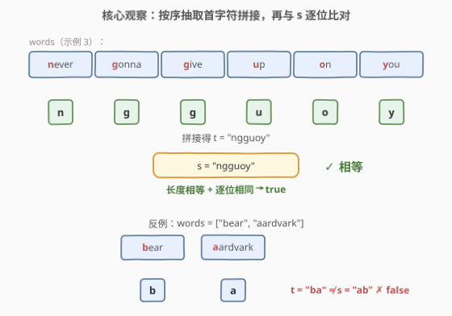
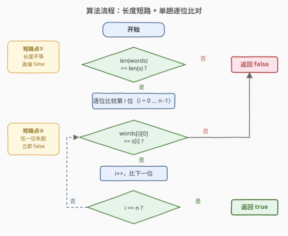
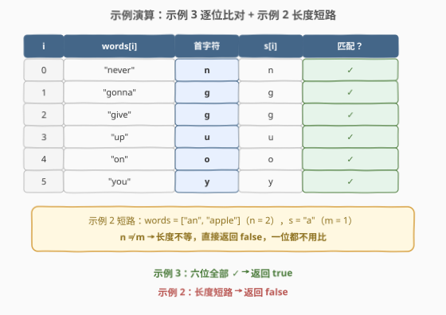

# LeetCode 判别首字母缩略词 题解

## 1. 题目概述

- **标题 / 题号**：判别首字母缩略词（#2828，easy）
- **链接**：https://leetcode.cn/problems/check-if-a-string-is-an-acronym-of-words/
- **难度**：简单
- **标签**：数组、字符串

**题意**：给你一个字符串数组 `words` 和一个字符串 `s`，请你判断 `s` 是不是 `words` 的**首字母缩略词**。

如果可以**按顺序串联** `words` 中每个字符串的**第一个字符**形成字符串 `s`，则认为 `s` 是 `words` 的首字母缩略词。例如，`"ab"` 可以由 `["apple", "banana"]` 形成，但是无法从 `["bear", "aardvark"]` 形成。

如果 `s` 是 `words` 的首字母缩略词，返回 `true`；否则，返回 `false`。

**示例 1**：

```text
输入：words = ["alice","bob","charlie"], s = "abc"
输出：true
解释：words 中 "alice"、"bob" 和 "charlie" 的第一个字符分别是 'a'、'b' 和 'c'。
因此，s = "abc" 是首字母缩略词。
```

**示例 2**：

```text
输入：words = ["an","apple"], s = "a"
输出：false
解释：words 中 "an" 和 "apple" 的第一个字符分别是 'a' 和 'a'。
串联这些字符形成的首字母缩略词是 "aa"。
因此，s = "a" 不是首字母缩略词。
```

**示例 3**：

```text
输入：words = ["never","gonna","give","up","on","you"], s = "ngguoy"
输出：true
解释：串联数组 words 中每个字符串的第一个字符，得到字符串 "ngguoy"。
因此，s = "ngguoy" 是首字母缩略词。
```

**约束**：

- $1 \le \text{words.length} \le 100$
- $1 \le \text{words[i].length} \le 10$
- $1 \le \text{s.length} \le 100$
- `words[i]` 和 `s` 由小写英文字母组成

> 💡 注意约束 $\text{words[i].length} \ge 1$：每个单词**必然存在首字符**，`words[i][0]` 永不越界，无需处理空串边界。

## 2. 解题思路

### 2.1 暴力思路

最直接的写法：把每个单词的首字符拼成一个新字符串 $t$，再整体比较 $t$ 是否等于 $s$。这已经是线性复杂度，但存在两处可省的开销：

1. **拼接浪费空间**：构建 $t$ 需要 $O(n)$ 额外空间，而比较本质上只需逐位进行；
2. **长度不等时白拼**：如示例 2 中 $n = 2$、$|s| = 1$，拼完 $t = \text{"aa"}$ 再比较必然不等——长度这一必要条件可以在拼接**之前**就以 $O(1)$ 代价排除。

### 2.2 核心观察：长度不变式 + 逐位比较



两条关键观察：

1. **长度不变式**：缩略词由每个单词**恰好贡献 1 个字符**拼接而成，因此 $s$ 是首字母缩略词的必要条件是：

   $$|\text{words}| = |s|$$

   把长度检查放在最前面，可对示例 2 这类输入以 $O(1)$ 代价整体短路，一步拒绝。

2. **无需显式拼接**：拼接结果 $t$ 的第 $i$ 位**就是** $\text{words}[i][0]$，因此逐位比较 $\text{words}[i][0]$ 与 $s[i]$ 即可，任何一位失配立即返回 `false`。

形式化地：

$$s \text{ 是 } \text{words} \text{ 的首字母缩略词} \iff |s| = n \;\land\; \forall i \in [0, n):\; \text{words}[i][0] = s[i]$$

> ⚠️ 与「子序列」类匹配（如 [392. 判断子序列](../0301-0400/392_判断子序列.md)）不同，这里是**严格逐位对齐**：第 $i$ 个单词只对应 $s$ 的第 $i$ 位，不存在「跳过谁」的自由度，因此连双指针都不需要，单层循环即可。

### 2.3 算法流程图



流程概括为三步：

1. **长度检查**：$|\text{words}| \ne |s|$ 直接返回 `false`（短路点①）；
2. **单趟逐位比对**：检查每个 $\text{words}[i][0]$ 是否等于 $s[i]$，失配立即返回 `false`（短路点②）；
3. **收尾**：$n$ 位全部通过，返回 `true`。

### 2.4 示例演算



以示例 3 `words = ["never","gonna","give","up","on","you"]`、`s = "ngguoy"` 为例，逐位追踪：

| i | words[i] | 首字符 | s[i] | 匹配 |
|---|----------|--------|------|------|
| 0 | "never" | n | n | ✓ |
| 1 | "gonna" | g | g | ✓ |
| 2 | "give" | g | g | ✓ |
| 3 | "up" | u | u | ✓ |
| 4 | "on" | o | o | ✓ |
| 5 | "you" | y | y | ✓ |

六位全部通过，$i$ 走到 $n = 6$，返回 `true`。

而示例 2 在第一步就被拦下：$|\text{words}| = 2 \ne 1 = |s|$，长度不等，**一位都不用比**，直接返回 `false`。

## 3. 参考代码

### C++

```cpp
class Solution {
public:
    bool isAcronym(vector<string>& words, string s) {
        int n = words.size();
        if (n != (int)s.size()) return false;   // 短路点①：长度不变式
        for (int i = 0; i < n; i++) {
            if (words[i][0] != s[i]) return false;  // 短路点②：逐位失配即退出
        }
        return true;
    }
};
```

### Python

```python
class Solution:
    def isAcronym(self, words: List[str], s: str) -> bool:
        return len(words) == len(s) and all(w[0] == c for w, c in zip(words, s))
```

> 💡 `zip` 会**静默截断**到较短的一方，且 `all()` 对空迭代返回 `True`——若去掉长度检查，`words = ["ab"]`、`s = "abcdefg"` 会因 `zip` 只配对 1 位而误判为 `True`。因此 `len(words) == len(s)` 前置条件不可省；Python 3.10+ 也可用 `zip(words, s, strict=True)` 让长度不等直接抛异常兜底，但显式比长度更清晰。

## 4. 复杂度分析

| 维度 | 复杂度 | 说明 |
|------|--------|------|
| 时间复杂度 | $O(n)$ | $n = |\text{words}|$：长度检查 $O(1)$，逐位比较至多 $n$ 次，每次只取首字符 $O(1)$，与单词长度无关 |
| 空间复杂度 | $O(1)$ | 逐位版不构建新串，仅用下标与字符变量；`join` 一行版需 $O(n)$ 存拼接结果 |

> 💡 本题数据规模 $n \le 100$，「拼接后比较」与「逐位比较」性能差异无关紧要；但「**先检查便宜的必要条件、再做主体判定**」的短路思想在更复杂的匹配问题上（如正则、通配符）是重要的剪枝套路。

## 5. 扩展：一行写法与工程取舍

题解评论区常见的另一种写法是直接模拟题意描述：

```python
class Solution:
    def isAcronym(self, words: List[str], s: str) -> bool:
        return "".join(w[0] for w in words) == s
```

| 写法 | 空间 | 提前退出 | 语义 |
|------|------|----------|------|
| `join` 拼接版 | $O(n)$ | 否（总要先抽完 $n$ 个首字符） | 完全复述题意，可读性最佳 |
| 长度前置 + 逐位版 | $O(1)$ | 是（首位失配即停） | 判定语义，工程上更稳 |

`join` 版胜在直白——「串联形成 `s`」逐字对应题面；逐位版胜在零额外空间与短路能力。面试中先写出 `join` 版、再主动指出「长度短路 + 逐位比较」的优化点，是展示分层思维的好机会。

## 6. 面试要点

1. **为什么要先比较长度？**

   > 长度是 $O(1)$ 可得的必要条件：$n$ 个单词的缩略词长度恰为 $n$，$|\text{words}| \ne |s|$ 时必然 `false`。先比长度既是最便宜的拒绝路径（示例 2 一步出局），也在 `zip` 写法中堵住了静默截断的陷阱。

2. **`zip` + `all` 的写法有什么隐患？**

   > `zip` 在较短序列耗尽时静默停止，`all()` 对空序列返回 `True`。若去掉长度检查，`words = ["ab"]`、`s = "abcdefg"` 只会配对出 `('a','a')`、`('b','b')` 两位，`all` 返回 `True` 造成误判。长度前置检查与 `zip` 配合才严密。

3. **`words[i]` 会不会是空串导致 `words[i][0]` 越界？**

   > 不会。约束 $1 \le \text{words[i].length} \le 10$ 保证每个单词非空、首字符必然存在。若面试官放宽约束允许空串，需先判 `if (words[i].empty()) return false;`——空单词没有首字符可贡献，同时破坏了长度不变式。

4. **本题与 [392. 判断子序列](../0301-0400/392_判断子序列.md) 的匹配差异在哪？**

   > 392 是**子序列匹配**：源串可以跳过字符，需要双指针维护两个游标；本题是**严格逐位对齐**：第 $i$ 个单词只对应 $s$ 的第 $i$ 位，位置关系是双射，单层下标循环即可。认清「对齐关系」能少引入不必要的指针。

5. **如果约束放开到大小写混合甚至 Unicode，需要注意什么？**

   > 题面限定小写字母，字符等值比较即可。若放开大小写，需先统一归一化（`lower()` / `tolower`）再比；Unicode 场景下 Python 按 code point 等值比较天然安全，C++ 需避免对多字节编码做「区间判断」，只做等值比较。

## 同类练习题

| # | 题目 | 与本题的关联 |
|---|------|-------------|
| 392 | [判断子序列](https://leetcode.cn/problems/is-subsequence/)（[题解](../0301-0400/392_判断子序列.md)） | 同为保序字符匹配，但允许跳过源串字符，对比「子序列匹配」与本题「严格逐位对齐」的差异 |
| 1528 | [重新排列字符串](https://leetcode.cn/problems/shuffle-string/)（[题解](../1501-1600/1528_重新排列字符串.md)） | 按 `indices` 数组把字符精确安放到目标位置，同属「位置 ↔ 字符」的精确对应 |
| 1678 | [设计 Goal 解析器](https://leetcode.cn/problems/goal-parser-interpretation/)（[题解](../1601-1700/1678_设计Goal解析器.md)） | 按规则把模式串解释成目标串后比较，同属小规模字符串模拟 |
| 1668 | [最大重复子字符串](https://leetcode.cn/problems/maximum-repeating-substring/)（[题解](../1601-1700/1668_最大重复子字符串.md)） | 判定 `sequence` 的重复拼接能否包含 `word`，串联思想的反向运用 |
