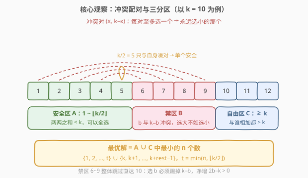
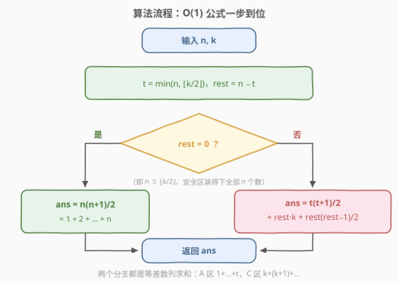
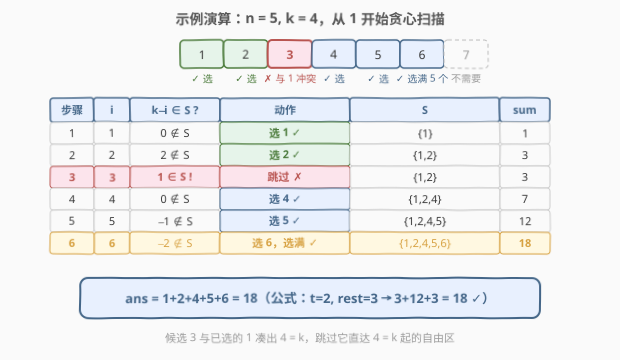

# LeetCode k-avoiding 数组的最小总和 题解

## 1. 题目概述

- **标题 / 题号**：k-avoiding 数组的最小总和（#2829，medium）
- **链接**：https://leetcode.cn/problems/determine-the-minimum-sum-of-a-k-avoiding-array/
- **难度**：中等
- **标签**：贪心、数学

**题意**：给你两个整数 `n` 和 `k`。

对于一个由**不同**正整数组成的数组，如果其中不存在任何求和等于 $k$ 的不同元素对，则称其为 **k-avoiding** 数组。

返回长度为 $n$ 的 k-avoiding 数组的可能的最小总和。

**示例 1**：

```text
输入：n = 5, k = 4
输出：18
解释：设若 k-avoiding 数组为 [1,2,4,5,6]，其元素总和为 18。
可以证明不存在总和小于 18 的 k-avoiding 数组。
```

**示例 2**：

```text
输入：n = 2, k = 6
输出：3
解释：可以构造数组 [1,2]，其元素总和为 3。
可以证明不存在总和小于 3 的 k-avoiding 数组。
```

**约束**：

- $1 \le n, k \le 50$

> 💡 本题核心是「**贪心 + 数学**」。关键词「不同正整数」「不存在和为 $k$ 的元素对」「最小总和」——要求和最小，直觉就是**从 1 开始从小到大挑**；而冲突只发生在配对 $(x,\ k-x)$ 之间，每对**至多选一个**，那么永远选较小的那个就完事了。把这条贪心策略推到底，可以直接得到一个 $O(1)$ 公式。

## 2. 解题思路

### 2.1 基础思路：从小到大贪心扫描

最朴素的做法（也是官方 hints 的路线）：维护已选集合 $S$，从 $i = 1$ 开始逐一考察——

- 若 $k - i$ 已经在 $S$ 中，说明 $i$ 会和它凑出 $k$，**跳过** $i$；
- 否则把 $i$ 选入 $S$，累加进答案。

直到选满 $n$ 个数为止。时间 $O(n + k)$（$i$ 最多扫描到 $k + n$），空间 $O(n)$。

> ⚠️ 这个模拟版本正确性依赖一个未经证明的贪心断言：「每次选当前最小的可行数是最优的」。它对吗？对，但需要论证——这正是 2.2 要做的结构性分析。顺便一提，$n, k \le 50$ 的数据范围下模拟版轻松通过，但把它数学化后可以做到 $O(1)$。

### 2.2 核心观察：冲突配对分区 → O(1) 公式

把全体正整数按「与 $k$ 的关系」划成三个区域：

| 区域 | 范围 | 性质 |
|------|------|------|
| **安全区 $A$** | $1 \sim \lfloor k/2 \rfloor$ | 任取两个**不同**元素，和 $\le \lfloor k/2 \rfloor + \lfloor k/2 \rfloor - 1 \le k-1 < k$，**互不冲突，可以全选** |
| **禁区 $B$** | $\lfloor k/2 \rfloor + 1 \sim k-1$ | 每个数 $b$ 与 $k - b \in A$ 恰好冲突，且 $k - b < b$ |
| **自由区 $C$** | $\ge k$ | 任何数与正整数之和 $> k$，**永不冲突** |



三条关键结论：

1. **$A$ 区可以整区打包**：$1 \sim \lfloor k/2 \rfloor$ 两两不冲突（$k$ 为偶数时 $k/2$ 看似「自己与自己凑对」，但题目要求**不同**元素对，单个 $k/2$ 安全）。
2. **$B$ 区永远不该选（交换论证）**：设最优解选了 $b \in B$ 而没选 $k-b \in A$。把 $b$ 换成 $k-b$：总和严格变小（$k - b < b$），且 $k-b$ 只与 $b$ 冲突、$b$ 已移除，不会引入新冲突。因此**最优解可以只从 $A \cup C$ 中选**。
3. **缺额从 $C$ 区顶上**：$A \cup C$ 内部两两兼容（不存在任何冲突对），所以最优解就是 $A \cup C$ 中最小的 $n$ 个数——先拿 $1 \sim t$（$t = \min(n, \lfloor k/2 \rfloor)$），不够的 $\text{rest} = n - t$ 个从 $k$ 开始连续拿。

于是答案是一个闭式公式（两个等差数列求和）：

$$\text{ans} = \underbrace{\frac{t(t+1)}{2}}_{A\ 区:\ 1+2+\cdots+t} + \underbrace{\text{rest} \cdot k + \frac{\text{rest}(\text{rest}-1)}{2}}_{C\ 区:\ k+(k+1)+\cdots}$$

> 💡 注意「从 $k$ 开始拿」而不是「从 $\lfloor k/2 \rfloor + 1$ 开始拿」：后者是 $B$ 区，选 $b$ 必须踢掉 $k-b$，净变化 $b - (k-b) = 2b - k > 0$，总和不降反升。跳过整个 $B$ 区直达 $k$，正是本题最反直觉也最关键的一步。

### 2.3 算法流程图



**完整步骤**：

1. **计算** $t = \min(n, \lfloor k/2 \rfloor)$，$\text{rest} = n - t$
2. **判断**：若 $n \le \lfloor k/2 \rfloor$（即 $\text{rest} = 0$），答案为 $\frac{n(n+1)}{2}$
3. **否则**：答案为 $\frac{t(t+1)}{2} + \text{rest} \cdot k + \frac{\text{rest}(\text{rest}-1)}{2}$
4. **返回**答案

### 2.4 示例演算

以示例 1 $n = 5,\ k = 4$ 为例。$\lfloor k/2 \rfloor = 2$，从 $i=1$ 开始贪心扫描：



| 步骤 | 候选 $i$ | $k-i$ 已选？ | 动作 | 已选集合 $S$ | sum |
|------|----------|--------------|------|--------------|-----|
| 1 | 1 | $0 \notin S$ | 选 1 ✓ | $\{1\}$ | 1 |
| 2 | 2 | $2 \notin S$ | 选 2 ✓ | $\{1,2\}$ | 3 |
| 3 | 3 | $1 \in S$ | 跳过 ✗ | $\{1,2\}$ | 3 |
| 4 | 4 | $0 \notin S$ | 选 4 ✓ | $\{1,2,4\}$ | 7 |
| 5 | 5 | $-1 \notin S$ | 选 5 ✓ | $\{1,2,4,5\}$ | 12 |
| 6 | 6 | $-2 \notin S$ | 选 6 ✓（选满） | $\{1,2,4,5,6\}$ | 18 |

第 3 步是关键：$3$ 与已选的 $1$ 凑出 $4 = k$，必须跳过，**直接从 $4 = k$ 起继续选**。最终数组 $[1,2,4,5,6]$，总和 $18$，与示例一致。

再用公式复核：$t = \min(5, 2) = 2$，$\text{rest} = 3$，

$$\text{ans} = \frac{2 \times 3}{2} + 3 \times 4 + \frac{3 \times 2}{2} = 3 + 12 + 3 = 18 \checkmark$$

> 💡 示例 2 $n=2,\ k=6$：$t = \min(2, 3) = 2$，$\text{rest} = 0$，答案 $= \frac{2 \times 3}{2} = 3$，即数组 $[1,2]$。

## 3. 参考代码

### C++

```cpp
class Solution {
public:
    int minimumSum(int n, int k) {
        int t = min(n, k / 2);       // A 区能拿的个数
        int rest = n - t;            // 缺额，从 k 起补
        // A 区: 1+2+...+t；C 区: k+(k+1)+...+(k+rest-1)
        return t * (t + 1) / 2 + rest * k + rest * (rest - 1) / 2;
    }
};
```

### Python

```python
class Solution:
    def minimumSum(self, n: int, k: int) -> int:
        t = min(n, k // 2)           # A 区能拿的个数
        rest = n - t                 # 缺额，从 k 起补
        # A 区: 1+2+...+t；C 区: k+(k+1)+...+(k+rest-1)
        return t * (t + 1) // 2 + rest * k + rest * (rest - 1) // 2
```

> 💡 两版核心逻辑完全一致：先算 $t = \min(n, \lfloor k/2 \rfloor)$，再用两个等差数列求和公式拼出答案。数据范围 $n, k \le 50$ 下最大答案约 $1875$，`int` 毫无溢出压力。

## 4. 复杂度分析

| 维度 | 复杂度 | 说明 |
|------|--------|------|
| **时间复杂度** | $O(1)$ | 只做常数次算术运算 |
| **空间复杂度** | $O(1)$ | 仅使用常数个变量 |

> ⚠️ 扩展思考：若把数据范围放大到 $n, k \le 10^9$，公式解依然 $O(1)$ 秒杀（注意用 64 位整数防溢出）；而 2.1 的扫描模拟是 $O(n + k)$ 的，会直接超时。这正是「把贪心过程数学化」的价值所在。

## 5. 扩展：贪心扫描模拟版

对应官方 hints 的路线，用一个哈希集合边扫边判冲突。它能通过本题 $n, k \le 50$ 的全部数据，也是验证公式正确性的好工具（两种写法在 $1 \le n, k \le 50$ 全范围内结果完全一致）：

```cpp
class Solution {
public:
    int minimumSum(int n, int k) {
        unordered_set<int> used;
        int sum = 0;
        for (int i = 1; (int)used.size() < n; i++) {
            if (!used.count(k - i)) {   // k-i 未选，i 可以安全加入
                used.insert(i);
                sum += i;
            }
        }
        return sum;
    }
};
```

```python
class Solution:
    def minimumSum(self, n: int, k: int) -> int:
        used = set()
        i, total = 0, 0
        while len(used) < n:
            i += 1
            if k - i not in used:       # k-i 未选，i 可以安全加入
                used.add(i)
                total += i
        return total
```

时间 $O(n + k)$、空间 $O(n)$。细心的读者会发现循环里有个细节：当 $k$ 为偶数且 $i = k/2$ 时，$k - i = i$ 而 $i$ 尚未入集合，判空通过、正常选入——这恰好利用了「不同元素对」的定义，单个 $k/2$ 不构成冲突，与 2.2 的区域分析完全吻合。

## 6. 面试要点

1. **为什么从 1 开始选最小的可行数是最优的？**

   - 交换论证：设某最优解不含某个更小的可行数 $x$ 而含更大的数 $y$（$x$ 与 $y$ 均不与解中其他元素冲突）。把 $y$ 换成 $x$ 后总和更小，且 $x$ 不与剩余任何元素冲突（$x$ 只与 $k - x$ 冲突，而 $k-x$ 若在解中则 $y = k - x$ 时才矛盾…… 对 $B$ 区元素统一按 2.2 的分区交换处理最严谨：$B$ 区每个 $b$ 换成 $k-b$ 严格更优）。因此最优解必由 $A \cup C$ 中最小的 $n$ 个数构成。

2. **$k$ 为偶数时 $k/2$ 到底能不能选？**

   - 能。冲突对要求**两个不同元素**，而 $k/2 + k/2 = k$ 需要两份 $k/2$；数组元素互异，只有一份，不构成冲突。所以安全区是 $1 \sim \lfloor k/2 \rfloor$（含 $k/2$），共 $\lfloor k/2 \rfloor$ 个数。

3. **$n$ 超过 $\lfloor k/2 \rfloor$ 后，为什么直接跳到 $k$ 而不选中间的数？**

   - 中间区域 $(\lfloor k/2 \rfloor,\ k)$ 的每个数 $b$ 都与更小的 $k - b$ 冲突。选入 $b$ 必须踢掉 $k-b$，净变化 $2b - k > 0$，总和不降反升。跳过整个禁区直达 $k$（自由区起点）是严格更优的。

4. **公式两部分分别是什么？**

   - $\frac{t(t+1)}{2}$ 是安全区 $1 + 2 + \cdots + t$ 的等差求和；$\text{rest} \cdot k + \frac{\text{rest}(\text{rest}-1)}{2}$ 是自由区 $k + (k+1) + \cdots + (k + \text{rest} - 1)$ 的求和（$\text{rest}$ 个从 $k$ 起的连续整数）。

5. **面试时先写模拟还是先写公式？**

   - 建议先讲清「配对二选一、选小弃大、跳过禁区直达 $k$」的结构性分析，再落公式——公式只是分析的压缩。直接背公式而讲不清 $B$ 区为何整体跳过，是本题最常见的挂点。模拟版可作为正确性交叉验证手段顺带一提。

> 💡 **一句话总结**：正整数按 $\lfloor k/2 \rfloor$ 与 $k$ 分成安全区 / 禁区 / 自由区——安全区全拿、禁区全弃（每个数都被更小的冲突搭档替换）、缺额从 $k$ 起连补，两个等差数列求和 $O(1)$ 收工。

## 同类练习题

| # | 题目 | 与本题的关联 |
|---|------|-------------|
| 2554 | [从一个范围内选择最多整数I](../2501-2600/2554_从一个范围内选择最多整数I.md) | 同为「不同正整数 + 冲突集合（禁止名单）」下的贪心选取，目标从「定长最小和」换成「总和预算内最多个数」 |
| 2578 | [最小和分割](../2501-2600/2578_最小和分割.md) | 按数位贪心重组出最小和，与本题同为「构造最小和」家族 |
| 2160 | [拆分数位后四位数字的最小和](../2101-2200/2160_拆分数位后四位数字的最小和.md) | 拆位贪心求最小和，规模更小的同型入门题 |
| 1798 | [你能构造出连续值的最大数目](../1701-1800/1798_你能构造出连续值的最大数目.md) | 从小到大贪心构造的代表性问题，「当前最小的可行选择」思想同源 |
| 330 | [按要求补齐数组](../0301-0400/330_按要求补齐数组.md) | 贪心「缺什么补什么」的经典题，贪心正确性同样靠交换论证兜底 |
