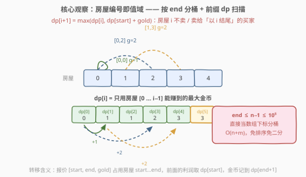
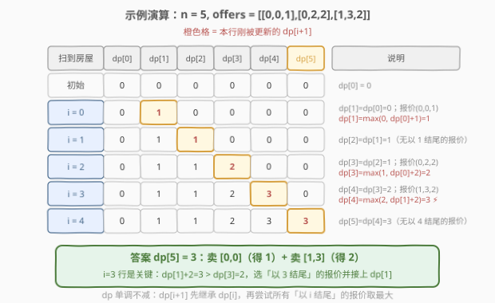

# LeetCode 销售利润最大化 题解

## 1. 题目概述

- **标题 / 题号**：销售利润最大化（#2830，medium）
- **链接**：https://leetcode.cn/problems/maximize-the-profit-as-the-salesman/
- **难度**：中等
- **标签**：数组、哈希表、动态规划、排序、二分查找

**题意**：给你一个整数 `n` 表示数轴上的房屋数量，编号从 `0` 到 `n - 1`。

另给你一个二维整数数组 `offers`，其中 `offers[i] = [start_i, end_i, gold_i]` 表示第 `i` 个买家想要以 `gold_i` 枚金币的价格购买从 `start_i` 到 `end_i` 的**所有**房屋。

作为一名销售，你需要有策略地选择并销售房屋使自己的收入最大化。返回你可以赚取的金币的最大数目。

**注意**：同一所房屋不能卖给不同的买家，并且允许保留一些房屋不进行出售。

**示例 1**：

```text
输入：n = 5, offers = [[0,0,1],[0,2,2],[1,3,2]]
输出：3
解释：有 5 所房屋，编号从 0 到 4，共有 3 个购买要约。
将位于 [0,0] 范围内的房屋以 1 金币的价格出售给第 1 位买家，
并将位于 [1,3] 范围内的房屋以 2 金币的价格出售给第 3 位买家。
可以证明我们最多只能获得 3 枚金币。
```

**示例 2**：

```text
输入：n = 5, offers = [[0,0,1],[0,2,10],[1,3,2]]
输出：10
解释：将位于 [0,2] 范围内的房屋以 10 金币的价格出售给第 2 位买家。
可以证明我们最多只能获得 10 枚金币。
```

**约束**：

- $1 \le n \le 10^5$
- $1 \le \text{offers.length} \le 10^5$
- $\text{offers[i].length} = 3$
- $0 \le \text{start}_i \le \text{end}_i \le n - 1$
- $1 \le \text{gold}_i \le 10^3$

> 💡 这是经典的**带权区间调度**（Weighted Interval Scheduling）问题：每个报价是一个带权区间，选出两两不重叠的一组区间使权和最大——正是 [1235. 规划兼职工作](../1201-1300/1235_规划兼职工作.md) 的同款模型。本题的特别之处在于**值域很小**（房屋编号 $0 \sim n-1$，$n \le 10^5$），可以省掉排序 + 二分，用「按 `end` 分桶 + 沿房屋编号扫一遍」的 $O(n + m)$ 写法，更简单也更高效。

## 2. 解题思路

### 2.1 暴力思路：枚举报价子集

对每个报价尝试「卖 / 不卖」两种决策，递归枚举所有 $2^m$ 个子集（$m$ 为报价数），验证选出的报价区间两两不重叠，取金币和的最大值。$m = 10^5$ 时子集数是天文数字，完全不可行。

> ⚠️ 贪心也不行。等权区间调度（[435. 无重叠区间](../0401-0500/435_无重叠区间.md)）可以「按右端点排序贪心选」，但**带权**时该策略失效：例如报价 $[0,2]\ g=10$ 与 $[0,0]\ g=1,\ [1,1]\ g=1,\ [2,2]\ g=1$——按结束时间贪心会先拿走 $[0,0]$，挡住大报价 $[0,2]$，只得 $2$ 而错失 $10$（示例 2 正是此陷阱）。带权必须用 **DP**。

### 2.2 核心观察：房屋编号即值域——按 end 分桶 + 前缀 DP



**状态定义**：设 $dp[i]$ 表示**只考虑房屋 $[0, i-1]$** 时能赚到的最大金币数（前缀 $i$ 所房屋），$dp[0] = 0$。

按房屋编号 $i$ 从左往右扫，处理到房屋 $i$ 时（即计算 $dp[i+1]$）有两种决策：

- **不卖房屋 $i$**（或没有任何报价覆盖它）：$dp[i+1] = dp[i]$；
- **卖给某个以 $i$ 结尾的买家**（报价 $[\text{start},\ i,\ \text{gold}]$）：这单占用房屋 $\text{start} \sim i$，前面的收益只能取 $dp[\text{start}]$，于是 $dp[i+1] = dp[\text{start}] + \text{gold}$。

两者取最大：

$$dp[i+1] = \max\Big(dp[i],\ \ \max_{(\text{start},\,\text{gold}) \in \text{groups}[i]} \big(dp[\text{start}] + \text{gold}\big)\Big)$$

其中 $\text{groups}[i]$ 是所有**以 $i$ 结尾**的报价集合——预处理时把每个报价按 `end` 扔进对应的桶即可。答案为 $dp[n]$。

**本题的甜点在哪？** 对比 [1235. 规划兼职工作](../1201-1300/1235_规划兼职工作.md)：

| | 1235 规划兼职工作 | 2830 本题 |
|---|---|---|
| 区间端点取值 | $1 \sim 10^9$，稀疏 | $0 \sim n-1$，**稠密且连续** |
| dp 下标来源 | 需排序 + 二分找转移点 | **端点直接当数组下标** |
| 时间复杂度 | $O(m \log m)$ | $O(n + m)$ |

> 💡 1235 中工作时间戳高达 $10^9$，没法开数组按「时刻」扫，只能把报价按 `end` **排序**后用**二分**找最近的兼容前驱；本题房屋编号天然是 $0 \sim n-1$ 的连续小值域，$n$ 本身就给了我们一张免费的哈希表——**桶下标即 `end`，dp 下标即房屋编号**，排序和二分全省了。这是「值域扫描型 DP」的典型受益场景。

**为什么按 `end` 而不是按 `start` 分桶？** 转移要读 $dp[\text{start}]$，必须保证**计算 $dp[\text{start}]$ 时它已经就绪**——即房屋 $\text{start}$ 已被扫描过。扫到 $i = \text{end}$ 时，$\text{start} \le \text{end}$ 必然已处理完；若按 `start` 分桶、从右往左扫则对称地读 $dp[\text{end}+1]$，也可以，但从左往右更符合直觉。

### 2.3 算法流程图

![算法流程：分桶 → 沿房屋编号扫一遍 → 返回 dp[n]](../images/p2830_algorithm_flow.svg)

```text
1. 建桶：遍历 offers，把 (start, gold) 放进 groups[end]
2. dp[0] = 0，i = 0
3. 对每个房屋 i (0 ≤ i ≤ n−1):
   a. dp[i+1] = dp[i]                       # 房屋 i 不卖（保底继承）
   b. 对 groups[i] 中每个报价 (s, g):
        dp[i+1] = max(dp[i+1], dp[s] + g)   # 卖给以 i 结尾的买家
4. 返回 dp[n]
```

> ⚠️ 注意步骤 3a 不能省：即使房屋 $i$ 没被任何报价覆盖，$dp[i+1]$ 也要继承 $dp[i]$；有报价时它作为「不选任何报价」的保底候选参与 max。整个 dp 数组单调不减，这是「前缀最优」定义的直接体现。

### 2.4 示例演算

以示例 1 $n = 5,\ \text{offers} = [[0,0,1],[0,2,2],[1,3,2]]$ 为例。分桶：$\text{groups}[0] = \{(0,1)\}$，$\text{groups}[2] = \{(0,2)\}$，$\text{groups}[3] = \{(1,2)\}$。



| 扫到房屋 $i$ | 基础转移 | 以 $i$ 结尾的报价 | 松弛 | $dp$ 数组（$dp[0..5]$） |
|--------------|----------|-------------------|------|------------------------|
| 初始 | — | — | — | $[0,0,0,0,0,0]$ |
| $i=0$ | $dp[1]=dp[0]=0$ | $(0,1)$ | $dp[1]=\max(0,\ dp[0]+1)=1$ | $[0,\mathbf{1},0,0,0,0]$ |
| $i=1$ | $dp[2]=dp[1]=1$ | 无 | — | $[0,1,\mathbf{1},0,0,0]$ |
| $i=2$ | $dp[3]=dp[2]=1$ | $(0,2)$ | $dp[3]=\max(1,\ dp[0]+2)=2$ | $[0,1,1,\mathbf{2},0,0]$ |
| $i=3$ | $dp[4]=dp[3]=2$ | $(1,2)$ | $dp[4]=\max(2,\ dp[1]+2)=\mathbf{3}$ | $[0,1,1,2,\mathbf{3},0]$ |
| $i=4$ | $dp[5]=dp[4]=3$ | 无 | — | $[0,1,1,2,3,\mathbf{3}]$ |

**最终** $dp[5] = 3$，对应方案：卖 $[0,0]$ 得 $1$ + 卖 $[1,3]$ 得 $2$。

> 💡 $i=3$ 行是精髓：报价 $(1,3,2)$ 的起点是 $1$，收益接在 $dp[1]=1$（前 1 所房屋的最优，恰是卖掉 $[0,0]$）之后，$1+2=3$ 胜过保底的 $dp[3]=2$。而示例 2 中报价 $(0,2,10)$ 使 $dp[3]=\max(1,\ dp[0]+10)=10$，后续 $dp$ 全线继承 $10$——大报价吞掉前缀最优，正是带权区间调度的核心博弈。

## 3. 参考代码

### C++

```cpp
class Solution {
  public:
    int maximizeTheProfit(int n, vector<vector<int>>& offers) {
        // 按 end 分桶：groups[i] 收集所有以 i 结尾的报价 (start, gold)
        vector<vector<pair<int, int>>> groups(n);
        for (auto& o : offers) {
            groups[o[1]].emplace_back(o[0], o[2]);
        }

        // dp[i] = 只考虑房屋 [0, i-1] 的最大利润
        vector<int> dp(n + 1, 0);
        for (int i = 0; i < n; i++) {
            dp[i + 1] = dp[i];                    // 房屋 i 不卖，保底继承
            for (auto& [s, g] : groups[i]) {      // 尝试卖给以 i 结尾的买家
                dp[i + 1] = max(dp[i + 1], dp[s] + g);
            }
        }
        return dp[n];
    }
};
```

### Python

```python
class Solution:
    def maximizeTheProfit(self, n: int, offers: List[List[int]]) -> int:
        # 按 end 分桶：groups[i] 收集所有以 i 结尾的报价 (start, gold)
        groups = [[] for _ in range(n)]
        for s, e, g in offers:
            groups[e].append((s, g))

        # dp[i] = 只考虑房屋 [0, i-1] 的最大利润
        dp = [0] * (n + 1)
        for i in range(n):
            dp[i + 1] = dp[i]                     # 房屋 i 不卖，保底继承
            for s, g in groups[i]:                # 尝试卖给以 i 结尾的买家
                dp[i + 1] = max(dp[i + 1], dp[s] + g)
        return dp[n]
```

> 💡 两版逻辑一致。注意 Python 侧不要用 `[[]] * n` 建桶（所有桶共享同一 list），要用列表推导式。数据范围内最大答案约 $10^5 \times 10^3 = 10^8$，C++ `int` 恰好装得下（$< 2^{31}-1$），但建议比赛时习惯性用 `long long` 更稳。

## 4. 复杂度分析

| 维度 | 复杂度 | 说明 |
|------|--------|------|
| **时间复杂度** | $O(n + m)$ | 建桶遍历 $m$ 个报价；主循环扫 $n$ 所房屋，每个报价在桶里恰好被访问一次 |
| **空间复杂度** | $O(n + m)$ | 桶共存 $m$ 个报价 + $dp$ 数组 $n + 1$ 个元素 |

> ⚠️ 对比排序 + 二分解法的 $O(m \log m)$：当 $n \ll m$（房屋少、报价密集）时本写法反而可能更慢（主循环被 $n$ 撑着），但本题 $n, m \le 10^5$ 同量级，两者都是线性对数以内，实际耗时都在个位数毫秒。

## 5. 扩展：值域大时的排序 + 二分解法（1235 通用模板）

若把约束改成 $0 \le \text{start}_i \le \text{end}_i \le 10^9$（稀疏值域，如 [1235. 规划兼职工作](../1201-1300/1235_规划兼职工作.md)），开 $10^9$ 的数组不现实，就回到「**排序 + 二分**」通用模板：

```cpp
class Solution {
  public:
    int maximizeTheProfit(int n, vector<vector<int>>& offers) {
        sort(offers.begin(), offers.end(),
             [](auto& a, auto& b) { return a[1] < b[1]; });   // 按 end 升序
        int m = offers.size();
        vector<int> ends(m), dp(m + 1, 0);
        for (int i = 0; i < m; i++) ends[i] = offers[i][1];
        for (int i = 1; i <= m; i++) {
            int s = offers[i - 1][0], g = offers[i - 1][2];
            // 二分找兼容前驱：报价 [s,e] 占用 s..e，前驱需 end ≤ s−1
            int j = upper_bound(ends.begin(), ends.begin() + i - 1, s - 1)
                    - ends.begin();
            dp[i] = max(dp[i - 1], dp[j] + g);   // 不选 / 选第 i 个报价
        }
        return dp[m];
    }
};
```

时间 $O(m \log m)$、空间 $O(m)$。**两个模板的取舍口诀**：值域稠密且可承受 → 分桶扫描（本题）；值域稀疏或巨大 → 排序 + 二分（1235）。

> ⚠️ 边界细节差异：1235 中「一份在时刻 $X$ 结束、另一份恰在 $X$ 开始」**不冲突**（二分找 $\text{end} \le \text{start}$）；本题房屋是**离散格子**，报价 $[\text{start}, \text{end}]$ 占用 $\text{start} \sim \text{end}$ 全部房屋，两报价相接（如 $[0,1]$ 与 $[2,3]$）才兼容——分桶写法里体现为收益记在 $dp[\text{end}+1]$、前驱读 $dp[\text{start}]$，天然避开该歧义；二分写法里则要找 $\text{end} \le \text{start}-1$（上式 `s - 1`）。

## 6. 面试要点

1. **为什么带权区间调度不能用贪心？**

   - 等权时「按右端点排序、能选就选」正确（交换论证：结束早的留给后面的空间大）。带权时局部最优会牺牲全局：一个右端点早但权重小的报价会挡住右端点稍晚但权重大的报价。反例：$[0,0]\ g=1$ 与 $[0,2]\ g=10$，贪心拿前者只得 $1$。带权问题失去贪心选择性，必须穷举「选/不选」两分支——这正是 DP 的 $\max$ 转移。

2. **`dp[i]` 的定义为什么是「前缀」而不是「恰好用到房屋 $i$」？**

   - 前缀定义（$dp[i]$ = 房屋 $[0,i-1]$ 的最优）让 dp 数组**单调不减**，转移时「不选」分支直接继承 $dp[i]$，无需关心房屋 $i$ 到底卖没卖。若定义成「$i$ 被占用」的方案数/最优，状态间会漏掉「房屋空着」的方案，转移要复杂得多。前缀化是区间 DP 的常用简化。

3. **本题相比 1235 省掉了什么、为什么能省？**

   - 省掉了排序（$O(m\log m)$）和每个报价的二分（$O(\log m)$）。能省的前提是**值域即下标**：房屋编号 $0 \sim n-1$ 连续且 $n \le 10^5$，`end` 可以直接做桶下标、`dp` 直接按房屋编号开数组。1235 的时间戳高达 $10^9$，这个前提不成立。面试中先看值域再选模板，是体现功底的地方。

4. **转移为什么读 `dp[start]` 而不是 `dp[start - 1]` 或 `dp[end]`？**

   - 报价 $[\text{start}, \text{end}]$ 占用的是房屋 $\text{start} \sim \text{end}$ **闭区间**，所以这单之前的收益是「房屋 $0 \sim \text{start}-1$」的最优，按前缀定义恰好就是 $dp[\text{start}]$。若读 $dp[\text{start} - 1]$，等于强行规定房屋 $\text{start}-1$ 必须空着，**漏算**合法方案；若读 $dp[\text{end}]$（或更靠右的位置），接上的方案可能已占用 $[\text{start}, \text{end}]$ 内的房屋，造成**重叠冲突**。一句话：前缀切点必须恰好落在占用区间的左边界上。

5. **如果报价可以部分满足（只买房子集的子集）会怎样？**

   - 那就不是区间调度了：买家要的是**整段** $[\text{start}, \text{end}]$，部分成交会改变问题性质（变成更复杂的组合优化）。面试遇到时先和面试官确认「整段成交」这一约束，它正是本题能建模成带权区间调度的关键。

> 💡 **一句话总结**：房屋编号 $0 \sim n-1$ 是免费的值域哈希——把报价按 `end` 扔进桶，沿房屋扫一遍做前缀 DP，$dp[i+1] = \max(dp[i],\ dp[\text{start}] + \text{gold})$，$O(n+m)$ 免排序免二分拿下带权区间调度。

## 同类练习题

| # | 题目 | 与本题的关联 |
|---|------|-------------|
| 1235 | [规划兼职工作](https://leetcode.cn/problems/maximum-profit-in-job-scheduling/)（[题解](../1201-1300/1235_规划兼职工作.md)） | 同一模型的「稀疏值域」版，时间戳 $10^9$，必须排序 + 二分，与本题分桶法形成互补对照 |
| 1751 | [最多可以参加的会议数目 II](https://leetcode.cn/problems/maximum-number-of-events-that-can-be-attended-ii/)（[题解](../1701-1800/1751_最多可以参加的会议数目II.md)） | 带权区间调度 + 「最多选 $k$ 个」约束，DP 加一维，二分思路不变 |
| 2054 | [两个最好的不重叠活动](https://leetcode.cn/problems/two-best-non-overlapping-events/)（[题解](../2001-2100/2054_两个最好的不重叠活动.md)） | $k=2$ 特化版，可用两次前缀/后缀 DP 拼接，是本题的去维变体 |
| 2008 | [出租车的最大盈利](https://leetcode.cn/problems/maximum-earnings-from-taxi/) | 乘客行程即出售区间、小费即金币，与本题本质完全相同，值域同样是小连续整数，可再练一遍分桶写法 |
| 435 | [无重叠区间](https://leetcode.cn/problems/non-overlapping-intervals/)（[题解](../0401-0500/435_无重叠区间.md)） | **等权**区间调度祖师题，贪心按右端点；对照理解「等权可贪心、带权必须 DP」的分界线 |
