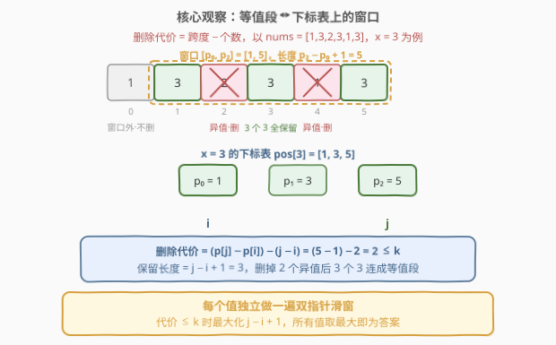
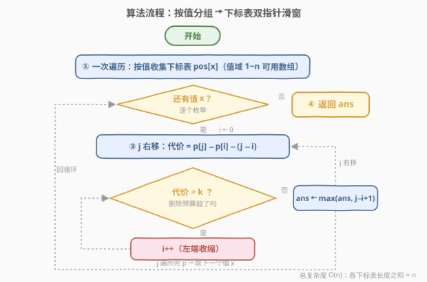
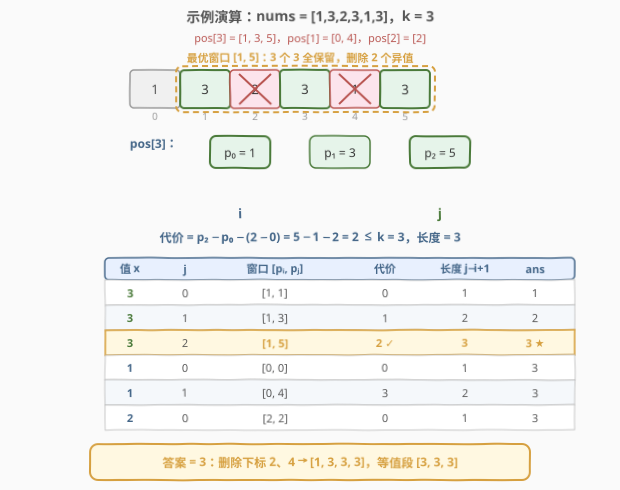

# 找出最长等值子数组

- **题目名称**：找出最长等值子数组
- **链接**：[2831. 找出最长等值子数组](https://leetcode.cn/problems/find-the-longest-equal-subarray/)
- **难度**：中等
- **标签**：数组、哈希表、滑动窗口

## 1. 题目概述

给你一个下标从 **0** 开始的整数数组 `nums` 和一个整数 `k`。

如果子数组中所有元素都相等，则认为子数组是一个 **等值子数组**。注意，空数组是等值子数组。

从 `nums` 中删除最多 `k` 个元素后，返回可能的最长等值子数组的长度。

**子数组** 是数组中一个连续且可能为空的元素序列。

**示例 1**：

```text
输入：nums = [1,3,2,3,1,3], k = 3
输出：3
解释：最优的方案是删除下标 2 和下标 4 的元素。
删除后，nums 等于 [1, 3, 3, 3]。
最长等值子数组从 i = 1 开始到 j = 3 结束，长度等于 3。
可以证明无法创建更长的等值子数组。
```

**示例 2**：

```text
输入：nums = [1,1,2,2,1,1], k = 2
输出：4
解释：最优的方案是删除下标 2 和下标 3 的元素。
删除后，nums 等于 [1, 1, 1, 1]。
数组自身就是等值子数组，长度等于 4。
```

**约束条件**：

- $1 \le \text{nums.length} \le 10^5$
- $1 \le \text{nums[i]} \le \text{nums.length}$
- $0 \le k \le \text{nums.length}$

> 💡 本题核心是「**按值分组的滑动窗口**」。关键词「删除最多 $k$ 个」「最长等值」——保留的等值段必然由**同一个值的若干次出现**构成，而这些出现夹着的异值元素必须全删。把每个值的下标抽成一张表，窗口内「异值元素个数」就是删除代价，于是问题化为下标表上的双指针滑窗。它与 [424. 替换后的最长重复字符](../0401-0500/424_替换后的最长重复字符.md) 是近亲，但答案从「窗口长度」变成了「主值出现次数」。

---

## 2. 解题思路

### 2.1 暴力思路：枚举窗口 + 众数计数

最朴素的做法：枚举所有子数组窗口 $[l, r]$，统计窗口内出现次数最多的元素 $x$ 的频次 $\text{maxCnt}$——若把窗口内的 $x$ 全部保留，其余全删，则

$$\text{删除代价} = (r - l + 1) - \text{maxCnt}$$

当代价 $\le k$ 时，候选答案为 $\text{maxCnt}$。配合增量计数，时间 $O(n^2)$，$n = 10^5$ 会超时。

在暴力之前，先消除两个常见误解：

1. **删除只发生在「保留段内部」**：设保留的等值段由值 $x$ 的若干次出现构成，其首次出现在 $a$、末次出现在 $b$，则开区间 $(a, b)$ 内的**所有异值必须删掉**（否则段被打断）；而 $a$ 左侧、$b$ 右侧的元素删不删都不影响段长——它们本来就在等值段之外。
2. **保留的必然是某个值的一段「连续出现」**：$x$ 的第 $i$ 到第 $j$ 次出现（按下标表编号），跳着保留没有意义——跳过的那次出现白白浪费了删除预算。

于是任何可行方案都唯一对应「选一个值 $x$ + 选 $x$ 下标表中连续的一段」，暴力枚举的正是这个集合。

### 2.2 核心观察：下标表滑窗 + 代价公式

对每个值 $x$，收集其全部下标得到下标表 $pos[x] = [p_0, p_1, \dots]$（严格递增）。若保留下标表中第 $i \sim j$ 个出现：

- 原数组窗口 $[p_i, p_j]$ 共 $p_j - p_i + 1$ 个元素，其中 $x$ 占 $j - i + 1$ 个；
- **删除代价**（需删掉的异值数）$= (p_j - p_i + 1) - (j - i + 1) = (p_j - p_i) - (j - i)$；
- **答案贡献** $= j - i + 1$。



问题转化为：**在每条下标表上找最长的 $[i, j]$，使 $(p_j - p_i) - (j - i) \le k$**。这正是滑动窗口的判据，且双指针合法性由两条单调性保证：

- 固定 $i$，$j$ 右移时代价不减：$p_{j+1} - p_j - 1 \ge 0$（下标严格递增，每次至少跳 1 格）；
- 固定 $j$，$i$ 右移时代价不增：对称地 $p_{i+1} - p_i - 1 \ge 0$。

因此 $j$ 超预算时只需不断右移 $i$，$i$ 永不回退。所有下标表长度之和为 $n$，总时间 $O(n)$。

> 💡 官方标签里的「二分查找」是另一条路线：固定 $i$ 时代价关于 $j$ 单调，可对每条下标表二分找最大合法 $j$，总时间 $O(n \log n)$，略逊于双指针但同样能过。

### 2.3 算法流程图



**完整步骤**：

1. **收集**：一次遍历，按值收集下标表 $pos[x]$（值域 $1 \sim n$，C++ 可用 `vector<vector<int>>` 代替哈希表）
2. **枚举值**：对每个值 $x$ 取其下标表 $p$，初始化 $i = 0$
3. **滑窗**：$j$ 从左到右遍历 $p$，当代价 $p_j - p_i - (j - i) > k$ 时不断 $i{+}{+}$
4. **更新**：$ans \leftarrow \max(ans,\ j - i + 1)$
5. **返回**：所有值处理完后返回 $ans$

### 2.4 示例演算

以示例 1 `nums = [1,3,2,3,1,3], k = 3` 为例，三条下标表分别为 $pos[3] = [1,3,5]$、$pos[1] = [0,4]$、$pos[2] = [2]$：



| 值 $x$ | $j$ | 窗口 $[p_i, p_j]$ | 代价 $(p_j{-}p_i)-(j{-}i)$ | 长度 $j{-}i{+}1$ | $ans$ |
|--------|-----|-------------------|---------------------------|------------------|-------|
| 3 | 0 | $[1, 1]$ | $0$ | 1 | 1 |
| 3 | 1 | $[1, 3]$ | $3-1-1 = 1$ | 2 | 2 |
| 3 | 2 | $[1, 5]$ | $5-1-2 = 2 \le k$ ✓ | **3** | **3** |
| 1 | 0 | $[0, 0]$ | $0$ | 1 | 3 |
| 1 | 1 | $[0, 4]$ | $4-0-1 = 3 \le k$ | 2 | 3 |
| 2 | 0 | $[2, 2]$ | $0$ | 1 | 3 |

关键一步是 $x = 3,\ j = 2$：窗口 $[1, 5]$ 长 5，含 3 个 3，只需删掉下标 2（值 2）和下标 4（值 1）这 **2 个**异值，代价 $2 \le 3$，三个 3 连成长度 3 的等值段。$x = 1$ 的最好成绩只有 2（窗口 $[0,4]$ 要删 3 个异值），无法超越。最终答案 **3**。

> 💡 示例 2 `nums = [1,1,2,2,1,1], k = 2`：$pos[1] = [0,1,4,5]$，取 $i=0, j=3$，代价 $= (5-0) - 3 = 2 \le k$，长度 4，即删除中间两个 2 后 $[1,1,1,1]$。

---

## 3. 参考代码

### C++

```cpp
class Solution {
public:
    int longestEqualSubarray(vector<int>& nums, int k) {
        int n = nums.size();
        vector<vector<int>> pos(n + 1);              // 值域 1~n，数组代替哈希
        for (int i = 0; i < n; i++) {
            pos[nums[i]].push_back(i);
        }
        int ans = 0;
        for (auto& p : pos) {                        // 每条下标表独立滑窗
            int i = 0;
            for (int j = 0; j < (int)p.size(); j++) {
                while (p[j] - p[i] - (j - i) > k) {  // 异值数超预算，收缩左端
                    i++;
                }
                ans = max(ans, j - i + 1);
            }
        }
        return ans;
    }
};
```

### Python

```python
class Solution:
    def longestEqualSubarray(self, nums: List[int], k: int) -> int:
        pos = defaultdict(list)
        for i, v in enumerate(nums):
            pos[v].append(i)
        ans = 0
        for p in pos.values():                       # 每条下标表独立滑窗
            i = 0
            for j in range(len(p)):
                while p[j] - p[i] - (j - i) > k:     # 异值数超预算，收缩左端
                    i += 1
                ans = max(ans, j - i + 1)
        return ans
```

> 💡 两版逻辑一致：先按下标表分组，再对每条表做「代价超预算则收缩」的双指针。注意 `while` 收缩发生在**更新答案之前**，保证记录的每个窗口都满足代价 $\le k$。

---

## 4. 复杂度分析

| 维度 | 复杂度 | 说明 |
|------|--------|------|
| **时间复杂度** | $O(n)$ | 每条下标表上 $i, j$ 各自单向前进一次，所有表长度之和为 $n$ |
| **空间复杂度** | $O(n)$ | 下标表 $pos$ 总计存储 $n$ 个下标 |

> ⚠️ 别把复杂度误估成 $O(n^2)$：虽然外层是「值 × 表」的双重循环，但每个下标在整个算法中只被 $j$ 访问一次、被 $i$ 越过一次，均摊后是线性。值域高达 $10^5$ 也不影响——绝大多数值的表是空的，空表直接跳过。

---

## 5. 扩展：424 式「不回缩」滑动窗口

也可以不分组，直接在原数组上滑窗（[424. 替换后的最长重复字符](../0401-0500/424_替换后的最长重复字符.md) 的经典写法）：维护窗口 $[l, r]$、计数表 $\text{cnt}$ 与**历史最大频次** $\text{maxFreq}$，每步 $r$ 右移后若 $(r - l + 1) - \text{maxFreq} > k$ 就 $l{+}{+}$（窗口只平移、不缩小），最终答案就是 $\text{maxFreq}$：

```cpp
class Solution {
public:
    int longestEqualSubarray(vector<int>& nums, int k) {
        int n = nums.size();
        vector<int> cnt(n + 1);
        int l = 0, maxFreq = 0;
        for (int r = 0; r < n; r++) {
            maxFreq = max(maxFreq, ++cnt[nums[r]]);
            if ((r - l + 1) - maxFreq > k) {   // 窗口只平移不缩小
                cnt[nums[l++]]--;
            }
        }
        return maxFreq;                        // 答案 = 历史最大频次
    }
};
```

```python
class Solution:
    def longestEqualSubarray(self, nums: List[int], k: int) -> int:
        cnt = defaultdict(int)
        l = max_freq = 0
        for r, v in enumerate(nums):
            cnt[v] += 1
            max_freq = max(max_freq, cnt[v])
            if (r - l + 1) - max_freq > k:     # 窗口只平移不缩小
                cnt[nums[l]] -= 1
                l += 1
        return max_freq                        # 答案 = 历史最大频次
```

正确性有两个要点，也正是与 424 的微妙差异所在（424 答案是**窗口长度**，本题答案是**频次**）：

1. **新纪录必然合法**：当某 $\text{cnt}[v]$ 刷新纪录 $m$ 时，本步加长窗口后 $(r-l+1) - m \le \text{上一步的}\ (r-l+1) - \text{maxFreq} \le k$，且该步收缩条件为假、$m$ 个 $v$ 完整保留在窗口内——纪录可达。
2. **最优解必被覆盖**（反证）：设最优解为 $x$ 在窗口 $[a, b]$ 内的 $A$ 次出现、代价 $D \le k$。若 $r$ 到达 $b$ 之前 $l$ 已越过 $a$，考察 $l$ 恰好离开 $a$ 的那一步 $r‘$：收缩条件 $(r’-a+1) - \text{maxFreq} > k$ 成立，而 $\text{maxFreq} \ge$ 窗口内实际最大频次 $\ge \text{cnt}[x]$，推出子窗口 $[a, r']$ 内异值数 $> k$；但该子窗口含于 $[a, b]$，异值总数不超过 $D \le k$，矛盾。故 $r$ 到达 $b$ 时 $l \le a$，$\text{cnt}[x] \ge A$。

> 💡 这里的 $\text{maxFreq}$ 是「只增不减」的历史值，允许过期——过期只意味着窗口暂时「名不副实」，而窗口从未缩小，最终返回的 $\text{maxFreq}$ 恰是全程出现过的最大合法频次。两种写法时间空间同为 $O(n)$，分组版思路更直白、单指针版代码更短，面试推荐先讲分组版再甩出这版作为加分项。

---

## 6. 面试要点

1. **为什么「删除最多 $k$ 个」能转化成「某个连续窗口内异值个数 $\le k$」？**

   - 保留的等值段由同一值 $x$ 的若干次出现构成：首末出现之间的异值必须删（否则段被打断），窗口之外的元素删不删都不影响段长。所以任何方案都等价于「选值 $x$ + 选 $x$ 下标表中连续一段出现」，代价恰为该区间内的异值数。

2. **代价公式 $(p_j - p_i) - (j - i)$ 是怎么来的？**

   - 区间 $[p_i, p_j]$ 共 $p_j - p_i + 1$ 个元素，其中 $x$ 占 $j - i + 1$ 个，相减即异值数。「跨度」量的是距离，「个数」量的是保留量，跨度减去（个数−1）就是被跳过的空隙。

3. **双指针为什么成立？$i$ 为什么不用回退？**

   - 固定 $i$ 时代价随 $j$ 单调不减（$p_{j+1} - p_j \ge 1$），固定 $j$ 时代价随 $i$ 单调不增。$j$ 右移导致超预算后，唯一补救是右移 $i$；而更小的 $j$ 曾经合法不代表更大的 $j$ 还能用旧 $i$，双向单调性保证整体每个指针只前进 $O(\text{表长})$ 步。

4. **与 424 替换后的最长重复字符的异同？**

   - 同：都可维护「窗口长度 − 最大频次 ≤ k」的不变式，都能用历史最大频次 trick 让窗口不回缩。异：424 是**替换**（窗口长度不变），答案是窗口长度；本题是**删除**（数组变短），答案是主值频次——单指针版返回 $\text{maxFreq}$ 而非 $r - l + 1$，这是最容易写错的地方。

5. **单指针版里 $\text{maxFreq}$ 允许「过期」为什么无害？**

   - 过期意味着它大于当前窗口的实际最大频次，窗口只是暂时比「应该的」更长；但窗口从未缩小，且每个新纪录都在合法窗口中诞生（见第 5 节要点 1），所以最终 $\text{maxFreq}$ 精确等于最优解。

> 💡 **一句话总结**：按值抽出下标表，保留一段连续出现，删除代价 $= (p_j - p_i) - (j - i)$，代价 $\le k$ 下最大化 $j - i + 1$——每条表一次双指针，总时间 $O(n)$。

---

## 7. 同类练习题

- [424. 替换后的最长重复字符](../0401-0500/424_替换后的最长重复字符.md)：本题单指针解法的母题，「历史最大频次 + 窗口不回缩」trick 的出处，对比替换与删除的答案差异
- [1004. 最大连续1的个数III](../1001-1100/1004_最大连续1的个数III.md)：目标值固定为 1 的「至多 k 次翻转」滑窗，本题相当于把目标值推广为任意值并取最优
- [2024. 考试的最大困惑度](../2001-2100/2024_考试的最大困惑度.md)：424 的换皮题（T/F 二选一），练同一套「窗口长度 − 最大频次 ≤ k」不变式
- [904. 水果成篮](../0901-1000/904_水果成篮.md)：窗口内「种类数受限」的经典滑窗，与本题同族的不同约束变体
- [2730. 找到最长的半重复子字符串](../2701-2800/2730_找到最长的半重复子字符串.md)：同为「窗口内坏事件个数 ≤ 上限」的滑动窗口，坏事件从「异值元素」换成「相邻相等对」
