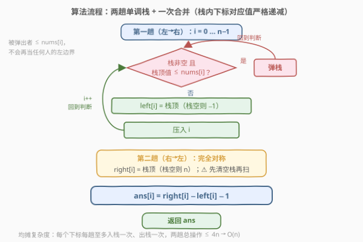

# 每个元素为最大值的最大范围

- **题目名称**：每个元素为最大值的最大范围
- **链接**：[2832. 每个元素为最大值的最大范围](https://leetcode.cn/problems/maximal-range-that-each-element-is-maximum-in-it/)
- **难度**：中等
- **标签**：栈、数组、单调栈

## 1. 题目概述

> ⚠️ 本题为 LeetCode 付费题，题意描述根据官方示例用例与 hints 重建，可能与官方题面有出入。

给定一个下标从 0 开始、元素**互异**的整数数组 `nums`，定义与 `nums` 等长的数组 `ans`：

- $\text{ans}[i]$ 是子数组 $\text{nums}[l..r]$ 的**最大长度**，满足该子数组的**最大元素恰好等于** $\text{nums}[i]$。

返回数组 `ans`。注意子数组是数组的**连续**部分。

**示例 1**：

```text
输入：nums = [1,5,4,3,6]
输出：[1,4,2,1,5]
解释：对 nums[0]=1，以 1 为最大值的最长子数组是 nums[0..0]，长度 1；
     对 nums[1]=5，最长是 nums[0..3] = [1,5,4,3]，长度 4；
     对 nums[2]=4，最长是 nums[2..3] = [4,3]，长度 2；
     对 nums[3]=3，最长是 nums[3..3]，长度 1；
     对 nums[4]=6，最长是整个数组 nums[0..4]，长度 5。
```

**示例 2**：

```text
输入：nums = [1,2,3,4,5]
输出：[1,2,3,4,5]
解释：对 nums[i]，以它为最大值的最长子数组是 nums[0..i]，长度 i+1。
```

**约束条件**：

- $1 \le \text{nums.length} \le 10^5$
- $1 \le \text{nums}[i] \le 10^5$
- `nums` 中所有元素**互异**

> 💡 「元素互异」是本题的关键前提：子数组最大值等于 $\text{nums}[i]$ 意味着 $\text{nums}[i]$ **本身必须出现在子数组中**（$l \le i \le r$），且子数组内不存在比它更大的元素——两个条件恰好框定一个**唯一**的最长区间。

---

## 2. 解题思路

### 2.1 暴力思路

对每个下标 $i$，从 $i$ 出发向两侧**逐格扩张**：左边只要 $\text{nums}[j] < \text{nums}[i]$ 就继续左移，右边同理，两侧都被「更大的元素」挡住时停下：

```python
# O(n^2) 暴力：逐元素向两侧扩张
ans = []
for i in range(n):
    l = i
    while l - 1 >= 0 and nums[l - 1] < nums[i]:
        l -= 1
    r = i
    while r + 1 < n and nums[r + 1] < nums[i]:
        r += 1
    ans.append(r - l + 1)
```

问题在极端数据上暴露无遗：**严格递增数组**（示例 2）中每个元素都要一路扩张到最左端，第 $i$ 个元素扩张 $i+1$ 格，总代价

$$\sum_{i=0}^{n-1}(i+1) = \frac{n(n+1)}{2} = O(n^2)$$

$n = 10^5$ 时约 $5 \times 10^9$ 次比较，必然超时。

### 2.2 核心观察：两侧「最近更大元素」夹出统治区间

![核心观察：两侧最近更大元素夹出 nums[i] 的统治区间](../images/p2832_concept_boundaries.svg)

对每个 $i$ 定义两个边界：

- $\text{left}[i]$：$i$ **左侧**最近的满足 $\text{nums}[j] > \text{nums}[i]$ 的下标 $j$，不存在则记 $-1$；
- $\text{right}[i]$：$i$ **右侧**最近的满足 $\text{nums}[k] > \text{nums}[i]$ 的下标 $k$，不存在则记 $n$。

三条关键观察：

1. **墙内畅通**：开区间 $(\text{left}[i],\, \text{right}[i])$ 内的所有元素都 $< \text{nums}[i]$——若中间藏着更大的元素，它离 $i$ 更近，与「最近」矛盾。因此 $\text{nums}[i]$ 是子数组 $\text{nums}[\text{left}[i]+1 .. \text{right}[i]-1]$ 的最大值。

2. **墙外受阻**：任何把 $\text{left}[i]$ 或 $\text{right}[i]$ 圈进来（或越过它们）的子数组，都会包含一个 $> \text{nums}[i]$ 的元素，$\text{nums}[i]$ 立即失去最大值身份。合法子数组全部被夹在开区间内。

3. **答案唯一**：于是

$$\text{ans}[i] = \text{right}[i] - \text{left}[i] - 1$$

问题从「逐元素扩张」转化为「**批量求两侧最近更大元素**」——这正是**单调栈**的招牌场景，与 [84. 柱状图中最大的矩形](../0001-0100/84_柱状图中最大的矩形.md) 的边界结构完全同构（84 找两侧最近**更矮**，本题找两侧最近**更高**）。

以从左往右求 $\text{left}[]$ 为例，维护一个**栈内下标对应值严格递减**的栈：

- 遍历到 $\text{nums}[i]$ 时，把栈顶所有值 $\le \text{nums}[i]$ 的下标弹掉；
- 弹完后的栈顶（若存在）就是 $\text{left}[i]$，栈空则 $\text{left}[i] = -1$；
- 压入 $i$，继续。

> 💡 为什么弹掉是安全的？被弹出的下标 $j$ 满足 $\text{nums}[j] \le \text{nums}[i]$ 且 $j < i$：对任何 $k > i$，若 $\text{nums}[j] > \text{nums}[k]$，则 $\text{nums}[i] \ge \text{nums}[j] > \text{nums}[k]$ 且 $i$ 离 $k$ 更近——$j$ 永远不可能再成为任何人的「最近更大元素」，留在栈里纯属占位。

### 2.3 算法流程图



算法分三步：

1. **第一趟（左→右）**：单调递减栈求出每个位置的 $\text{left}[i]$；
2. **第二趟（右→左）**：完全对称地求出 $\text{right}[i]$——注意**清空栈**、无边界时哨兵换成 $n$；
3. **合并**：一趟遍历计算 $\text{ans}[i] = \text{right}[i] - \text{left}[i] - 1$。

### 2.4 示例演算

![示例演算：nums = [1,5,4,3,6] 的两趟扫描与最终答案](../images/p2832_example_walkthrough.svg)

以示例 1 `nums = [1,5,4,3,6]` 为例。第一趟从左到右，栈内存**下标**（下表按对应值展示），每步的判断与结果：

| i | 操作 | 栈（值，底→顶） | left[i] |
|---|------|-----------------|---------|
| 0 | 栈空，压入 | 1 | −1 |
| 1 | 弹出 1，压入 | 5 | −1 |
| 2 | 5 > 4，压入 | 5, 4 | 1 |
| 3 | 4 > 3，压入 | 5, 4, 3 | 2 |
| 4 | 弹出 3、4、5，压入 | 6 | −1 |

第二趟从右到左对称执行，得 $\text{right} = [1, 4, 4, 4, 5]$（$\text{right}[4] = 5 = n$，右侧无更大）。合并：

| i | nums[i] | left[i] | right[i] | ans[i] = right−left−1 |
|---|---------|---------|----------|----------------------|
| 0 | 1 | −1 | 1 | 1 |
| 1 | 5 | −1 | 4 | 4 |
| 2 | 4 | 1 | 4 | 2 |
| 3 | 3 | 2 | 4 | 1 |
| 4 | 6 | −1 | 5 (= n) | 5 |

与预期输出 $[1,4,2,1,5]$ 一致。示例 2 的递增数组也可一眼验证：$\text{right}[i] = i+1$、$\text{left}[i] = -1$，故 $\text{ans}[i] = i+1$。

---

## 3. 参考代码

### C++

```cpp
class Solution {
public:
    vector<int> maximumLengthOfRanges(vector<int>& nums) {
        int n = nums.size();
        vector<int> left(n, -1), right(n, n);
        stack<int> stk;                        // 栈内下标对应的值严格递减
        for (int i = 0; i < n; ++i) {          // 第一趟：左侧最近更大
            while (!stk.empty() && nums[stk.top()] <= nums[i]) stk.pop();
            if (!stk.empty()) left[i] = stk.top();
            stk.push(i);
        }
        stk = stack<int>();                    // 清空栈，勿复用第一趟残留
        for (int i = n - 1; i >= 0; --i) {     // 第二趟：右侧最近更大
            while (!stk.empty() && nums[stk.top()] <= nums[i]) stk.pop();
            if (!stk.empty()) right[i] = stk.top();
            stk.push(i);
        }
        vector<int> ans(n);
        for (int i = 0; i < n; ++i) ans[i] = right[i] - left[i] - 1;
        return ans;
    }
};
```

### Python

```python
class Solution:
    def maximumLengthOfRanges(self, nums: List[int]) -> List[int]:
        n = len(nums)
        left, right = [-1] * n, [n] * n

        stk = []                               # 栈内下标对应的值严格递减
        for i, x in enumerate(nums):           # 第一趟：左侧最近更大
            while stk and nums[stk[-1]] <= x:
                stk.pop()
            if stk:
                left[i] = stk[-1]
            stk.append(i)

        stk = []                               # 清空栈，勿复用第一趟残留
        for i in range(n - 1, -1, -1):         # 第二趟：右侧最近更大
            while stk and nums[stk[-1]] <= nums[i]:
                stk.pop()
            if stk:
                right[i] = stk[-1]
            stk.append(i)

        return [r - l - 1 for l, r in zip(left, right)]
```

> 💡 弹栈条件写 `<=` 而非 `<` 是有意为之：本题元素互异，两者等价；但「弹掉一切不超过当前值的元素、留下**严格更大**的作边界」的写法，即使数组出现重复值也能保持正确语义（相等元素不挡路，见第 6 节）。

---

## 4. 复杂度分析

| 维度 | 复杂度 | 说明 |
|------|--------|------|
| 时间复杂度 | $O(n)$ | **均摊分析**：两趟扫描中每个下标至多入栈一次、出栈一次，内层 `while` 的总弹出次数 $\le n$，加上合并一趟，总操作数为 $O(n)$ 的常数倍 |
| 空间复杂度 | $O(n)$ | `left`、`right` 两个边界数组与栈各 $O(n)$；栈内任意时刻只是其中一部分，不改变量级 |

> 💡 嵌套 `while` 套在 `for` 里看起来像 $O(n^2)$，但每一次弹栈都永久消耗一个早已入栈的下标——总入栈 $= n$，总出栈 $\le n$，平摊到每次迭代 $O(1)$。这与 [739. 每日温度](../0701-0800/739_每日温度.md)、[901. 股票价格跨度](../0901-1000/901_股票价格跨度.md) 的均摊论证完全一致。

---

## 5. 扩展：单趟写法（弹出即结算）

仔细观察第一趟的弹栈动作：当 $\text{nums}[j]$ 被 $\text{nums}[i]$ 弹出时，$i$ 恰好就是 $j$ 的**右侧最近更大**，而弹出 $j$ 之后的新栈顶恰好是 $j$ 的**左侧最近更大**——两个边界在同一瞬间凑齐！于是两趟可以合并成一趟，再配合**哨兵** $+\infty$ 在末尾强制清空栈：

```python
class Solution:
    def maximumLengthOfRanges(self, nums: List[int]) -> List[int]:
        n = len(nums)
        ans = [0] * n
        stk = []                                   # 栈内下标对应的值严格递减
        for i in range(n + 1):
            cur = nums[i] if i < n else float('inf')   # 哨兵 +∞ 清空栈
            while stk and nums[stk[-1]] <= cur:
                j = stk.pop()
                left = stk[-1] if stk else -1      # 弹出后的新栈顶 = 左边界
                ans[j] = i - left - 1              # 右边界 = 触发弹出的 i
            if i < n:
                stk.append(i)
        return ans
```

这正是 [901. 股票价格跨度](../0901-1000/901_股票价格跨度.md)「弹出即结算跨度」的同款技巧，[84. 柱状图中最大的矩形](../0001-0100/84_柱状图中最大的矩形.md) 的单趟版也基于同一事实。代价是哨兵与弹出语义要一次想清楚——面试中两趟版更不容易写错，单趟版适合作为「秀操作」的收尾。

---

## 6. 面试要点

1. **为什么「元素互异」是本题的关键前提？**

   > 互异保证「子数组最大值等于 $\text{nums}[i]$」$\iff$「$\text{nums}[i]$ 在子数组内且其余元素都比它小」，两条件合成唯一的最长区间。若允许重复，以 $[3,3]$ 为例两个 3 都是子数组 $[3,3]$ 的最大值，题意仍可成立但需要讨论「相等元素是否挡路」——好在弹栈条件取 `<=`（留下严格更大的作边界）恰好给出正确答案：$[3,3,3]$ 的答案是 $[3,3,3]$。

2. **弹栈条件为什么写 `<=`？换成 `<` 会怎样？**

   > `<=` 的语义是「弹出一切不超过当前值的元素，留下严格更大的作边界」。本题互异时两种写法结果相同；但若允许重复且写 `<`，相等的元素会残留在栈中被误当作「更大」的边界：$[3,3,3]$ 会错算成 $[1,1,1]$。`<=` 是更稳健的习惯写法。

3. **`for` 里嵌 `while`，为什么复杂度是 $O(n)$？**

   > 均摊分析：每个下标在每趟中至多入栈一次、出栈一次，内层 `while` 的总执行次数不超过总入栈数 $n$，因此两趟总操作数有 $4n$ 的上界，线性。

4. **本题与 [84. 柱状图中最大的矩形](../0001-0100/84_柱状图中最大的矩形.md) 是什么关系？**

   > 边界结构完全同构：84 对每根柱子求两侧最近**更矮**的边界，宽度 $= \text{right} - \text{left} - 1$，再乘以高度取全局最大；本题求两侧最近**更高**的边界，直接输出每个位置的宽度。掌握其中一个，另一个只是「更大/更小」方向与聚合方式的差别。

5. **第二趟开始前忘记清空栈会发生什么？**

   > 第一趟的残留下标会冒充右侧边界。例如 `nums = [6,5,4]`：第一趟结束栈残留 $[0,1,2]$，第二趟 $i=2$ 时先弹出自己（值相等触发 `<=`），随后把 $\text{nums}[1]=5$ 误读为右侧最近更大，$\text{right}[2]$ 错成 $1$（正确是 $n=3$）。务必 `stk = stack<int>()` 或新建栈。

---

## 7. 同类练习题

- [84. 柱状图中最大的矩形](https://leetcode.cn/problems/largest-rectangle-in-histogram/)（[题解](../0001-0100/84_柱状图中最大的矩形.md)）：同款「两侧最近更小元素夹出区间」，84 对每个元素取高度×宽度的全局最大，本题逐元素输出宽度
- [901. 股票价格跨度](https://leetcode.cn/problems/online-stock-span/)（[题解](../0901-1000/901_股票价格跨度.md)）：本题的单侧版——只求左侧最近更大元素的距离，「弹出即结算」技巧出处
- [739. 每日温度](https://leetcode.cn/problems/daily-temperatures/)（[题解](../0701-0800/739_每日温度.md)）：求右侧最近更大元素的距离，单调栈入门必刷
- [496. 下一个更大元素 I](https://leetcode.cn/problems/next-greater-element-i/)（[题解](../0401-0500/496_下一个更大元素 I.md)）：求下一个更大元素的「值」而非距离，单调栈 + 哈希的变体
- [42. 接雨水](https://leetcode.cn/problems/trapping-rain-water/)（[题解](../0001-0100/42_接雨水.md)）：两侧更高元素决定水位上界，「边界夹逼」思想的另一应用
