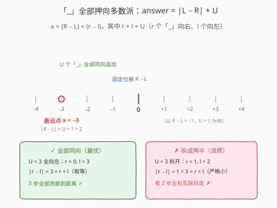
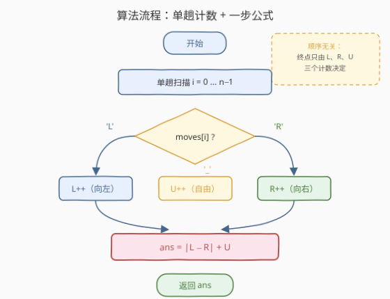
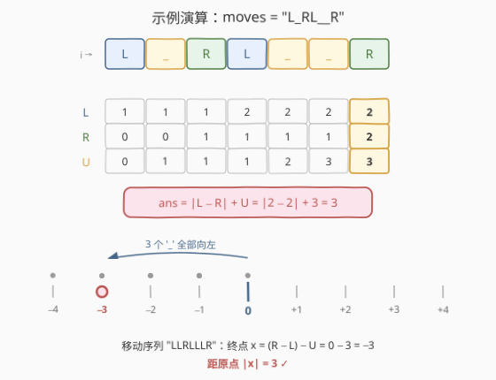

# LeetCode 距离原点最远的点 题解

## 1. 题目概述

- **标题 / 题号**：距离原点最远的点（#2833，easy）
- **链接**：https://leetcode.cn/problems/furthest-point-from-origin/
- **难度**：简单
- **标签**：字符串、计数

**题意**：给你一个长度为 $n$ 的字符串 `moves`，仅由字符 `'L'`、`'R'` 和 `'_'` 组成，表示在一条**原点为 0 的数轴**上的若干次移动。初始位置就在原点（0），第 $i$ 次移动过程中，可以根据对应字符选择移动方向：

- 如果 `moves[i] = 'L'` 或 `moves[i] = '_'`，可以选择**向左**移动一个单位距离；
- 如果 `moves[i] = 'R'` 或 `moves[i] = '_'`，可以选择**向右**移动一个单位距离。

也就是说，`'L'` / `'R'` 是**固定方向**的移动，`'_'` 是**自由方向**的移动（每一处独立选择左右）。返回移动 $n$ 次之后，可以到达的点中**距离原点最远**的点到原点的距离。

**示例 1**：

```text
输入：moves = "L_RL__R"
输出：3
解释：可以到达的距原点 0 最远的点是 -3，移动的序列为 "LLRLLLR"。
```

**示例 2**：

```text
输入：moves = "_R__LL_"
输出：5
解释：可以到达的距原点 0 最远的点是 -5，移动的序列为 "LRLLLLL"。
```

**示例 3**：

```text
输入：moves = "_______"
输出：7
解释：可以到达的距原点 0 最远的点是 7，移动的序列为 "RRRRRRR"。
```

**约束**：

- $1 \le \text{moves.length} = n \le 50$
- `moves` 仅由字符 `'L'`、`'R'` 和 `'_'` 组成

> 💡 读题关键：「最远」衡量的是**到原点的距离**（坐标的绝对值），不是坐标本身——示例 1 中 $-3$ 比 $3$ 更远。另外每处 `'_'` 的选择互相独立，理论上共有 $2^U$ 种方案（$U$ 为 `'_'` 的个数）。

## 2. 解题思路

### 2.1 暴力思路

最朴素的办法：**枚举每个 `'_'` 的方向**（左/右），共 $2^U$ 种组合；对每种组合模拟一遍得到终点坐标，取绝对值最大者。

问题在于复杂度：$U$ 最大可达 50，$2^{50} \approx 10^{15}$，彻底不可行——即使 $n \le 50$ 的小数据也扛不住枚举，必须寻找结构性观察来降维。

### 2.2 核心观察：终点只由计数决定，「_」全部押向多数派



两条关键观察：

1. **顺序无关，只看计数**：终点坐标是若干个 $+1$ 与 $-1$ 之和，而加法满足交换律，所以终点只由三种字符的**个数**决定，与出现顺序无关。设 $L$、$R$、$U$ 分别为 `'L'`、`'R'`、`'_'` 的个数。

2. **`'_'` 不该拆分**（官方 hint 同款结论）：设 $U$ 个 `'_'` 中有 $r$ 个向右、$l$ 个向左（$r + l = U$），则终点为

   $$x = (R + r) - (L + l) = (R - L) + (r - l)$$

   由**三角不等式**一路放缩：

   $$|x| = |(R - L) + (r - l)| \le |R - L| + |r - l| \le |R - L| + (r + l) = |R - L| + U$$

   第二个不等式取等当且仅当 $r = 0$ 或 $l = 0$——即**所有 `'_'` 朝同一个方向**。直觉：把 `'_'` 拆成两半左右互踩，$|r - l| < r + l$，白白浪费步数。

   而这个上界**总能取到**：把全部 `'_'` 押向 $L$、$R$ 中的**多数派**（即顺着 $R - L$ 的符号方向），$|x|$ 恰好等于 $|R - L| + U$。于是：

   $$\boxed{\text{answer} = |L - R| + U}$$

> 💡 等价的「二选一」视角：最优方案只在两个候选里——`'_'` 全左或全右，答案为 $\max(|L + U - R|,\; |R + U - L|) = U + |L - R|$。$2^U$ 种方案被压缩到 2 种，本质都是「同向不拆分」这一结论的推论。

### 2.3 算法流程图



流程只有两步：

1. **单趟计数**：扫一遍 `moves`，维护 $L$、$R$、$U$ 三个计数器；
2. **一步出答案**：返回 $|L - R| + U$。

没有分支回溯、没有排序、没有二次扫描——计数题的标准形态。

### 2.4 示例演算



以示例 1 `moves = "L_RL__R"` 为例，逐字符追踪三个计数器：

| i | moves[i] | 类型 | L | R | U |
|---|----------|------|---|---|---|
| 0 | L | 固定向左 | 1 | 0 | 0 |
| 1 | _ | 自由 | 1 | 0 | 1 |
| 2 | R | 固定向右 | 1 | 1 | 1 |
| 3 | L | 固定向左 | 2 | 1 | 1 |
| 4 | _ | 自由 | 2 | 1 | 2 |
| 5 | _ | 自由 | 2 | 1 | 3 |
| 6 | R | 固定向右 | 2 | 2 | 3 |

扫完后 $L = 2$、$R = 2$、$U = 3$：固定部分位移 $R - L = 0$，三个 `'_'` 全部向左，终点 $x = 0 - 3 = -3$，对应移动序列 `"LLRLLLR"`（与官方解释一致）：

$$\text{answer} = |2 - 2| + 3 = 3$$

示例 3 则是 $L = R = 0$、$U = 7$ 的极端情形——没有任何固定位移打底，7 个 `'_'` 全部向右，答案就是 $7$。

## 3. 参考代码

### C++

```cpp
class Solution {
public:
    int furthestDistanceFromOrigin(string moves) {
        int L = 0, R = 0, U = 0;
        for (char c : moves) {
            if (c == 'L')      L++;
            else if (c == 'R') R++;
            else               U++;
        }
        return abs(L - R) + U;   // '_' 全部押向多数派
    }
};
```

### Python

```python
class Solution:
    def furthestDistanceFromOrigin(self, moves: str) -> int:
        return abs(moves.count("L") - moves.count("R")) + moves.count("_")
```

> 💡 `str.count` 的参数是**子串**而非字符列表，传单字符 `"L"` 即统计其出现次数；三个 `count` 各扫一遍字符串共 3 趟，仍是 $O(n)$（系数为 3，$n \le 50$ 完全无感）。若追求严格单趟，可用 `collections.Counter(moves)` 一趟收齐三个计数。

## 4. 复杂度分析

| 维度 | 复杂度 | 说明 |
|------|--------|------|
| 时间复杂度 | $O(n)$ | 单趟扫描；Python 三次 `count` 为 $3n$ 次字符比较，同为线性 |
| 空间复杂度 | $O(1)$ | 三个整型计数器；`Counter` 写法为 $O(k)$，$k \le 3$ 仍是常数 |

> 💡 本题 $n \le 50$，任何写法都秒过；真正有价值的是「**顺序无关 ⇒ 转计数**」的降维思想——它把 $2^U$ 的决策空间压成了 3 个数字。

## 5. 扩展：镜像问题——距离原点**最近**的点

把问题反过来问：能到达的点中距原点**最近**是多少？此时 `'_'` 的策略从「押同向」变成「**优先抵消**」固定部分的失衡 $|L - R|$：

- 若 $U \le |L - R|$：$U$ 步全部逆着多数派走，最近距离 $= |L - R| - U$；
- 若 $U > |L - R|$：失衡被抵消后还剩 $U - |L - R|$ 个 `'_'`，它们只能**成对**左右互踩（一左一右回到原地）；若剩奇数个，则必然偏离原点恰好 1 步：

$$\text{nearest} = \begin{cases} |L - R| - U & U \le |L - R| \\ (U - |L - R|) \bmod 2 & U > |L - R| \end{cases}$$

这个**奇偶性陷阱**值得单独体会：每步位移的绝对值都是 1，所以 $n$ 步后的坐标与 $n$ **同奇偶**，$L = 1$、$R = 0$、$U = 2$（$n = 3$）时无论怎么走都到不了原点，最近只能到 $\pm 1$。反观本题的「最远」版：答案 $|L - R| + U$ 与 $n$ 同奇偶，天然没有取等障碍。

## 6. 面试要点

1. **为什么所有 `'_'` 一定同向？**

   > 三角不等式 + 交换论证：设拆分为 $r$ 个向右、$l$ 个向左，则 $|r - l| \le r + l = U$，且取等当且仅当一边为 0；一旦拆分，$|r - l|$ 严格变小，等价于浪费步数。把全部 `'_'` 押向多数派即可达到上界 $|R - L| + U$。

2. **字符顺序影响答案吗？**

   > 不影响。终点是若干 $\pm 1$ 的求和，加法交换律保证结果只由计数决定——这是「模拟 → 计数」降维的前提。一旦引入障碍物、边界或转向（如 [874. 模拟行走机器人](https://leetcode.cn/problems/walking-robot-simulation/)），顺序变得关键，计数论证随之失效。

3. **与 [657. 机器人能否返回原点](https://leetcode.cn/problems/robot-return-to-origin/) 是什么关系？**

   > 同属「数轴移动 + 计数」家族，只是目标函数不同：657 是**判定型**（四方向计数两两相等 ⇔ 回到原点），本题是**最值型**（计数差的绝对值 + 自由步数）。一个查「计数相等」，一个算「计数差 + 自由度」。

4. **如果改问「距离原点最近的点」呢？**

   > `'_'` 从「押同向」改为「逆着多数派抵消」：$U \le |L - R|$ 时答案 $|L - R| - U$；抵消过头时注意奇偶性——剩下的 `'_'` 只能成对互踩，剩奇数个则最近距离为 1（见第 5 节）。目标一换，策略镜像翻转，但计数框架不变。

5. **一行 Python 写法有什么可说的？**

   > `moves.count("L")` 传的是子串（单字符也是合法子串）；三次 `count` 扫三趟，$O(n)$ 系数为 3。面试中可主动指出「单趟循环或 `Counter` 可做到严格单趟」，展示对线性常数与代码简洁之间取舍的意识。

## 同类练习题

| # | 题目 | 与本题的关联 |
|---|------|-------------|
| 657 | [机器人能否返回原点](https://leetcode.cn/problems/robot-return-to-origin/) | 同为数轴移动 + 计数，判定型（L 与 R、U 与 D 计数相等即回原点），对比本题的最值型 |
| 1041 | [困于环中的机器人](https://leetcode.cn/problems/robot-bounded-in-circle/) | 移动指令含转向且无限重复，用一轮后的「终点 + 朝向」判断是否永远有界，计数思想的几何延伸 |
| 874 | [模拟行走机器人](https://leetcode.cn/problems/walking-robot-simulation/) | 带障碍的网格移动，顺序与障碍共同决定结果，对比本题「顺序无关、无障碍」的理想化设定 |
| 2849 | [判断能否在给定时间到达单元格](https://leetcode.cn/problems/determine-if-a-cell-is-reachable-at-a-given-time/) | 从距离公式反推可达性，注意起点终点的退化特例，同属「距离量纲上的数学小题」 |
