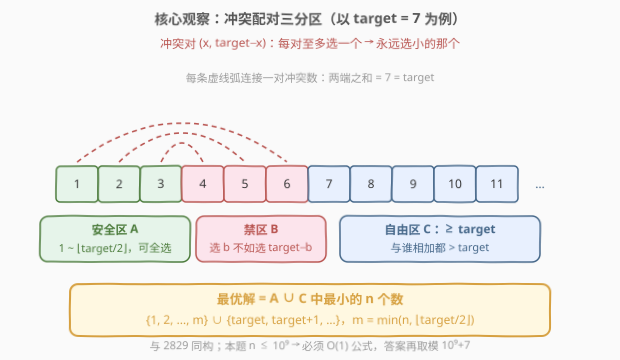
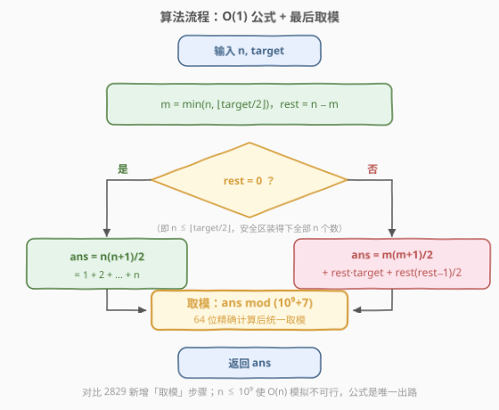
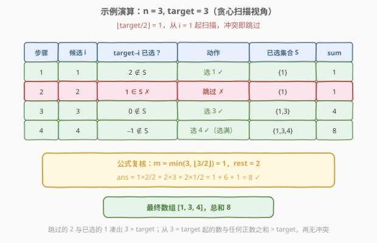

# 找出美丽数组的最小和

- **题目名称**：找出美丽数组的最小和
- **链接**：[2834. 找出美丽数组的最小和](https://leetcode.cn/problems/find-the-minimum-possible-sum-of-a-beautiful-array/)
- **难度**：中等
- **标签**：贪心、数学

## 1. 题目概述

给你两个正整数 `n` 和 `target`。

如果数组 `nums` 满足下述条件，则称其为**美丽数组**：

- `nums.length == n`。
- `nums` 由两两互不相同的正整数组成。
- 在范围 `[0, n-1]` 内，**不存在**两个**不同**下标 `i` 和 `j`，使得 `nums[i] + nums[j] == target`。

返回符合条件的美丽数组所可能具备的**最小**和，并对结果进行取模 $10^9 + 7$。

**示例 1**：

```text
输入：n = 2, target = 3
输出：4
解释：nums = [1,3] 是美丽数组。
- nums 的长度为 n = 2。
- nums 由两两互不相同的正整数组成。
- 不存在两个不同下标 i 和 j，使得 nums[i] + nums[j] == 3。
可以证明 4 是符合条件的美丽数组所可能具备的最小和。
```

**示例 2**：

```text
输入：n = 3, target = 3
输出：8
解释：nums = [1,3,4] 是美丽数组。
- nums 的长度为 n = 3。
- nums 由两两互不相同的正整数组成。
- 不存在两个不同下标 i 和 j，使得 nums[i] + nums[j] == 3。
可以证明 8 是符合条件的美丽数组所可能具备的最小和。
```

**示例 3**：

```text
输入：n = 1, target = 1
输出：1
解释：nums = [1] 是美丽数组。
```

**约束条件**：

- $1 \le n \le 10^9$
- $1 \le \text{target} \le 10^9$

> 💡 本题与 [2829. k-avoiding 数组的最小总和](../2801-2900/2829_k-avoiding数组的最小总和.md)是**同构的孪生题**：把 2829 的「不存在和为 $k$ 的元素对」逐字换成「不存在和为 $\text{target}$ 的元素对」，贪心结构一模一样。真正的差异只有两处——数据范围从 $n, k \le 50$ 放大到 $n, \text{target} \le 10^9$（模拟退场，公式登场），以及答案需对 $10^9+7$ 取模（溢出分析与取模时机成为新考点）。

---

## 2. 解题思路

### 2.1 基础思路：贪心扫描模拟（在本题会超时）

沿用 2829 的第一直觉：维护已选集合 $S$，从 $i = 1$ 开始逐一考察——

- 若 $\text{target} - i$ 已经在 $S$ 中，说明 $i$ 会和它凑出 $\text{target}$，**跳过** $i$；
- 否则把 $i$ 选入 $S$，累加进答案。

直到选满 $n$ 个数为止。时间 $O(n + \text{target})$、空间 $O(n)$。

> ⚠️ 这套模拟在 2829（$n, k \le 50$）轻松通过，但本题 $n \le 10^9$：$10^9$ 次循环 + $10^9$ 大小的哈希集合，时间空间双双爆炸。**必须把贪心过程数学化成 $O(1)$ 公式**——这正是本题相对 2829 的核心考察点。

### 2.2 核心观察：冲突配对三分区 → O(1) 公式

把全体正整数按「与 $\text{target}$ 的关系」划成三个区域：

| 区域 | 范围 | 性质 |
|------|------|------|
| **安全区 $A$** | $1 \sim \lfloor \text{target}/2 \rfloor$ | 任取两个**不同**元素，和 $\le \lfloor \text{target}/2 \rfloor + \lfloor \text{target}/2 \rfloor - 1 < \text{target}$，**互不冲突，可以全选** |
| **禁区 $B$** | $\lfloor \text{target}/2 \rfloor + 1 \sim \text{target}-1$ | 每个数 $b$ 与 $\text{target} - b \in A$ 恰好冲突，且 $\text{target} - b < b$ |
| **自由区 $C$** | $\ge \text{target}$ | 与任何正整数之和 $> \text{target}$，**永不冲突** |



三条关键结论：

1. **$A$ 区可以整区打包**：$1 \sim \lfloor \text{target}/2 \rfloor$ 两两不冲突（$\text{target}$ 为偶数时 $\text{target}/2$ 看似「自己与自己凑对」，但冲突要求两个**不同下标**，元素互异只有一份，单个 $\text{target}/2$ 安全）。
2. **$B$ 区永远不该选（交换论证）**：设最优解选了 $b \in B$ 而没选 $\text{target}-b \in A$。把 $b$ 换成 $\text{target}-b$：总和严格变小（$\text{target}-b < b$），且 $\text{target}-b$ 只与 $b$ 冲突、$b$ 已移除，不会引入新冲突。因此**最优解可以只从 $A \cup C$ 中选**。
3. **缺额从 $C$ 区顶上**：$A \cup C$ 内部两两兼容（不存在任何冲突对），所以最优解就是 $A \cup C$ 中最小的 $n$ 个数——先拿 $1 \sim m$（$m = \min(n, \lfloor \text{target}/2 \rfloor)$），不够的 $\text{rest} = n - m$ 个从 $\text{target}$ 开始连续拿。

于是答案是两个等差数列求和，再对 $10^9+7$ 取模：

$$\text{ans} = \underbrace{\frac{m(m+1)}{2}}_{A\ 区:\ 1+2+\cdots+m} + \underbrace{\text{rest} \cdot \text{target} + \frac{\text{rest}(\text{rest}-1)}{2}}_{C\ 区:\ \text{target}+(\text{target}+1)+\cdots} \pmod{10^9+7}$$

> 💡 注意「从 $\text{target}$ 开始拿」而不是「从 $\lfloor \text{target}/2 \rfloor + 1$ 开始拿」：后者是 $B$ 区，选 $b$ 必须踢掉 $\text{target}-b$，净变化 $2b - \text{target} > 0$，总和不降反升。跳过整个 $B$ 区直达 $\text{target}$，是本题（和 2829）最反直觉也最关键的一步。

### 2.3 算法流程图



**完整步骤**：

1. **计算** $m = \min(n, \lfloor \text{target}/2 \rfloor)$，$\text{rest} = n - m$
2. **判断**：若 $n \le \lfloor \text{target}/2 \rfloor$（即 $\text{rest} = 0$），答案为 $\frac{n(n+1)}{2}$
3. **否则**：答案为 $\frac{m(m+1)}{2} + \text{rest} \cdot \text{target} + \frac{\text{rest}(\text{rest}-1)}{2}$
4. **取模**：对 $10^9 + 7$ 取模后返回（本题新增步骤，64 位安全性分析见第 5 节）

### 2.4 示例演算

以示例 2 $n = 3,\ \text{target} = 3$ 为例。$\lfloor \text{target}/2 \rfloor = 1$，从 $i=1$ 开始贪心扫描：



| 步骤 | 候选 $i$ | $\text{target}-i$ 已选？ | 动作 | 已选集合 $S$ | sum |
|------|----------|--------------------------|------|--------------|-----|
| 1 | 1 | $2 \notin S$ | 选 1 ✓ | $\{1\}$ | 1 |
| 2 | 2 | $1 \in S$ | 跳过 ✗ | $\{1\}$ | 1 |
| 3 | 3 | $0 \notin S$ | 选 3 ✓ | $\{1,3\}$ | 4 |
| 4 | 4 | $-1 \notin S$ | 选 4 ✓（选满） | $\{1,3,4\}$ | 8 |

第 2 步是关键：$2$ 与已选的 $1$ 凑出 $3 = \text{target}$，必须跳过，**直接从 $3 = \text{target}$ 起继续选**。最终数组 $[1,3,4]$，总和 $8$，与示例一致。

再用公式复核：$m = \min(3, 1) = 1$，$\text{rest} = 2$，

$$\text{ans} = \frac{1 \times 2}{2} + 2 \times 3 + \frac{2 \times 1}{2} = 1 + 6 + 1 = 8 \checkmark$$

> 💡 **与 2829 交叉验证**：把 2829 示例 1（$n=5,\ k=4$）代入本题公式：$m = \min(5,2) = 2$，$\text{rest} = 3$，$\text{ans} = 3 + 12 + 3 = 18$，与 2829 的答案完全一致——两题确实同构。再看本题的极限：$n = \text{target} = 10^9$ 时 $m = \text{rest} = 5 \times 10^8$，精确答案约 $7.5 \times 10^{17}$，既远超 32 位整型，也提醒我们**取模与 64 位计算缺一不可**。

---

## 3. 参考代码

### C++

```cpp
class Solution {
public:
    int minimumPossibleSum(int n, int target) {
        const long long MOD = 1'000'000'007;
        long long m = min(n, target / 2);       // 安全区 1..⌊target/2⌋ 实际拿的个数
        long long rest = n - m;                 // 缺额，从 target 起连补
        // A 区: 1+2+…+m；C 区: target+(target+1)+…+(target+rest−1)
        long long ans = m * (m + 1) / 2 + rest * target + rest * (rest - 1) / 2;
        return ans % MOD;                       // 精确值上界约 7.5e17 < 2^63−1
    }
};
```

### Python

```python
class Solution:
    def minimumPossibleSum(self, n: int, target: int) -> int:
        MOD = 10**9 + 7
        m = min(n, target // 2)           # 安全区 1..⌊target/2⌋ 实际拿的个数
        rest = n - m                       # 缺额，从 target 起连补
        ans = m * (m + 1) // 2 + rest * target + rest * (rest - 1) // 2
        return ans % MOD                   # 大整数无溢出，最后取模即可
```

> 💡 两版逻辑一致：$m = \min(n, \lfloor \text{target}/2 \rfloor)$ 加两个等差数列求和。C++ 必须用 `long long`——`int` 在 $n = 10^9$ 时连 $\frac{n(n+1)}{2} \approx 5 \times 10^{14}$ 都装不下；`long long` 精确计算的安全性见第 5 节的上界分析。

---

## 4. 复杂度分析

| 维度 | 复杂度 | 说明 |
|------|--------|------|
| **时间复杂度** | $O(1)$ | 常数次算术运算 + 一次取模 |
| **空间复杂度** | $O(1)$ | 仅使用常数个变量 |

> ⚠️ 对比 2829：两题最优解同为 $O(1)$，但本题的 $O(1)$ 是**被 $n \le 10^9$ 逼出来的刚需**（模拟 $O(n)$ 直接超时），而 2829 的 $O(1)$ 只是锦上添花（模拟也能过）。

---

## 5. 扩展：64 位安全性分析与取模的两种姿势

**为什么 C++ 里 `long long` 精确算完再取模是安全的？** 对三项分别放缩（$n, \text{target} \le 10^9$）：

- $\frac{m(m+1)}{2} \le \frac{(5 \times 10^8)^2}{2} \approx 1.25 \times 10^{17}$（因为 $m \le \lfloor \text{target}/2 \rfloor \le 5 \times 10^8$）
- $\text{rest} \cdot \text{target} \le (n - \text{target}/2) \cdot \text{target} \le 5 \times 10^{17}$（关于 $\text{target}$ 的二次函数在 $\text{target} = n = 10^9$ 处取最大）
- $\frac{\text{rest}(\text{rest}-1)}{2} < \frac{n^2}{2} = 5 \times 10^{17}$

三项之和不超过约 $1.2 \times 10^{18}$（紧上界约 $7.5 \times 10^{17}$，出现在 $n = \text{target} = 10^9$ 时），远小于 $2^{63} - 1 \approx 9.2 \times 10^{18}$，`long long` 放心得下，最后统一 `% MOD` 即可。

**若数据范围再放大（如 $n \le 10^{18}$）**：精确计算会溢出，必须**逐项取模**。此时 $\div 2$ 与取模不可交换，两种标准处理：

- **模逆元**：$\frac{m(m+1)}{2} \equiv m(m+1) \cdot \text{inv2} \pmod{p}$，其中 $\text{inv2} = \frac{p+1}{2} = 500000004$；
- **奇偶拆分**：$m$ 与 $m+1$ 必一奇一偶，先把偶的那个除以 $2$ 再做模乘，完全避开逆元。

```python
MOD = 10**9 + 7
inv2 = (MOD + 1) // 2                        # 2 的模逆元 = 500000004
ans = (m % MOD) * ((m + 1) % MOD) % MOD * inv2 \
    + (rest % MOD) * (target % MOD) \
    + (rest % MOD) * ((rest - 1) % MOD) % MOD * inv2
ans %= MOD
```

**模拟版（小数据交叉验证）**：与 2.1 相同的扫描写法，可在小范围内验证公式正确性（$1 \le n, \text{target} \le 100$ 时与公式结果完全一致），但大数据必超时：

```python
class Solution:
    def minimumPossibleSum(self, n: int, target: int) -> int:
        used = set()
        i, total = 0, 0
        while len(used) < n:
            i += 1
            if target - i not in used:    # target−i 未选，i 可安全加入
                used.add(i)
                total += i
        return total % (10**9 + 7)
```

时间 $O(n + \text{target})$、空间 $O(n)$。循环里有个细节：当 $\text{target}$ 为偶数且 $i = \text{target}/2$ 时，$\text{target}-i = i$ 自身尚未入集合，判空通过、正常选入——「不同下标」的定义恰好放行单个 $\text{target}/2$，与 2.2 的分区分析完全吻合。

---

## 6. 面试要点

1. **本题和 2829 是什么关系？面试时先做什么？**

   - 完全同构（$k \leftrightarrow \text{target}$）。开场先点破「这就是 k-avoiding 数组的放大版」，再独立推导三分区与公式——展示**识别同构并迁移**的能力，比闷头重推更加分。

2. **$\text{target}$ 为偶数时 $\text{target}/2$ 到底能不能选？**

   - 能。冲突要求两个**不同下标** $i \ne j$，而 $\text{target}/2 + \text{target}/2 = \text{target}$ 需要两份 $\text{target}/2$；数组元素两两互异，只有一份，不构成冲突。所以安全区是 $1 \sim \lfloor \text{target}/2 \rfloor$（含中点），共 $\lfloor \text{target}/2 \rfloor$ 个数。

3. **$n$ 超过 $\lfloor \text{target}/2 \rfloor$ 后，为什么直接跳到 $\text{target}$？**

   - 禁区 $(\lfloor \text{target}/2 \rfloor,\ \text{target})$ 的每个数 $b$ 都与更小的 $\text{target}-b$ 冲突。选入 $b$ 必须踢掉 $\text{target}-b$，净变化 $2b - \text{target} > 0$，总和不降反升。跳过禁区直达 $\text{target}$（自由区起点）严格更优。

4. **答案取模 $10^9+7$，C++ 里怎么保证不溢出？**

   - `int` 连 $\frac{n(n+1)}{2}$ 都装不下；`long long` 精确值的上界约 $7.5 \times 10^{17} < 2^{63}-1$（见第 5 节三项放缩），故**先精确求和、最后统一取模**。若值域更大则需逐项取模，并用模逆元 $\text{inv2} = 500000004$ 或奇偶拆分处理 $\div 2$。

5. **为什么「从 1 开始选当前最小可行数」是最优贪心？**

   - 交换论证：最优解中任何「弃小选大」都能换成更小的兼容数而严格减小总和。形式化即三分区——$B$ 区每个数被 $A$ 区搭档整体替换后，最优解恰为 $A \cup C$ 中最小的 $n$ 个数。

> 💡 **一句话总结**：美丽数组 = 2829 的 k-avoiding 数组换皮——安全区 $1 \sim \lfloor \text{target}/2 \rfloor$ 全拿、禁区全弃、缺额从 $\text{target}$ 起连补；两个等差数列求和 $O(1)$ 收工，`long long` 精确计算后取模 $10^9+7$。

---

## 7. 同类练习题

- [2829. k-avoiding 数组的最小总和](../2801-2900/2829_k-avoiding数组的最小总和.md)：孪生题，同一套三分区贪心，数据范围 $50$ 且不取模——先做它再回来本题，体会「数据范围逼迫公式化」
- [945. 使数组唯一的最小增量](../0901-1000/945_使数组唯一的最小增量.md)：同属「跳过被占用值、取当前最小可用数」的贪心家族
- [2554. 从一个范围内选择最多整数I](../2501-2600/2554_从一个范围内选择最多整数I.md)：同为「不同正整数 + 禁止名单」约束下的贪心选取，目标从「定长最小和」换成「总和预算内最多个数」
- [1798. 你能构造出连续值的最大数目](../1701-1800/1798_你能构造出连续值的最大数目.md)：从小到大贪心构造的代表性问题，「当前最小可行选择」思想同源
- [330. 按要求补齐数组](../0301-0400/330_按要求补齐数组.md)：贪心「缺什么补什么」的经典题，正确性同样靠交换论证兜底
