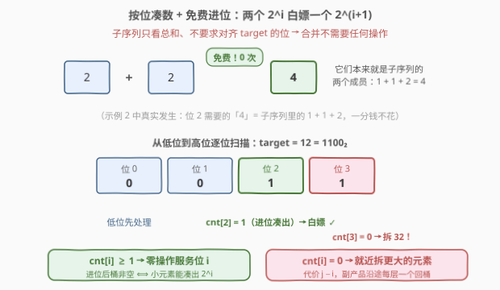
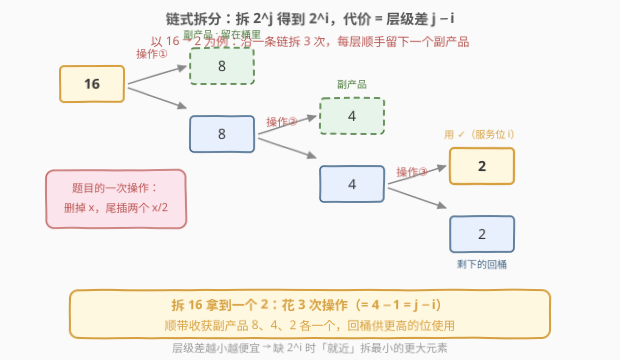
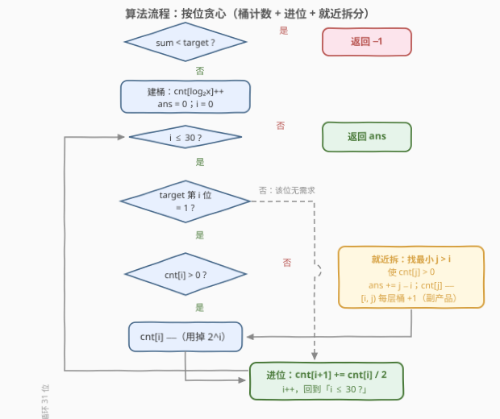
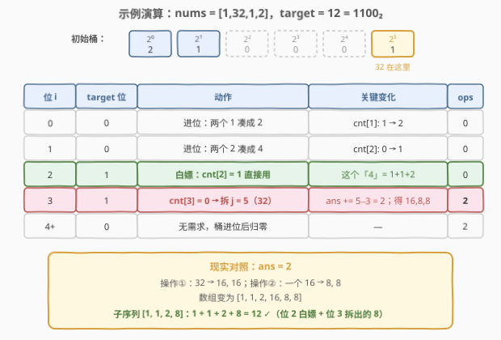

# 使子序列的和等于目标的最少操作次数

- **题目名称**：使子序列的和等于目标的最少操作次数
- **链接**：[2835. 使子序列的和等于目标的最少操作次数](https://leetcode.cn/problems/minimum-operations-to-form-subsequence-with-target-sum/)
- **难度**：困难
- **标签**：贪心、位运算、数组

## 1. 题目概述

给你一个下标从 0 开始的数组 `nums`，它包含**非负**整数，且全部为 **2 的幂**，同时给你一个整数 `target`。

一次操作中，你必须对数组做以下修改：

- 选择数组中一个元素 `nums[i]`，满足 `nums[i] > 1`；
- 将 `nums[i]` 从数组中删除；
- 在 `nums` 的**末尾**添加**两个**数，值都为 `nums[i] / 2`。

你的目标是让 `nums` 的一个**子序列**的元素和等于 `target`，请你返回达成这一目标的**最少操作次数**。如果无法得到这样的子序列，请你返回 `-1`。

数组中一个**子序列**是通过删除原数组中一些元素，并且不改变剩余元素顺序得到的剩余数组。

**示例 1**：

```text
输入：nums = [1,2,8], target = 7
输出：1
解释：第一次操作中，选择元素 nums[2]。数组变为 nums = [1,2,4,4]。
这时候，nums 包含子序列 [1,2,4]，和为 7。
无法通过更少的操作得到和为 7 的子序列。
```

**示例 2**：

```text
输入：nums = [1,32,1,2], target = 12
输出：2
解释：第一次操作中，选择元素 nums[1]。数组变为 nums = [1,1,2,16,16]。
第二次操作中，选择元素 nums[3]。数组变为 nums = [1,1,2,16,8,8]。
这时候，nums 包含子序列 [1,1,2,8]，和为 12。
```

**示例 3**：

```text
输入：nums = [1,32,1], target = 35
输出：-1
解释：无法得到和为 35 的子序列。
```

**约束条件**：

- $1 \le \text{nums.length} \le 1000$
- $1 \le \text{nums[i]} \le 2^{30}$，且均为 2 的幂
- $1 \le \text{target} < 2^{31}$

> 💡 本题关键词「全部为 2 的幂」「一分为二的操作」「子序列求和」——天然的**二进制**结构；操作只会把元素变小、个数变多，**总和永远不变**。思路自然朝着「按 target 的二进制位逐位凑数」的贪心去想。

---

## 2. 解题思路

### 2.1 暴力思路：BFS 搜索所有分裂状态

最直接的做法是把整个数组看成一个状态，每次操作任选一个 $> 1$ 的元素一分为二得到新状态。从初始状态出发 BFS，每扩展一层操作数 +1，首次出现「存在和为 target 的子序列」的状态时返回层数。

问题是**状态空间指数级**：一个 $2^{30}$ 可以被反复分裂出海量组合；子序列判定本身又是子集和问题（好在元素全是 2 的幂，可以用 bitset 优化到 $O(n \cdot \text{target} / w)$）。数据范围 $n \le 1000$、元素到 $2^{30}$，搜索必挂，必须挖掘「2 的幂」的结构性质。

### 2.2 核心观察：按位贪心——桶计数 + 免费进位 + 就近拆分

**观察一：操作不改变总和 → 可行性一眼判定**

一次操作把 $x$ 换成两个 $x/2$，数组总和不变。若 $\sum \text{nums} < \text{target}$，无论怎么操作都凑不出 target，直接返回 $-1$。反之当 $\sum \text{nums} \ge \text{target}$ 时答案一定存在：把所有元素全部拆成 $1$，就能凑出 $[0, \sum \text{nums}]$ 内的任何整数。

**观察二：target 的每个二进制位独立「凑数」**

所有元素都是 2 的幂，把 target 写成二进制 $\text{target} = \sum_{i \in S} 2^i$，问题变成：**从低位到高位，为每个 $i \in S$ 凑出一组和为 $2^i$ 的元素**。

**观察三：两个 $2^i$ 可以「免费」当一个 $2^{i+1}$ 用（进位）**

子序列只要求和等于 target，**不要求每个元素恰好对齐 target 的某一位**。因此两个未使用的 $2^i$ 元素可以直接一起选进子序列——它们的和就是 $2^{i+1}$，**一次操作都不用花**。

于是维护计数桶 $\text{cnt}[i]$ = 值为 $2^i$ 的未用元素个数，处理完第 $i$ 位后把 $\lfloor \text{cnt}[i] / 2 \rfloor$ 「进位」到 $\text{cnt}[i+1]$。这与二进制加法的进位完全同构：**桶 + 进位本质上是对「未用元素总和」做一次总和不变的重分组**。

> 💡 **凑位判定引理**：记 $S_i$ 为未用元素中所有 $\le 2^i$ 的元素之和，则 $S_i \ge 2^i \iff$ 进位后的 $\text{cnt}[i] \ge 1$。因为进位分组总和不变，且每一组恰好对应一组互不相交的实际元素、每组之和为 $2^{\text{组级别}}$。所以 $\text{cnt}[i] \ge 1$ 恰好等价于「能用小元素零操作凑出 $2^i$」。



**观察四：$\text{cnt}[i] = 0$ 时，就近拆最小的更大元素**

当位 $i$ 有需求但（含进位后）$\text{cnt}[i] = 0$，说明小元素怎么凑都不够，必须分裂大元素。把 $2^j$（$j > i$）拆出一个 $2^i$，需要**沿一条链拆 $j - i$ 次**：每拆一层留一个「副产品」，最后得到两个 $2^i$——用一个服务该位，剩一个回桶。



- **就近拆**（选最小的 $j$）让代价 $j - i$ 最小；
- 副产品 $2^i, 2^{i+1}, \ldots, 2^{j-1}$ 各一个回到桶里，供更高的位继续用（还能继续进位）。

### 2.3 算法流程图



**完整步骤**：

1. 若 $\sum \text{nums} < \text{target}$，返回 $-1$
2. 统计计数桶：$\text{cnt}[i]$ = 值为 $2^i$ 的元素个数
3. 从低位 $i = 0$ 到高位 $i = 30$ 逐位处理：
   - 若 target 第 $i$ 位为 $1$：
     - 若 $\text{cnt}[i] = 0$：向上找最小的 $j > i$ 且 $\text{cnt}[j] > 0$，令 $\text{ans} \mathrel{+}= j - i$；$\text{cnt}[j] \mathrel{-}= 1$，并把 $[i, j)$ 每层桶 $+1$（沿途副产品回桶）
     - $\text{cnt}[i] \mathrel{-}= 1$（消耗一个 $2^i$ 服务该位）
   - 进位：$\text{cnt}[i+1] \mathrel{+}= \lfloor \text{cnt}[i] / 2 \rfloor$
4. 返回 ans

### 2.4 示例演算

以示例 2 `nums = [1,32,1,2]`、$target = 12 = 1100_2$ 为例。初始桶：$\text{cnt}[0] = 2$（两个 1）、$\text{cnt}[1] = 1$（一个 2）、$\text{cnt}[5] = 1$（一个 32）。



| 位 $i$ | target 位 | 动作 | 关键变化 | ops |
|--------|-----------|------|----------|-----|
| 0 | 0 | 无需求；进位：两个 $1$ 凑成 $2$ | $\text{cnt}[1]\colon 1 \to 2$ | 0 |
| 1 | 0 | 无需求；进位：两个 $2$ 凑成 $4$ | $\text{cnt}[2]\colon 0 \to 1$ | 0 |
| 2 | 1 | $\text{cnt}[2] = 1$，白嫖用掉 | $\text{cnt}[2]\colon 1 \to 0$ | 0 |
| 3 | 1 | $\text{cnt}[3] = 0$ → 拆 $j = 5$（那个 32） | $\text{ans} \mathrel{+}= 5 - 3 = 2$；副产品 $16, 8, 8$，用掉一个 $8$ | 2 |
| 4+ | 0 | 无需求，后续桶全空 | — | 2 |

位 3 的两次操作对应现实：$32 \to 16, 16$，再 $16 \to 8, 8$。最终数组 $[1, 1, 2, 16, 8, 8]$，子序列 $[1, 1, 2, 8]$ 和为 $12$ ✓。注意**位 2 的「4」一分钱没花**——它就是子序列里的 $1 + 1 + 2$，这正是观察三「免费进位」的威力。

---

## 3. 参考代码

### C++

```cpp
class Solution {
public:
    int minOperations(vector<int>& nums, int target) {
        long long s = 0;
        long long cnt[33] = {0};
        for (int x : nums) { s += x; cnt[__builtin_ctz(x)]++; }   // 2^k 落进桶 k
        if (s < target) return -1;                                 // 总和守恒，不够必无解
        long long ans = 0;
        for (int i = 0; i < 31; i++) {
            if ((target >> i) & 1) {
                if (cnt[i] == 0) {                     // 小元素凑不出 2^i，就近拆
                    int j = i + 1;
                    while (cnt[j] == 0) j++;
                    ans += j - i;                      // 沿链拆 j−i 次
                    cnt[j]--;
                    for (int k = i; k < j; k++) cnt[k]++;  // 沿途副产品回桶
                }
                cnt[i]--;                              // 消耗一个 2^i 服务该位
            }
            cnt[i + 1] += cnt[i] / 2;                  // 免费进位：两个 2^i 凑 2^(i+1)
        }
        return (int)ans;
    }
};
```

### Python

```python
class Solution:
    def minOperations(self, nums: List[int], target: int) -> int:
        if sum(nums) < target:
            return -1
        cnt = [0] * 33
        for x in nums:
            cnt[x.bit_length() - 1] += 1          # 2^k 落进桶 k
        ans = 0
        for i in range(31):
            if (target >> i) & 1:
                if cnt[i] == 0:                   # 小元素凑不出 2^i，就近拆
                    j = i + 1
                    while cnt[j] == 0:
                        j += 1
                    ans += j - i                  # 沿链拆 j−i 次
                    cnt[j] -= 1
                    for k in range(i, j):         # 沿途副产品回桶
                        cnt[k] += 1
                cnt[i] -= 1                       # 消耗一个 2^i 服务该位
            cnt[i + 1] += cnt[i] // 2             # 免费进位：两个 2^i 凑 2^(i+1)
        return ans
```

> 💡 两版逻辑完全一致。注意 $n \cdot 2^{30}$ 最大约 $2^{40}$，C++ 里 `s` 必须用 `long long` 累加；`cnt` 开 33 个足够（元素最高 $2^{30}$，进位最多到 $2^{31}$）。

---

## 4. 复杂度分析

| 维度 | 复杂度 | 说明 |
|------|--------|------|
| **时间复杂度** | $O(n + \log^2 C)$ | 建桶 $O(n)$；主循环 $\log C \approx 31$ 个位，位内向上找 $j$ 最坏再扫 $O(\log C)$ 层，总体 $\log^2 C \approx 961$ 次常数操作，$C = 2^{31}$ |
| **空间复杂度** | $O(\log C)$ | 计数桶仅 33 个格子 |

---

## 5. 扩展：三个正确性细节

**细节一：进位为什么「不漏解」？** 凑位判定引理（2.2 观察三）保证 $\text{cnt}[i] \ge 1 \iff$ 未用的 $\le 2^i$ 元素之和 $\ge 2^i$。而「和 $\ge 2^i$ ⟹ 存在和恰好为 $2^i$ 的子集」对 2 的幂恒成立（对计数做二进制竖式进位，某一层必然「落」出一个 $2^i$ 组）。因此桶空时确实必须拆、桶非空时确实不用拆，贪心每一步的「拆 / 不拆」决策都不会错。

**细节二：被丢弃的那个 $2^i$ 副产品。** 现实中拆 $2^j$ 会产生两个 $2^i$，代码里只用了一个，另一个相当于丢弃。它是安全的：此刻桶里所有 $2^i$ 已耗尽（否则不会触发拆分），后续拆分只发生在更高的位、不会再产生新的 $2^i$，所以这个孤儿 $2^i$ 永远等不到配对进位的伙伴，丢弃不影响最优性。

**细节三：为什么「就近拆」最优？** 交换论证的直觉：任何方案从 $2^J$ 中取出一个 $2^i$ 至少要走 $J - i$ 步链式拆分，而从更小的 $2^j$ 只需 $j - i < J - i$ 步；把「拆 $2^J$」换成「拆 $2^j$」后，$2^J$ 原封不动留在桶里，后续高位要用它时代价不增。严格证明可对「每个原始元素被选入子序列的碎片」做二叉树归纳；正确性也可以用小规模 BFS 对拍验证（本仓库题解写作时用 3000 组随机小数据对拍通过）。

---

## 6. 面试要点

1. **为什么 $\sum \text{nums} < \text{target}$ 直接返回 $-1$？**

   - 操作是 $x \to x/2 + x/2$，**总和严格守恒**；子序列和最多等于数组总和，不够就无解。反过来 $\sum \ge \text{target}$ 时全拆成 $1$ 必然有解，所以 $-1$ 的判定是完备的。

2. **子序列并不要求元素对齐二进制位，为什么还能按位独立处理？**

   - 「两个 $2^i$ 凑一个 $2^{i+1}$」不需要任何操作——它们本来就是子序列里的两个成员。桶的**免费进位**恰好表达了这个自由度；凑位判定引理保证「进位后 $\text{cnt}[i] \ge 1$ ⟺ 小元素能零操作凑出 $2^i$」。

3. **为什么必须从低位处理到高位？**

   - 进位只能往高处走：低位凑剩的元素可以支援高位，反之不行。先做高位就会错过「小元素凑大位」的省钱机会，被迫做不必要的拆分。

4. **拆分时为什么选「最小的更大元素」？**

   - 拆 $2^j$ 服务位 $i$ 的代价是链长 $j - i$，$j$ 越小越省；副产品虽然层级更低，但低位副产品还能继续进位支援高位，不会浪费。

5. **实现上有哪些坑？**

   - 忘记先判 $\sum < \text{target}$；拆完忘记把 $[i, j)$ 每层副产品 $+1$；C++ 用 `int` 累加总和（$1000 \times 2^{30} > 2^{31}$ 会溢出）；位循环上界要覆盖到 $2^{30}$（31 个位）。

> 💡 **一句话总结**：总和守恒判无解；按 target 的二进制位从低到高凑数——桶计数、两个凑一个**免费进位**、缺谁拆谁（**就近拆**，代价 = 层级差 $j - i$）。

---

## 7. 同类练习题

- [2571. 将整数减少到零需要的最少操作数](../2501-2600/2571_将整数减少到零需要的最少操作数.md)：同样站在二进制位视角贪心「就近取 2 的幂」，位视角处理 2 的幂家族入门题
- [2568. 最小无法得到的或值](../2501-2600/2568_最小无法得到的或值.md)：研究「2 的幂子集能表示哪些值」，与本题的凑位判定引理同源
- [1558. 得到目标数组的最少函数调用次数](../1501-1600/1558_得到目标数组的最少函数调用次数.md)：把本题的「一分为二」换成「+1 / 整体翻倍」的逆向操作，同为按位统计最少操作数
- [1780. 判断一个数字是否可以表示成三的幂的和](../1701-1800/1780_判断一个数字是否可以表示成三的幂的和.md)：进制展开唯一性判定，对照「2 的幂子集求和」的结构差异
