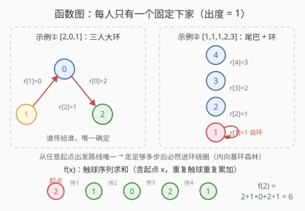
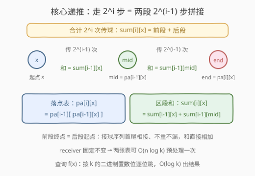
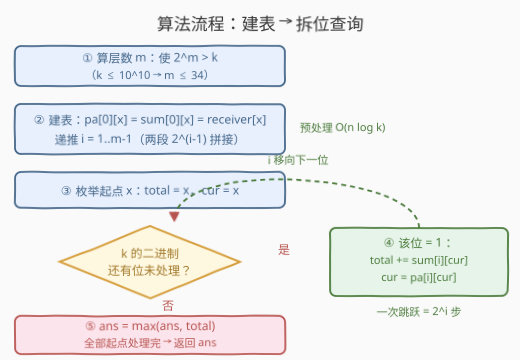
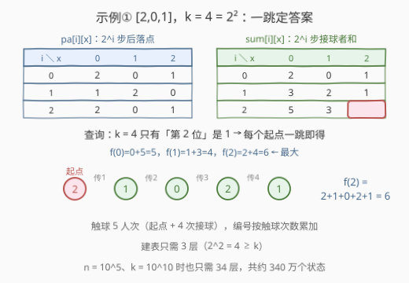

# 在传球游戏中最大化函数值

- **题目名称**：在传球游戏中最大化函数值
- **链接**：[2836. 在传球游戏中最大化函数值](https://leetcode.cn/problems/maximize-value-of-function-in-a-ball-passing-game/)
- **难度**：困难
- **标签**：位运算、数组、动态规划、倍增

## 1. 题目概述

给你一个长度为 `n`、下标从 **0** 开始的整数数组 `receiver` 和一个整数 `k`。`n` 名玩家编号互不相同（`0` 到 `n-1`）玩传球游戏：编号为 `i` 的玩家会把球传给编号为 `receiver[i]` 的玩家（可以传给自己）。

你需要选一名玩家 `x` 作为开始时唯一持球的人，球会被传**恰好** `k` 次。定义函数 `f(x)` 为从 `x` 开始、`k` 次传球内**所有触球玩家的编号之和**（多次触球则累加多次，含起点 `x`，共 `k+1` 项）：

$$f(x) = x + receiver[x] + receiver[receiver[x]] + \cdots + receiver^{(k)}[x]$$

返回 $\max\limits_{0 \le x < n} f(x)$。

**示例 1**：

```text
输入：receiver = [2,0,1], k = 4
输出：6
解释：从 x = 2 开始，触球序列为 2 → 1 → 0 → 2 → 1，
     f(2) = 2 + 1 + 0 + 2 + 1 = 6，是所有起点中最大的。
```

**示例 2**：

```text
输入：receiver = [1,1,1,2,3], k = 3
输出：10
解释：从 x = 4 开始，触球序列为 4 → 3 → 2 → 1，
     f(4) = 4 + 3 + 2 + 1 = 10。
```

**约束条件**：

- `1 <= receiver.length == n <= 10^5`
- `0 <= receiver[i] <= n - 1`
- `1 <= k <= 10^10`

> 💡 两个关键信号：`k` 高达 $10^{10}$——任何"一步一步模拟"的做法直接出局；而 `receiver` 一旦给定就**不再变化**——静态结构可以预处理。这两点合起来，正是**倍增**（binary lifting）的收割场景。

---

## 2. 解题思路

### 2.1 暴力思路：逐起点模拟

枚举每个起点 `x`，老老实实模拟 `k` 次传球、累加触球编号，最后取最大值。单次模拟 $O(k)$，总计 $O(nk) = 10^5 \times 10^{10} = 10^{15}$，天文数字，完全不可行。

> ⚠️ 瓶颈不在"枚举起点"（`n` 只有 $10^5$，这部分没问题），而在"每次查询走 k 步"。要害是把「走 k 步」加速到 $O(\log k)$——从 $10^{10}$ 步压到最多 34 次跳跃。

### 2.2 核心观察：静态函数图 + 倍增跳跃

**观察一：`receiver` 描述的是一张"函数图"（内向基环森林）**。每个玩家有且只有一个下家（出度恰为 1），所以从任何起点出发的传球路线是一条**唯一确定**的链，走足够多步后必然进入一个环并绕圈。没有分叉、没有选择——路径完全由起点决定，这正是可以预处理跳跃表的前提。

**观察二："翻倍"可以拼接**。想知道"从 `x` 走 $2^i$ 步"？先走 $2^{i-1}$ 步到中转点 `mid`，再从 `mid` 走 $2^{i-1}$ 步。两段首尾相接，触球者序列不重不漏，编号之和直接相加。这和快速幂、LCA 倍增是同一个套路：**把"走 k 步"按 k 的二进制拆成若干个 $2^i$ 跳跃**。



据此定义两张表（$i = 0 \cdots m-1$，$m$ 为满足 $2^m > k$ 的最小层数）：

- `pa[i][x]`：从 `x` 出发传 $2^i$ 次球后，球在**谁手上**（落点）
- `sum[i][x]`：从 `x` 出发传 $2^i$ 次球的过程中，所有**接球者**编号之和（**不含起点 x**）

**初值**（走 $2^0 = 1$ 步，落点和接球者都是 `receiver[x]`）：

$$pa[0][x] = sum[0][x] = receiver[x]$$

**递推**（$i \ge 1$，记 $mid = pa[i-1][x]$）：

$$pa[i][x] = pa[i-1][mid], \qquad sum[i][x] = sum[i-1][x] + sum[i-1][mid]$$



**查询 f(x)**：`total = x`（起点先计入），`cur = x`；从低到高扫描 `k` 的二进制位，第 `i` 位为 1 时执行 `total += sum[i][cur]`、`cur = pa[i][cur]`。跳过的各段 $2^i$ 步首尾相接、恰好覆盖 `k` 步，最终 `total` 即 `f(x)`。对所有 `x` 取最大值。

> ⚠️ **两个易错点**：
>
> 1. `sum` 表**不含起点**：查询时 `total` 初值已经是 `x`，若 `sum` 把区段左端点也计入，每次跳跃都会重复加一次端点。设计成"接球者之和"，边界最干净。
> 2. **溢出**：$f(x) \le (k+1)\cdot(n-1) \approx 10^{10} \times 10^5 = 10^{15}$，超出 32 位 int 范围，C++ 必须用 `long long`。

### 2.3 算法流程图



**完整步骤**：

1. **算层数** `m`：最小的 `m` 使 $2^m > k$（`k ≤ 10^10` 时 `m ≤ 34`）。
2. **建表**：`pa[0][x] = sum[0][x] = receiver[x]`；按 `i = 1..m-1` 递推两张表。
3. **枚举起点** `x`：`total = x`、`cur = x`。
4. **拆位跳**：扫描 `k` 的每个二进制位 `i`，为 1 时 `total += sum[i][cur]`、`cur = pa[i][cur]`（一次跳 $2^i$ 步）。
5. **取最大**：`ans = max(ans, total)`，所有起点处理完返回 `ans`。

### 2.4 示例演算

以示例 1 `receiver = [2,0,1]`、$k = 4 = (100)_2$ 为例，建 3 层表（$i = 0, 1, 2$）：

| $i$（走 $2^i$ 步） | `pa[i][0..2]` | `sum[i][0..2]` | 抽查验证 |
|---|---|---|---|
| 0（1 步） | `[2, 0, 1]` | `[2, 0, 1]` | `sum[0][2] = 1`：从 2 出发 1 次传球，接球者是 1 |
| 1（2 步） | `[1, 2, 0]` | `[3, 2, 1]` | `sum[1][0] = 2+1 = 3`：从 0 出发触球 2、1 |
| 2（4 步） | `[2, 0, 1]` | `[5, 3, 4]` | `sum[2][2] = 4`：从 2 出发触球 1、0、2、1 |



查询阶段，$k = 4$ 只有第 2 位是 1，所以每个起点**只需一跳**：

- $f(0) = 0 + sum[2][0] = 0 + 5 = 5$
- $f(1) = 1 + sum[2][1] = 1 + 3 = 4$
- $f(2) = 2 + sum[2][2] = 2 + 4 = \mathbf{6}$ ← 答案

对照触球序列验证：$2 \to 1 \to 0 \to 2 \to 1$，$f(2) = 2+1+0+2+1 = 6$ ✓。若是 $k=5=101_2$ 这类多位为 1 的情况，就先跳 $2^0$ 再跳 $2^2$，两段拼接即可——这正是递推式的用武之地。

---

## 3. 参考代码

### C++

```cpp
class Solution {
public:
    long long getMaxFunctionValue(vector<int>& receiver, long long k) {
        int n = receiver.size();
        int m = 0;
        while ((1LL << m) <= k) m++;               // 最小 m 使 2^m > k（k≤10^10 → m≤34）
        // pa[i][x]：从 x 传 2^i 次后球在谁手上
        // sum[i][x]：从 x 传 2^i 次过程中接球者编号之和（不含起点 x）
        vector<vector<int>> pa(m, vector<int>(n));
        vector<vector<long long>> sum(m, vector<long long>(n));
        for (int x = 0; x < n; x++) {
            pa[0][x] = receiver[x];
            sum[0][x] = receiver[x];
        }
        for (int i = 1; i < m; i++) {
            for (int x = 0; x < n; x++) {
                int mid = pa[i - 1][x];            // 走 2^(i-1) 步的中转点
                pa[i][x] = pa[i - 1][mid];
                sum[i][x] = sum[i - 1][x] + sum[i - 1][mid];
            }
        }
        long long ans = 0;
        for (int x = 0; x < n; x++) {              // 枚举起点
            long long total = x;                   // 起点自己先计入
            int cur = x;
            for (int i = 0; i < m; i++) {
                if (k >> i & 1) {                  // k 的第 i 个二进制位为 1
                    total += sum[i][cur];
                    cur = pa[i][cur];
                }
            }
            ans = max(ans, total);
        }
        return ans;
    }
};
```

### Python

```python
class Solution:
    def getMaxFunctionValue(self, receiver: List[int], k: int) -> int:
        n = len(receiver)
        m = k.bit_length()                        # 最小 m 使 2^m > k
        pa = [receiver[:]]                        # pa[i][x]：传 2^i 次后球在哪
        s = [receiver[:]]                         # s[i][x]：传 2^i 次中接球者编号和（不含 x）
        for i in range(1, m):
            prev_pa, prev_s = pa[i - 1], s[i - 1]
            # 落点：先跳 2^(i-1) 到 mid，再跳 2^(i-1)
            pa.append([prev_pa[mid] for mid in prev_pa])
            # 区段和：前段 + 后段（等价于显式双层循环，推导式快 3~4 倍）
            s.append([a + prev_s[mid] for a, mid in zip(prev_s, prev_pa)])

        ans = 0
        for x in range(n):                        # 枚举起点
            total, cur, kk, i = x, x, k, 0
            while kk:                             # 按 k 的二进制拆位跳
                if kk & 1:
                    total += s[i][cur]
                    cur = pa[i][cur]
                kk >>= 1
                i += 1
            ans = max(ans, total)
        return ans
```

> 💡 两版结构一致：**建表 + 拆位查询**。C++ 注意 `1LL << m` 防 int 溢出、返回值用 `long long`；Python 建表用列表推导（`[prev_pa[mid] for mid in prev_pa]` 恰好逐 `x` 算出 `prev_pa[prev_pa[x]]`，与显式循环等价），`k.bit_length()` 直接给出层数。

---

## 4. 复杂度分析

| 维度 | 复杂度 | 说明 |
|------|--------|------|
| **时间复杂度** | $O(n \log k)$ | 建表 $n \times m$ + 查询 $n \times m$，其中 $m = \lceil \log_2 k \rceil \le 34$ |
| **空间复杂度** | $O(n \log k)$ | `pa` 与 `sum` 两张 $n \times m$ 的表 |

$n = 10^5$、$k = 10^{10}$ 时约 $3.4 \times 10^6$ 个状态：`pa` 存 int 约 13.6 MB，`sum` 存 long long 约 27.2 MB，C++ 轻松容纳；Python 用两层列表同样可过。

---

## 5. 扩展：显式基环分解（不用倍增行不行？）

既然每个连通分量是"尾巴 + 环"，也可以**显式找环**：沿图走并打访问时间戳，首次撞到已访问的点即定位环；对环做一遍前缀和、对环外尾巴也做前缀和。从 `x` 走 `k` 步 = 尾巴上走 `t` 步进环 + 环上整圈折叠 $\lfloor (k-t)/L \rfloor$ 次 + 余数 `r` 步，于是：

$$f(x) = \text{尾前缀和} + \left\lfloor \frac{k-t}{L} \right\rfloor \cdot \text{环总和} + \text{环上前缀差}$$

总复杂度 $O(n)$（与 `k` 无关），比倍增更低。

> 💡 **两种做法怎么选？** 基环分解复杂度更优，但要单独处理"起点在环上还是环外"、整圈折叠、余数边界等一堆分支，细节多易写错；倍增完全不理会图的结构——"无脑递推 + 无脑拆位"，代码短、正确性一目了然，**工程性价比之选**。倍增还有个额外优势：它不依赖"最终成环"这一结构性质，任何「静态函数图上跳 `k` 步并聚合区段信息」的问题（典型如 [2876. 有向图访问计数](https://leetcode.cn/problems/count-visited-nodes-in-a-directed-graph/)）都能套同一套模板；基环分解则只在"图真是基环森林"时好用。

---

## 6. 面试要点

1. **为什么这题能用倍增？关键性质是什么？**

   三要素缺一不可：① `receiver` **静态不变**（表可以预处理）；② 每个点出度恰为 1，**路径无分支**（走 $2^i$ 步的落点唯一确定）；③ 所求信息（编号和）是**可拼接的区段量**（整段 = 前段 + 后段）。三者齐备，倍增成立。

2. **`sum[i][x]` 为什么不含起点 `x`？**

   查询时 `total` 初值已经是 `x`。`sum` 只统计"接球者"，则每一段 $2^i$ 跳跃恰好贡献区段内所有触球者、不与任何相邻段重叠。若把起点计入 `sum`，相邻两段会在拼接点重复计数。

3. **层数 `m` 怎么定？`k = 10^10` 时是多少？**

   取最小的 `m` 使 $2^m > k$，即 $m = \lfloor \log_2 k \rfloor + 1$（Python 的 `k.bit_length()`，C++ 用 `while ((1LL << m) <= k) m++`）。$k = 10^{10}$ 时 $m = 34$（$2^{34} \approx 1.7 \times 10^{10}$）。

4. **结果最大多大，会溢出吗？**

   $f(x) \le (k+1)(n-1) \approx 10^{15}$，远超 int32（约 $2.1 \times 10^9$），但远小于 int64 上限（约 $9.2 \times 10^{18}$）。C++ 全程 `long long`，Python 天然大整数无虞。

5. **和快速幂、LCA 倍增是什么关系？**

   同一套「**可结合信息 + 二进制拆位**」模板：快速幂把"乘 `n` 次"拆成平方链，LCA 把"跳 $2^i$ 层祖先"存表，本题把"传 $2^i$ 次球"存表。理解这一层，三个题就是一道题。

> 💡 **一句话总结**：2836 = 静态函数图 + 超大 `k`。预处理 `pa`/`sum` 两张倍增表，把「走 `k` 步」拆成二进制位上的若干次 $2^i$ 跳跃，`f(x)` 单次查询 $O(\log k)$，总复杂度 $O(n \log k)$。

---

## 7. 同类练习题

- [1483. 树节点的第 K 个祖先](https://leetcode.cn/problems/kth-ancestor-of-a-tree-node/)：倍增 `pa` 表的正宗模板题，本题去掉 `sum` 信息即是它
- [2876. 有向图访问计数](https://leetcode.cn/problems/count-visited-nodes-in-a-directed-graph/)：同款内向基环森林，从每个点出发统计可访问节点数，倍增/基环两种做法都能做
- [2127. 参加会议的最多员工数](https://leetcode.cn/problems/maximum-employees-to-be-invited-to-a-meeting/)：基环森林显式找环 + 环上贪心的代表作，对照本题扩展篇
- [50. Pow(x, n)](https://leetcode.cn/problems/powx-n/)：二进制拆位思想的源头（快速幂），把"跳 $2^i$ 步"换成"自乘 $2^i$ 次"
