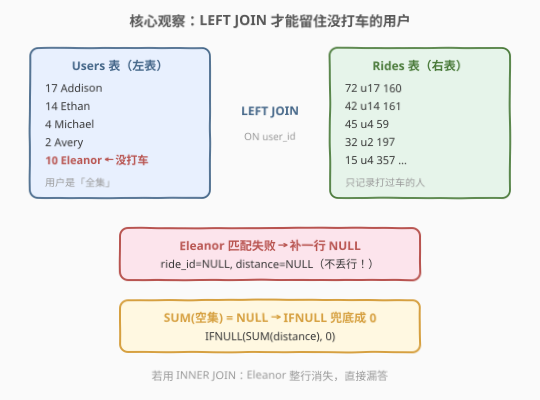
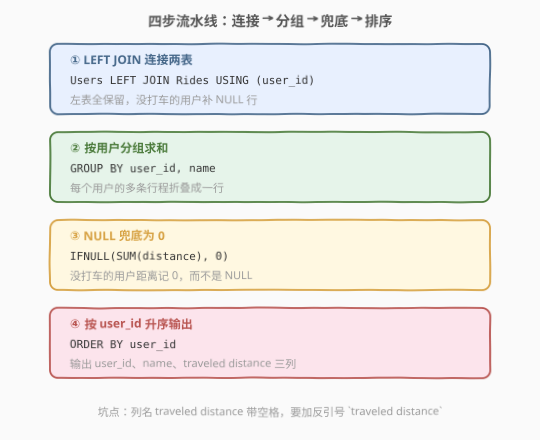
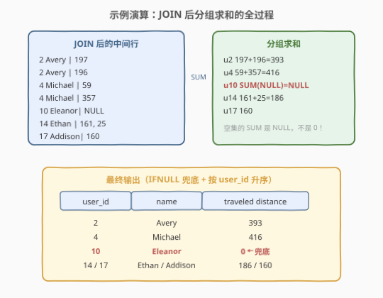

# LeetCode 总旅行距离 题解

## 1. 题目概述

- **标题 / 题号**：总旅行距离（#2837，easy）
- **链接**：https://leetcode.cn/problems/total-traveled-distance/
- **难度**：简单
- **标签**：数据库、SQL、多表连接

> ⚠️ 本题为 LeetCode 付费题，题意描述根据官方示例用例与外部资料重建，可能与官方题面有出入。

**表结构**：`Users`

| 列名 | 类型 |
|------|------|
| user_id | int |
| name | varchar |

- `user_id` 为该表具有唯一值的列。
- 每行包含用户 id 和姓名。

**表结构**：`Rides`

| 列名 | 类型 |
|------|------|
| ride_id | int |
| user_id | int |
| distance | int |

- `ride_id` 为该表具有唯一值的列。
- 每行包含行程 id、用户 id 和该次行程的旅行距离。

**目标**：写一条 SQL 查询，计算**每个用户**旅行的总 `distance`。若有用户从未完成任何行程，其 `distance` 视为 `0`。输出 `user_id`、`name` 和总旅行 `distance`，并按 `user_id` **升序**排列。

**示例 1**：

```text
输入：
Users 表
+---------+---------+
| user_id | name    |
+---------+---------+
| 17      | Addison |
| 14      | Ethan   |
| 4       | Michael |
| 2       | Avery   |
| 10      | Eleanor |
+---------+---------+
Rides 表
+---------+---------+----------+
| ride_id | user_id | distance |
+---------+---------+----------+
| 72      | 17      | 160      |
| 42      | 14      | 161      |
| 45      | 4       | 59       |
| 32      | 2       | 197      |
| 15      | 4       | 357      |
| 56      | 2       | 196      |
| 10      | 14      | 25       |
+---------+---------+----------+

输出：
+---------+---------+-------------------+
| user_id | name    | traveled distance |
+---------+---------+-------------------+
| 2       | Avery   | 393               |
| 4       | Michael | 416               |
| 10      | Eleanor | 0                 |
| 14      | Ethan   | 186               |
| 17      | Addison | 160               |
+---------+---------+-------------------+
```

**解释**：
- 用户 2 完成两次行程（197 + 196），总距离 393。
- 用户 4 完成两次行程（59 + 357），总距离 416。
- 用户 10（Eleanor）没有任何行程，总距离记为 0。
- 用户 14 完成两次行程（161 + 25），总距离 186；用户 17 只有一次行程 160。

## 2. 解题思路

### 2.1 暴力思路：INNER JOIN + GROUP BY

最直觉的写法是把两表按 `user_id` 连接后分组求和：

```sql
SELECT user_id, name, SUM(distance) AS `traveled distance`
FROM Users JOIN Rides USING (user_id)
GROUP BY user_id, name;
```

这有两个硬伤：

1. **`JOIN`（INNER）会丢人**：从未打车的用户（如 Eleanor）在 `Rides` 表没有匹配行，连接后整行消失，输出里直接少一个人——题目要求"没行程的用户距离为 0"，而不是不输出。
2. **`SUM` 对空集返回 `NULL` 而非 0**：即使把连接改成 `LEFT JOIN` 保住了 Eleanor，她那一组的 `distance` 全是 `NULL`，`SUM(NULL)` 的结果也是 `NULL`，不兜底的话输出就不是 `0`。

> ⚠️ 这两个坑正是本题唯一的考点：**LEFT JOIN 保行 + IFNULL 兜底**。

### 2.2 核心观察：LEFT JOIN 保全集 + IFNULL 兜底

用户是"全集"（每个用户都要输出一行），行程只是"附加信息"，所以必须以 `Users` 为**左表**做 `LEFT JOIN`——左表所有行保留，匹配不上的右侧补 `NULL`。 Eleanor 匹配失败后得到一行 `(10, Eleanor, NULL)`，行还在，只是 `distance` 为 `NULL`。

分组求和后，没有行程的用户其组内 `distance` 全为 `NULL`，`SUM` 返回 `NULL`，需要 `IFNULL(SUM(distance), 0)` 把它变成 `0`。



> 💡 注意 `IFNULL` 包在 **`SUM` 外面**：`IFNULL(SUM(distance), 0)` 判断的是"聚合结果是否为 NULL"。若写成 `SUM(IFNULL(distance, 0))`，LEFT JOIN 补出的 `NULL` 行会被逐行转成 0 再求和，本例结果恰好也是 0，两者在本题等价；但语义上前者表达"整组无数据 → 0"，更贴合题意。

### 2.3 算法流程图



**完整步骤**：

1. **连接**：`Users LEFT JOIN Rides USING (user_id)`，以用户表为左表保住所有人。
2. **分组**：`GROUP BY user_id, name`，把每个用户的多条行程折叠成一行。
3. **兜底**：`IFNULL(SUM(distance), 0) AS traveled distance`，空组记 0。
4. **排序**：`ORDER BY user_id` 升序输出。

> ⚠️ 输出列名 `traveled distance` 中间带**空格**，必须用反引号（或双引号）包裹：`` AS `traveled distance` ``，否则会报语法错误。

### 2.4 示例演算

LEFT JOIN 后每个用户名下的行程行，分组求和：

| user_id | name | 组内 distance | SUM | IFNULL 后 |
|---------|----------|---------------|-----|-----------|
| 2 | Avery | 197, 196 | 393 | 393 |
| 4 | Michael | 59, 357 | 416 | 416 |
| 10 | Eleanor | NULL | NULL | **0** |
| 14 | Ethan | 161, 25 | 186 | 186 |
| 17 | Addison | 160 | 160 | 160 |

按 `user_id` 升序输出即为示例答案。



## 3. 参考代码

### MySQL

```sql
# Write your MySQL query statement below
SELECT
    user_id,
    name,
    IFNULL(SUM(distance), 0) AS `traveled distance`
FROM Users
LEFT JOIN Rides USING (user_id)
GROUP BY user_id, name
ORDER BY user_id;
```

> 💡 `USING (user_id)` 是 `ON Users.user_id = Rides.user_id` 的简写，两表同名列时更简洁。`COALESCE(SUM(distance), 0)` 完全等价且是标准 SQL，`IFNULL` 是 MySQL 方言。

### Pandas

```python
import pandas as pd


def total_traveled_distance(users: pd.DataFrame, rides: pd.DataFrame) -> pd.DataFrame:
    merged = users.merge(rides, on="user_id", how="left")
    agg = (
        merged.groupby(["user_id", "name"], as_index=False)["distance"]
        .sum()
        .fillna(0)
        .rename(columns={"distance": "traveled distance"})
    )
    return agg.sort_values("user_id").reset_index(drop=True)
```

> 💡 Pandas 与 SQL 同构：`how="left"` 即 LEFT JOIN；`groupby().sum()` 后无行程用户的 `distance` 为 `NaN`，`fillna(0)` 对应 `IFNULL` 兜底。

## 4. 复杂度分析

| 维度 | 复杂度 | 说明 |
|------|--------|------|
| **时间复杂度** | $O(m + n \log m)$ | 连接可哈希探测 $O(m + n)$（$m$ 为用户数、$n$ 为行程数）；GROUP BY 与 ORDER BY 均按 `user_id` 排序，$O((m+n)\log m)$ 量级 |
| **空间复杂度** | $O(m + n)$ | 连接中间结果与分组聚合的临时表 |

> ⚠️ 若连接走哈希实现，整体近似线性；若走排序归并则多一个 $\log$ 因子。LeetCode SQL 题数据量小，均在毫秒级。

## 5. 扩展：关联子查询写法

除了"先 LEFT JOIN 再聚合"，也可以对外层每个用户做**关联子查询**，语义更直白："对每个用户，去 Rides 里捞他的行程总和，捞不到就 0"：

```sql
SELECT
    user_id,
    name,
    IFNULL(
        (SELECT SUM(distance) FROM Rides r WHERE r.user_id = u.user_id),
        0
    ) AS `traveled distance`
FROM Users u
ORDER BY user_id;
```

> 💡 两种写法语义等价：JOIN 版是"先拼接再折叠"（数据库可自由选择连接顺序，通常更快），子查询版是"逐人询问"（逻辑直观，但相关子查询可能被优化器改写或退化为逐行探测）。另注意：若输出列改为 `SUM(distance)` 的 NULL 直接显示，子查询版本里 `IFNULL` 同样不可省。

## 6. 面试要点

1. **为什么必须 LEFT JOIN 而不能用 INNER JOIN？**

   - 题目要求"每个用户"都输出一行，没打车的用户（如 Eleanor）在 `Rides` 中无匹配行，INNER JOIN 会把这些人**整行丢弃**。以 `Users` 为左表做 LEFT JOIN，匹配失败时右侧补 `NULL` 行，保证用户全集不丢。

2. **`SUM` 对全 NULL 组返回什么？为什么要 IFNULL？**

   - `SUM` 忽略 NULL 值，若组内**所有**值都是 NULL（即该用户没有任何行程），聚合结果是 `NULL` 而非 0。题目要求距离为 0，所以用 `IFNULL(SUM(distance), 0)` 兜底。`COUNT`、`AVG`、`MAX` 等聚合对空组同样返回 NULL，这是 SQL 聚合的通性。

3. **`IFNULL(SUM(distance), 0)` 和 `SUM(IFNULL(distance, 0))` 有区别吗？**

   - 本题两者结果相同（LEFT JOIN 只会补出全 NULL 的行）。但语义不同：前者是"聚合结果为 NULL 就置 0"——即使组里有部分 NULL 行也只管最终结果；后者是"先把每行 NULL 置 0 再求和"。当列中可能混有部分 NULL 值时二者会有差异，需要按业务语义选择。

4. **GROUP BY user_id 为什么还要带上 name？**

   - 标准 SQL 要求 SELECT 中的非聚合列必须出现在 GROUP BY 中（MySQL 旧版靠 `ONLY_FULL_GROUP_BY` 关闭才允许省略）。`user_id` 是主键时按函数依赖可以只 GROUP BY `user_id`，但显式写上 `name` 兼容性最好，不依赖任何方言开关。

5. **输出列名带空格怎么处理？**

   - `traveled distance` 两个单词之间有空格，不是合法的裸标识符，必须写成 `` AS `traveled distance` ``（MySQL 反引号）或 `AS "traveled distance"`（标准 SQL 双引号）。漏了引号会直接报语法错误，这是本题一个隐蔽的提交坑。

> 💡 **一句话总结**：2837 是 LEFT JOIN + GROUP BY + IFNULL 的入门聚合题。两个考点——**INNER JOIN 丢掉无行程用户**、**SUM 空集返回 NULL 而非 0**——用"左连接保全集 + IFNULL 兜底"一并解决，最后按 `user_id` 排序输出。

## 同类练习题

| # | 题目 | 与本题的关联 |
|---|------|-------------|
| 1068 | [产品销售分析 I](https://leetcode.cn/problems/product-sales-analysis-i/) | Sales LEFT JOIN Product 后取首年价格与总销量，同款"左表保全 + 分组聚合"模板 |
| 1075 | [项目员工 I](https://leetcode.cn/problems/project-employees-i/) | Project LEFT JOIN Employee 后按项目求平均工作年限，LEFT JOIN + AVG 组合 |
| 511 | [游戏玩法分析 I](https://leetcode.cn/problems/game-play-analysis-i/) | GROUP BY 玩家取最早登录日期，单表分组聚合入门 |
| 586 | [订单最多的客户](https://leetcode.cn/problems/customer-placing-the-largest-number-of-orders/) | GROUP BY + COUNT 找下单最多的客户，聚合后再取最值的变体 |
