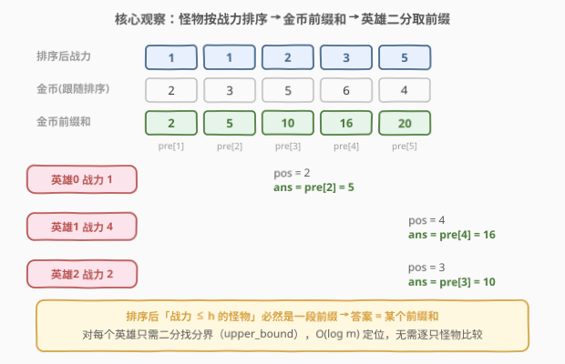
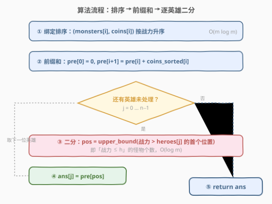
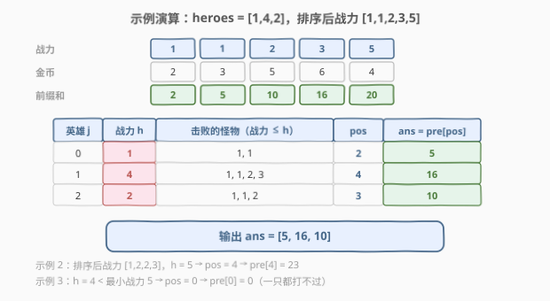

# LeetCode 英雄可以获得的最大金币数 题解

## 1. 题目概述

- **标题 / 题号**：英雄可以获得的最大金币数（#2838，medium）
- **链接**：https://leetcode.cn/problems/maximum-coins-heroes-can-collect/
- **难度**：中等
- **标签**：数组、排序、前缀和、二分查找、双指针

> ⚠️ 本题为 LeetCode 付费题，题意描述根据官方示例用例与 hints 重建，可能与官方题面有出入。

**题意**：给定三个下标从 **0** 开始的整数数组：

- 长度为 $n$ 的 `heroes`，$\text{heroes}[j]$ 表示第 $j$ 位英雄的战力；
- 长度为 $m$ 的 `monsters` 和 `coins`，第 $i$ 只怪物的战力为 $\text{monsters}[i]$，身上带着 $\text{coins}[i]$ 枚金币。

若 $\text{heroes}[j] \ge \text{monsters}[i]$，则第 $j$ 位英雄可以击败第 $i$ 只怪物。**每位英雄都独立挑战全部怪物**（怪物不会被前面的英雄「打掉」），第 $j$ 位英雄获得的金币是他能击败的所有怪物携带金币之和。

返回长度为 $n$ 的数组 `ans`，其中 $\text{ans}[j]$ 表示第 $j$ 位英雄获得的金币总数。

**示例 1**：

```text
输入：heroes = [1,4,2], monsters = [1,1,5,2,3], coins = [2,3,4,5,6]
输出：[5,16,10]
解释：
- 第 0 位英雄战力 1，击败战力 ≤ 1 的怪物（下标 0、1），获得 2 + 3 = 5 枚金币；
- 第 1 位英雄战力 4，击败战力 ≤ 4 的怪物（下标 0、1、3、4），获得 2 + 3 + 5 + 6 = 16 枚金币；
- 第 2 位英雄战力 2，击败战力 ≤ 2 的怪物（下标 0、1、3），获得 2 + 3 + 5 = 10 枚金币。
```

**示例 2**：

```text
输入：heroes = [5], monsters = [2,3,1,2], coins = [10,6,5,2]
输出：[23]
解释：英雄战力 5 ≥ 所有怪物战力，获得 10 + 6 + 5 + 2 = 23 枚金币。
```

**示例 3**：

```text
输入：heroes = [4,4], monsters = [5,7,8], coins = [1,1,1]
输出：[0,0]
解释：两位英雄战力 4 均小于最小怪物战力 5，一只都打不过。
```

**约束条件**（按官方 hints 与常规数据规模重建）：

- $1 \le n = \text{heroes.length} \le 10^5$
- $1 \le m = \text{monsters.length} = \text{coins.length} \le 10^5$
- $1 \le \text{heroes}[i], \text{monsters}[i], \text{coins}[i] \le 10^9$

> 💡 本题核心是「**排序 + 前缀和 + 二分查找**」。关键词「每位英雄问一遍：战力不超过我的怪物金币总和是多少」——这是典型的**静态区间前缀查询**：数据（怪物）不变、查询（英雄）来一堆。把怪物按战力排序后，「战力 $\le h$ 的怪物」必然是一段**前缀**，于是「逐怪物求和」升维成「前缀和数组 + 二分定位」，单次查询从 $O(m)$ 降到 $O(\log m)$。与 [2389. 和有限的最长子序列](../2301-2400/2389_和有限的最长子序列.md)、[2602. 使数组元素全部相等的最少操作次数](../2501-2600/2602_使数组元素全部相等的最少操作次数.md) 是同一套「离线查询三件套」模板。

## 2. 解题思路

### 2.1 暴力思路：每个英雄全量扫描

对每个英雄 $j$，遍历全部 $m$ 只怪物，累加所有满足 $\text{monsters}[i] \le \text{heroes}[j]$ 的 $\text{coins}[i]$。时间 $O(n \cdot m)$。

$n, m \le 10^5$ 时最坏 $10^{10}$ 次比较，必然超时。

> ⚠️ 暴力法的硬伤：$n$ 个英雄把同样的扫描工作重复做了 $n$ 遍，而「战力 $\le h$ 的怪物集合」随着 $h$ 增大只会**单调扩张**——这个单调性完全没有被利用。正解就是把怪物排序，让每个查询变成一次二分定位。

### 2.2 核心观察：排序 + 前缀和 + 二分

三个关键观察：

1. **查询与怪物原始顺序无关**。每位英雄的答案只由「哪些怪物战力 $\le h$」决定，怪物谁前谁后不影响金币总和——所以**可以排序**（对照 [1. 两数之和](../0001-0100/1_两数之和.md) 要求返回原始下标、不能排序的场景）。
2. **排序后可击败集合必为前缀**。把怪物按战力升序排序后，「战力 $\le h$」的怪物在数组中是连续的一段前缀。英雄战力 $h$ 越大，前缀越长——$h$ 与前缀长度**单调对应**。
3. **前缀和把「区间求和」变成「两个数的差」**。对排序后的金币数组做前缀和 $\text{pre}$（$\text{pre}[0]=0$，$\text{pre}[i+1]=\text{pre}[i]+\text{coins}_{\text{sorted}}[i]$），则「前 $\text{pos}$ 只怪物的金币和」= $\text{pre}[\text{pos}]$，$O(1)$ 取用。

于是每位英雄的查询退化为一次**二分查找**：在排序后的战力数组中找最后一个 $\le h$ 的位置。用 `upper_bound`（C++）/ `bisect_right`（Python）找「第一个 $> h$ 的下标」$\text{pos}$，它恰好等于「战力 $\le h$ 的怪物个数」，答案即 $\text{pre}[\text{pos}]$。



> 💡 **为什么用 upper_bound 而不是 lower_bound？** 战力可以相等（示例 1 有两只战力为 1 的怪物）。英雄能击败的是所有战力 $\le h$ 的怪物，含等号——所以要找「最后一个 $\le h$」的右边界，即第一个 $> h$ 的位置，这正是 `upper_bound` 的语义。若误用 `lower_bound`（第一个 $\ge h$ 的位置），战力恰好等于 $h$ 的怪物会被漏掉。

### 2.3 算法流程图



**完整步骤**：

1. **绑定排序**：把 `monsters[i]` 与 `coins[i]` 绑成对（或对下标排序），按战力升序排列，$O(m \log m)$
2. **前缀和**：$\text{pre}[0]=0$，$\text{pre}[i+1]=\text{pre}[i]+\text{coins}_{\text{sorted}}[i]$
3. **逐英雄二分**：对每个 $\text{heroes}[j]$，$\text{pos} = $ 第一个战力 $> \text{heroes}[j]$ 的下标（`upper_bound`）
4. **取答案**：$\text{ans}[j] = \text{pre}[\text{pos}]$
5. 全部英雄处理完后返回 `ans`

### 2.4 示例演算

以示例 1 为例。`monsters = [1,1,5,2,3]`，`coins = [2,3,4,5,6]`，按战力排序后战力为 $[1,1,2,3,5]$，金币跟随排序变为 $[2,3,5,6,4]$，前缀和为 $[2,5,10,16,20]$：



| 英雄 j | 战力 h | 击败的怪物（战力 ≤ h） | pos | ans = pre[pos] |
|--------|--------|------------------------|-----|----------------|
| 0 | 1 | $1,\ 1$ | 2 | $5$ |
| 1 | 4 | $1,\ 1,\ 2,\ 3$ | 4 | $16$ |
| 2 | 2 | $1,\ 1,\ 2$ | 3 | $10$ |

注意战力为 5 的怪物排在最后（金币 4 也跟着挪到最后），任何英雄战力都小于 5，`pre[5] = 20` 始终取不到。最终输出 $[5, 16, 10]$，与示例一致。

> 💡 示例 2：排序后战力 $[1,2,2,3]$、金币 $[5,10,2,6]$，$h=5$ → pos = 4 → $\text{pre}[4] = 23$。示例 3：$h = 4 <$ 最小战力 5 → pos = 0 → $\text{pre}[0] = 0$，即「一只都打不过」的边界情形由前缀和的第 0 项自然兜住，无需特判。

## 3. 参考代码

### C++

```cpp
class Solution {
public:
    vector<long long> maximumCoins(vector<int>& heroes, vector<int>& monsters, vector<int>& coins) {
        int m = monsters.size();
        vector<int> idx(m);
        iota(idx.begin(), idx.end(), 0);
        sort(idx.begin(), idx.end(), [&](int a, int b) {
            return monsters[a] < monsters[b];          // 按战力排序，金币跟随
        });

        vector<int> power(m);                          // 排序后的战力数组（供二分）
        vector<long long> pre(m + 1, 0);               // 前缀和，pre[0] = 0
        for (int i = 0; i < m; i++) {
            power[i] = monsters[idx[i]];
            pre[i + 1] = pre[i] + coins[idx[i]];
        }

        vector<long long> ans;
        ans.reserve(heroes.size());
        for (int h : heroes) {
            // pos = 第一个战力 > h 的下标 = 战力 ≤ h 的怪物个数
            int pos = upper_bound(power.begin(), power.end(), h) - power.begin();
            ans.push_back(pre[pos]);
        }
        return ans;
    }
};
```

### Python

```python
class Solution:
    def maximumCoins(self, heroes: List[int], monsters: List[int], coins: List[int]) -> List[int]:
        pairs = sorted(zip(monsters, coins))           # 按战力排序，金币跟随
        powers = [p for p, _ in pairs]

        pre = [0] * (len(pairs) + 1)                   # 前缀和，pre[0] = 0
        for i, (_, c) in enumerate(pairs):
            pre[i + 1] = pre[i] + c

        return [pre[bisect_right(powers, h)] for h in heroes]
```

> 💡 两版核心逻辑完全一致：排序配对 → 前缀和 → 每个英雄一次 `upper_bound` / `bisect_right`。⚠️ **必须用 64 位整数**：$m \le 10^5$ 只怪物、每只最多 $10^9$ 金币，总和可达 $10^{14}$，超出 `int`（32 位）范围——C++ 用 `long long`，Python 天然大整数无此顾虑。这也是本题最常见的翻车点（返回类型本身就是 `vector<long long>`）。

## 4. 复杂度分析

| 维度 | 复杂度 | 说明 |
|------|--------|------|
| **时间复杂度** | $O((n + m) \log m)$ | 排序 $O(m \log m)$ + $n$ 次二分各 $O(\log m)$ |
| **空间复杂度** | $O(m)$ | 排序下标数组、战力数组与前缀和数组（不计输出） |

> ⚠️ 若数据范围缩小到 $n, m \le 10^3$，暴力 $O(nm)$ 也能通过；但 $10^5$ 规模下必须依赖排序 + 二分把单次查询压到对数级。对比暴力 $10^{10}$ 次操作，本解法约 $10^5 \times 17 \approx 2 \times 10^6$ 次，快了四个数量级。

## 5. 扩展：双指针（把英雄也排序）

若英雄也允许排序（**离线处理**），可以去掉每个英雄的二分：把英雄按战力升序、怪物按战力升序，用**归并式双指针**——战力小的英雄先算，怪物指针只前进不回退，扫一遍完成所有查询。

```cpp
class Solution {
public:
    vector<long long> maximumCoins(vector<int>& heroes, vector<int>& monsters, vector<int>& coins) {
        int m = monsters.size(), n = heroes.size();
        vector<int> idx(m), hid(n);
        iota(idx.begin(), idx.end(), 0);
        iota(hid.begin(), hid.end(), 0);
        sort(idx.begin(), idx.end(), [&](int a, int b) { return monsters[a] < monsters[b]; });
        sort(hid.begin(), hid.end(), [&](int a, int b) { return heroes[a] < heroes[b]; });

        vector<long long> ans(n);
        long long sum = 0;
        int i = 0;                                     // 怪物指针，只前进不回退
        for (int j : hid) {                            // 英雄按战力从小到大
            while (i < m && monsters[idx[i]] <= heroes[j]) {
                sum += coins[idx[i]];
                i++;
            }
            ans[j] = sum;                              // 写回英雄原始下标
        }
        return ans;
    }
};
```

时间 $O(m \log m + n \log n)$（瓶颈仍是两次排序），扫描阶段 $O(n + m)$。与二分解法相比：

| 解法 | 扫描阶段 | 何时更优 | 代价 |
|------|----------|----------|------|
| 排序 + 二分 | $O(n \log m)$ | 查询**在线**到达、无法预知全部英雄时 | 每次查询都要二分 |
| 双指针（离线） | $O(n + m)$ | 查询可一次性拿到、允许乱序回答 | 必须先拿到全部查询、要记录原始下标回填 |

> 💡 这正是「**离线算法**」的经典权衡：把查询也排个序，二分就退化成指针平移。[2602. 使数组元素全部相等的最少操作次数](../2501-2600/2602_使数组元素全部相等的最少操作次数.md) 与 [1847. 最近的房间](../1801-1900/1847_最近的房间.md) 都是「查询排序后双指针/单调推进」的变体。

## 6. 面试要点

1. **为什么可以对怪物排序？**

   - 每位英雄的答案只取决于「战力 $\le h$ 的怪物集合」的金币总和，与怪物在原数组中的位置无关。排序不改变任何一个集合的总和。这与 [1. 两数之和](../0001-0100/1_两数之和.md) 需要返回原始下标、禁止排序的场景形成对照——判断「能否排序」先看输出依赖不依赖原始顺序。

2. **upper_bound 和 lower_bound 在这里怎么选？**

   - 击败条件是 $\text{heroes}[j] \ge \text{monsters}[i]$，**含等号**，所以要找「最后一个 $\le h$」的右边界 = 第一个 $> h$ 的位置，即 `upper_bound`。若击败条件是严格大于（$>$），才轮到 `lower_bound`。战力有重复时两者结果不同，这是高频笔误点。

3. **为什么必须用 64 位整数？**

   - $m \le 10^5$、$\text{coins}[i] \le 10^9$，前缀和上界 $10^{14}$，超过 32 位 `int` 的约 $2.1 \times 10^9$。C++ 中前缀和数组与返回值都要 `long long`；只把返回值换成 `long long` 而中间累加用 `int` 同样会溢出。

4. **一个英雄都打不过时怎么处理？**

   - `upper_bound` 返回 0（没有怪物战力 $\le h$），$\text{ans} = \text{pre}[0] = 0$。前缀和的第 0 项天然兜住空集边界，不需要 `if` 特判——「空区间 = pre[左端]」是前缀和处理边界情况的通用技巧。

5. **如果英雄战力是流式到达（在线查询）呢？**

   - 预处理（排序 + 前缀和）不变，每个新英雄照旧二分 $O(\log m)$——这正是二分解法相对离线双指针的价值：**预处理一次，查询任意时刻来都行**。反过来，若查询全部已知，第 5 节的双指针可把扫描压到线性。

> 💡 **一句话总结**：怪物按战力排序后「可击败集合」必为前缀——前缀和预处理金币、每个英雄 `upper_bound` 二分定位，$O((n+m)\log m)$ 解决战斗；两个实现细节务必咬死：**含等号的右边界用 upper_bound**、**总和上界 $10^{14}$ 用 64 位**。

## 同类练习题

| # | 题目 | 与本题的关联 |
|---|------|-------------|
| 2389 | [和有限的最长子序列](../2301-2400/2389_和有限的最长子序列.md) | 同款「排序 + 前缀和 + 每查询二分」三件套，把「击败怪物」换成「选最小的数凑预算」，模板完全复用 |
| 2602 | [使数组元素全部相等的最少操作次数](../2501-2600/2602_使数组元素全部相等的最少操作次数.md) | 排序 + 前缀和 + 二分定位目标两侧，查询侧还需拆成左右两段分别算差，本题的进阶版 |
| 1170 | [比较字符串最小字母出现频次](../1101-1200/1170_比较字符串最小字母出现频次.md) | 预处理排序数组 + 每查询二分数个数（严格大于的元素个数），「静态数据 + 批量查询」入门版 |
| 1847 | [最近的房间](../1801-1900/1847_最近的房间.md) | 把查询与数据**都排序**后双指针/有序集合推进的离线查询代表题，对应本文第 5 节的离线思想 |
| 719 | [找出第 K 小的数对距离](https://leetcode.cn/problems/find-k-th-smallest-pair-distance/) | 二分答案 + 排序后双指针计数，「有序性 + 单调性」思想的另一种组合 |
