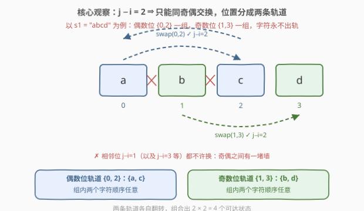
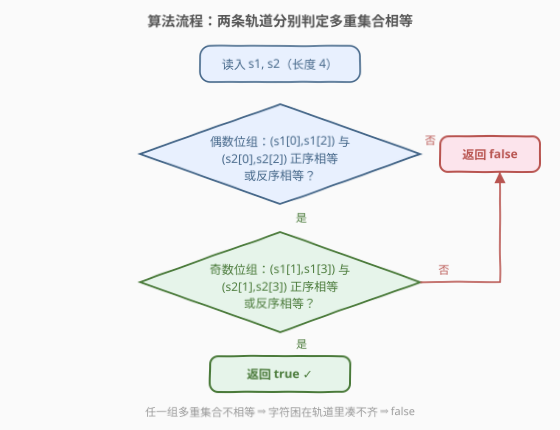
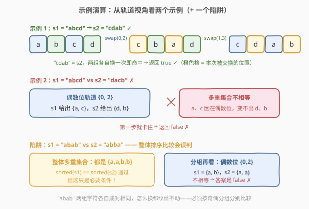

# 判断通过操作能否让字符串相等 I

- **题目名称**：判断通过操作能否让字符串相等 I
- **链接**：[2839. 判断通过操作能否让字符串相等 I](https://leetcode.cn/problems/check-if-strings-can-be-made-equal-with-operations-i/)
- **难度**：简单
- **标签**：字符串、哈希表

## 1. 题目概述

给你两个字符串 `s1` 和 `s2`，两个字符串的长度都为 `4`，且只包含**小写**英文字母。

你可以对两个字符串中的**任意一个**执行以下操作**任意**次：

- 选择两个下标 `i` 和 `j` 且满足 `j - i = 2`，然后**交换**这个字符串中两个下标对应的字符。

如果你可以让字符串 `s1` 和 `s2` 相等，那么返回 `true`，否则返回 `false`。

**示例 1**：

```text
输入：s1 = "abcd", s2 = "cdab"
输出：true
解释：我们可以对 s1 执行以下操作：
- 选择下标 i = 0 ，j = 2 ，得到字符串 s1 = "cbad" 。
- 选择下标 i = 1 ，j = 3 ，得到字符串 s1 = "cdab" = s2 。
```

**示例 2**：

```text
输入：s1 = "abcd", s2 = "dacb"
输出：false
解释：无法让两个字符串相等。
```

**约束条件**：

- $s1.length == s2.length == 4$
- $s1$ 和 $s2$ 只包含小写英文字母。

> 💡 本题核心是「**奇偶位置的置换轨道**」。关键词「$j - i = 2$」「长度为 4」「交换任意次」——$j-i=2$ 是**偶数差**，意味着交换只能在**同奇偶**的下标之间发生；长度为 4 时合法下标对只有 $(0,2)$ 和 $(1,3)$ 两组。把这条限制推到底，答案就是一个 $O(1)$ 的分组比较。

---

## 2. 解题思路

### 2.1 暴力思路：枚举所有可达状态

先老老实实问一句：对 `s1`（或 `s2`）折腾任意次操作，**到底能变出多少种样子**？

长度为 4 的字符串里，满足 $j - i = 2$ 的下标对只有两个：$(0, 2)$ 和 $(1, 3)$（官方 hints 也点明了「只有 2 种不同的交换」）。每一对交换都是一个**对合**——交换两次等于没换。所以从 `s1` 出发可达的状态至多是：

$$\{\,s_1,\quad s_1 \circ (0\,2),\quad s_1 \circ (1\,3),\quad s_1 \circ (0\,2)(1\,3)\,\}$$

至多 **4 种**。暴力做法就是把这 4 个状态全列出来，看 `s2` 在不在里面。时间 $O(1)$（常数次长度为 4 的字符串比较），写成代码就是一个两层循环套 `swap`。

> ⚠️ 这个暴力版完全够用（毕竟只有 4 个状态），但它把正确性藏在「枚举恰好不重不漏」里。能不能不枚举、直接**判定**？这正是 2.2 要做的结构性观察——而且这个观察能无缝泛化到长度为 $n$ 的姊妹题 2840。

### 2.2 核心观察：奇偶位置分成两个独立轨道

**观察 1：交换被锁死在同奇偶下标之间。**

$j - i = 2$ 是偶数，故 $i$ 与 $j$ **模 2 同余**——偶数位永远只能和偶数位换，奇数位永远只能和奇数位换。**字符无法跨越奇偶边界**：一个一开始待在偶数位的字符，无论怎么交换，最终仍待在偶数位。

对长度为 4 的字符串，具体就是：

| 轨道 | 下标集合 | 允许的交换 |
|------|----------|------------|
| **偶数位轨道** | $\{0, 2\}$ | 只能 $(0, 2)$ 互换 |
| **奇数位轨道** | $\{1, 3\}$ | 只能 $(1, 3)$ 互换 |



用群论的语言：操作生成一个位置置换群 $G = \{e,\ (0\,2),\ (1\,3),\ (0\,2)(1\,3)\} \cong \mathbb{Z}_2 \times \mathbb{Z}_2$（Klein 四元群）。位置在 $G$ 作用下的**轨道**恰好是 $\{0,2\}$ 与 $\{1,3\}$，两条轨道**互不往来**。

**观察 2：轨道内部「无序化」。**

每条轨道只有 2 个位置，组内互换任意次，等价于「这两个字符按原序或互换序出现」——即组内**多重集合（可重集合）不变，顺序任意**。两条轨道独立翻转，组合出 2.1 中的 4 个可达状态。

**于是得到判定条件**：

$$s_1 \text{ 可变为 } s_2 \iff \{s_1[0], s_1[2]\} \overset{\text{多重集合}}{=} \{s_2[0], s_2[2]\} \ \wedge\ \{s_1[1], s_1[3]\} \overset{\text{多重集合}}{=} \{s_2[1], s_2[3]\}$$

两个元素的**多重集合**相等，展开成代码就是「两种排列任一对应相等」：

```text
(a, b) 与 (c, d) 同组可相等 ⟺ (a==c 且 b==d) 或 (a==d 且 b==c)
```

**观察 3：「可以对任意一个字符串操作」并没有更强的能力。**

题目允许对 `s1`、`s2` 中**任一**字符串操作，看似自由度翻倍，实则不然：设对 `s1` 施加了置换 $g \in G$、对 `s2` 施加了 $h \in G$ 后两者相等，即 $s_1 \circ g = s_2 \circ h$。由于 $G$ 是**交换群**且每个元素**自逆**（$h^{-1} = h$），两边右乘 $h$ 得 $s_1 \circ (gh) = s_2$——也就是说 `s2` 仍在「只动 `s1`」的可达集合里。双侧操作与单侧操作**判定结果完全一致**。

> ⚠️ 最常见的错误是「整体排序后比较」：`sorted(s1) == sorted(s2)` 是**必要不充分**条件。反例：`s1 = "abab"`，`s2 = "abba"`——两者排序后都是 `aabb`，但偶数位组分别是 $\{a,b\}$ 与 $\{a,a\}$，不相等，答案为 `false`。事实上 `"abab"` 两组字符各自成对相同（$a \leftrightarrow a$、$b \leftrightarrow b$），怎么换都纹丝不动。**分组比较不可省略**。

### 2.3 算法流程图



**完整步骤**：

1. **检查偶数位组** $(0, 2)$：`s1` 的 $(s_1[0], s_1[2])$ 与 `s2` 的 $(s_2[0], s_2[2])$ 是否满足「正序相等或反序相等」；不满足直接返回 `false`
2. **检查奇数位组** $(1, 3)$：同法比较 $(s_1[1], s_1[3])$ 与 $(s_2[1], s_2[3])$；不满足返回 `false`
3. **两组都通过**，返回 `true`

### 2.4 示例演算

以示例 1 $s_1 = $ `"abcd"`、$s_2 = $ `"cdab"` 为例，按轨道分组比较：



| 轨道 | $s_1$ 的字符 | $s_2$ 的字符 | 多重集合比较 | 结果 |
|------|--------------|--------------|--------------|------|
| 偶数位 $\{0, 2\}$ | $\{a, c\}$ | $\{c, a\}$ | 相等 ✓ | 组内换一次即可 |
| 奇数位 $\{1, 3\}$ | $\{b, d\}$ | $\{d, b\}$ | 相等 ✓ | 组内换一次即可 |

两组全部通过 → `true`。具体操作路径与题面一致：`"abcd"` 交换 $(0,2)$ 得 `"cbad"`，再交换 $(1,3)$ 得 `"cdab"`。

再看示例 2 $s_1 = $ `"abcd"`、$s_2 = $ `"dacb"`：

| 轨道 | $s_1$ 的字符 | $s_2$ 的字符 | 多重集合比较 | 结果 |
|------|--------------|--------------|--------------|------|
| 偶数位 $\{0, 2\}$ | $\{a, c\}$ | $\{d, b\}$ | 不相等 ✗ | 返回 `false` |

偶数位第一步就卡住（`a`、`c` 困在偶数位，永远变不成 `d`、`b`）→ `false`。

---

## 3. 参考代码

### C++

```cpp
class Solution {
public:
    bool canBeEqual(string s1, string s2) {
        // 两元素多重集合相等：正序相等 或 反序相等
        auto pairEq = [](char a, char b, char c, char d) {
            return (a == c && b == d) || (a == d && b == c);
        };
        return pairEq(s1[0], s1[2], s2[0], s2[2]) &&   // 偶数位轨道 {0,2}
               pairEq(s1[1], s1[3], s2[1], s2[3]);     // 奇数位轨道 {1,3}
    }
};
```

### Python

```python
class Solution:
    def canBeEqual(self, s1: str, s2: str) -> bool:
        def pair_eq(a, b, c, d):
            # 两元素多重集合相等：正序相等 或 反序相等
            return (a == c and b == d) or (a == d and b == c)
        return pair_eq(s1[0], s1[2], s2[0], s2[2]) and \
               pair_eq(s1[1], s1[3], s2[1], s2[3])
```

> 💡 Python 还可以写成一行**分组排序**：`sorted(s1[::2]) == sorted(s2[::2]) and sorted(s1[1::2]) == sorted(s2[1::2])`。`s[::2]` 切片取出全部偶数位、`s[1::2]` 取出全部奇数位，排序后比较即「多重集合相等」的直接翻译——这个写法的好处是**天然泛化到长度为 $n$ 的 2840 题**。

---

## 4. 复杂度分析

| 维度 | 复杂度 | 说明 |
|------|--------|------|
| **时间复杂度** | $O(1)$ | 长度固定为 4，仅常数次字符比较 |
| **空间复杂度** | $O(1)$ | 仅使用常数个变量（分组排序版为 $O(1)$，$n$ 固定） |

> ⚠️ 扩展思考：若字符串长度放大到 $n$（即 2840 题），分组排序版为 $O(n \log n)$、分组计数版为 $O(n)$，见下节。

---

## 5. 扩展：长度为 n 的泛化（2840 题）

把长度限制放开到 $n$ 后，合法下标对变成 $(0,2), (1,3), (2,4), \dots$——仍然是「只换同奇偶位」。此时奇偶轨道从「2 个位置」扩张成「一整条同奇偶链」，而链上**相邻可换**（$(i, i+2)$ 在同奇偶子序列里恰是相邻位置）意味着：**相邻对换可以生成轨道内部的任意排列**。

于是判定条件升级为：

$$\text{sorted}\big(s_1[\text{偶数位}]\big) = \text{sorted}\big(s_2[\text{偶数位}]\big) \ \wedge\ \text{sorted}\big(s_1[\text{奇数位}]\big) = \text{sorted}\big(s_2[\text{奇数位}]\big)$$

```python
class Solution:
    def canBeEqual(self, s1: str, s2: str) -> bool:
        return sorted(s1[::2]) == sorted(s2[::2]) and \
               sorted(s1[1::2]) == sorted(s2[1::2])
```

对应 2839 的 $n = 4$ 特例，两组各至多 2 个字符，「排序」退化为「两种顺序任选其一」，与 2.2 的判定完全一致。

回到本题规模，也补一版 2.1 的**暴力枚举**作交叉验证（两组各自「换 / 不换」，共 $2 \times 2 = 4$ 个状态）：

```cpp
class Solution {
public:
    bool canBeEqual(string s1, string s2) {
        for (int a = 0; a < 2; a++) {          // 是否交换 (0,2)
            for (int b = 0; b < 2; b++) {      // 是否交换 (1,3)
                string t = s1;
                if (a) swap(t[0], t[2]);
                if (b) swap(t[1], t[3]);
                if (t == s2) return true;
            }
        }
        return false;
    }
};
```

两种写法在全部小写字符串对上结果一致（可达状态本就只有那 4 个，枚举必然不重不漏）。

---

## 6. 面试要点

1. **为什么交换只能发生在同奇偶下标之间？**

   - $j - i = 2$ 是偶数差，故 $i \equiv j \pmod 2$。位置按奇偶分成两条**轨道**（$\{0,2\}$ 与 $\{1,3\}$），字符在轨道内流动、永不出轨。这是「限制条件 → 不变量」的标准提炼：**奇偶性是操作保持的不变量**。

2. **「可以对任意一个字符串操作」会带来更强的能力吗？**

   - 不会。操作生成的置换群 $G$ 是交换群且每个元素自逆，$s_1 \circ g = s_2 \circ h \Rightarrow s_2 = s_1 \circ (gh)$，双侧操作可达的相等关系与只动一边完全等价。面试中主动指出这一点是加分项。

3. **直接 `sorted(s1) == sorted(s2)` 判整体字符多重集，为什么错？**

   - 整体相等只是**必要条件**。反例 `s1 = "abab"`、`s2 = "abba"`：整体都是 $\{a,a,b,b\}$，但偶数位组分别为 $\{a,b\}$ 与 $\{a,a\}$，不可达。必须**按奇偶分组分别**比较多重集合。

4. **泛化到长度 $n$（2840 题）判定条件如何变化？**

   - 同奇偶下标链上相邻可换，相邻对换生成全排列，所以每条轨道内部可达**任意排列**——条件仍是「偶数位多重集合相等 ∧ 奇数位多重集合相等」，只是比较从 2 元素升到 $O(n)$，用排序或计数实现。

5. **本题的通用方法论是什么？**

   - 「操作任意次问可达性」类问题的套路：**找出操作的不变量（不变量给必要性）+ 论证轨道内可达任意状态（给充分性）**。本题不变量是奇偶分组的多重集合，轨道内由对合翻转（$n=4$）或相邻对换（$n$ 任意）保证可达。同样的框架出现在 765 情侣牵手（置换环）、773 滑动谜题（BFS 状态空间）中。

> 💡 **一句话总结**：$j-i=2$ 把 4 个位置劈成奇偶两条老死不相往来的轨道，每条轨道内两个字符可随意换序——两组**多重集合**分别相等即 `true`，$O(1)$ 判定收工。

---

## 7. 同类练习题

- [2840. 判断通过操作能否让字符串相等 II](https://leetcode.cn/problems/check-if-strings-can-be-made-equal-with-operations-ii/)：本题的长度 $n$ 泛化版，轨道内「相邻对换生成任意排列」，判定条件升级为奇偶位分组排序比较
- [765. 情侣牵手](https://leetcode.cn/problems/couples-holding-hands/)（[题解](../0701-0800/765_情侣牵手.md)）：同为「交换操作下的可达性/最少操作数」，用置换环结构刻画谁和谁必须归位
- [773. 滑动谜题](https://leetcode.cn/problems/sliding-puzzle/)（[题解](../0701-0800/773_滑动谜题.md)）：状态空间 BFS 判可达并求最小步数，是 2.1 暴力枚举思路的系统化版本
- [854. 相似度为 K 的字符串](https://leetcode.cn/problems/k-similar-strings/)（[题解](../0801-0900/854_相似度为K的字符串.md)）：交换任意两位让两串相等的最少次数，「交换可达性」从判定升级为求最优路径
- [1528. 重新排列字符串](https://leetcode.cn/problems/shuffle-string/)：按目标下标精确安放字符，「位置 ↔ 字符」映射视角的对照题
