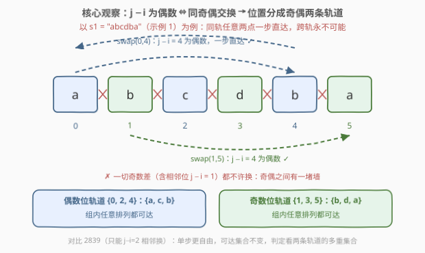
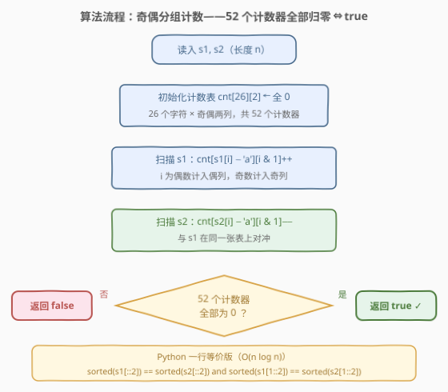
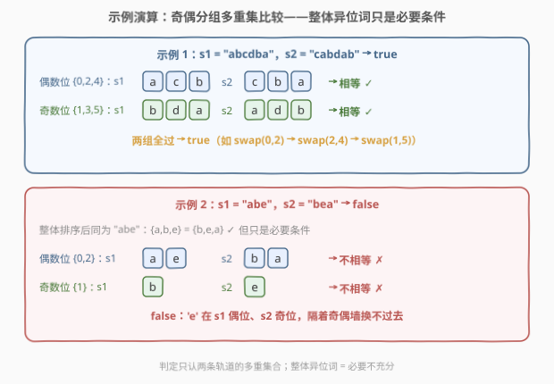

# 判断通过操作能否让字符串相等 II

- **题目名称**：判断通过操作能否让字符串相等 II
- **链接**：[2840. 判断通过操作能否让字符串相等 II](https://leetcode.cn/problems/check-if-strings-can-be-made-equal-with-operations-ii/)
- **难度**：中等
- **标签**：哈希表、字符串、排序

## 1. 题目概述

给你两个字符串 `s1` 和 `s2`，两个字符串长度都为 `n`，且只包含**小写**英文字母。

你可以对两个字符串中的**任意一个**执行以下操作**任意**次：

- 选择两个下标 `i` 和 `j`，满足 `i < j` 且 `j - i` 是**偶数**，然后**交换**这个字符串中两个下标对应的字符。

如果你可以让字符串 `s1` 和 `s2` 相等，那么返回 `true`，否则返回 `false`。

**示例 1**：

```text
输入：s1 = "abcdba", s2 = "cabdab"
输出：true
解释：我们可以对 s1 执行以下操作：
- 选择下标 i = 0 ，j = 2 ，得到字符串 s1 = "cbadba" 。
- 选择下标 i = 2 ，j = 4 ，得到字符串 s1 = "cbbdaa" 。
- 选择下标 i = 1 ，j = 5 ，得到字符串 s1 = "cabdab" = s2 。
```

**示例 2**：

```text
输入：s1 = "abe", s2 = "bea"
输出：false
解释：无法让两个字符串相等。
```

**约束条件**：

- $n == s1.length == s2.length$
- $1 \le n \le 10^5$
- `s1` 和 `s2` 只包含小写英文字母。

> 💡 本题是 [2839. 判断通过操作能否让字符串相等 I](<./2839_判断通过操作能否让字符串相等 I.md>) 的规模放大版：交换条件从固定的 $j - i = 2$ 放宽为**任意偶数差**，长度从 $4$ 放大到 $10^5$。关键词「$j - i$ 是偶数」「任意次」——偶数差意味着交换只能发生在**同奇偶**的下标之间；而 $n \le 10^5$ 宣告了 2839 那种「枚举全部可达状态」的暴力彻底失效（可达状态数是阶乘级），必须把「可达性」压缩成一个 $O(n)$ 的**不变量判定**。

---

## 2. 解题思路

### 2.1 暴力思路：为什么枚举彻底失效

「操作任意次问可达性」最朴素的做法是把 `s1` 能变出的所有字符串全部生成（BFS + 访问集合），再看 `s2` 在不在里面。2839 里 $n = 4$、合法交换只有两对，可达状态满打满算 4 个，枚举绰绰有余；本题 $n \le 10^5$：

- 偶数位轨道内有 $\lceil n/2 \rceil$ 个位置、奇数位轨道内有 $\lfloor n/2 \rfloor$ 个位置，两轨独立重排，可达状态数最高约 $\lceil n/2 \rceil! \times \lfloor n/2 \rfloor!$——$n = 40$ 时就已约 $6 \times 10^{36}$，$n = 10^5$ 时是天文数字；
- 每生成一个状态还要 $O(n)$ 的拷贝与哈希。

枚举路线在 $n$ 上是**阶乘级爆炸**，必须换思路：不再问「能变出哪些串」，而是问「**无论怎么变，什么永远不变；该变的，是否都能变到**」——即找**操作不变量**（给必要性）+ 论证**轨道内可达任意排列**（给充分性），把可达性压缩成多重集合比较。

另一条想当然的捷径是「整体判异位词」：`sorted(s1) == sorted(s2)`。它是**必要不充分**条件——示例 2 中 `s1 = "abe"`、`s2 = "bea"` 排序后同为 `"abe"`，答案却是 `false`。缺的那一环正是奇偶分组，见下。

### 2.2 核心观察：奇偶双轨，轨内全排列



**观察 1（不变量 → 必要性）：交换被锁死在同奇偶下标之间。**

$j - i$ 是偶数 $\iff i \equiv j \pmod 2$——偶数位只能与偶数位换，奇数位只能与奇数位换。**字符的「奇偶籍贯」终身不变**：初始在偶数位的字符无论怎么折腾，最终仍停在某个偶数位。于是每条轨道上的**字符多重集合**是操作不变量，可达的必要条件为（记 $s[0::2]$ 为偶数位字符子列、$s[1::2]$ 为奇数位字符子列，即 Python 切片记号）：

$$\operatorname{sorted}\big(s_1[0::2]\big) = \operatorname{sorted}\big(s_2[0::2]\big) \ \wedge\ \operatorname{sorted}\big(s_1[1::2]\big) = \operatorname{sorted}\big(s_2[1::2]\big)$$

**观察 2（轨内全排列 → 充分性）：同轨任意两点一步直达。**

本题允许**任意**偶数差：偶数位轨道里 $0$ 和 $4$（差为 $4$）、$0$ 和 $100$（差为 $100$）都能**一次**互换——轨道内**全体对换**均合法。而对换是排列的原子，任何目标排列都能用「选择排序」显式构造：依次处理每个位置，若当前位置不是目标字符，就从后方找到目标字符所在位置、一次对换换过来，每一步的两端都在同一轨道内，合法。因此**轨道内可达任意排列**，两条多重集合相等时一定能把两串各自重排成完全相同的子列。

> ⚠️ 对比 2839（$j - i = 2$）：那里同轨只有**相邻**位置能换，但冒泡式的相邻对换链同样生成轨道内全排列——两题的**可达集合完全相同、判定条件同构**。II 的单步交换能力更强（$0 \leftrightarrow 4$ 一步直达，无需中转），真正被放大的只是 $n$：把 $O(1)$ 的两元素比较，逼成 $O(n)$ 的分组多重集比较。

**观察 3（「对任意一个字符串操作」没有额外能力）。**

设终态为 $t$：$s_1$ 侧与 $s_2$ 侧各自操作若干次后都变成 $t$。$t$ 的偶位多重集必须同时等于 $s_1$ 的偶位多重集（$s_1$ 侧操作保持不变）与 $s_2$ 的偶位多重集（$s_2$ 侧操作保持不变），故「两串偶位多重集相等」仍是硬性必要条件，奇位同理。反过来该条件又充分：由观察 2，把两串各自重排成「轨内升序」的同一规范串即可。双侧操作与只动一边，判定结果一致。

综合三个观察：

$$s_1 \text{ 可变为 } s_2 \iff \text{偶位多重集相等} \ \wedge\ \text{奇位多重集相等}$$

### 2.3 算法流程图



判定条件的直接翻译是**分组排序比较**；更快的实现是**分组计数**——`cnt[26][2]`（26 个字符 × 奇偶两列，共 52 个计数器）：

1. **扫描 s1**：每个下标 $i$ 执行 `cnt[s1[i] - 'a'][i & 1]++`；
2. **扫描 s2**：每个下标 $i$ 执行 `cnt[s2[i] - 'a'][i & 1]--`；
3. **判定**：52 个计数器**全为 0** ⇔ 两条轨道的多重集合都相等 → `true`；否则 `false`。

### 2.4 示例演算



以示例 1 $s_1 = $ `"abcdba"`、$s_2 = $ `"cabdab"` 为例：

| 轨道 | $s_1$ 的字符 | $s_2$ 的字符 | 多重集合比较 | 结果 |
|------|--------------|--------------|--------------|------|
| 偶数位 $\{0,2,4\}$ | $\{a,c,b\}$ | $\{c,b,a\}$ | 相等 ✓ | 可重排一致 |
| 奇数位 $\{1,3,5\}$ | $\{b,d,a\}$ | $\{a,d,b\}$ | 相等 ✓ | 可重排一致 |

两组全过 → `true`。操作路径与题面一致：`"abcdba"` 经 $(0,2)$、$(2,4)$、$(1,5)$ 三次交换变为 `"cabdab"`。

再看示例 2 $s_1 = $ `"abe"`、$s_2 = $ `"bea"`：

| 轨道 | $s_1$ 的字符 | $s_2$ 的字符 | 多重集合比较 | 结果 |
|------|--------------|--------------|--------------|------|
| 整体 | $\{a,b,e\}$ | $\{b,e,a\}$ | 相等 ✓ | 只是必要条件 |
| 偶数位 $\{0,2\}$ | $\{a,e\}$ | $\{b,a\}$ | **不相等 ✗** | 返回 `false` |

整体是异位词，但 $s_1$ 偶位困着 $\{a,e\}$、$s_2$ 偶位是 $\{a,b\}$——`e` 与 `b` 隔着奇偶之墙永换不过去 → `false`。

---

## 3. 参考代码

### C++

```cpp
class Solution {
public:
    bool checkStrings(string s1, string s2) {
        int cnt[26][2] = {};
        for (int i = 0; i < (int)s1.size(); i++) cnt[s1[i] - 'a'][i & 1]++;
        for (int i = 0; i < (int)s2.size(); i++) cnt[s2[i] - 'a'][i & 1]--;
        for (int c = 0; c < 26; c++)
            if (cnt[c][0] != 0 || cnt[c][1] != 0) return false;
        return true;
    }
};
```

### Python

```python
class Solution:
    def checkStrings(self, s1: str, s2: str) -> bool:
        return sorted(s1[::2]) == sorted(s2[::2]) and \
               sorted(s1[1::2]) == sorted(s2[1::2])
```

> 💡 切片 `s[::2]` / `s[1::2]` 取出偶/奇位子列，排序后比较正是 2.2 判定条件的直译。若追求严格线性，用 `Counter` 对 `(字符, 奇偶)` 二元组计数相减即可：

```python
from collections import Counter

class Solution:
    def checkStrings(self, s1: str, s2: str) -> bool:
        freq = Counter((c, i & 1) for i, c in enumerate(s1))
        freq.subtract((c, i & 1) for i, c in enumerate(s2))
        return not any(freq.values())
```

---

## 4. 复杂度分析

| 维度 | 复杂度 | 说明 |
|------|--------|------|
| 时间复杂度 | $O(n)$ | 计数版：两次线性扫描 + 52 个常数计数器检查；切片排序版为 $O(n \log n)$ |
| 空间复杂度 | $O(1)$ | 计数版仅 52 个整数；切片排序版需 $O(n)$ 存两条子列的副本 |

> 💡 $n \le 10^5$ 下两种写法都轻松通过（排序版约 $10^5 \times 17 \approx 1.7 \times 10^6$ 次比较）。计数版胜在严格线性 + 常数空间，是 C++ 的自然选择；切片排序版胜在一行直译判定条件，是 Python 的惯用表达。

---

## 5. 扩展：与 2839 对照，以及「墙」的另一种拆法

**I / II 对照**：

| 维度 | 2839（I） | 2840（II） |
|------|-----------|------------|
| 交换条件 | $j - i = 2$（固定距离） | $j - i$ 为任意偶数 |
| 单步能力 | 轨内**相邻**对换 | 轨内**任意**对换，一步直达 |
| 可达集合 | 轨内全排列（相邻对换链式生成） | 轨内全排列（任意对换直接生成） |
| 判定条件 | 奇偶分组多重集相等（每组至多 2 元素） | 奇偶分组多重集相等（每组至多 $n/2$ 元素） |
| 复杂度 | $O(1)$ | $O(n)$（计数）/ $O(n \log n)$（排序） |

两题判定条件**同构**：单步交换能力的放宽并没有扩大可达集合——「相邻对换生成对称群」与「全体对换生成对称群」殊途同归。被放大的只是规模，以及「必须想到不变量」的紧迫性。

**变体思考：若操作改成 $j - i$ 为奇数呢？** 相邻位 $(i, i+1)$ 的差恰为 $1$（奇数），全部合法——而相邻对换生成整个 $S_n$，任何字符可以游走到任何位置，奇偶墙不复存在。此时判定退化为 `sorted(s1) == sorted(s2)`（整体异位词，即 242 题）。可见**奇偶这堵墙正是本题非平凡性的全部来源**：墙内自由，墙外绝缘。

> 💡 方法论：「操作任意次问可达性」= **不变量给必要条件 + 轨道结构给充分性**。同一框架下的经典题：765 情侣牵手（置换环）、1657 确定两个字符串是否接近（操作保持的频数不变量）、773 滑动谜题（状态空间 BFS）。

---

## 6. 面试要点

1. **为什么交换只能发生在同奇偶下标之间？**

   > $j - i$ 为偶数 $\iff i \equiv j \pmod 2$。位置按奇偶分成两条**轨道**，字符在轨内流动、永不出轨。**奇偶分组的多重集合是操作不变量**——这是必要性的来源。

2. **为什么轨道内「任意排列」都可达？**

   > 本题允许任意偶数差，轨道内任何两个位置都能**一步**互换；全体对换生成对称群，选择排序即为显式构造。即使像 2839 只允许 $j - i = 2$，冒泡式的相邻对换同样生成全排列——两题判定条件同构。

3. **`sorted(s1) == sorted(s2)` 为什么不对？**

   > 整体多重集相等只是**必要条件**。反例 `s1 = "abe"`、`s2 = "bea"`：整体都是 $\{a,b,e\}$，但偶位组分别是 $\{a,e\}$ 与 $\{a,b\}$，不可达。必须**按奇偶分组分别**比较多重集合。

4. **「可以对任意一个字符串操作」会更强吗？**

   > 不会。终态的偶位多重集必须同时等于两串各自的偶位多重集，故「两串偶位多重集相等」仍是硬必要条件；结合轨内全排列又充分。双侧操作与单侧操作的判定结果一致（2839 里还可以用「交换群 + 元素自逆」的代数论证）。

5. **计数与排序两种实现如何取舍？**

   > 计数版 $O(n)$ 时间、52 个整数的 $O(1)$ 空间；排序版 $O(n \log n)$ 时间、$O(n)$ 空间，但一行直译判定条件。面试可先写排序版把语义立住，再主动优化为计数版，展示「先正确后优化」的分层思维。

> 💡 **一句话总结**：偶数差把 $n$ 个位置劈成奇偶两条互不相通的轨道，每条轨道内部可任意重排——**两组多重集合分别相等**即 `true`，一次 $O(n)$ 分组计数收工。

---

## 7. 同类练习题

- [2839. 判断通过操作能否让字符串相等 I](https://leetcode.cn/problems/check-if-strings-can-be-made-equal-with-operations-i/)（[题解](<./2839_判断通过操作能否让字符串相等 I.md>)）：本题 $n=4$、$j-i=2$ 的前作，判定条件同构，枚举 4 个状态的暴力甜区
- [242. 有效的字母异位词](https://leetcode.cn/problems/valid-anagram/)（[题解](../0201-0300/242_有效的字母异位词.md)）：无轨道限制的多重集判等基线——拆掉奇偶墙，本题就退化成它
- [1657. 确定两个字符串是否接近](https://leetcode.cn/problems/determine-if-two-strings-are-close/)（[题解](../1601-1700/1657_确定两个字符串是否接近.md)）：同为「操作不变量 + 轨道可达性」刻画相等可达性
- [1347. 制造字母异位词的最小步骤数](https://leetcode.cn/problems/minimum-number-of-steps-to-make-two-strings-anagram/)（[题解](../1301-1400/1347_制造字母异位词的最小步骤数.md)）：分组计数的差值不再是判零而是求和，从判定升级为最小操作数
- [859. 亲密字符串](https://leetcode.cn/problems/buddy-strings/)（[题解](../0801-0900/859_亲密字符串.md)）：恰好一次交换的判等，边界情况丰富，交换类判定的入门对照
