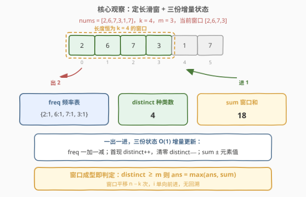
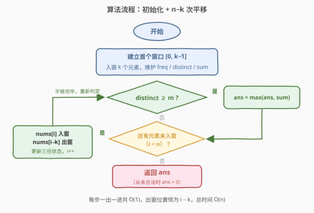
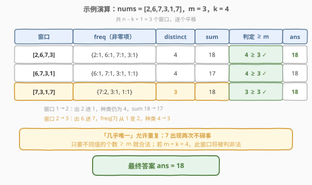

# 几乎唯一子数组的最大和

- **题目名称**：几乎唯一子数组的最大和
- **链接**：[2841. 几乎唯一子数组的最大和](https://leetcode.cn/problems/maximum-sum-of-almost-unique-subarray/)
- **难度**：中等
- **标签**：数组、哈希表、滑动窗口

## 1. 题目概述

给你一个整数数组 `nums` 和两个正整数 `m` 和 `k`。

请你返回 `nums` 中长度为 `k` 的**几乎唯一**子数组的**最大和**，如果不存在几乎唯一子数组，请你返回 `0`。

如果 `nums` 的一个子数组有至少 `m` 个互不相同的元素，我们称它是**几乎唯一**子数组。

**子数组**指的是一个数组中一段连续**非空**的元素序列。

**示例 1**：

```text
输入：nums = [2,6,7,3,1,7], m = 3, k = 4
输出：18
解释：总共 3 个长度为 k = 4 的几乎唯一子数组，分别为 [2,6,7,3]、[6,7,3,1] 和 [7,3,1,7]。
     这些子数组中，和最大的是 [2,6,7,3]，和为 18。
```

**示例 2**：

```text
输入：nums = [5,9,9,2,4,5,4], m = 1, k = 3
输出：23
解释：总共 5 个长度为 k = 3 的几乎唯一子数组，分别为 [5,9,9]、[9,9,2]、[9,2,4]、[2,4,5] 和 [4,5,4]。
     这些子数组中，和最大的是 [5,9,9]，和为 23。
```

**示例 3**：

```text
输入：nums = [1,2,1,2,1,2,1], m = 3, k = 3
输出：0
解释：不存在长度为 k = 3 且含至少 m = 3 个互不相同元素的子数组，所以不存在几乎唯一子数组，返回 0。
```

**约束条件**：

- $1 \le \text{nums.length} \le 2 \times 10^4$
- $1 \le m \le k \le \text{nums.length}$
- $1 \le \text{nums[i]} \le 10^9$

> 💡 「长度为 $k$」与「至少 $m$ 个互不相同元素」两个条件分别决定了**定长滑动窗口**与**频率哈希表 + 种类计数器**，再加上窗口和的增量维护，三份状态都是一出一进 $O(1)$ 更新，整体单趟 $O(n)$。本题是 [2461. 长度为 K 子数组中的最大和](../2401-2500/2461_长度为K子数组中的最大和.md) 的直接推广——把「完全唯一」（$m = k$）放宽为「几乎唯一」（$m \le k$）。

---

## 2. 解题思路

### 2.1 暴力思路：枚举窗口 + 集合判重

枚举全部 $n - k + 1$ 个长度为 $k$ 的窗口，对每个窗口用哈希集合统计互不相同元素的个数，对合法窗口求和并取最大：

```text
ans = 0
for left in 0..n−k:
    window = nums[left : left+k]
    if len(set(window)) >= m:          # O(k) 判重
        ans = max(ans, sum(window))    # O(k) 求和
return ans
```

正确性显然，但时间是 $O(n \cdot k)$：$n = 2 \times 10^4$、$k \approx n/2$ 时约 $2 \times 10^8$ 次元素操作，会超时。

> ⚠️ 暴力的浪费与所有滑窗题如出一辙：**相邻窗口只差「一个出、一个进」**，集合与和却每次从头重建。定长窗口没有「扩张-收缩」的博弈，是最适合增量维护的形态。

### 2.2 核心观察：定长滑窗 + 频率表 + 种类计数器



维护长度恒为 $k$ 的窗口，同步维护三份状态：

| 状态 | 含义 | 入窗更新 | 出窗更新 |
|------|------|----------|----------|
| `freq[x]` | 值 $x$ 在窗口内的出现次数 | `freq[x]++` | `freq[x]−−` |
| `distinct` | 窗口内互不相同元素的个数 | `freq[x]` 从 $0 \to 1$ 时 `distinct++` | `freq[x]` 从 $1 \to 0$ 时 `distinct−−` |
| `sum` | 窗口内元素之和 | `sum += x` | `sum −= x` |

窗口每右移一格恰好**一出一进**两个元素，三份状态各做 $O(1)$ 更新。窗口成型后判定：**`distinct >= m` 则用 `sum` 刷新答案**。

> 💡 `distinct` 不必每步遍历 `freq` 数非零项（那是 $O(k)$），只需盯着「频次跨越 $0/1$ 边界」的事件：新值**首现**时种类 $+1$，旧值**清零**时种类 $-1$。这是「维护种类数」类滑窗（如 904 水果成篮、159/340 至多 K 种字符）的通用手法。

### 2.3 算法流程图



整个算法只有「初始化 + $n - k$ 次平移」两段：`i` 单向前进，出窗位置永远是 `i − k`，无需显式维护 `left` 指针，更没有回溯。

### 2.4 示例演算

以示例 1 `nums = [2,6,7,3,1,7], m = 3, k = 4` 为例，共 3 个窗口：



三步演算的关键点：

- 初始窗口 $[2,6,7,3]$：4 个值互不相同，$4 \ge 3$ 合法，$\text{ans} = 18$。
- 平移一次（2 出、1 进）：仍是 4 种，$\text{sum} = 17 < 18$，答案不变。
- 再平移（6 出、7 进）：**7 第二次出现**，`freq[7]` 从 1 变 2，`distinct` 降到 3——恰好等于 $m$ 依然合法，$\text{sum} = 18$ 追平答案。

> ⚠️ 第三个窗口正是「几乎唯一」与「完全唯一」的分野：7 重复了。若本题是 $m = k = 4$（即 2461），该窗口将被判非法；本题只要求不同值的个数 $\ge m$，判定条件是 $\ge m$ 而非 $= k$——这也是两题代码的唯一差别。

---

## 3. 参考代码

### C++

```cpp
class Solution {
public:
    long long maxSum(vector<int>& nums, int m, int k) {
        int n = nums.size();
        unordered_map<int, int> freq;   // 值 -> 窗口内出现次数
        long long sum = 0;              // 窗口和，最大 2e4 * 1e9 = 2e13，必须 long long
        int distinct = 0;               // 窗口内互不相同元素的个数

        for (int i = 0; i < k; i++) {   // 建立首个窗口 [0, k-1]
            sum += nums[i];
            if (freq[nums[i]]++ == 0) distinct++;
        }
        long long ans = distinct >= m ? sum : 0;

        for (int i = k; i < n; i++) {   // 平移窗口：一出一进
            sum += nums[i] - nums[i - k];
            if (freq[nums[i]]++ == 0) distinct++;     // 新值首现，种类 +1
            if (--freq[nums[i - k]] == 0) distinct--; // 旧值清零，种类 -1
            if (distinct >= m) ans = max(ans, sum);
        }
        return ans;
    }
};
```

### Python

```python
class Solution:
    def maxSum(self, nums: List[int], m: int, k: int) -> int:
        freq = defaultdict(int)     # 值 -> 窗口内出现次数
        window_sum = 0              # 窗口内元素之和
        distinct = 0                # 窗口内互不相同元素的个数

        for i in range(k):          # 建立首个窗口 [0, k-1]
            window_sum += nums[i]
            if freq[nums[i]] == 0:  # 新值首现，种类 +1
                distinct += 1
            freq[nums[i]] += 1

        ans = window_sum if distinct >= m else 0

        for i in range(k, len(nums)):          # 平移窗口：一出一进
            window_sum += nums[i] - nums[i - k]
            if freq[nums[i]] == 0:             # 新值首现，种类 +1
                distinct += 1
            freq[nums[i]] += 1
            freq[nums[i - k]] -= 1
            if freq[nums[i - k]] == 0:         # 旧值清零，种类 -1
                distinct -= 1
            if distinct >= m:
                ans = max(ans, window_sum)
        return ans
```

> ⚠️ 两个易错点：一是 **C++ 必须用 `long long`**——窗口和上限 $2 \times 10^4 \times 10^9 = 2 \times 10^{13}$，超出 `int` 上限近 $10^4$ 倍，`sum`、`ans` 及 `max` 的两个参数都要是 64 位；二是 `distinct` 只在频次**跨越 $0/1$ 边界**时增减（首现 $+1$、清零 $-1$），即使某次「入窗值 = 出窗值」，先加后减或先减后加最终结果都对，但千万别写成每步遍历 `freq` 数非零项——那就退化回 $O(nk)$ 了。

---

## 4. 复杂度分析

| 维度 | 复杂度 | 说明 |
|------|--------|------|
| **时间复杂度** | $O(n)$ | 每个元素各入窗、出窗一次，每次均为 $O(1)$ 哈希操作 |
| **空间复杂度** | $O(k)$ | `freq` 至多存 $k$ 个键（窗口内不同值个数 $\le k$） |

---

## 5. 扩展：m 参数旋钮的两端

`m` 在 $[1, k]$ 内滑动，两端都是退化形态：

- **$m = k$**：「至少 $k$ 个互不相同」$\Leftrightarrow$ 长度为 $k$ 的窗口**全部唯一**，本题退化为 [2461. 长度为 K 子数组中的最大和](../2401-2500/2461_长度为K子数组中的最大和.md)，代码只差把判定换成 `distinct >= k`。
- **$m = 1$**：长度 $k \ge 1$ 的窗口至少含 1 个不同元素，判定恒真，本题退化为「长度为 $k$ 的子数组的最大和」（[643. 子数组最大平均数 I](../0601-0700/643_子数组最大平均数I.md) 的求和版），连 `freq` 都可省去，只留 `sum` 一份状态。

一句话：**「几乎唯一」是「完全唯一」与「不设限」之间的一条旋钮**，2461 与 643 分别是旋到两端时的特例。

---

## 6. 面试要点

1. **为什么用定长滑窗，不需要 while 收缩？**

   - 窗口长度被题目钉死为 $k$，唯一的运动方式是**整体平移**（`right++` 的同时左端同步出窗）。变长窗口（如 3、76）才存在「扩张-收缩」的博弈；定长窗口里左端是 `right` 的从动指针，代码里甚至可以不显式维护 `left`，用 `i − k` 表示出窗位置即可。

2. **`distinct` 怎么 $O(1)$ 维护？直接 `freq.size()` 不行吗？**

   - C++ 的 `unordered_map` 不会自动删除频次为 0 的键，`size()` 会虚高；若坚持用 `size()`，必须在归零时 `erase`。更稳妥的做法是显式维护 `distinct` 计数器，只盯「首现」和「清零」两类边界事件，省一次哈希删除也更直观。

3. **为什么 C++ 会溢出？哪些变量必须 64 位？**

   - $n \le 2 \times 10^4$、$\text{nums}[i] \le 10^9$，窗口和上限 $2 \times 10^{13}$，是 `int32` 上限（约 $2.1 \times 10^9$）的近万倍。返回类型题目已给 `long long`，但局部 `sum`、`ans` 也要跟着用 64 位，且 `max(ans, sum)` 两侧类型须一致。Python 天然大数无此坑。

4. **与 2461 的本质区别是什么？**

   - 仅判定条件不同：2461 要求窗口内 $k$ 个元素**两两不同**（`distinct == k`），本题放宽为**至少 $m$ 个不同**（`distinct >= m`）。数据结构、滑窗骨架、增量维护完全一致——先把 2461 的模板写熟，本题只需改一行判定。

5. **能否用桶数组代替哈希表？**

   - 值域高达 $10^9$，直接开桶不现实；若先离散化（排序 + 去重映射到 $O(n)$）可换 `vector<int>` 计数，把哈希操作换成数组下标访问，常数更小。本题 $n$ 仅 $2 \times 10^4$，哈希足够，不必离散化。

> 💡 **一句话总结**：长度 $k$ 钉死窗口，`freq` + `distinct` 盯住「至少 $m$ 种」，`sum` 增量跟着走——一出一进各 $O(1)$，单趟 $O(n)$ 取最大和。

---

## 7. 同类练习题

- [2461. 长度为 K 子数组中的最大和](../2401-2500/2461_长度为K子数组中的最大和.md)：本题 $m = k$ 的特例（完全唯一），同一套定长滑窗模板
- [643. 子数组最大平均数 I](../0601-0700/643_子数组最大平均数I.md)：本题 $m = 1$ 的特例，最纯净的定长滑窗求和入门
- [2090. 半径为 k 的子数组平均值](../2001-2100/2090_半径为k的子数组平均值.md)：定长 $2k+1$ 滑窗求和变体，练「窗口和 + 边界下标换算」
- [1423. 可获得的最大点数](../1401-1500/1423_可获得的最大点数.md)：定长滑窗取「补集」的经典变形——首尾取 $k$ 张 $\Leftrightarrow$ 中间留一个长度 $n-k$ 的定长窗口求最小和
- [904. 水果成篮](../0901-1000/904_水果成篮.md)：**变长**窗口维护「种类数 ≤ 2」，与本题的定长「种类数 ≥ m」互为镜像
