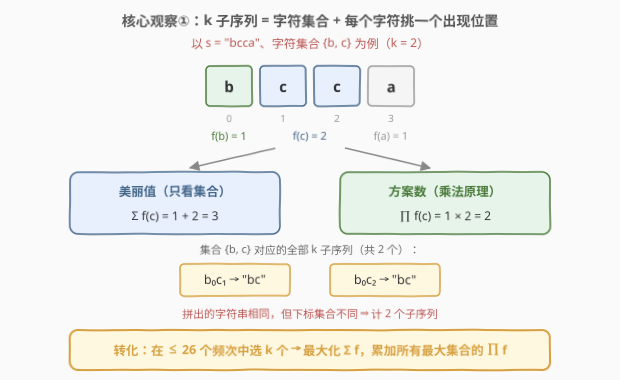
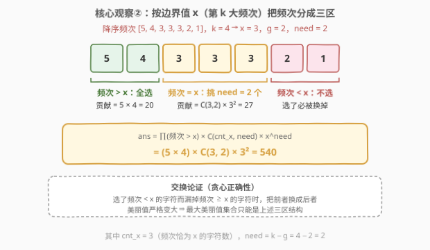
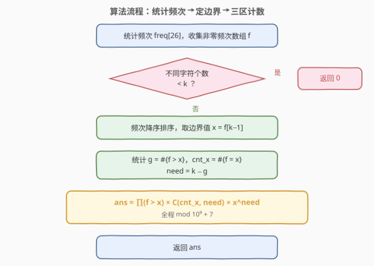
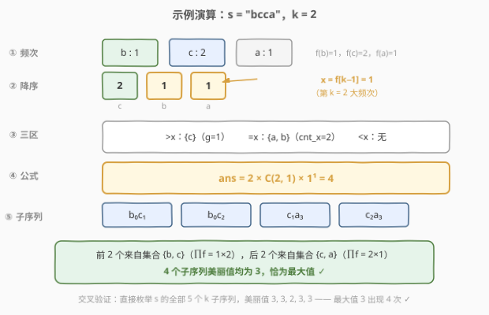

# 统计一个字符串的 k 子序列美丽值最大的数目

- **题目名称**：统计一个字符串的 k 子序列美丽值最大的数目
- **链接**：[2842. 统计一个字符串的 k 子序列美丽值最大的数目](https://leetcode.cn/problems/count-k-subsequences-of-a-string-with-maximum-beauty/)
- **难度**：困难
- **标签**：贪心、哈希表、数学、组合数学、排序、费马小定理

## 1. 题目概述

给你一个字符串 $s$ 和一个整数 $k$。

**k 子序列**指的是 $s$ 的一个长度为 $k$ 的**子序列**，且所有字符都是**唯一**的，即每个字符在子序列里只出现一次。

定义 $f(c)$ 为字符 $c$ 在 $s$ 中出现的次数。k 子序列的**美丽值**定义为这个子序列中每一个字符 $c$ 的 $f(c)$ 之和。

请你返回所有 k 子序列里美丽值是**最大值**的子序列数目。由于答案可能很大，将结果对 $10^9 + 7$ 取余后返回。

> ⚠️ 两个容易踩坑的定义细节：
> - $f(c)$ 统计的是 $c$ 在整个 $s$ 中的出现次数，**不是**在 k 子序列里的出现次数；
> - 两个 k 子序列只要有一个字符在原串中的**下标**不同，就是两个不同的子序列——即使拼出的字符串完全相同。

**示例 1**：

```text
输入：s = "bcca", k = 2
输出：4
解释：s 中 f('a') = 1，f('b') = 1，f('c') = 2。
s 的全部 5 个 k 子序列：
「bc」ca     → b₀c₁，美丽值 f('b') + f('c') = 3
「b」c「c」a  → b₀c₂，美丽值 f('b') + f('c') = 3
「b」cc「a」  → b₀a₃，美丽值 f('b') + f('a') = 2
b「c」c「a」  → c₁a₃，美丽值 f('c') + f('a') = 3
bc「ca」     → c₂a₃，美丽值 f('c') + f('a') = 3
共 4 个 k 子序列美丽值为最大值 3，答案为 4。
```

**示例 2**：

```text
输入：s = "abbcd", k = 4
输出：2
解释：s 中 f('a') = 1，f('b') = 2，f('c') = 1，f('d') = 1。
k = 4 恰好用完全部 4 种字符，位置挑法共 1 × 2 × 1 × 1 = 2 种，
两个子序列美丽值均为 5，答案为 2。
```

**约束条件**：

- $1 \le s.length \le 2 \times 10^5$
- $1 \le k \le s.length$
- $s$ 只包含小写英文字母

> 💡 本题核心是「**贪心定结构 + 组合计数**」，三步走：① k 子序列字符互异 ⇒ 子序列由「字符集合 + 每个字符挑哪个出现位置」唯一决定；② 美丽值只依赖集合 ⇒ 最大美丽值集合必是「频次前 $k$ 大」的贪心结构（交换论证兜底）；③ 对并列的边界频次做组合计数 $\binom{cnt_x}{need} \cdot x^{need}$。全程只和 26 个字母的频次打交道，$O(n + 26\log 26)$ 收工。

---

## 2. 解题思路

### 2.1 暴力思路：从「枚举子序列」到「枚举字符集合」

直接枚举 $s$ 的所有 k 子序列是 $\binom{n}{k}$ 量级，$n \le 2\times 10^5$ 下是天文数字。但「字符互异」这个约束提供了绝佳的简化入口——**每个 k 子序列由两层相互独立的选择唯一决定**：

1. **选哪些字符**：一个大小为 $k$ 的字符集合 $S$（互异性保证每个字符恰好贡献一次）；
2. **每个字符选哪个出现位置**：每个 $c \in S$ 有 $f(c)$ 个出现位置，任选其一。

于是对固定集合 $S$，由乘法原理（且求和与位置选择无关）：

$$\text{方案数}(S) = \prod_{c \in S} f(c), \qquad \text{美丽值}(S) = \sum_{c \in S} f(c)$$



原问题就此转化为纯组合问题：**在至多 26 个非零频次中选 $k$ 个，先最大化 $\sum f$，再把所有达到最大值的集合的 $\prod f$ 加起来。**

> ⚠️ 转化后当然可以暴力枚举全部 $\binom{26}{k}$ 个集合（$k = 13$ 时约 $1.04 \times 10^7$ 个），C++ 勉强能跑、Python 必超时——而且完全没必要：「和最大」的集合结构高度受限，可以直接**计数**而非**枚举**。

### 2.2 核心观察：交换论证锁定结构 + 边界组组合计数

把非零频次降序排列 $f_1 \ge f_2 \ge \cdots \ge f_m$（$m$ 为不同字符数；$m < k$ 时凑不齐 $k$ 个互异字符，直接返回 $0$）。最大美丽值显然是前 $k$ 大之和 $f_1 + \cdots + f_k$；真正的问题是：**哪些集合能达到这个和？**

记边界值 $x = f_k$（第 $k$ 大频次）。由于排序后严格大于 $x$ 的元素只能出现在前 $k-1$ 个位置上，$g = \#\{f_v > x\} \le k - 1$，因此边界组必然存在、$need = k - g \ge 1$。

> **断言**：集合 $S$（$|S| = k$）美丽值最大 $\iff$
> ① $S$ 含**全部** $g$ 个频次 $> x$ 的字符；② $S$ 恰含 $need = k - g$ 个频次 $= x$ 的字符；③ $S$ 不含任何频次 $< x$ 的字符。
>
> **证明（交换论证）**：设 $S$ 在三个区间分别选了 $a, b, c$ 个（$a + b + c = k$），$G$ 为全部频次 $> x$ 字符的频次总和。频次 $< x$ 的字符频次至多 $x - 1$，故
> $$\mathrm{beauty}(S) \le G + b \cdot x + c \cdot (x-1) = G + (k - a) \cdot x - c$$
> 若 $a < g$：$S$ 至少漏掉 $g - a$ 个频次 $\ge x + 1$ 的字符，上界进一步收紧为 $G - (g-a)(x+1) + (k-a)x - c < G + (k-g)x$；若 $a = g$ 但 $c > 0$：上界为 $G + (k-g)x - c < G + (k-g)x$。而「①全选 + ②补足 $need$ 个」恰好取到 $G + (k-g) \cdot x = f_1 + \cdots + f_k$，即上确界。$\blacksquare$

（直观版：**选了低频、漏了高频，交换后必更优**——这正是「贪心」标签的来源。）



结构确定后，计数按三区进行：

| 区间 | 处理 | 贡献 |
|------|------|------|
| 频次 $> x$ | $g$ 个字符全选，每个字符 $f$ 种取位 | $\prod_{f_v > x} f_v$（对所有最大集合相同） |
| 频次 $= x$ | $cnt_x$ 个字符中任挑 $need$ 个 | $\binom{cnt_x}{need} \times x^{need}$ |
| 频次 $< x$ | 一个不选 | $1$ |

$$\text{ans} = \prod_{f_v > x} f_v \times \binom{cnt_x}{need} \times x^{\,need} \pmod{10^9 + 7}$$

> 💡 为什么不能直接「前 $k$ 大频次连乘」？因为并列频次会分裂出多个达到最大美丽值的集合：示例 1 中前 2 大频次连乘 $= 2 \times 1 = 2$，而正确答案 $= 2 \times \binom{2}{1} \times 1^1 = 4$——恰好差一个边界组合因子。只有当 $cnt_x = need$（边界组恰好被整组选完）时才退化为纯连乘。

### 2.3 算法流程图



**完整步骤**：

1. **统计**每个字符出现次数，收集非零频次数组 $f$；
2. **判断**：$|f| < k$（不同字符不足）→ 返回 $0$；
3. **排序**频次降序，取边界值 $x = f_{k-1}$（0 起下标，即第 $k$ 大）；
4. **统计** $g$（频次 $> x$ 的个数）、$cnt_x$（频次 $= x$ 的个数），$need = k - g$；
5. **套公式**：$\text{ans} = \prod_{f_v > x} f_v \times \binom{cnt_x}{need} \times x^{need} \bmod (10^9 + 7)$；
6. **返回** ans。

### 2.4 示例演算

以示例 1 $s = \text{"bcca"},\ k = 2$ 为例：



| 步骤 | 操作 | 结果 |
|------|------|------|
| 1 | 统计频次 | $f(b)=1,\ f(c)=2,\ f(a)=1$，不同字符 $3 \ge k$ |
| 2 | 非零频次降序 | $[2, 1, 1]$（对应 c、b、a） |
| 3 | 边界值 | $x = f_{k-1} = f_1 = 1$（第 $k$ 大频次） |
| 4 | 三区划分 | $> x$：{c}，$g = 1$；$= x$：{a, b}，$cnt_x = 2$；$< x$：无 |
| 5 | 缺口 | $need = k - g = 2 - 1 = 1$ |
| 6 | 套公式 | $\text{ans} = 2 \times \binom{2}{1} \times 1^1 = 4$ |

4 个最大美丽值（$= 3$）子序列：$b_0c_1$、$b_0c_2$ 来自集合 {b, c}（$\prod f = 1 \times 2 = 2$ 个），$c_1a_3$、$c_2a_3$ 来自集合 {c, a}（$\prod f = 2 \times 1 = 2$ 个），与公式完全吻合。

示例 2 复核：$s = \text{"abbcd"},\ k = 4$：频次降序 $[2, 1, 1, 1]$，$x = 1$，$g = 1$，$cnt_x = 3$，$need = 3$，$\text{ans} = 2 \times \binom{3}{3} \times 1^3 = 2$ ✓

---

## 3. 参考代码

### C++

```cpp
class Solution {
    static constexpr long long MOD = 1'000'000'007;

    static long long qpow(long long a, long long b) {   // 快速幂
        long long res = 1;
        for (; b > 0; b >>= 1, a = a * a % MOD)
            if (b & 1) res = res * a % MOD;
        return res;
    }
    // n ≤ 26，精确值 ≤ C(26,13) ≈ 1.04e7，直接整数计算再取模
    static long long C(int n, int r) {
        if (r < 0 || r > n) return 0;
        long long res = 1;
        for (int i = 1; i <= r; ++i) res = res * (n - r + i) / i;
        return res;
    }

public:
    int countKSubsequencesWithMaxBeauty(string s, int k) {
        int freq[26] = {0};
        for (char c : s) ++freq[c - 'a'];

        vector<int> f;                       // 各字符出现次数
        for (int v : freq)
            if (v > 0) f.push_back(v);
        if ((int)f.size() < k) return 0;     // 不同字符不足 k 个

        sort(f.begin(), f.end(), greater<int>());
        int x = f[k - 1];                    // 第 k 大频次 = 边界值
        int g = 0, cntX = 0;
        for (int v : f) {
            if (v > x) ++g;                  // 频次 > x：全选
            else if (v == x) ++cntX;         // 频次 = x：边界组
        }
        int need = k - g;                    // 边界组还需挑选的个数

        long long ans = 1;
        for (int v : f) {                    // 必选区：频次 > x 连乘
            if (v > x) ans = ans * v % MOD;
            else break;                      // 已降序，碰到 ≤ x 即停
        }
        ans = ans * C(cntX, need) % MOD;     // 边界组挑 need 个字符
        ans = ans * qpow(x, need) % MOD;     // 每个字符 x 种取位方式
        return (int)ans;
    }
};
```

### Python

```python
from math import comb


class Solution:
    def countKSubsequencesWithMaxBeauty(self, s: str, k: int) -> int:
        MOD = 10 ** 9 + 7
        cnt = Counter(s)
        if len(cnt) < k:                      # 不同字符不足 k 个
            return 0

        freqs = sorted(cnt.values(), reverse=True)
        x = freqs[k - 1]                      # 第 k 大频次 = 边界值
        g = sum(v > x for v in freqs)         # 频次 > x：全选
        cnt_x = sum(v == x for v in freqs)    # 频次 == x 的字符数
        need = k - g                          # 边界组还需挑选的个数

        ans = 1
        for v in freqs:                       # 必选区：频次 > x 连乘
            if v > x:
                ans = ans * v % MOD
            else:
                break
        return ans * comb(cnt_x, need) % MOD * pow(x, need, MOD) % MOD
```

> 💡 两版逻辑一致：排序 → 定边界 $x$ → 三区计数。字母表只有 26 个字符，$\binom{cnt_x}{need} \le \binom{26}{13} \approx 1.04 \times 10^7 < 10^9 + 7$，C++ / Python 里先精确算出组合数再取模零风险；真正要小心的是 $\prod f$ 与 $x^{need}$——位置挑法连乘极易爆 `long long` / 大整数，必须边乘边模。

---

## 4. 复杂度分析

| 维度 | 复杂度 | 说明 |
|------|--------|------|
| **时间复杂度** | $O(n + \Sigma \log \Sigma)$，$\Sigma = 26$ | 一次遍历统计频次 $O(n)$；至多 26 个频次的排序与计数 $O(\Sigma \log \Sigma)$ |
| **空间复杂度** | $O(\Sigma)$ | 频次表与临时列表，常数级 |

---

## 5. 扩展：费马小定理求逆元（通用组合数模板）

本题 $cnt_x \le 26$，组合数可以精确整数计算。但若计数上界变大（比如字符集扩成全部 ASCII，或对 $n$ 个元素做组合计数），就需要「**阶乘预处理 + 费马小定理求逆元**」的标准模板：

> **费马小定理**：$p$ 为质数且 $\gcd(a, p) = 1$ 时，$a^{p-1} \equiv 1 \pmod p$，两边除以 $a$ 得逆元 $a^{-1} \equiv a^{p-2} \pmod p$。

```cpp
const long long MOD = 1'000'000'007;
const int N = 2e5 + 5;
long long fact[N], inv_fact[N];

void init(int n) {                       // O(n) 预处理，只需一次快速幂
    fact[0] = 1;
    for (int i = 1; i <= n; ++i) fact[i] = fact[i - 1] * i % MOD;
    inv_fact[n] = qpow(fact[n], MOD - 2);            // 费马小定理求 (n!)^(-1)
    for (int i = n; i >= 1; --i) inv_fact[i - 1] = inv_fact[i] * i % MOD;
}

long long C(int n, int r) {              // O(1) 查询 C(n, r) mod p
    if (r < 0 || r > n) return 0;
    return fact[n] * inv_fact[r] % MOD * inv_fact[n - r] % MOD;
}
```

核心动机：**取模世界里没有除法**，$\binom{n}{r} = \frac{n!}{r!\,(n-r)!}$ 的分母必须换成乘逆元。逆元从 $n!$ 倒推（$\mathit{inv\_fact}_{i-1} = \mathit{inv\_fact}_i \times i$），全程只做一次快速幂。Python 选手更轻松：`pow(a, MOD - 2, MOD)` 求逆元，或直接 `math.comb` 拿精确值再取模。

---

## 6. 面试要点

1. **为什么固定字符集合的方案数是 $\prod f(c)$？**

   k 子序列要求字符互异 ⇒ 集合中每个字符恰好出现一次 ⇒ 每个字符独立地从自己的 $f(c)$ 个出现位置中挑一个；不同挑法对应不同下标集合，按题意就是不同的子序列（哪怕拼出的字符串相同），乘法原理连乘。同时美丽值 $\sum f(c)$ 只依赖集合、与位置挑法无关——这是能把「求最大值」与「计数」完全解耦的关键。

2. **最大美丽值集合的结构为什么是「>x 全选、=x 挑 need 个、<x 不选」？**

   交换论证：设三个区间各选 $a, b, c$ 个，代入上界 $\mathrm{beauty} \le G + (k-a)x - c$，可证 $a < g$ 或 $c > 0$ 时严格小于 $G + (k-g)x$，而贪心结构恰好取到该值（即前 $k$ 大频次之和）。一句话：**选了低频、漏了高频，交换必更优**。

3. **为什么不能直接把降序前 $k$ 个频次连乘完事？**

   边界并列会产生多个达到最大美丽值的集合：需在连乘 $\prod_{f_v > x} f_v$ 之外补上 $\binom{cnt_x}{need} \times x^{need}$。示例 1 就是现成反例：纯连乘得 2，正确答案 4。仅当 $cnt_x = need$（边界组整组选完、无并列歧义）时才退化为纯连乘。

4. **组合数怎么算？取模有什么坑？**

   本题 $cnt_x \le 26$，$\binom{26}{13} \approx 1.04 \times 10^7$，直接整数精确计算再取模即可。通用场景用「阶乘 + 费马小定理逆元」模板（见第 5 节）；最大的坑是**对除法直接取模**——必须把 $1/r!$ 换成逆元 $r!^{\,p-2} \bmod p$。

5. **数据范围给了什么提示？**

   $n \le 2 \times 10^5$ 却只有 26 种小写字母 ⇒ 频次表、组合数上界都极小，指向「统计频次 + 组合数学」而非任何 $O(nk)$ 的 DP；答案对 $10^9 + 7$ 取模 ⇒ 计数规模巨大（位置挑法连乘），$\prod f$ 与 $x^{need}$ 必须边算边取模。

> 💡 **一句话总结**：互异性把子序列拆成「字符集合 × 位置挑法」；交换论证把最大集合锁定为「频次 > x 全选 + 边界组任挑 need 个」；答案 $= \prod_{f_v > x} f_v \times \binom{cnt_x}{need} \times x^{need}$，全程 26 个频次内解决战斗。

---

## 7. 同类练习题

- [62. 不同路径](../0001-0100/62_不同路径.md)：组合数计数入门，$\binom{m+n-2}{m-1}$ 统计路径方案数
- [1641. 统计字典序元音字符串的数目](../1601-1700/1641_统计字典序元音字符串的数目.md)：小数据范围下的组合计数（隔板法），与本题「26 个字母内做组合数学」同味
- [1467. 两个盒子中球的颜色数相同的概率](../1401-1500/1467_两个盒子中球的颜色数相同的概率.md)：按频次分组枚举组合数 + 费马小定理逆元，组合计数套路同源
- [1735. 生成乘积数组的方案数](../1701-1800/1735_生成乘积数组的方案数.md)：质因数分解 + 隔板法 + 逆元，组合计数进阶综合题
- [1916. 统计为蚁群构筑房间的不同顺序](../1901-2000/1916_统计为蚁群构筑房间的不同顺序.md)：困难计数题，逆元运用的另一座里程碑
