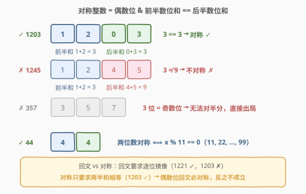
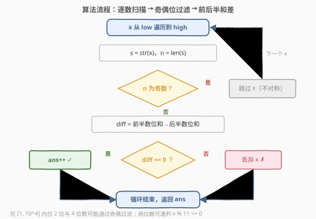
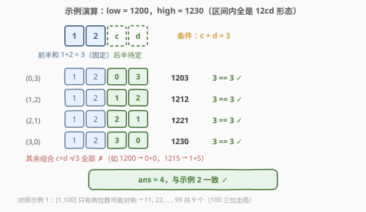

# LeetCode 统计对称整数的数目 题解

## 1. 题目概述

- **标题 / 题号**：统计对称整数的数目（#2843，easy）
- **链接**：https://leetcode.cn/problems/count-symmetric-integers/
- **难度**：简单
- **标签**：数学、枚举

**题意**：给你两个正整数 `low` 和 `high`。

对于一个由 $2n$ 位数字组成的整数 $x$，如果其**前 $n$ 位数字之和与后 $n$ 位数字之和相等**，则认为这个数字是一个**对称整数**。

返回在 $[\text{low}, \text{high}]$ 范围内的对称整数的**数目**。

**示例 1**：

```text
输入：low = 1, high = 100
输出：9
解释：在 1 到 100 范围内共有 9 个对称整数：11、22、33、44、55、66、77、88 和 99。
```

**示例 2**：

```text
输入：low = 1200, high = 1230
输出：4
解释：在 1200 到 1230 范围内共有 4 个对称整数：1203、1212、1221 和 1230。
```

**约束**：

- $1 \le \text{low} \le \text{high} \le 10^4$

> 💡 注意定义里的 $2n$ 位：**位数必须能等分成两半**。这意味着一位数、三位数（以及 $10^4$ 本身这个五位数）天生出局——这是本题最快的过滤条件。

## 2. 解题思路

### 2.1 暴力思路：区间逐数判定

最直接的解法（官方 hints 也是这么指引的）：遍历 $[\text{low}, \text{high}]$ 中每个数 $x$，转成字符串后：

1. 位数 $n$ 为奇数 → 无法对半分，**跳过**；
2. 否则比较前 $n/2$ 位之和与后 $n/2$ 位之和，相等则计数。

区间长度至多 $10^4$、位数至多 5，总运算量 $\le 5 \times 10^4$，一次线性扫描轻松通过——本题本质是一道「**枚举 + 数位判定**」的签到题。

### 2.2 核心观察：位数奇偶定生死，两位数有闭式



把「对称」条件按位数拆开看，有三个直接结论：

| 位数 | 对称条件 | 说明 |
|------|----------|------|
| 奇数位 | **不可能对称** | 无法等分成前后两半，直接出局 |
| 2 位（$\overline{ab}$） | $a = b$ $\iff$ $x$ 是 **11 的倍数** | $10a + b = 11a$，即 11, 22, …, 99 |
| 4 位（$\overline{abcd}$） | $a + b = c + d$ | 如 1203：$1+2 = 0+3 = 3$ ✓ |

其中「两位数 $\iff$ 11 的倍数」值得单独记：设十位为 $a$、个位为 $b$，对称要求 $a = b$，此时 $x = 10a + b = 11a$——判定退化成一次取模 `x % 11 == 0`。示例 1 的答案 9 正是 $[11, 99]$ 中 11 的倍数个数（100 是三位数，出局）。

> 💡 **与回文数区分**：回文要求逐位镜像（$s_i = s_{n-1-i}$），对称只要求**两半数位和**相等，条件更宽松。偶数位回文（如 1221）必然对称，但对称不必回文——1203 就是对称而非回文的例子；奇数位回文（如 121）则因位数无法等分而必然不对称。

### 2.3 算法流程图



**完整步骤**：

1. **遍历**：$x$ 从 $\text{low}$ 到 $\text{high}$；
2. **奇偶过滤**：转字符串求位数 $n$，$n$ 为奇数直接 `continue`；
3. **求差**：计算 $\text{diff} = $ 前 $n/2$ 位之和 $-$ 后 $n/2$ 位之和；
4. **计数**：$\text{diff} = 0$ 则 `ans++`；
5. 循环结束返回 `ans`。

### 2.4 示例演算

以示例 2 $[\text{low}, \text{high}] = [1200, 1230]$ 为例。



区间内全是四位数 $\overline{12cd}$：**前半段 "12" 固定，前半和恒为 $1 + 2 = 3$**，于是问题变成「后半段 $c + d$ 是否等于 3」。枚举 $c, d \in [0, 9]$：

| $cd$ | $c+d$ | 是否 $= 3$ | 对应整数 | 对称？ |
|------|-------|-----------|----------|--------|
| 00 | 0 | ✗ | 1200 | ✗ |
| 01 | 1 | ✗ | 1201 | ✗ |
| 02 | 2 | ✗ | 1202 | ✗ |
| **03** | **3** | ✓ | **1203** | ✓ |
| **12** | **3** | ✓ | **1212** | ✓ |
| **21** | **3** | ✓ | **1221** | ✓ |
| **30** | **3** | ✓ | **1230** | ✓ |

恰好 4 组 $(c, d)$ 满足 $c + d = 3$（且都落在区间内），答案 $= 4$ ✓，与示例一致。

再用 2.2 的结论交叉验证示例 1：$[1, 100]$ 内只有两位数可能对称，即 11 的倍数 $11, 22, \ldots, 99$ 共 9 个（$100$ 为三位数出局），答案 $9$ ✓。

## 3. 参考代码

### C++

```cpp
class Solution {
public:
    int countSymmetricIntegers(int low, int high) {
        int ans = 0;
        for (int x = low; x <= high; ++x) {
            string s = to_string(x);
            int n = s.size();
            if (n % 2 == 1) continue;            // 奇数位：无法对半分，直接出局
            int half = n / 2, diff = 0;          // diff = 前半和 − 后半和
            for (int i = 0; i < half; ++i)
                diff += s[i] - s[half + i];
            ans += (diff == 0);
        }
        return ans;
    }
};
```

### Python

```python
class Solution:
    def countSymmetricIntegers(self, low: int, high: int) -> int:
        ans = 0
        for x in range(low, high + 1):
            s = str(x)
            if len(s) % 2:                       # 奇数位：无法对半分
                continue
            m = len(s) // 2
            ans += sum(map(int, s[:m])) == sum(map(int, s[m:]))
        return ans
```

> 💡 两版逻辑一致：字符串判定**不依赖** $10^4$ 的范围假设，位数换成 6、8 也照样正确。实现上只维护 `diff`（前半和 − 后半和）一个变量，一趟循环内同时完成两半求和，无需分别算两次。

## 4. 复杂度分析

| 维度 | 复杂度 | 说明 |
|------|--------|------|
| **时间复杂度** | $O((\text{high} - \text{low} + 1) \cdot D)$ | $D$ 为位数，本题 $\le 5$；总运算量 $\le 5 \times 10^4$ |
| **空间复杂度** | $O(D)$ | 仅 `to_string` 的临时串与常数个变量 |

## 5. 扩展：分段速判、多查询与更大范围

**① 分段速判版（贴合 $10^4$ 范围）**：利用 2.2 的结论避开字符串，纯算术分支——

```cpp
class Solution {
public:
    int countSymmetricIntegers(int low, int high) {
        int ans = 0;
        for (int x = low; x <= high; ++x) {
            if (x < 100)      ans += (x % 11 == 0);          // 两位数 ⟺ 11 的倍数
            else if (x < 1000) continue;                     // 三位数：奇数位出局
            else {                                            // 四位数：a+b == c+d
                int a = x / 1000, b = x / 100 % 10, c = x / 10 % 10, d = x % 10;
                ans += (a + b == c + d);
            }
        }
        return ans;
    }
};
```

**② 多次查询 → 前缀计数**：若 $[\text{low}, \text{high}]$ 被查询多次，可一次性预处理 $f[x] = [1, x]$ 内对称整数的个数（一张长度 $10^4$ 的表），每次查询 $O(1)$ 回答 $f[\text{high}] - f[\text{low} - 1]$——「区间 → 前缀差」的标准手法。

顺带一个组合计数的小结论：$[1, 9999]$ 内对称整数共 $9 + 615 = 624$ 个。四位数部分 $= \sum_{a=1}^{9}\sum_{b=0}^{9} N(a+b)$，其中 $N(s) = \min(s, 18-s) + 1$ 是满足 $c + d = s$ 的 $(c, d)$ 组数——不遍历也能把「存量」直接算出来。

**③ 范围放大到 $10^{18}$ → 数位 DP**：线性枚举的耗时与区间长度成正比，范围一大立刻失效。改用数位 DP：枚举总位数 $2n$，从高位逐位填数，维护「前半和 − 后半和」$\text{diff} \in [-81, 81]$ 以及 `tight`、前导零状态，终止条件 $\text{diff} = 0$；区间计数照旧拆成「$\le \text{high}$ 的减去 $\le \text{low}-1$ 的」两个前缀。完整套路见 [2827. 范围内美丽整数的数目](../2801-2900/2827_范围内美丽整数的数目.md)与 [2719. 统计整数数目](../2701-2800/2719_统计整数数目.md)。

## 6. 面试要点

1. **为什么奇数位数的数可以直接跳过？**

   对称整数的定义是「$2n$ 位数的前 $n$ 位和等于后 $n$ 位和」，前提就是位数能等分。奇数位连前提都不满足，连判定都省了——这也是把 $10^4$（5 位）本身排除在外的依据。

2. **两位数的对称条件为什么等价于 11 的倍数？**

   设 $\overline{ab}$，对称 $\iff a = b$，此时 $x = 10a + b = 11a$；反之 $10 \le x \le 99$ 且 $x \bmod 11 = 0$ 时必有 $a = b$。所以两位数一段可以整段用 `x % 11 == 0` 速判。

3. **对称整数和回文数是什么关系？**

   回文要求逐位镜像相等，对称只要求两半**和**相等，条件更宽松：偶数位回文必对称（$a + b = b + a$ 恒真），但对称不必回文（1203）；奇数位回文（121）因位数无法等分必然不对称。两者是「逐位相等」与「分组求和相等」的强弱关系。

4. **如果查询次数很多，或范围扩大，分别怎么应对？**

   多次查询：预处理前缀计数表 $f[x]$，每次 $O(1)$；范围扩大到 $10^{18}$：线性枚举失效，换数位 DP + 前缀差（状态含「前半和 − 后半和」）。按数据范围选工具，是这道签到题最有价值的延伸考点。

5. **本题总运算量大约多少，为什么不需要任何优化？**

   区间 $\le 10^4$ 个数、每个 $\le 5$ 位，字符级运算 $\le 5 \times 10^4$ 次，毫秒级完成。动手前先确认「暴力够不够」，比一上来就堆技巧更值得展示。

## 同类练习题

| # | 题目 | 与本题的关联 |
|---|------|-------------|
| 2827 | [范围内美丽整数的数目](https://leetcode.cn/problems/number-of-beautiful-integers-in-the-range/)（[站内题解](../2801-2900/2827_范围内美丽整数的数目.md)） | 本题的「范围放大」进化版，区间计数改由数位 DP + 前缀差完成 |
| 728 | [自除数](https://leetcode.cn/problems/self-dividing-numbers/)（[站内题解](../0701-0800/728_自除数.md)） | 同款「区间内逐数判定数位性质」的枚举模板，逐位取余短路 |
| 788 | [旋转数字](https://leetcode.cn/problems/rotated-digits/)（[站内题解](../0701-0800/788_旋转数字.md)） | 逐位提取数字 + 有效集合判定，同样的小数据枚举套路 |
| 1291 | [顺次数](https://leetcode.cn/problems/sequential-digits/)（[站内题解](../1201-1300/1291_顺次数.md)） | 区间内枚举满足数位约束的数，用滑窗生成代替逐数判定 |
| 2719 | [统计整数数目](https://leetcode.cn/problems/count-of-integers/)（[站内题解](../2701-2800/2719_统计整数数目.md)） | 数位 DP 计数「数位和落在区间内」的数，前缀差的标准手法 |
