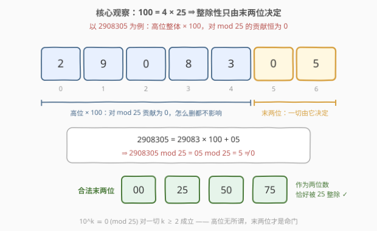
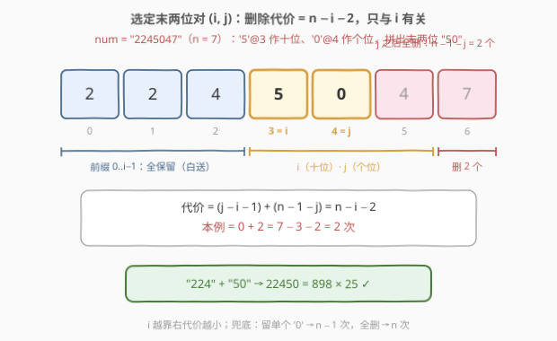
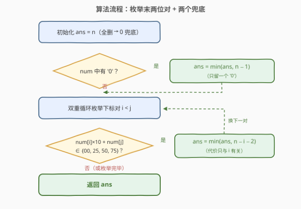
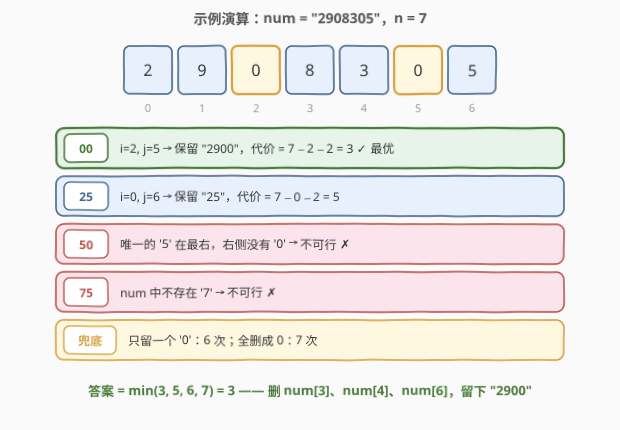

# LeetCode 生成特殊数字的最少操作 题解

## 1. 题目概述

- **标题 / 题号**：生成特殊数字的最少操作（#2844，medium）
- **链接**：https://leetcode.cn/problems/minimum-operations-to-make-a-special-number/
- **难度**：中等
- **标签**：贪心、数学、字符串、枚举

**题意**：给你一个下标从 **0** 开始的字符串 `num`，表示一个非负整数。

在一次操作中，您可以选择 `num` 的任意一位数字并将其删除。请注意，如果你删除 `num` 中的所有数字，则 `num` 变为 `0`。

返回最少需要多少次操作可以使 `num` 变成特殊数字。

如果整数 `x` 能被 `25` 整除，则该整数 `x` 被认为是特殊数字。

**示例 1**：

```text
输入：num = "2245047"
输出：2
解释：删除数字 num[5] 和 num[6]，得到数字 "22450"，可以被 25 整除。
可以证明要使数字变成特殊数字，最少需要删除 2 位数字。
```

**示例 2**：

```text
输入：num = "2908305"
输出：3
解释：删除 num[3]、num[4] 和 num[6]，得到数字 "2900"，可以被 25 整除。
可以证明要使数字变成特殊数字，最少需要删除 3 位数字。
```

**示例 3**：

```text
输入：num = "10"
输出：1
解释：删除 num[0]，得到数字 "0"，可以被 25 整除。
可以证明要使数字变成特殊数字，最少需要删除 1 位数字。
```

**约束**：

- $1 \le num.length \le 100$
- `num` 仅由数字 `'0'` 到 `'9'` 组成
- `num` 不含任何前导零

> 💡 本题核心是「**末两位决定整除性**」。$100 = 4 \times 25$，于是 $10^k\ (k \ge 2)$ 全是 25 的倍数——一个数能否被 25 整除，只看它**最后两位**是不是 $00/25/50/75$。删除操作只决定「哪些位留下来」，问题瞬间坍缩成：**枚举哪两个下标留作末两位**，再加上「留一个 0」「全删」两个兜底。

## 2. 解题思路

### 2.1 暴力思路：枚举删除子集

最朴素的想法：每个数位要么删、要么留，枚举全部 $2^n$ 个删除方案，把留下的数字拼成整数、验证能否被 25 整除，取删除次数最小的可行方案。$n \le 100$ 时 $2^{100}$ 是天文数字，不可行。

但暴力里藏着钥匙——**验证可行性时，我们根本不在乎留下的数字整体长什么样，只在乎它的最后两位**。把 $2^n$ 个方案按「末两位（或只剩一位/空）」归类，同类方案的可行性完全一致，只需在每类里挑删除次数最少的代表。搜索空间从指数级坍缩到 $O(n^2)$ 个「末两位候选对」。

### 2.2 核心观察：被 25 整除 ⟺ 末两位 ∈ {00, 25, 50, 75}

**观察 1：高位对 $\bmod\ 25$ 的贡献恒为 0。**

$100 = 4 \times 25$，因此任意数都可以拆成

$$x = \underbrace{\lfloor x/100 \rfloor \times 100}_{\text{高位，贡献为 } 0} + \underbrace{(x \bmod 100)}_{\text{末两位}} \ \Longrightarrow\ x \equiv x \bmod 100 \pmod{25}$$

即 $10^k \equiv 0 \pmod{25}$ 对一切 $k \ge 2$ 成立。而 $x \bmod 100$ 中是 25 倍数的只有 4 个：$00, 25, 50, 75$。



**观察 2：保留一对 $(i, j)$ 作末两位，代价只与 $i$ 有关。**

若让 `num[i]` 当**十位**、`num[j]`（$i < j$）当**个位**，最优方案是：

- $0 \sim i-1$ **全部保留**——它们是前缀，对 $\bmod\ 25$ 毫无影响（哪怕拼出前导零，数值也不变），多删一位都是白白浪费操作；
- $i+1 \sim j-1$ **全删**（$j - i - 1$ 个）——不删的话 `num[i]` 就不是十位了；
- $j+1 \sim n-1$ **全删**（$n - 1 - j$ 个）——不删的话 `num[j]` 就不是个位了。

于是删除次数为

$$(j - i - 1) + (n - 1 - j) = n - i - 2$$

**与 $j$ 无关**！$i$ 越靠右，代价越小——直觉：十位越靠右，「需要删掉的尾巴」越短。



**观察 3：三类终态穷尽一切可能。**

任何「特殊数字」终态 $S$ 只有三种形态：

| 终态形态 | 对应候选 | 代价 |
|----------|----------|------|
| $\lvert S \rvert \ge 2$ | 末两位来自某对 $(i, j)$，其余位是 $0 \sim i-1$ 的子序列 | $\ge n - i - 2$（「前缀全保留」恰取到该下界） |
| $S = $ `"0"`（单个 '0'） | `num` 中任一个 '0' 留下，其余全删 | $n - 1$ |
| $S$ 为空（全删得 0） | 题目明说全删后 `num` 变为 0 | $n$ |

所以答案 $= \min\bigl(n,\ \ n-1\ [\text{若存在 '0'}],\ \ \min_{\text{合法对}(i,j)} n-i-2\bigr)$。注意「留单个 '0'」的兜底**不可省略**：当 `num` 中不存在任何合法末两位对时（如 `"10"`），它是唯一优于全删的选择；反之只要 `num` 里有两个 '0'，"00" 对必然存在且代价 $\le n - 2 < n - 1$，兜底自动失效。

> ⚠️ 两个常见坑：其一，只枚举四个后缀却忘了「留单个 '0'」——`"10"` 会错误地返回 2（全删）而不是 1；其二，以为要特判前导零——其实前缀哪怕全是 0 也无所谓，`0025` 与 `25` 数值相同，整除性不受影响。

### 2.3 算法流程图



**完整步骤**：

1. 初始化 `ans = n`（全删 → 0，永远可行的兜底）；
2. 若 `num` 含 `'0'`，更新 `ans = min(ans, n - 1)`（只留一个 `'0'`）；
3. 双重循环枚举所有下标对 $0 \le i < j \le n-1$，若 `num[i]` 与 `num[j]` 组成的两位数 $\in \{00, 25, 50, 75\}$，更新 `ans = min(ans, n - i - 2)`；
4. 返回 `ans`。

### 2.4 示例演算

以示例 2 `num = "2908305"`（$n = 7$）为例，逐一检查 4 种合法末两位与两个兜底：



| 候选 | 定位 | 保留结果 | 代价 |
|------|------|----------|------|
| 末两位 `00` | 两个 '0' 在下标 2、5 → $i=2, j=5$ | `"290" + "0"` = `"2900"` | $7 - 2 - 2 = 3$ ✓ |
| 末两位 `25` | '2'@0、'5'@6 → $i=0, j=6$ | `"2" + "5"` = `"25"` | $7 - 0 - 2 = 5$ |
| 末两位 `50` | 唯一的 '5' 在下标 6，右侧无 '0' | 无解 ✗ | — |
| 末两位 `75` | `num` 中不存在 '7' | 无解 ✗ | — |
| 留单个 '0' | 任取一个 '0' | `"0"` | $6$ |
| 全删 | — | 空（即 0） | $7$ |

答案 $= \min(3, 5, 6, 7) = 3$，与官方一致：删 `num[3]`、`num[4]`、`num[6]` 得 `"2900"`。

## 3. 参考代码

### C++

```cpp
class Solution {
public:
    int minimumOperations(string num) {
        int n = num.size();
        int ans = n;                                      // 兜底：全删 → 0
        if (num.find('0') != string::npos) ans = n - 1;   // 兜底：只留一个 '0'
        for (int i = 0; i + 1 < n; i++) {
            for (int j = i + 1; j < n; j++) {
                int v = (num[i] - '0') * 10 + (num[j] - '0');
                if (v == 0 || v == 25 || v == 50 || v == 75)  // 合法末两位
                    ans = min(ans, n - i - 2);                // 代价只与 i 有关
            }
        }
        return ans;
    }
};
```

### Python

```python
class Solution:
    def minimumOperations(self, num: str) -> int:
        n = len(num)
        ans = n if '0' not in num else n - 1   # 全删 → 0 / 只留一个 '0'
        for i in range(n - 1):
            for j in range(i + 1, n):
                v = int(num[i]) * 10 + int(num[j])
                if v in (0, 25, 50, 75):       # 合法末两位
                    ans = min(ans, n - i - 2)  # 代价只与 i 有关
        return ans
```

> 💡 $n \le 100$，$O(n^2)$ 约 $5 \times 10^3$ 次判断，绰绰有余。若追求线性，见第 5 节——利用「代价只与 $i$ 有关」从右往左一趟扫完。

## 4. 复杂度分析

| 维度 | 复杂度 | 说明 |
|------|--------|------|
| **时间复杂度** | $O(n^2)$ | 枚举全部下标对 $(i, j)$，每对 $O(1)$ 判断两位数是否属于 $\{00, 25, 50, 75\}$ |
| **空间复杂度** | $O(1)$ | 仅常数个变量 |

> ⚠️ 第 5 节给出 $O(n)$ 改进：从右往左维护「右侧出现过的数字」，命中即得最大 $i$、直接收工。

## 5. 扩展：O(n) 一趟从右往左扫描

代价 $n - i - 2$ **只取决于 $i$**，所以真正要找的是「**最靠右的**、右侧存在匹配个位的十位下标」。从右往左扫，维护布尔表 `seen[10]` 记录右侧出现过的数字：站在 $i$ 处，若 `num[i]` 与某个 `seen` 数字能拼出合法末两位，则 $i$ 已是最大合法十位下标（再往左 $i$ 只会更小、代价更大），直接得答案。

```cpp
class Solution {
public:
    int minimumOperations(string num) {
        int n = num.size();
        int ans = num.find('0') != string::npos ? n - 1 : n;
        bool seen[10] = {false};                 // 下标 i 右侧出现过的数字
        for (int i = n - 1; i >= 0; i--) {
            int d = num[i] - '0';
            for (int e = 0; e < 10; e++) {
                int v = d * 10 + e;
                if (seen[e] && (v == 0 || v == 25 || v == 50 || v == 75))
                    return min(ans, n - i - 2);  // 首个命中即最大 i，最优
            }
            seen[d] = true;
        }
        return ans;
    }
};
```

**泛化**：这套「只看末 $k$ 位」的技巧对一切 $d \mid 10^k$ 成立——被 50 整除看末两位 $\{00, 50\}$，被 4 整除看末两位（16 种组合），被 8 整除看末三位，本质都是 $10^k \equiv 0 \pmod d$。反之若 $d \nmid 10^k$（如 $d = 7$），高位无法忽略，此招失效，得换数位 DP 等手段。

## 6. 面试要点

1. **为什么整除性只由末两位决定？**

   - $100 = 4 \times 25$，故 $10^k \equiv 0 \pmod{25}$（$k \ge 2$）。任何数 $x = \lfloor x/100 \rfloor \times 100 + (x \bmod 100)$，高位部分贡献为 0，于是 $x \bmod 25 = (x \bmod 100) \bmod 25$，末两位只有 $00/25/50/75$ 四种合法形态。

2. **选定 $(i, j)$ 作末两位后，为什么前缀全部保留是最优的？**

   - 前缀乘的都是 $10^k\ (k \ge 2)$，对 $\bmod\ 25$ 贡献为 0，保留零成本；而 $i$、$j$ 之间与 $j$ 之后必须删空，这对数字才能真正落到末两位。总代价 $(j-i-1) + (n-1-j) = n-i-2$，**与 $j$ 无关**，$i$ 越靠右越好。

3. **如何保证「枚举对 + 兜底」覆盖了所有可行方案（下界论证）？**

   - 任何可行终态 $S$：若 $\lvert S \rvert \ge 2$，其末两位必来自某对 $(i, j)$，而任何到达 $S$ 的方案都必须删掉 $(i,j)$ 之间与 $j$ 之后的所有位，即代价 $\ge n-i-2$——我们的候选恰好取到该下界；$\lvert S \rvert = 1$ 时只能是 `"0"`（唯一被 25 整除的单 digit）；$\lvert S \rvert = 0$ 对应全删。三类穷尽，取最小即最优。

4. **「留单个 '0'」的兜底什么时候真正起作用？**

   - 当 `num` 不含任何合法末两位对时。例如 `"10"`：没有 00/25/50/75 对，只留 '0' 代价 1，优于全删的 2。反之只要有两个 '0'，"00" 对代价 $\le n-2$ 必然更优，兜底自动被覆盖。

5. **把 25 换成 4、50 或 7，思路如何变化？**

   - 4 与 50 都整除 100，仍是「末两位」问题，只是合法集合变为「能被 4 整除的 16 种两位组合」或 $\{00, 50\}$；8 整除 1000，看末三位。7 不整除任何 $10^k$，高位无法消去，需要数位 DP 之类的手段。

> 💡 **一句话总结**：$25 \mid 100$ 把「整除性」压缩到末两位——枚举留下哪对 $(i, j)$ 当末两位（代价 $n - i - 2$ 只看 $i$），再加「留一个 0」与「全删」两个兜底，$O(n^2)$ 收工（可优化到一趟 $O(n)$）。

## 同类练习题

| # | 题目 | 与本题的关联 |
|---|------|-------------|
| 402 | [移掉 K 位数字](https://leetcode.cn/problems/remove-k-digits/)（[题解](../0401-0500/402_移掉K位数字.md)） | 同为「删数位使剩余数满足性质」，贪心 + 单调栈维护尽量递增的前缀 |
| 2259 | [移除指定数字得到的最大结果](https://leetcode.cn/problems/remove-digit-from-number-to-maximize-result/)（[题解](../2201-2300/2259_移除指定数字得到的最大结果.md)） | 只删一位的最优化，删位位置选择的贪心对照 |
| 2578 | [最小和分割](https://leetcode.cn/problems/split-with-minimum-sum/)（[题解](../2501-2600/2578_最小和分割.md)） | 数位重排贪心，「数位级操作」家族的又一变体 |
| 1015 | [可被 K 整除的最小整数](https://leetcode.cn/problems/smallest-integer-divisible-by-k/)（[题解](../1001-1100/1015_可被K整除的最小整数.md)） | 整除性 + 抽屉原理（$1, 11, 111, \dots$ 首次被 $K$ 整除） |
