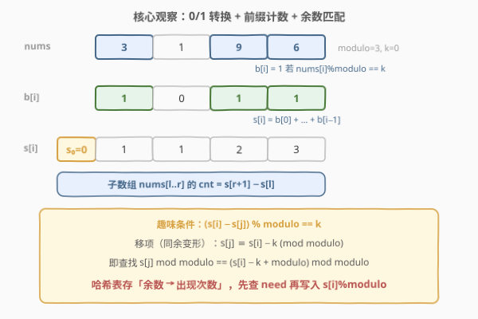
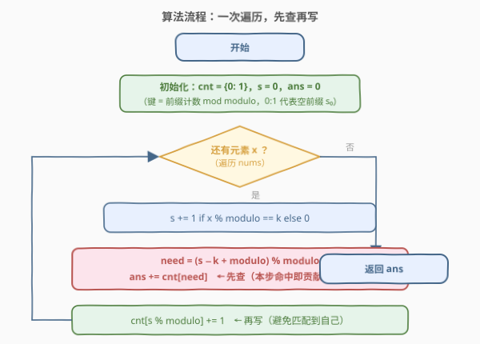
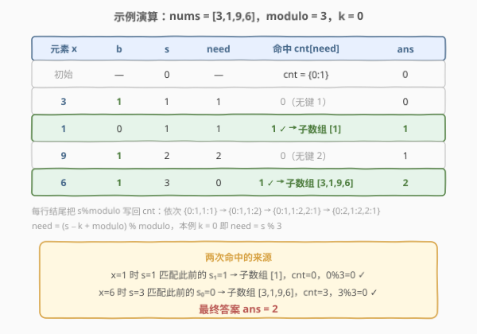

# 统计趣味子数组的数目

- **题目名称**：统计趣味子数组的数目
- **链接**：[2845. 统计趣味子数组的数目](https://leetcode.cn/problems/count-of-interesting-subarrays/)
- **难度**：中等
- **标签**：数组、哈希表、前缀和

## 1. 题目概述

给你一个下标从 **0** 开始的整数数组 `nums`，以及整数 `modulo` 和整数 `k`。请你找出并统计数组中**趣味子数组**的数目。

如果**子数组** `nums[l..r]` 满足下述条件，则称其为**趣味子数组**：在范围 $[l, r]$ 内，设 $cnt$ 为满足 $\text{nums}[i] \bmod modulo = k$ 的索引 $i$ 的数量，并且 $cnt \bmod modulo = k$。

**示例 1**：

```text
输入：nums = [3,2,4], modulo = 2, k = 1
输出：3
解释：趣味子数组分别是 [3]、[3,2]、[3,2,4]。
三者范围内都恰有 1 个下标满足 nums[i] % 2 == 1（即 i = 0），cnt = 1 且 1 % 2 == 1。
```

**示例 2**：

```text
输入：nums = [3,1,9,6], modulo = 3, k = 0
输出：2
解释：趣味子数组分别是 [3,1,9,6] 与 [1]。
前者范围内有 3 个下标（0, 2, 3）满足 nums[i] % 3 == 0，cnt = 3 且 3 % 3 == 0；
后者范围内没有下标满足条件，cnt = 0 且 0 % 3 == 0。
```

**约束条件**：

- $1 \le \text{nums.length} \le 10^5$
- $1 \le \text{nums}[i] \le 10^9$
- $1 \le modulo \le 10^9$
- $0 \le k < modulo$

> ⚠️ 两个隐蔽陷阱：其一，$modulo$ 最大 $10^9$，**不能用数组代替哈希表**（对比 [974. 和可被 K 整除的子数组](../0901-1000/974_和可被K整除的子数组.md) 中 $k \le 10^5$ 可开桶）；其二，子数组总数可达 $\binom{10^5}{2} + 10^5 \approx 5 \times 10^9$，C++ 中答案**必须用 `long long`**。

---

## 2. 解题思路

### 2.1 暴力思路：枚举所有子数组

双重循环枚举子数组右端点 $r$ 与左端点 $l$，向左扩张时增量维护 $cnt$（每遇到一个 $\text{nums}[i] \bmod modulo = k$ 就加一），判断 $cnt \bmod modulo = k$。时间复杂度 $O(n^2)$，在 $n = 10^5$ 时约 $10^{10}$ 次操作，必然超时。

> ⚠️ 暴力法的硬伤：每个子区间的 $cnt$ 都被独立重算（哪怕只差一个元素）。而「区间内满足条件的元素个数」正是**前缀计数**可直接 $O(1)$ 回答的量——正解由此切入。

### 2.2 核心观察：0/1 转换 + 前缀计数 + 余数匹配



**第一步：0/1 转换**。把每个元素压成一个布尔标记：

$$
b[i] = \begin{cases} 1, & \text{nums}[i] \bmod modulo = k \\ 0, & \text{ otherwise} \end{cases}
$$

**第二步：前缀计数**。定义 $s[i] = b[0] + b[1] + \cdots + b[i-1]$（$s[0] = 0$），则子数组 $\text{nums}[l..r]$ 的 $cnt$ 为：

$$
cnt(l, r) = s[r+1] - s[l]
$$

**第三步：条件变形**。趣味条件 $cnt \bmod modulo = k$ 即 $(s[i] - s[j]) \bmod modulo = k$（其中 $i = r+1$，$j = l$，$j < i$）。移项得：

$$
s[j] \equiv s[i] - k \pmod{modulo}
\quad\Longleftrightarrow\quad
s[j] \bmod modulo = (s[i] - k + modulo) \bmod modulo
$$

> 💡 **关键转化**：「子区间的计数取模等于 $k$」被改写成「**两个前缀计数的模值相差 $k$**」。于是对每个右端点，只需查询之前有多少个前缀计数的余数等于 $need = (s[i] - k + modulo) \bmod modulo$——用哈希表记录「余数 → 出现次数」即可 $O(1)$ 完成。这与 [974. 和可被 K 整除的子数组](../0901-1000/974_和可被K整除的子数组.md) 的同余匹配同构：974 匹配「余数相等」（差是 $modulo$ 的倍数），本题匹配「余数相差 $k$」。

### 2.3 算法流程图



**完整步骤**：

1. **初始化**：哈希表 `cnt = {0: 1}`（空前缀 $s_0 = 0$ 贡献一次余数 0），前缀计数 `s = 0`，答案 `ans = 0`
2. **遍历**每个元素 `x`：
   - 若 `x % modulo == k` 则 `s += 1`
   - 计算 `need = (s - k + modulo) % modulo`，`ans += cnt[need]`（**先查**）
   - `cnt[s % modulo] += 1`（**再写**）
3. **返回** `ans`

> ⚠️ **顺序不能颠倒**：必须先把当前前缀计数查询完毕、再把它写入哈希表，否则 $j = i$ 时会「自己匹配自己」，把长度为 0 的空区间也计入答案。

### 2.4 示例演算

以示例 2 `nums = [3,1,9,6], modulo = 3, k = 0` 为例：



| 步骤 | 元素 x | b | s | need = (s−0)%3 | 命中 cnt[need] | ans | cnt 更新后 |
|------|--------|---|---|----------------|----------------|-----|------------|
| 初始 | — | — | 0 | — | — | 0 | {0: 1} |
| 1 | 3 | 1 | 1 | 1 | 0（无键 1） | 0 | {0: 1, 1: 1} |
| 2 | 1 | 0 | 1 | 1 | 1 ✓（$s_1 = 1$） | 1 | {0: 1, 1: 2} |
| 3 | 9 | 1 | 2 | 2 | 0（无键 2） | 1 | {0: 1, 1: 2, 2: 1} |
| 4 | 6 | 1 | 3 | 0 | 1 ✓（$s_0 = 0$） | 2 | {0: 2, 1: 2, 2: 1} |

两次命中恰好对应两个趣味子数组：

- 步骤 2：$s = 1$ 匹配此前的 $s_1 = 1$ → 子数组 `nums[1..1] = [1]`，$cnt = 0$，$0 \bmod 3 = 0$ ✓
- 步骤 4：$s = 3$ 匹配此前的 $s_0 = 0$ → 子数组 `nums[0..3] = [3,1,9,6]`，$cnt = 3$，$3 \bmod 3 = 0$ ✓

最终答案为 `2`。

> 💡 示例 1 `nums = [3,2,4], modulo = 2, k = 1` 同法演算：$s$ 依次为 0,1,1,1，每次 `need = (s−1+2)%2 = 0`，而 `cnt[0]` 恒为 1（只有 $s_0 = 0$ 贡献），三步各命中 1 次，答案 `3`。

---

## 3. 参考代码

### C++

```cpp
class Solution {
  public:
    long long countInterestingSubarrays(vector<int>& nums, int modulo, int k) {
        long long ans = 0;
        int s = 0;
        unordered_map<int, int> cnt;
        cnt[0] = 1;                                  // 空前缀 s0 = 0
        for (int x : nums) {
            s += (x % modulo == k) ? 1 : 0;
            int need = (s - k + modulo) % modulo;    // k < modulo 保证非负
            auto it = cnt.find(need);
            if (it != cnt.end()) ans += it->second;  // 先查
            ++cnt[s % modulo];                       // 再写
        }
        return ans;
    }
};
```

### Python

```python
class Solution:
    def countInterestingSubarrays(self, nums: List[int], modulo: int, k: int) -> int:
        cnt = {0: 1}                                 # 空前缀 s0 = 0
        ans = s = 0
        for x in nums:
            s += 1 if x % modulo == k else 0
            ans += cnt.get((s - k) % modulo, 0)      # 先查（Python 取模恒非负）
            cnt[s % modulo] = cnt.get(s % modulo, 0) + 1   # 再写
        return ans
```

> 💡 两版逻辑完全一致。C++ 中 `(s - k + modulo) % modulo` 依赖约束 $k < modulo$ 保证括号内非负（$s \ge 0$，$k < modulo$ ⟹ $s - k + modulo > 0$），从而规避负数取模的符号问题；Python 的 `%` 本身返回非负值，直接写 `(s - k) % modulo` 即可。

---

## 4. 复杂度分析

| 维度 | 复杂度 | 说明 |
|------|--------|------|
| **时间复杂度** | $O(n)$ | 只遍历数组一次，每步哈希表查询 / 写入均摊 $O(1)$ |
| **空间复杂度** | $O(\min(n, modulo))$ | 哈希表最多存 $\min(n + 1, modulo)$ 个余数键（前缀计数只有 $n + 1$ 个，余数只有 $modulo$ 种） |

---

## 5. 扩展：与 974（和可被 K 整除的子数组）的对照

本题是「前缀 + 同余 + 哈希」家族的又一变体，与 [974. 和可被 K 整除的子数组](../0901-1000/974_和可被K整除的子数组.md) 的异同值得细品：

| 维度 | 974 | 2845（本题） |
|------|-----|--------------|
| 前缀量 | 元素**和**的前缀和 | 满足条件元素**个数**的前缀计数（0/1 转换后仍是和） |
| 匹配条件 | 余数**相等**（差是 $k$ 的倍数） | 余数**相差 $k$** |
| $k$（模数）范围 | $\le 10^5$，可用数组开桶 | $\le 10^9$，**必须哈希表** |
| 答案类型 | 子数组数 $\le n^2$，需 `long long` | 同左，需 `long long` |

> 💡 当 $k = 0$ 时本题的匹配条件退化为「余数相等」，恰是 974 的同余匹配——即 974 是本题 $k = 0$、前缀量换成元素和的特例。家族的通用骨架只有三句话：**前缀量化差、同余变形、哈希先查再写**。另有一种等价写法是先把 `nums` 整体映射成 0/1 数组 `b` 再跑标准模板，语义更直白但多一次显式遍历，本页代码选择边遍历边映射。

---

## 6. 面试要点

1. **为什么哈希表要初始化 `{0: 1}`？**

   - 它代表空前缀 $s_0 = 0$（余数 0 出现过一次）。当某个**从下标 0 开始**的子数组自身满足趣味条件时，需要它与 $s_0$ 配对；漏掉初始化会漏算所有 $l = 0$ 的答案。

2. **为什么必须「先查再写」？**

   - 查询统计的是 $j < i$ 的前缀。若先把 $s_i$ 写入再查询，$j = i$ 的「自己减自己」满足 $\bmod modulo = 0$，当 $k = 0$ 时空区间会被错误计入。

3. **C++ 里 `need` 的计算为什么写成 `(s - k + modulo) % modulo`？**

   - $s - k$ 可能为负（$s < k$ 时），而 C++ 负数取模符号跟随被除数。由约束 $0 \le k < modulo$ 且 $s \ge 0$，加一个 $modulo$ 后必为正且不超过 $2 \times 10^9$（`int` 可容），一次取模即落到 $[0, modulo)$。

4. **为什么答案要用 `long long`？**

   - 子数组总数最多 $\frac{n(n+1)}{2} \approx 5 \times 10^9 > 2^{31} - 1$。理论上全数组趣味（如 $k = 0$ 且所有元素 $\bmod\ modulo = 0$，$modulo = 1$... 注意 $modulo = 1$ 时 $k = 0$，任意 $cnt \bmod 1 = 0$ 恒成立，**全部子数组都趣味**）时答案即达上界，`int` 必然溢出。

5. **本题与 560（和为 K 的子数组）在框架上的关系？**

   - 完全同构的三步：前缀量化差 → 目标值查哈希 → 先查再写。560 查 `prefix[j] == prefix[i] - k`（精确相等），974 查「模值相等」，本题查「模值相差 $k$」——匹配条件从相等推广到同余偏移，哈希键从原值换成余数而已。

> 💡 **一句话总结**：把「区间内满足条件的个数」变成 0/1 数组的前缀计数，趣味条件 $(s_i - s_j) \bmod modulo = k$ 同余变形为查 $s_j \bmod modulo = (s_i - k + modulo) \bmod modulo$，哈希表「先查再写」一次遍历搞定。$O(n)$ 时间，答案开 `long long`。

---

## 7. 同类练习题

- [974. 和可被 K 整除的子数组](https://leetcode.cn/problems/subarray-sums-divisible-by-k/)（[题解](../0901-1000/974_和可被K整除的子数组.md)）：同余匹配母题，前缀和取模后查「余数相等」，本题是其「余数相差 $k$」推广
- [560. 和为 K 的子数组](https://leetcode.cn/problems/subarray-sum-equals-k/)（[题解](../0501-0600/560_和为K的子数组.md)）：前缀和 + 哈希「先查再写」模板的源头，匹配条件为精确相等
- [1248. 统计「优美子数组」](https://leetcode.cn/problems/count-number-of-nice-subarrays/)（[题解](../1201-1300/1248_统计优美子数组.md)）：同样是「区间内满足条件元素的计数」，但目标是恰为 $k$ 个而非模 $modulo$，可对照两种条件的变形方式
- [525. 连续数组](https://leetcode.cn/problems/contiguous-array/)（[题解](../0501-0600/525_连续数组.md)）：0/1 转换（0 当 −1）后查前缀差为 0，0/1 转换思想的另一应用
- [930. 和相同的二元子数组](https://leetcode.cn/problems/binary-subarrays-with-sum/)：0/1 数组上「区间和恰为目标值」的计数，前缀 + 哈希精确匹配的练习
