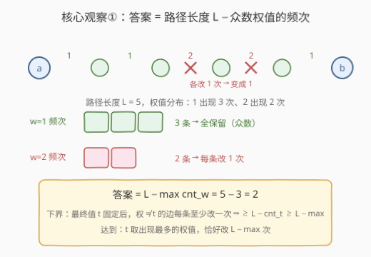
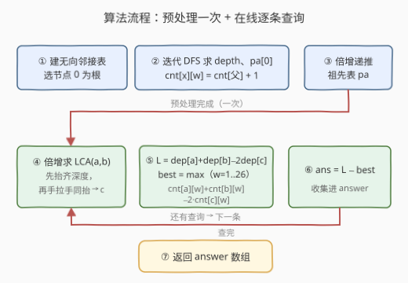

# LeetCode 边权重均等查询 题解

## 1. 题目概述

- **标题 / 题号**：边权重均等查询（#2846，hard）
- **链接**：https://leetcode.cn/problems/minimum-edge-weight-equilibrium-queries-in-a-tree/
- **难度**：困难
- **标签**：树、深度优先搜索、最近公共祖先、倍增、前缀和

**题意**：给定一棵由 `n` 个节点组成的无向树（节点编号 `0` 到 `n-1`），`edges[i] = [u_i, v_i, w_i]` 表示节点 `u_i` 与 `v_i` 之间存在一条权值为 `w_i` 的边。另有 `m` 条查询 `queries[i] = [a_i, b_i]`：对每条查询，求使 `a_i` 到 `b_i` 路径上**每条边的权值相等**所需的最小操作次数。一次操作可以选择树上任意一条边，并将其权值改为任意值。

**示例 1**：

```text
输入：n = 7, edges = [[0,1,1],[1,2,1],[2,3,1],[3,4,2],[4,5,2],[5,6,2]],
     queries = [[0,3],[3,6],[2,6],[0,6]]
输出：[0,0,1,3]
解释：查询 [2,6] 路径边权为 1,2,2,2，把边 [2,3] 改为 2 即全部相等，1 次；
     查询 [0,6] 路径边权为 1,1,1,2,2,2，把前三条边都改为 2，3 次。
```

**示例 2**：

```text
输入：n = 8, edges = [[1,2,6],[1,3,4],[2,4,6],[2,5,3],[3,6,6],[3,0,8],[7,0,2]],
     queries = [[4,6],[0,4],[6,5],[7,4]]
输出：[1,2,2,3]
```

**约束**：

- `1 <= n <= 10^4`
- `1 <= w_i <= 26`
- `1 <= queries.length == m <= 2 * 10^4`

> 💡 三个关键信号：① 查询**相互独立**（每次查询树都回到初始状态）且树是**静态**的——典型的"预处理 + 在线查询"结构；② **权值只有 1~26**——值域小到可以按权值开 26 个计数器，这是全题的题眼；③ `n·m = 2×10^8`——每条查询必须压到 $O(\log n + 26)$ 量级，逐边走路径的暴力必死。

## 2. 解题思路

### 2.1 暴力思路：每条查询现走路径

对每条查询 `(a, b)`：从 `a` 沿父指针一路走到根并记录途经的边，从 `b` 同样走一遍，两段拼出去掉重复部分得到 `a→b` 的路径，再统计路径上各权值的出现频次，套用"保留众数"的贪心求答案。单次查询 $O(n)$，总计 $O(nm) = 2 \times 10^8$——C++ 勉强能扛，Python 必然超时。

> ⚠️ 瓶颈在于每条查询都**从零开始**走路径。树是静态的，所有查询共享同一棵树——"根到任意节点"的信息完全可以**预处理**，查询时只用 $O(1)$ 容斥拼出任意路径的信息。这正是**树上前缀和**的思想。

### 2.2 核心观察：众数贪心 + 树上前缀计数 + 倍增 LCA

**观察一：先把"改"变成"数"——答案 = 路径长度 − 众数频次。**

设路径上有 $L$ 条边，权值 $w$ 出现了 $\mathrm{cnt}_w$ 次。最终所有边权都等于某个目标值 $t$：

- **下界**：权 $\ne t$ 的边每条**至少**要改一次，故操作数 $\ge L - \mathrm{cnt}_t \ge L - \max_w \mathrm{cnt}_w$；
- **达到**：取 $t$ 为路径上出现最多的权值（众数），把其余 $L - \max_w \mathrm{cnt}_w$ 条边逐条改成 $t$，恰好用这么多次。

（若 $t$ 不取路径上已有的权值，则 $L$ 条边全要改，只会更差。）于是问题从"最少改几次"变成"路径上每种权值各出现几次"：

$$\text{answer}(a,b) = L - \max_{w=1}^{26} \mathrm{cnt}_w(a \to b)$$



**观察二：权值只有 26 种 → 树上前缀计数 + LCA 容斥。**

把数组前缀和搬到树上：以节点 `0` 为根，定义

$$\mathrm{cnt}[x][w] = \text{根到 } x \text{ 的路径上权值为 } w \text{ 的边数}$$

DFS 时一条简单递推就能求出：`cnt[v] = cnt[父(v)]`，再把边权对应的分量加一。对查询 `(a, b)`，设 $c = \mathrm{LCA}(a, b)$，则 `a→b` 的路径 =「根→a」+「根→b」拼起来、再去掉被算了两遍的「根→c」公共段：

$$\mathrm{cnt}_w(a \to b) = \mathrm{cnt}[a][w] + \mathrm{cnt}[b][w] - 2 \cdot \mathrm{cnt}[c][w]$$

$$L = \mathrm{depth}[a] + \mathrm{depth}[b] - 2 \cdot \mathrm{depth}[c]$$

这就是 $O(26)$ 查询任意路径权频的全部公式——与数组前缀和 $\mathrm{sum}[l..r] = S[r+1] - S[l]$ 完全同源。

![树上前缀计数：路径权频 = cnt[a] + cnt[b] − 2·cnt[LCA]](../images/p2846_prefix_count_concept.svg)

**观察三：LCA 用倍增，单次 $O(\log n)$。**

静态树 + $2\times10^4$ 次查询，预处理 `pa[i][x]`（`x` 的 $2^i$ 级祖先）后，每次查询先"抬齐深度"再"手拉手上跳"。令 `pa[0][根] = 根`（自环），递推与跳跃天然不越界。倍增表的构造详见 [2836. 在传球游戏中最大化函数值](https://leetcode.cn/problems/maximize-value-of-function-in-a-ball-passing-game/)，本题是同一张表的 LCA 用法。

### 2.3 算法流程图



**完整步骤**：

1. 建无向邻接表，以节点 `0` 为根。
2. **迭代 DFS**（防链式树爆递归栈）：求 `depth[x]`、`pa[0][x]`，并递推前缀计数表 `cnt[x][w]`（继承父节点后对应分量 +1）。
3. 倍增递推 `pa[i][x] = pa[i-1][pa[i-1][x]]`，`i = 1..m-1`（`m` 为满足 $2^m \ge n$ 的最小层数）。
4. 对每条查询 `(a, b)`：倍增求 `c = LCA(a, b)`；算 `L` 与 `best = max_w` 容斥频次；答案 `= L − best`。

### 2.4 示例演算

以示例 1 的链式树 `0—1—2—3—4—5—6`（边权 `1,1,1,2,2,2`）为例。DFS 一次得到前缀计数表：

| 节点 x | 0 | 1 | 2 | 3 | 4 | 5 | 6 |
|---|---|---|---|---|---|---|---|
| cnt[x][w=1] | 0 | 1 | 2 | 3 | 3 | 3 | 3 |
| cnt[x][w=2] | 0 | 0 | 0 | 0 | 1 | 2 | 3 |

![示例演算：查询 [2,6] 与 [0,6]](../images/p2846_example_walkthrough.svg)

- **查询 [2, 6]**：`c = LCA(2,6) = 2`（2 是 6 的祖先），$L = 2+6-2\times2 = 4$；$w{=}1: 2+3-2\times2 = 1$，$w{=}2: 0+3-0 = 3$ → 答案 $4 - 3 = \mathbf{1}$ ✓
- **查询 [0, 6]**：`c = 0`（根），$L = 6$；$w{=}1: 3$，$w{=}2: 3$ → 答案 $6 - 3 = \mathbf{3}$ ✓
- **查询 [0, 3] / [3, 6]**：路径边权本就全相等，众数频次 = $L$，答案 $0$ ✓

## 3. 参考代码

### C++

```cpp
class Solution {
    int m;
    vector<int> depth;
    vector<vector<int>> pa;                       // pa[i][x]：x 的 2^i 级祖先（根的祖先 = 根自身）

    int lca(int x, int y) {
        if (depth[x] < depth[y]) swap(x, y);      // 保证 x 更深
        for (int i = m - 1; i >= 0; i--)          // 一、把 x 抬到与 y 同层
            if (depth[x] - (1 << i) >= depth[y]) x = pa[i][x];
        if (x == y) return x;                     // y 本身就是 LCA
        for (int i = m - 1; i >= 0; i--)          // 二、手拉手一起上跳
            if (pa[i][x] != pa[i][y]) { x = pa[i][x]; y = pa[i][y]; }
        return pa[0][x];
    }

public:
    vector<int> minOperationsQueries(int n, vector<vector<int>>& edges, vector<vector<int>>& queries) {
        vector<vector<pair<int, int>>> g(n);
        for (auto& e : edges) {
            g[e[0]].push_back({e[1], e[2]});
            g[e[1]].push_back({e[0], e[2]});
        }

        m = 1;
        while ((1 << m) < n) m++;                 // 最小 m 使 2^m >= n，覆盖最大深度
        depth.assign(n, 0);
        pa.assign(m, vector<int>(n, 0));
        vector<array<int, 27>> cnt(n);            // cnt[x][w]：根->x 路径上权为 w 的边数
        cnt[0].fill(0);

        vector<pair<int, int>> stk = {{0, -1}};   // 迭代 DFS，防链式树爆递归栈
        while (!stk.empty()) {
            auto [u, f] = stk.back(); stk.pop_back();
            for (auto [v, w] : g[u]) {
                if (v == f) continue;
                depth[v] = depth[u] + 1;
                pa[0][v] = u;
                cnt[v] = cnt[u];                  // 树上前缀计数：继承父节点
                cnt[v][w]++;                      // 再多一条权为 w 的边
                stk.push_back({v, u});
            }
        }
        for (int i = 1; i < m; i++)               // 倍增递推（根自环保证不越界）
            for (int x = 0; x < n; x++)
                pa[i][x] = pa[i - 1][pa[i - 1][x]];

        vector<int> ans;
        ans.reserve(queries.size());
        for (auto& q : queries) {
            int a = q[0], b = q[1], c = lca(a, b);
            int L = depth[a] + depth[b] - 2 * depth[c];
            int best = 0;
            for (int w = 1; w <= 26; w++)         // 值域只有 1..26，直接枚举
                best = max(best, cnt[a][w] + cnt[b][w] - 2 * cnt[c][w]);
            ans.push_back(L - best);              // 答案 = 路径长 - 众数频次
        }
        return ans;
    }
};
```

### Python

```python
class Solution:
    def minOperationsQueries(self, n: int, edges: List[List[int]], queries: List[List[int]]) -> List[int]:
        g = [[] for _ in range(n)]
        for u, v, w in edges:
            g[u].append((v, w))
            g[v].append((u, w))

        m = max(1, (n - 1).bit_length())          # 最小 m 使 2^m >= n，覆盖最大深度
        depth = [0] * n
        pa = [[0] * n]                            # pa[i][x]：x 的 2^i 级祖先（根的祖先 = 根）
        cnt = [None] * n                          # cnt[x][w]：根->x 路径上权为 w 的边数
        cnt[0] = [0] * 27

        stk = [(0, -1)]                           # 迭代 DFS，防链式树爆递归栈
        while stk:
            u, f = stk.pop()
            for v, w in g[u]:
                if v == f:
                    continue
                depth[v] = depth[u] + 1
                pa[0][v] = u
                c = cnt[u][:]                     # 树上前缀计数：拷贝父节点
                c[w] += 1                         # 再多一条权为 w 的边
                cnt[v] = c
                stk.append((v, u))

        for i in range(1, m):                     # 倍增递推（根自环保证不越界）
            pp = pa[i - 1]
            pa.append([pp[pp[x]] for x in range(n)])

        def lca(x: int, y: int) -> int:
            if depth[x] < depth[y]:
                x, y = y, x                       # 保证 x 更深
            for i in range(m - 1, -1, -1):        # 一、把 x 抬到与 y 同层
                if depth[x] - (1 << i) >= depth[y]:
                    x = pa[i][x]
            if x == y:
                return x
            for i in range(m - 1, -1, -1):        # 二、手拉手一起上跳
                if pa[i][x] != pa[i][y]:
                    x, y = pa[i][x], pa[i][y]
            return pa[0][x]

        ans = []
        for a, b in queries:
            c = lca(a, b)
            L = depth[a] + depth[b] - 2 * depth[c]
            best = max(cnt[a][w] + cnt[b][w] - 2 * cnt[c][w] for w in range(1, 27))
            ans.append(L - best)                  # 答案 = 路径长 - 众数频次
        return ans
```

> 💡 两版结构一致：**DFS 前缀计数 + 倍增 LCA + 容斥取众数**。C++ 用 `array<int,27>` 让 `cnt[v] = cnt[u]` 是 O(27) 的值拷贝；Python 用 `cnt[u][:]` 切片拷贝，`m = (n-1).bit_length()` 直接给出倍增层数。`a == b` 时 $L=0$、频次全 0，公式自然给出 0，无需特判。

## 4. 复杂度分析

| 维度 | 复杂度 | 说明 |
|------|--------|------|
| **预处理时间** | $O(27n + n\log n)$ | DFS 中每节点拷贝 27 个计数器 + 倍增表 $n \times \lceil\log_2 n\rceil$ |
| **单次查询** | $O(\log n + 26)$ | 倍增 LCA 上跳 $O(\log n)$ + 枚举 26 个权值容斥 |
| **总时间** | $O(27n + n\log n + m(\log n + 26))$ | $n=10^4,\ m=2\times10^4$ 时约 $10^6$ 量级，非常宽裕 |
| **空间复杂度** | $O(27n + n\log n)$ | `cnt` 前缀计数表 + 倍增 `pa` 表 |

$n = 10^4$ 时 $\log_2 n \approx 14$：`pa` 表约 $1.4\times10^5$ 个 int（C++ 约 0.6 MB），`cnt` 表约 $2.7\times10^5$ 个 int，内存毫无压力。

## 5. 扩展：LCA 的其他求法与值域变大怎么办

**LCA 换法**。倍增并非唯一选择：**离线 Tarjan**（DFS + 并查集，均摊 $O(\alpha)$）把所有查询挂到节点上一次算完；**欧拉序 + ST 表**做到 $O(1)$ 在线查询。本题查询侧的常数大头是 26 个权值的枚举，与 $\log n$ 同量级，所以 LCA 用哪种都行——倍增胜在代码短、无需离线、思路可与 2836 复用。

**如果权值范围是 $10^9$？** "答案 = $L - \max \mathrm{cnt}_w$" 的贪心结论不变，但 26 列前缀计数表失效。此时需要把路径显式拆成 $O(\log n)$ 段（重链剖分）再做"区间众数频次"查询——而众数**不满足可合并性**（两段各自的众数合并后未必是整体的众数），线段树直接维护不了，得上 merge-sort-tree、值域分块或离线 + 树上启发式合并（DSU on tree）这类重武器。小值域正是本题的"放行条件"。

> 💡 一句话总结：2846 = 静态树多查询。贪心把"最少操作"转成"路径众数频次"；小值域（≤26）让"根到节点前缀计数 + LCA 容斥"以 $O(27n)$ 预处理、$O(\log n + 26)$ 每查询解决战斗。

## 6. 面试要点

1. **答案为什么是 $L - \max_w \mathrm{cnt}_w$？**

   双向证明。**下界**：设最终所有边权为 $t$，则权 $\ne t$ 的边每条至少改一次，操作数 $\ge L - \mathrm{cnt}_t \ge L - \max_w \mathrm{cnt}_w$。**达到**：取 $t$ 为路径众数，其余 $L - \max$ 条边各改一次。$t$ 取路径上不存在的值只会退化成 $L$ 次全改，不会更优。

2. **为什么是减 $2 \cdot \mathrm{cnt}[c]$ 而不是减一次？**

   根→a 与根→b 两条前缀路径**都完整包含**根→c 这一段，相加时公共段被计了两次，容斥要减两遍。与数组前缀和 $\mathrm{sum}[l..r] = S[r+1] - S[l]$ 同源——这是"树上前缀和"，也是树上差分的逆运算。

3. **权值 1~26 这个条件为什么关键？**

   两个层面：① 预处理——每个节点只需 27 个计数器，$O(27n)$ 内存与拷贝成本都可承受；② 查询——枚举 26 个权值即得路径频次分布，绕开了"区间众数"这种不可合并信息。值域一大，本题难度直接上一个档次（见扩展篇）。

4. **倍增 LCA 的两个阶段是什么？根怎么处理？**

   先把**深的那个人抬到与浅的同层**（按深度差的二进制拆位跳），再**两人手拉手同步上跳**直到父亲相同。约定 `pa[0][根] = 根`（自环），递推 `pa[i][x] = pa[i-1][pa[i-1][x]]` 与所有跳跃天然不越界。层数取满足 $2^m \ge n$ 的最小 $m$。

5. **为什么用迭代 DFS 而不递归？**

   $n = 10^4$ 的链式树递归深度达 $10^4$：Python 默认递归上限 1000 直接 `RecursionError`；C++ 默认栈深一般扛得住但属于隐患。显式栈或 BFS 一劳永逸，代码也不复杂。

## 同类练习题

| # | 题目 | 与本题的关联 |
|---|------|-------------|
| 1483 | [树节点的第 K 个祖先](https://leetcode.cn/problems/kth-ancestor-of-a-tree-node/) | 倍增 `pa` 表的正宗模板题，本题 LCA 的"抬人"操作就是它 |
| 2646 | [最小化旅行的价格总和](https://leetcode.cn/problems/minimize-the-total-price-of-the-trips/) | 同为"多查询树上路径 + LCA + 路径统计"，路径上打标记再 DFS 收集的套路 |
| 2096 | [从二叉树一个节点到另一个节点每一步的方向](https://leetcode.cn/problems/step-by-step-directions-from-a-binary-tree-node-to-another/) | 用 LCA 把 a→b 路径拆成两段根路径再翻转拼接 |
| 1123 | [最深叶节点的最近公共祖先](https://leetcode.cn/problems/lowest-common-ancestor-of-deepest-leaves/) | LCA 性质与自底向上信息合并的练习 |
