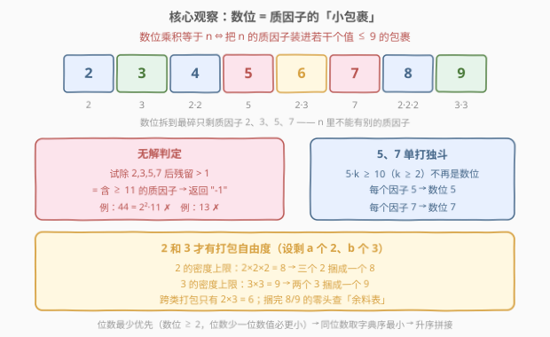
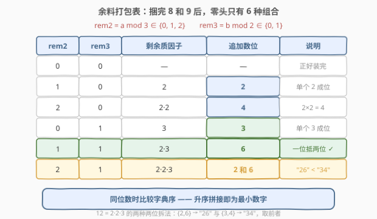
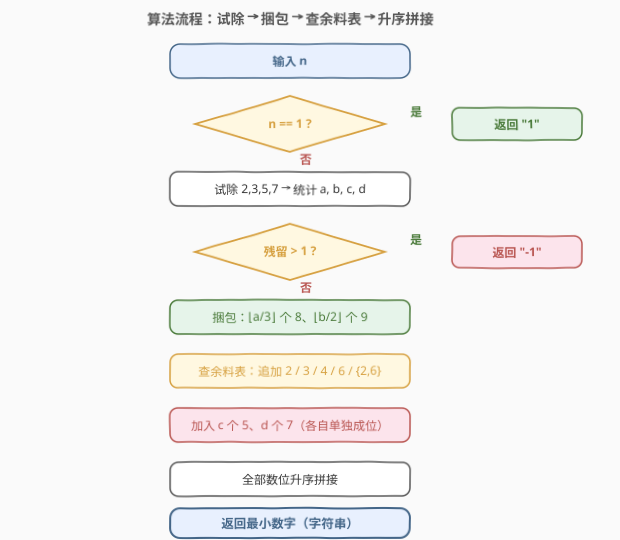
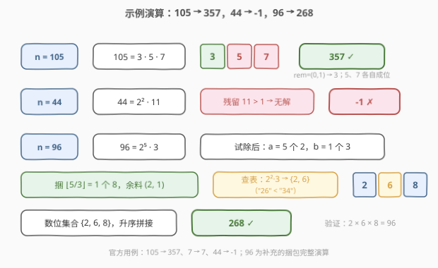

# 给定数字乘积的最小数字

- **题目名称**：给定数字乘积的最小数字
- **链接**：[2847. 给定数字乘积的最小数字](https://leetcode.cn/problems/smallest-number-with-given-digit-product/)
- **难度**：中等
- **标签**：贪心、数学

## 1. 题目概述

> ⚠️ 本题为 LeetCode 付费题，题意描述根据官方示例用例与 hints 重建，可能与官方题面有出入。

给你一个正整数 $n$。正整数 $x$ 的**数位乘积**定义为其所有数位的乘积，例如 $123$ 的数位乘积是 $1\times 2\times 3=6$。

返回数位乘积恰好等于 $n$ 的**最小正整数** $x$；若不存在这样的正整数，返回 $-1$。

**示例 1**：

```text
输入：n = 105
输出：357
解释：357 的数位乘积为 3 × 5 × 7 = 105。
可以证明 357 是数位乘积等于 105 的最小正整数。
```

**示例 2**：

```text
输入：n = 7
输出：7
解释：7 的数位乘积就是 7 本身，因此答案为 7。
```

**示例 3**：

```text
输入：n = 44
输出：-1
解释：44 = 2 × 2 × 11。数位 2~9 的质因数只有 2、3、5、7，
无法提供质因子 11，因此不存在数位乘积等于 44 的正整数。
```

**约束条件**（按 hints 重建）：

- $1 \le n \le 10^{18}$
- 答案可能长达 25 位（如 $n = 5^{25}$ 的答案是 25 个 "5"），**超出 64 位整数范围**，接口按返回字符串处理。

> 💡 本题核心是「**贪心 + 数学**」。关键词「数位乘积」「最小正整数」——正向枚举 $x$ 无从下手（值域无上界），但反向从 $n$ 的**质因数分解**入手，问题瞬间变成有限空间内的「装箱」：把质因子 $2,3,5,7$ 打包成若干个值不超过 9 的数位，**位数越少越好**。

---

## 2. 解题思路

### 2.1 暴力思路：为什么行不通

两个朴素方向都撞墙：

- **枚举 x**：从 1 开始逐个检验数位乘积是否等于 $n$？$x$ 的位数最多可达 25+ 位，且数位乘积分布极不均匀（含 0 的数乘积直接归零），枚举既无上界也无次序，必然超时。
- **DFS 枚举数位多重集**：既然答案的每个数位都整除 $n$，可以在 $\{2,\dots,9\}$ 上搜索乘积等于 $n$ 的多重集，每个多重集升序排列取最小拼接，再全局取最小。有整除剪枝确实能过，但最坏情形（$n = 2^k$ 型）路径数是 tribonacci 级别，实现繁琐——而且数位的代数结构其实已经把最优解「写死」了，完全不必搜索。

### 2.2 核心观察：质因数分解 + 按密度装箱

把 2~9 每个数位拆成质因数，一张表看清全部结构：

| 数位 | 2 | 3 | 4 | 5 | 6 | 7 | 8 | 9 |
|------|---|---|---|---|---|---|---|---|
| 质因数分解 | $2$ | $3$ | $2^2$ | $5$ | $2\cdot 3$ | $7$ | $2^3$ | $3^2$ |



三个关键结论：

1. **无解判定**：数位只含质因子 $2,3,5,7$，所以 $n$ 的质因子也必须只有这四个。把 $n$ 中的 $2,3,5,7$ 全部试除干净后，若剩余部分 $>1$（即存在 $\ge 11$ 的质因子），直接返回 `-1`。示例 3 的 $44 = 2^2\cdot 11$ 正是栽在这里。
2. **5 和 7 只能单打独斗**：$5\times k \ge 10$（$k\ge 2$）不再是数位，$7$ 同理。因此每个质因子 $5$ 必须独占一个数位 5，每个 $7$ 独占一个数位 7——毫无打包自由度。
3. **2 和 3 才有打包自由度，且密度有上限**：设剩余 $a$ 个 $2$、$b$ 个 $3$。由于所有数位 $\ge 2$（没有前导零问题），**位数少一位，数值必更小**，所以先最小化位数，等价于每个「包裹」尽量装满：
   - $2$ 的装箱密度上限是 $2^3 = 8$：三个 2 捆成一个 8；
   - $3$ 的装箱密度上限是 $3^2 = 9$：两个 3 捆成一个 9；
   - 跨类打包只有 $2\cdot 3 = 6$ 一种。

捆完 8 和 9 后的零头：$rem_2 = a \bmod 3 \in \{0,1,2\}$，$rem_3 = b \bmod 2 \in \{0,1\}$，组合只有 6 种，逐一枚举即得**余料打包表**：

| $rem_2$ | $rem_3$ | 剩余质因子 | 追加数位 | 说明 |
|---------|---------|------------|----------|------|
| 0 | 0 | — | — | 正好装完 |
| 1 | 0 | $2$ | 2 | 单个 2 直接成位 |
| 2 | 0 | $2^2$ | 4 | $2\cdot 2=4$ |
| 0 | 1 | $3$ | 3 | 单个 3 直接成位 |
| 1 | 1 | $2\cdot 3$ | 6 | 一位抵两位，优于 $\{2,3\}$ |
| 2 | 1 | $2^2\cdot 3$ | 2 和 6 | 同为两位时 "26" < "34"，取字典序小的拆法 |



最后把所有数位（若干 8、9，余料数位，加上 $c$ 个 5、$d$ 个 7）**升序拼接**——位数相同时，升序排列就是最小数（交换论证：交换相邻逆序对必使数值变小）。

> 💡 「先捆 8 和 9」为什么不会吃亏？若最优解把某个 8 拆得更碎，碎包裹要么导致位数更多（更差），要么在余料处拼出更大的首位（字典序更差）。零头仅 6 种组合，逐一验证即可确认表中方案全局最优——**微型 case analysis，覆盖即证明**。

### 2.3 算法流程图



**完整步骤**：

1. **特判** $n=1$：返回 "1"（这是唯一允许数位 1 出现的场景）
2. **试除** $2,3,5,7$ 统计个数 $a,b,c,d$；若除完残留 $>1$，返回 "-1"
3. **捆包**：$\lfloor a/3\rfloor$ 个 8，$\lfloor b/2\rfloor$ 个 9
4. **查余料表**：按 $(a\bmod 3,\ b\bmod 2)$ 追加对应数位
5. **补独立数位**：$c$ 个 5、$d$ 个 7
6. **升序拼接**所有数位，返回

### 2.4 示例演算



| $n$ | 质因数分解 | 捆包过程 | 数位集合 | 答案 |
|-----|-----------|----------|----------|------|
| 105 | $3\cdot 5\cdot 7$ | 无 8/9；$rem=(0,1)$ → 3；5、7 各自成位 | $\{3,5,7\}$ | **357** |
| 7 | $7$ | 7 单独成位 | $\{7\}$ | **7** |
| 44 | $2^2\cdot 11$ | 残留 $11>1$ → 无解 | — | **-1** |
| 96 | $2^5\cdot 3$ | $\lfloor 5/3\rfloor=1$ 个 8；$rem=(2,1)$ → $\{2,6\}$ | $\{2,6,8\}$ | **268** |

重点看 $n=96$：五个 2 捆出一个 8 后剩两个 2，与一个 3 组合成 $2^2\cdot 3=12$——拆成 $\{2,6\}$ 而不是 $\{3,4\}$，因为同为两位数 "26" < "34"。最终数位 $\{2,6,8\}$ 升序拼接得 268（$2\times 6\times 8=96$ ✓）。

再验证一个数位更多的：$n=720=2^4\cdot 3^2\cdot 5$ → 一个 8、一个 9，$rem=(1,0)$ → 2，加一个 5 → $\{2,5,8,9\}$ → **2589**（$2\times 5\times 8\times 9=720$ ✓）。

---

## 3. 参考代码

### C++

```cpp
class Solution {
public:
    string smallestNumber(long long n) {
        if (n == 1) return "1";
        int cnt[10] = {};                     // cnt[d]: 数位 d 的个数
        for (int p : {2, 3, 5, 7})            // 试除四个合法质因子
            while (n % p == 0) n /= p, cnt[p]++;
        if (n > 1) return "-1";               // 残留 ≥ 11 的质因子 → 无解

        cnt[8] = cnt[2] / 3, cnt[2] %= 3;     // 三个 2 捆成一个 8
        cnt[9] = cnt[3] / 2, cnt[3] %= 2;     // 两个 3 捆成一个 9
        if (cnt[2] == 1 && cnt[3] == 1) {     // 2·3 → 6
            cnt[6] = 1, cnt[2] = cnt[3] = 0;
        } else if (cnt[2] == 2 && cnt[3] == 1) {  // 2·2·3 → {2,6}，优于 {3,4}
            cnt[6] = 1, cnt[2] = 1, cnt[3] = 0;
        } else if (cnt[2] == 2) {             // 2·2 → 4
            cnt[4] = 1, cnt[2] = 0;
        }

        string ans;                           // 升序拼接即为最小
        for (int d = 2; d <= 9; d++) ans += string(cnt[d], '0' + d);
        return ans;
    }
};
```

### Python

```python
class Solution:
    def smallestNumber(self, n: int) -> str:
        if n == 1:
            return "1"
        cnt = [0] * 10                        # cnt[d]: 数位 d 的个数
        for p in (2, 3, 5, 7):                # 试除四个合法质因子
            while n % p == 0:
                n //= p
                cnt[p] += 1
        if n > 1:                             # 残留 ≥ 11 的质因子 → 无解
            return "-1"

        cnt[8], cnt[2] = divmod(cnt[2], 3)    # 三个 2 捆成一个 8
        cnt[9], cnt[3] = divmod(cnt[3], 2)    # 两个 3 捆成一个 9
        if cnt[2] == 1 and cnt[3] == 1:       # 2·3 → 6
            cnt[6] += 1
            cnt[2] = cnt[3] = 0
        elif cnt[2] == 2 and cnt[3] == 1:     # 2·2·3 → {2,6}，优于 {3,4}
            cnt[6] += 1
            cnt[2] = 1
            cnt[3] = 0
        elif cnt[2] == 2:                     # 2·2 → 4
            cnt[4] += 1
            cnt[2] = 0

        return "".join(str(d) * cnt[d] for d in range(2, 10))
```

> ⚠️ 本题为付费题，接口签名按题意重建：$n\le 10^{18}$ 用 64 位整数接收；答案最长可达 25 位——如 $n=5^{25}$ 的答案是 25 个 "5"——超出 `long long` 上限（$\approx 9.2\times 10^{18}$），故返回字符串。提交时若签名略有出入，微调入参/返回类型即可，核心逻辑不变。

> 💡 两版逻辑完全一致：试除 → 捆 8/9 → 查余料表 → 升序拼接。注意余料三分支的判断顺序：先判 $(1,1)$、$(2,1)$ 这两个含 3 的组合，剩下的才是纯 2 余料。

---

## 4. 复杂度分析

| 维度 | 复杂度 | 说明 |
|------|--------|------|
| **时间复杂度** | $O(\log n)$ | 试除 2,3,5,7 的总次数不超过质因子个数（$n\le 10^{18}$ 时至多约 60 次）；拼接答案 $O(\text{位数})\le O(\log n)$ |
| **空间复杂度** | $O(\log n)$ | 答案字符串本身，最坏约 25 位 |

> ⚠️ 对比 2.1 的多重集 DFS 暴力（最坏 tribonacci 级路径数），质因数分解把搜索空间彻底「数学化」成常数个分支——这正是本题作为中等题的考点：答案不是搜出来的，是**算**出来的。

---

## 5. 扩展：DFS 对拍验证器

贪心正确性最稳妥的验证方式是写一个暴力对拍器交叉检验（本文贪心与下述暴力在 $n\le 10^4$ 全范围内逐一比对一致）：

```python
def brute(n: int) -> str:
    if n == 1:
        return "1"
    best = None                          # (位数, 字符串) 双关键字比较

    def dfs(prod: int, digits: list) -> None:
        nonlocal best
        if prod == 1:                    # 质因子全部装完
            s = "".join(sorted(map(str, digits)))
            cand = (len(s), s)
            if best is None or cand < best:
                best = cand
            return
        for d in range(2, 10):           # 数位 1 不改变乘积只会更长，跳过
            if prod % d == 0:
                dfs(prod // d, digits + [d])

    dfs(n, [])
    return best[1] if best else "-1"
```

比较答案是 **(位数, 字典序) 双关键字**：先比位数（数位 $\ge 2$ 无前导零，位数少必更小），位数相同再比字典序——直接拿字符串比较会翻车，例如 `"4" > "26"` 但数值上 $4 < 26$。

顺带两个对称问题的思考：

- **改成求「最大」**：问题发散于无界——往任意答案里插任意多个 1，数位乘积不变而数值无限变大。数位 1 的存在让「最大」无意义；同理「最小」里也永不需要 1（除了 $n=1$ 本身）。
- **改成统计满足条件的 $x$ 的个数**：数位 1 同样让计数发散，必须约定「不含数位 1」或「固定位数」才有意义。

---

## 6. 面试要点

1. **为什么从质因数分解入手，而不是枚举 x？**

   - 正向看，$x$ 的值域无上界且数位乘积分布极不均匀（含 0 直接归零），枚举无次序无边界；反向看，「$n$ = 数位乘积」意味着 $n$ 的每个质因子都必须被某个 $2\sim 9$ 的数位吸收，而数位的质因子只有 $2,3,5,7$——问题收敛为「四个计数 + 装箱」。

2. **5 和 7 为什么必须单独成位？**

   - $5\times k\ge 10$（$k\ge 2$）不再是单个数位，$7$ 同理。也可从质因数表直读：能容纳因子 5 的数位只有 5，能容纳 7 的只有 7。

3. **「先捆 8 和 9」的最优性怎么论证？**

   - 分两层：① 位数优先——所有数位 $\ge 2$，$k$ 位数一定小于 $k+1$ 位数，故先最小化位数；② 密度上限——$2^3=8$、$3^2=9$ 是 2、3 各自的最高装箱密度，跨类只有 $6=2\cdot 3$。捆完后零头 $(a\bmod 3)\in\{0,1,2\}$、$(b\bmod 2)\in\{0,1\}$，仅 6 种组合，逐一枚举即完成证明（case analysis 覆盖即证明）。

4. **余料 $(2,1)$ 为什么拆 $\{2,6\}$ 而不是 $\{3,4\}$？**

   - $2^2\cdot 3=12$，两种拆法都是两位数：$\{2,6\}$ 升序是 "26"，$\{3,4\}$ 升序是 "34"，"26" < "34"。同位数时选排序后字典序最小的多重集。这类「同为最优位数时比字典序」的细节正是面试官最爱追问的点。

5. **为什么答案要返回字符串？**

   - $n\le 10^{18}$ 时答案最长可达 25 位：$n=5^{25}\approx 3\times 10^{17}$，答案是 25 个 "5"（$\approx 5.6\times 10^{24}$），远超 `long long` 上限。凡是「构造最小数」的题，先算清楚答案的**最坏位数**再定类型，是必备的边界意识。

> 💡 **一句话总结**：数位乘积 ⇔ 质因子装箱——试除 2,3,5,7 判无解，5/7 单独成位，2 三捆一 8、3 两捆一 9，余料 6 种组合查表，最后升序拼接。全程 $O(\log n)$，不搜索、纯计算。

---

## 7. 同类练习题

- [738. 单调递增的数字](../0701-0800/738_单调递增的数字.md)：同为「构造满足约束的最小数字」，从数位结构出发的贪心
- [2165. 重排数字的最小值](../2101-2200/2165_重排数字的最小值.md)：给定数位多重集求最小排列，与本题「升序拼接」同源
- [2578. 最小和分割](../2501-2600/2578_最小和分割.md)：数位重组贪心家族，把数位分配到两个数使总和最小
- [670. 最大交换](../0601-0700/670_最大交换.md)：数位贪心的对偶方向——交换一次数位求最大值
- [179. 最大数](https://leetcode.cn/problems/largest-number/)：数位拼接贪心经典题，拼接比较器与本题「字典序最小」思想互为镜像
