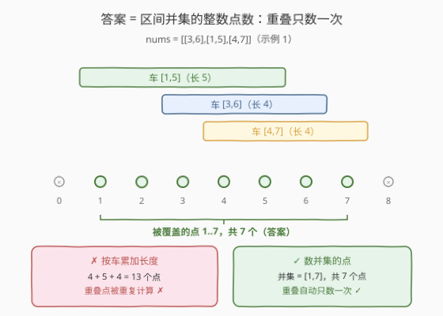
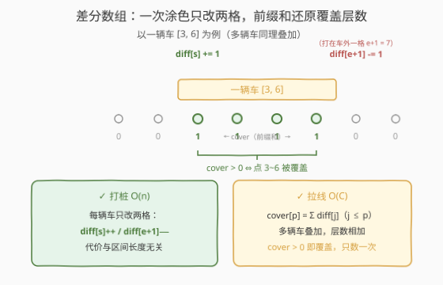
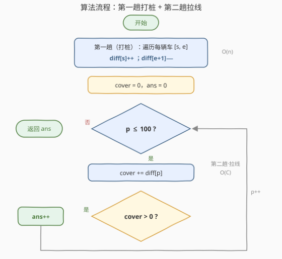

# LeetCode 与车相交的点 题解

## 1. 题目概述

- **标题 / 题号**：与车相交的点（#2848，easy）
- **链接**：https://leetcode.cn/problems/points-that-intersect-with-cars/
- **难度**：简单
- **标签**：数组、哈希表、前缀和

**题意**：给你一个下标从 **0** 开始的二维整数数组 `nums`，表示汽车停放在数轴上的坐标。对于任意下标 $i$，`nums[i] = [start_i, end_i]`，其中 $start_i$ 是第 $i$ 辆车的**起点**，$end_i$ 是第 $i$ 辆车的**终点**。

返回数轴上**被车任意部分覆盖**的整数点的数目。

换言之：把每辆车看作数轴上的闭区间 $[start_i, end_i]$，求这些区间**并集**覆盖的整数点个数——重叠的部分只数一次。

**示例 1**：

```text
输入：nums = [[3,6],[1,5],[4,7]]
输出：7
解释：从 1 到 7 的所有点都至少与一辆车相交，因此答案为 7。
```

**示例 2**：

```text
输入：nums = [[1,3],[5,8]]
输出：7
解释：1、2、3、5、6、7、8 共计 7 个点满足至少与一辆车相交，因此答案为 7。
```

**约束**：

- $1 \le \text{nums.length} \le 100$
- $\text{nums[i].length} = 2$
- $1 \le start_i \le end_i \le 100$

> 💡 读题关键：「被任意部分覆盖」翻译成集合语言就是**区间并集**——示例 2 中 $[1,3]$ 与 $[5,8]$ 不相连，中间的点 4 没被任何车盖住，不计入答案；而示例 1 的三辆车互相咬合，重叠点也只能数一次。另外值域只有 $[1, 100]$，这个「小值域」正是本题解法的突破口。

## 2. 解题思路

### 2.1 暴力思路

最直接的做法是**逐点枚举**：对每个整数点 $p \in [1, 100]$，扫描全部 $n$ 辆车，检查是否存在某辆车满足 $start_i \le p \le end_i$。时间复杂度 $O(C \cdot n)$（$C = 100$ 为值域上限），本题规模下最多 $10^4$ 次判断，必然能过。

稍作改进的**标记法**：把查询方向反过来，不查点而是涂色——每辆车把 $[start_i, end_i]$ 内的每个点塞进一个**哈希集合**（或布尔数组），集合天然对重叠去重，最后返回集合大小。代码最短，但每辆车要逐点塞入，时间复杂度为 $O\big(\sum_i (end_i - start_i + 1)\big)$，最坏 $O(nC)$。

两种做法都把「重叠只数一次」寄托在**去重结构**上，但没有利用「区间加」的结构性——差分数组能把单次涂色的代价从 $O(\text{区间长})$ 压到 $O(1)$。

### 2.2 核心观察：差分数组——区间「涂色」只改两格



**观察 1（问题的本质）**：答案 = 区间并集覆盖的整数点数。示例 1 中三辆车总长 $4 + 5 + 4 = 13$，但并集只有 $[1, 7]$ 共 7 个点——朴素累加会把重叠部分重复计入，这正是必须「取并集」的原因。

**观察 2（怎么高效涂色）**：给区间 $[s, e]$ 的每个点「覆盖层数 +1」是经典的**区间加法**。维护差分数组 `diff`，一次涂色只需改两格：

$$\text{diff}[s] \mathrel{+}= 1, \qquad \text{diff}[e+1] \mathrel{-}= 1$$

随后从左到右累加前缀和 $\text{cover}[p] = \sum_{j \le p} \text{diff}[j]$，即得每个点的**覆盖层数**：$s$ 处起 +1，$e+1$ 处被 −1 抵消归零，恰好覆盖 $[s, e]$；多辆车叠加时层数相加。**被覆盖 ⇔ cover > 0**，与层数是 1 还是 3 无关。



> 💡 差分是前缀和的**逆运算**：先对每辆车打两个桩（$O(1)$），再对全值域拉一条前缀和（$O(C)$），就还原出每个点的覆盖层数——「打桩 + 拉线」换掉了「逐点涂色」，重叠去重由「层数相加后判正」自动完成。

值域 $C = 100$ 很小，`diff` 开 102 个格子即可（$e + 1$ 最大到 101）。

### 2.3 算法流程图



整个算法只有两趟：

1. **第一趟（打桩）**：遍历每辆车，`diff[s]++`、`diff[e+1]--`，单辆车 $O(1)$；
2. **第二趟（拉线）**：$p$ 从 1 扫到 100，滚动累加 $\text{cover} \mathrel{+}= \text{diff}[p]$，`cover > 0` 则 `ans++`。

没有排序、没有去重结构、没有逐点涂色——小值域区间计数题的标准形态。

### 2.4 示例演算


以示例 1 `nums = [[3,6],[1,5],[4,7]]` 为例。三辆车各打一对桩：$[3,6]$ → diff[3]+1、diff[7]−1；$[1,5]$ → diff[1]+1、diff[6]−1；$[4,7]$ → diff[4]+1、diff[8]−1。汇总后从左到右拉前缀和：

| $p$ | 1 | 2 | 3 | 4 | 5 | 6 | 7 | 8 | 9..100 |
|-----|---|---|---|---|---|---|---|---|--------|
| diff[p] | +1 | 0 | +1 | +1 | 0 | −1 | −1 | −1 | 0 |
| cover | 1 | 1 | 2 | 3 | 3 | 2 | 1 | 0 | 0 |
| 覆盖？ | ✓ | ✓ | ✓ | ✓ | ✓ | ✓ | ✓ | ✗ | ✗ |

`cover > 0` 的点恰为 $1 \sim 7$，共 **7** 个，与示例答案一致。顺带还能读出重叠信息：点 4 被三辆车同时盖住（cover = 3），点 7 只剩一辆（cover = 1）——「层数」比「布尔标记」多出来的额外信息，正是差分解法白送的红利。

## 3. 参考代码

### C++

```cpp
class Solution {
public:
    int numberOfPoints(vector<vector<int>>& nums) {
        int diff[102] = {0};
        for (auto& car : nums) {          // 第一趟（打桩）：每辆车改两格
            diff[car[0]]++;
            diff[car[1] + 1]--;
        }
        int ans = 0, cover = 0;
        for (int p = 1; p <= 100; p++) {  // 第二趟（拉线）：前缀和数正数
            cover += diff[p];
            ans += cover > 0;
        }
        return ans;
    }
};
```

### Python

```python
class Solution:
    def numberOfPoints(self, nums: List[List[int]]) -> int:
        diff = [0] * 102
        for s, e in nums:                 # 第一趟（打桩）：每辆车改两格
            diff[s] += 1
            diff[e + 1] -= 1
        ans = cover = 0
        for p in range(1, 101):           # 第二趟（拉线）：前缀和数正数
            cover += diff[p]
            ans += cover > 0
        return ans
```

> 💡 若追求极简，哈希集合一行也能过：`len({p for s, e in nums for p in range(s, e + 1)})`——但那是 $O(nC)$ 的逐点涂色；差分数组 $O(n + C)$ 才是把「区间」当「区间」对待的写法。

## 4. 复杂度分析

| 维度 | 复杂度 | 说明 |
|------|--------|------|
| 时间复杂度 | $O(n + C)$ | 第一趟 $n$ 辆车各改两格；第二趟扫值域 $[1, 100]$ 共 $C = 100$ 步 |
| 空间复杂度 | $O(C)$ | 差分数组 102 个整数，与车数 $n$ 无关 |

> 💡 对比：逐点暴力 $O(C \cdot n)$、哈希集合 $O\big(\sum \text{len}_i\big)$、差分数组 $O(n + C)$。本题 $n, C \le 100$ 三种写法都秒过，真正值得带走的是「**小值域上的区间计数 → 差分**」这套思维——它把去重、重叠、计数一并解决。

## 5. 扩展：值域变大时——排序 + 区间合并

差分数组按值域开空间，若把约束改成 $1 \le end_i \le 10^9$（车数仍为 $10^2$ 量级），102 个格子就不够用了（官方 hint 也指向这条路：按左端点排序后去掉重叠部分再数点）。此时应回到「并集」本源：**按左端点排序后线性合并**，不相连的区间各算各的长度，相交或包含的区间只延伸右端点：

```cpp
class Solution {
public:
    int numberOfPoints(vector<vector<int>>& nums) {
        sort(nums.begin(), nums.end());
        int ans = 0, curEnd = 0;
        for (auto& car : nums) {
            int s = car[0], e = car[1];
            if (s > curEnd) {          // 与已合并部分不相连：整段新增
                ans += e - s + 1;
                curEnd = e;
            } else if (e > curEnd) {   // 相交但更远：只延伸尾巴
                ans += e - curEnd;
                curEnd = e;
            }
        }
        return ans;
    }
};
```

```python
class Solution:
    def numberOfPoints(self, nums: List[List[int]]) -> int:
        nums.sort()
        ans, cur_end = 0, 0
        for s, e in nums:
            if s > cur_end:
                ans += e - s + 1
                cur_end = e
            elif e > cur_end:
                ans += e - cur_end
                cur_end = e
        return ans
```

时间 $O(n \log n)$、空间 $O(1)$，与值域彻底解耦。两套解法的选择标准一句话：**值域小用差分，值域大用排序合并**。

## 6. 面试要点

1. **为什么是 `diff[e+1]--` 而不是 `diff[e]--`？**

   > 区间 $[s, e]$ 是**闭区间**，$e$ 本身要被覆盖。前缀和走到 $e+1$ 时才把 +1 抵消归零，还原后恰好 $[s, e]$ 层数为 1；若写在 $e$，点 $e$ 就漏盖了。这是差分写法最常见的 off-by-one。

2. **cover 用「大于 0」判断，能改成「等于 1」吗？**

   > 不能。多辆车重叠时层数会累加到 2、3（示例 1 的点 4 层数为 3），只要 ≥ 1 就算被覆盖。反过来，若题目改问「恰好被 k 辆车覆盖」，判 `cover == k` 即可——层数信息是差分解法白送的。

3. **哈希集合解法差在哪里？什么时候它反而更好？**

   > 集合写法 $O\big(\sum \text{len}_i\big)$，区间长而多时退化明显；但它不依赖值域连续。若点是大范围稀疏整数（如 $10^9$ 量级且无序），差分数组开不下，就得用排序合并或「离散化 + 差分」。

4. **和 [56. 合并区间](https://leetcode.cn/problems/merge-intervals/) 是什么关系？**

   > 本题答案 = 合并区间后各段长度之和。56 输出合并后的区间列表（结构），本题只要总点数（数值）；第 5 节的扩展解法就是 56 的模板直接复用。

5. **第二趟为什么扫到 100 就够，不用扫到 101？**

   > $end_i \le 100$，被覆盖的点最大只到 100；101 处只可能承接来自 $e = 100$ 的 −1 桩，cover 归零后不会再变正。差分数组开 102 只是给 $e+1$ 留写入位置，不参与计数。

## 同类练习题

| # | 题目 | 与本题的关联 |
|---|------|-------------|
| 56 | [合并区间](https://leetcode.cn/problems/merge-intervals/) | 区间并集的通用模板，本题答案 = 合并后各段长度之和 |
| 1109 | [航班预订统计](https://leetcode.cn/problems/corporate-flight-bookings/) | 差分数组区间加法的招牌应用，前缀和还原每个航班的预订座位数 |
| 1854 | [人口最多的年份](https://leetcode.cn/problems/maximum-population-year/) | 出生/死亡年区间计数，diff[birth]++、diff[death+1]−− 同款打桩 |
| 986 | [区间列表的交集](https://leetcode.cn/problems/interval-list-intersections/) | 区间家族对照题——交集 vs 本题并集，双指针归并的另一面 |
| 228 | [汇总区间](https://leetcode.cn/problems/summary-ranges/) | 把连续整数点打包回区间，恰是本题「数点 → 存区间」的逆操作 |
