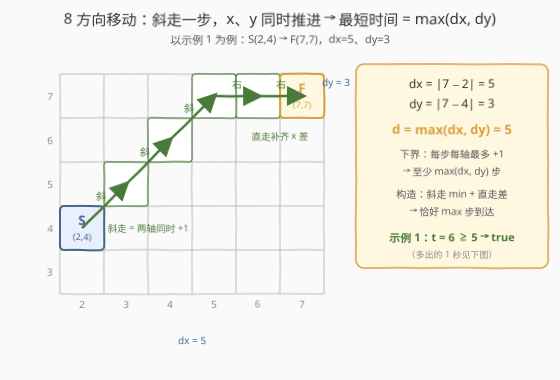
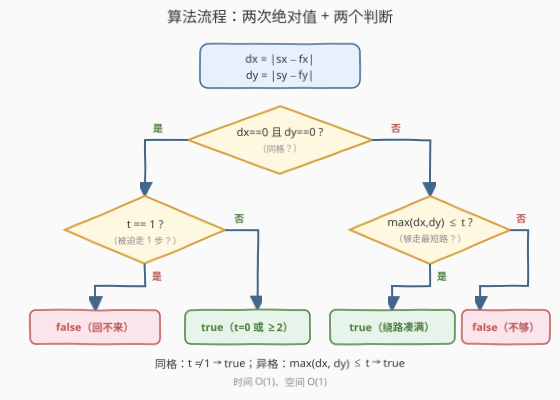
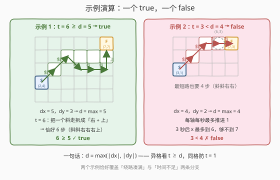

# 判断能否在给定时间到达单元格

- **题目名称**：判断能否在给定时间到达单元格
- **链接**：[2849. 判断能否在给定时间到达单元格](https://leetcode.cn/problems/determine-if-a-cell-is-reachable-at-a-given-time/)
- **难度**：中等
- **标签**：数学、几何

## 1. 题目概述

给你四个整数 `sx`、`sy`、`fx`、`fy` 以及一个**非负整数** `t`。

在一个无限的二维网格中，你从单元格 `(sx, sy)` 开始出发。每一秒，你**必须**移动到一个与当前单元格**相邻**的单元格中（相邻指共享至少一个角的 8 个单元格，即横、竖、斜三个方向都可以）。你可以多次访问同一个单元格。

如果你能**恰好** `t` 秒后到达单元格 `(fx, fy)`，返回 `true`；否则返回 `false`。

**示例 1**：

```text
输入：sx = 2, sy = 4, fx = 7, fy = 7, t = 6
输出：true
解释：从 (2, 4) 出发，可以经过上图路径在恰好 6 秒后到达 (7, 7)。
```

**示例 2**：

```text
输入：sx = 3, sy = 1, fx = 7, fy = 3, t = 3
输出：false
解释：从 (3, 1) 到 (7, 3) 至少需要 4 秒，因此无法在 3 秒后到达。
```

**约束条件**：

- $1 \le sx, sy, fx, fy \le 10^9$
- $0 \le t \le 10^9$

> 💡 读题抓三个关键词：「**每秒必须移动**」——不能原地等待；「**恰好 t 秒**」——不是至多，多一秒少一秒都不行；「**相邻含对角**」——8 邻接，斜走一步合法。再看数据范围：坐标和时间都到 $10^9$，任何逐格 BFS / 模拟都必然爆炸，答案只能是 $O(1)$ 的数学判定。

---

## 2. 解题思路

### 2.1 暴力思路

最直觉的做法是 **BFS**：从 $(sx, sy)$ 出发逐秒扩散，记录第 $k$ 秒可达的格子集合，看 $(fx, fy)$ 是否恰好在第 $t$ 层。但第 $k$ 秒可达的区域是以起点为中心、切比雪夫半径为 $k$ 的正方形，面积约 $(2k+1)^2$；$t$ 达 $10^9$ 时状态数是 $10^{18}$ 量级，彻底不可行。

DP 同样无从下手——网格无限、没有障碍、没有结构可记。正确的方向是**反过来刻画**：不模拟走法，直接回答两个数学问题：

1. 从 S 到 F **至少**要多少秒？（最短时间）
2. 比「至少」多出来的时间，能不能**精确凑整**到恰好 $t$ 秒？（奇偶性 / 绕路）

### 2.2 核心观察：切比雪夫距离 + 绕路自由



**观察 1（最短时间 = 切比雪夫距离）**：记 $dx = |sx - fx|$，$dy = |sy - fy|$。

- **下界**：每一步中 $x$ 坐标最多变化 1，故至少要走 $dx$ 步；$y$ 同理至少 $dy$ 步；两者须同时满足，所以至少 $\max(dx, dy)$ 步。
- **构造**：先沿对角线走 $\min(dx, dy)$ 步（两轴同时推进），再沿较长的一轴直走 $|dx - dy|$ 步，恰好 $\max(dx, dy)$ 步到达。

所以最短时间 $d = \max(dx, dy)$——这正是**切比雪夫距离**（Chebyshev distance），国际象棋里「王」的走法距离。

**观察 2（多余的时间可以随便凑）**：本题第二个关键在于，「恰好」并不卡奇偶性：

- **多 2 秒**：任意时刻去邻格打个转再回来，路径长度 $+2$；
- **多 1 秒**：把一步替换成等位移的两步——斜走 $(0,0) \to (1,1)$ 拆成 $(0,0) \to (1,0) \to (1,1)$；纯直线路径里的一步直走 $(0,0) \to (1,0)$ 也可以换成「侧移 + 斜回」$(0,0) \to (0,1) \to (1,0)$，时长 $+1$。

$+1$ 与 $+2$ 的任意组合覆盖所有多余量，因此**异格时只要 $t \ge d$，每个整数秒都恰好可达**。对比：若只许 4 方向移动，斜走不存在，$+1$ 凑不出来，奇偶性就被锁死了（见第 5 节）。


**观察 3（唯一的例外）**：起点 = 终点（$dx = dy = 0$）时 $d = 0$，按观察 2 似乎任何 $t$ 都行，但「每秒必须移动」在这里反咬一口：

- $t = 0$：原地不动即达 → `true`；
- $t = 1$：第 1 秒被迫离开起点，1 秒末必然不在起点 → **`false`**（唯一反例）；
- $t \ge 2$：去邻格再回来（2 秒）；$t = 3$ 走一个「斜 + 横 + 竖」的三角形回到原点；更久就叠加 $+2$ → `true`。

于是同格时答案为 $t \ne 1$。

### 2.3 算法流程图



整个算法就是「两次绝对值 + 两个分支」：

1. 计算 $dx = |sx - fx|$、$dy = |sy - fy|$；
2. 若 $dx = dy = 0$（同格）：返回 $t \ne 1$；
3. 否则（异格）：返回 $\max(dx, dy) \le t$。

### 2.4 示例演算



- **示例 1**：$dx = 5$，$dy = 3$，$d = \max(5, 3) = 5 \le 6$ → `true`。恰好 6 秒的走法：斜、斜、右、右、右、上（2 斜 + 3 右 + 1 上，位移恰为 $(+5, +3)$）——相当于把最短路径中的一个斜走拆成了「右 + 上」两步。
- **示例 2**：$dx = 4$，$dy = 2$，$d = \max(4, 2) = 4 > 3$ → `false`。每轴每秒最多推进 1，3 秒后 $x$ 最多到 6，根本够不着 $x = 7$ 的终点。

---

## 3. 参考代码

### C++

```cpp
class Solution {
public:
    bool isReachableAtTime(int sx, int sy, int fx, int fy, int t) {
        int dx = abs(sx - fx), dy = abs(sy - fy);
        if (dx == 0 && dy == 0) return t != 1;  // 同格：被迫走 1 步，回不来
        return max(dx, dy) <= t;                // 切比雪夫距离 ≤ t 即可达
    }
};
```

### Python

```python
class Solution:
    def isReachableAtTime(self, sx: int, sy: int, fx: int, fy: int, t: int) -> bool:
        dx, dy = abs(sx - fx), abs(sy - fy)
        if dx == 0 and dy == 0:
            return t != 1        # 同格：被迫走 1 步，回不来
        return max(dx, dy) <= t  # 切比雪夫距离 ≤ t 即可达
```

> 💡 坐标上界 $10^9$，`int` 装得下，无溢出风险。写完默念三遍特判：**同格、t=1、false**——直接写 `return max(dx, dy) <= t` 会在 $sx=fx,\ sy=fy,\ t=1$ 上翻车，这是本题九成错解的来源。

---

## 4. 复杂度分析

| 维度 | 复杂度 | 说明 |
|------|--------|------|
| 时间复杂度 | $O(1)$ | 两次减法取绝对值 + 一次 max + 一次比较 |
| 空间复杂度 | $O(1)$ | 只用常数个变量 |

> 💡 对比：BFS 需要 $O(t^2)$ 且 $t \le 10^9$ 不可行；数学判定 $O(1)$ 才是本题的期望解。「坐标很大」往往是「别搜索、找公式」的信号。

---

## 5. 扩展：若只许上下左右 4 方向移动？

把「8 邻接」改成「4 邻接」，结论立刻变样：

- **最短时间**变成**曼哈顿距离** $|dx| + |dy|$（每步只推一轴）；
- **浪费只能成对**：没有斜走可拆，$+1$ 凑不出来，只剩「去—回」式 $+2$ → 奇偶性被锁死。

可达判定变为：

$$t \ge |dx| + |dy| \quad \text{且} \quad t - \big(|dx| + |dy|\big) \equiv 0 \pmod{2}$$

顺带一个常考的坐标变换：把每个点 $(x, y)$ 映射为 $(x+y,\ x-y)$（坐标系旋转 45°），**切比雪夫距离就变成了曼哈顿距离**。两套距离互相转换的套路见 1131 题。

---

## 6. 面试要点

1. **为什么最短时间是 $\max(dx, dy)$ 而不是 $|dx| + |dy|$？**

   > 8 邻接允许斜走：一步同时推进两轴各 1。下界——每步每轴最多变化 1，故步数 $\ge dx$ 且 $\ge dy$；构造——斜走 $\min(dx, dy)$ 步 + 直走 $|dx - dy|$ 步恰好取等。若只有 4 方向，斜走没了，才退回曼哈顿距离。

2. **「恰好 t 秒」为什么不用管奇偶性？**

   > 因为存在「$+1$ 操作」：一步斜走可拆成两步直走（或一步直走换成侧移 + 斜回），时长 $+1$；再配合邻格踱步 $+2$，能凑出任意多余量。$+1$ 操作依赖斜走——这正是 4 方向版本奇偶锁死、8 方向版本奇偶自由的根本原因。

3. **为什么同格且 t=1 是 false？t=3 呢？**

   > 每秒必须移动：$t=1$ 时第 1 秒被迫离开起点，1 秒末不可能在起点。$t=3$ 却可以：走「斜 + 横 + 竖」的三角形（如 $(0,0) \to (1,1) \to (1,0) \to (0,0)$）恰好 3 步回原点；$t \ge 2$ 的其他值用三角形（3 步）与踱步（$+2$）组合即可全覆盖。

4. **这题最容易写错的点是什么？**

   > 漏掉同格特判：$\max(0, 0) = 0 \le t$ 对任何 $t \ge 0$ 都成立，朴素公式会对「同格 + $t=1$」错误地返回 true。同格时正确答案是 $t \ne 1$。

5. **如果网格里再加障碍物呢？**

   > 解析解失效，回到 BFS / A*（带障碍的 8 方向最短路，参考 1091 题）；「恰好 $t$ 秒」的判定仍可用「最短路 $\le t$ 且能凑出 $t - $ 最短路」的框架，只是凑法要在图上验证（按步数奇偶分层建图的思想）。

---

## 7. 同类练习题

- [1266. 访问所有点的最小时间](https://leetcode.cn/problems/minimum-time-visiting-all-points/)：逐段累加切比雪夫距离，本题的「多点巡游」版
- [1091. 二进制矩阵中的最短路径](https://leetcode.cn/problems/shortest-path-in-binary-matrix/)：带障碍的 8 邻接最短路 BFS，本题可视为它无障碍时的 $O(1)$ 解析解
- [1131. 绝对值表达式的最大值](https://leetcode.cn/problems/maximum-of-absolute-value-expression/)：切比雪夫 ↔ 曼哈顿距离转换（旋转 45° 坐标系）的经典应用
- [874. 模拟行走机器人](https://leetcode.cn/problems/walking-robot-simulation/)：网格移动模拟题，体会「能模拟」与「能公式化」的边界
