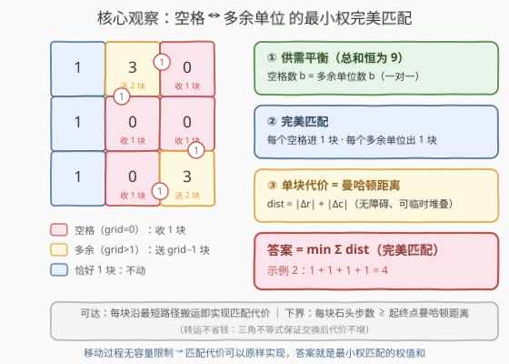
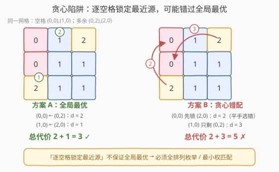
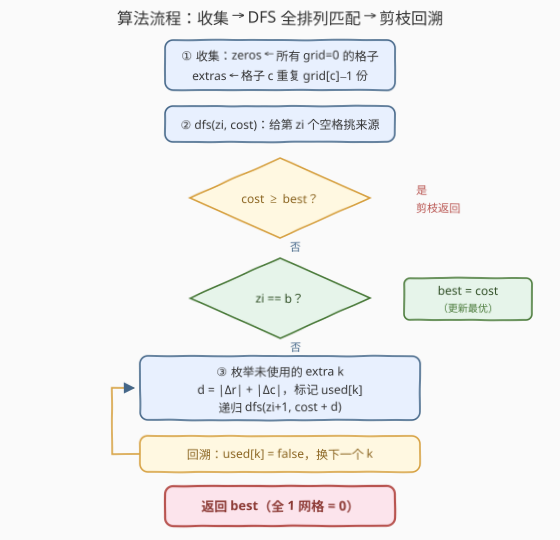
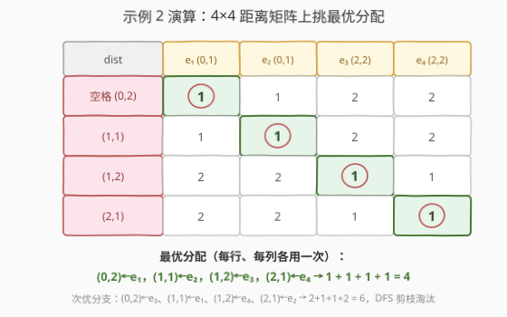

# LeetCode 将石头分散到网格图的最少移动次数 题解

## 1. 题目概述

- **标题 / 题号**：将石头分散到网格图的最少移动次数（#2850，medium）
- **链接**：https://leetcode.cn/problems/minimum-moves-to-spread-stones-over-grid/
- **难度**：中等
- **标签**：数组、回溯、状态压缩、动态规划、矩阵

**题意**：给定一个 `3 × 3` 的二维整数矩阵 `grid`，`grid[i][j]` 表示格子 `(i, j)` 里的石头数目，网格中总共恰好有 `9` 个石头（一个格子可能有多个石头）。

每一次操作，可以把**一个**石头从它当前所在格子移动到一个**至少有一条公共边**的相邻格子。

返回让**每个格子恰好有一个石头**的最少移动次数。

**示例 1**：

```text
输入：grid = [[1,1,0],[1,1,1],[1,2,1]]
输出：3
解释：(2,1) 有 2 个石头，把多余的一个沿 (2,1)→(2,2)→(1,2)→(0,2) 移进空格 (0,2)，共 3 步。
```

**示例 2**：

```text
输入：grid = [[1,3,0],[1,0,0],[1,0,3]]
输出：4
解释：(0,1) 的 2 个多余石头分别移到 (0,2) 和 (1,1)；(2,2) 的 2 个多余石头
     分别移到 (1,2) 和 (2,1)。每块都走 1 步，共 4 步。
```

**约束**：

- `grid.length == grid[i].length == 3`
- `0 <= grid[i][j] <= 9`
- `grid` 中元素之和为 `9`

> 💡 抓住两个题面细节：① 网格恒为 `3 × 3` 且石头总数恒为 `9`——**状态规模极小**，官方 hint 也点明"含多于一个石头的格子至多 4 个"；② 移动过程对中间状态**没有任何限制**（格子石头数可以临时为 0、可以堆叠）。这两点是本题能一步转化为"最小权完美匹配"的钥匙。

## 2. 解题思路

### 2.1 暴力思路：BFS 搜索所有状态

最直接的做法是把整个网格的石头分布当作一个**状态节点**：初始状态为 `grid`，目标状态为每格 1 块；每次操作"从某格移 1 块到相邻格"是一条边，对状态图做 **BFS** 求最短路。

由于 `9` 块石头放进 `9` 个格子、每格数量不限，状态总数为不定方程 $x_1+x_2+\cdots+x_9=9$ 的非负整数解数 $\binom{17}{8}=24310$，每个状态至多 `9 × 4 = 36` 种转移。BFS 完全可行，但实现繁琐（状态哈希、去重），而且**完全没有用到"答案只由谁补给谁决定"的结构**——杀鸡用了牛刀。

换个视角：最终每个空格恰好进 1 块石头，这些石头全部来自"多余"的格子。**要决策的只有"哪个空格由哪个多余单位来填"**，这正是规模极小的匹配问题。

### 2.2 核心观察：空格 ↔ 多余石头 的最小权完美匹配

**事实 1（供需恰好平衡）**：石头总数为 `9`，目标也是 9 格各 1 块。格子 $c$ 若有 $k$ 块石头，最终留 1 块、要送走 $k-1$ 块（这些是**多余单位**）；值为 `0` 的格子（**空格**）则要收 1 块。于是

$$\text{空格数} = \sum_c \max(\text{grid}[c]-1,\ 0) = \text{多余单位数}$$

每个空格恰好收 1 块、每个多余单位恰好送 1 块——这是一对一的**完美匹配**。

**事实 2（单块搬运代价 = 曼哈顿距离）**：网格无障碍，且移动途中石头可以在任何格子临时堆叠（没有容量约束），所以把一块石头从 $A=(r_A,c_A)$ 搬到 $B=(r_B,c_B)$ 的最少步数就是曼哈顿距离

$$\mathrm{dist}(A,B)=|r_A-r_B|+|c_A-c_B|$$

**定理（答案 = 最小权完美匹配的权值和）**，从两个方向看：

- **可达（≤）**：任取一个匹配方案，让每块多余石头沿最短路径（比如先横后竖）走进配对的空格，互不干扰，总步数恰好为 $\sum \mathrm{dist}$；
- **下界（≥）**：任何移动方案中，跟踪每块石头的完整轨迹，它从起点格到终点格的实际步数 ≥ 起终点的曼哈顿距离（一步移动至多让距离缩短 1）。把"终点落在空格"的石头收集起来，恰好构成一个匹配；若某格子既有石头搬出又有石头搬入（转运），由三角不等式交换身份后代价不增，故可设每格只出不进或只进不出。于是总步数 ≥ 某个完美匹配的 $\sum \mathrm{dist}$ ≥ 最小权匹配。



> ⚠️ **贪心陷阱**：能否让每个空格各自挑"最近的多余石头"并锁定？不行——局部最优 ≠ 全局最优。看 `grid = [[0,1,2],[0,1,1],[2,1,1]]`：空格 `(0,0)` 和 `(1,0)`，多余单位在 `(0,2)` 和 `(2,0)`。若 `(0,0)` 先锁定了同样距离为 2 的 `(2,0)`，`(1,0)` 只能要 `(0,2)`（距离 3），总代价 `2+3=5`；而全局最优是 `(0,0)←(0,2)`、`(1,0)←(2,0)`，总代价 `2+1=3`。**必须做全局枚举（或最小权匹配）**。



**规模有多大？** 空格数 $b \le 8$（极端 `[[9,0,...],[0,...]]` 只有一个非空格）；且含多余石头的格子至多 4 个（5 个格子各 2 块就有 10 块 > 9）。全排列枚举上界 $8! = 40320$，加上"代价已不小于当前最优"的剪枝，实际远小于此——**回溯全排列足矣**。

### 2.3 算法流程图



**完整步骤**：

1. **收集**：扫描 9 个格子，`grid[i][j] == 0` 的记入 `zeros`；否则把格子 `(i,j)` 重复 `grid[i][j] - 1` 次记入 `extras`（有几块多余就记几份）
2. **DFS** `dfs(zi, cost)`：为第 `zi` 个空格挑选来源
   - **剪枝**：`cost >= best` 直接返回
   - **终止**：`zi == len(zeros)` 时所有空格都有着落，更新 `best = min(best, cost)`
   - **枚举**：对每个未使用的多余单位 `k`，代价累加曼哈顿距离，标记 `used[k]`，递归 `dfs(zi + 1, cost + dist)`
   - **回溯**：取消标记 `used[k] = false`
3. 返回 `best`（全 1 网格没有空格，`best = 0`）

### 2.4 示例演算

以示例 2 `grid = [[1,3,0],[1,0,0],[1,0,3]]` 为例：空格 4 个——`(0,2), (1,1), (1,2), (2,1)`；多余单位 4 个——$e_1, e_2$ 来自 `(0,1)`，$e_3, e_4$ 来自 `(2,2)`。

先列出 4 × 4 的**距离矩阵**，再在矩阵上找一组"每行每列各用一次"的分配使总和最小：



| 步骤 | 决策 | 距离 | 累计代价 | 说明 |
|------|------|------|----------|------|
| 1 | `(0,2) ← e₁(0,1)` | 1 | 1 | 多余单位相邻右移 |
| 2 | `(1,1) ← e₂(0,1)` | 1 | 2 | 相邻下移 |
| 3 | `(1,2) ← e₃(2,2)` | 1 | 3 | 相邻上移 |
| 4 | `(2,1) ← e₄(2,2)` | 1 | 4 | 相邻左移，全部空格填满，`best = 4` |

DFS 也会探索次优分支，例如 `(0,2) ← e₃(2,2)`（距离 2）开头的方案最好也只能凑出 `2+1+1+2 = 6`，被剪枝淘汰。最终答案 **4**，与示例一致。

> 💡 对示例 1（只有 1 个空格 `(0,2)` 和 1 个多余单位 `(2,1)`）距离矩阵退化成 1 × 1：答案就是 $|2-0|+|1-2|=3$。

## 3. 参考代码

### C++

```cpp
// 将石头分散到网格图的最少移动次数 —— 空格 × 多余单位的最小权完美匹配
// 编译: g++ -O2 -std=c++17 2850.cpp -o sol
#include <vector>
#include <functional>
#include <climits>
#include <cstdlib>
using namespace std;

class Solution {
  public:
    int minimumMoves(vector<vector<int>>& grid) {
        vector<pair<int,int>> zeros, extras;          // 空格 / 多余石头单位
        for (int i = 0; i < 3; ++i)
            for (int j = 0; j < 3; ++j) {
                if (grid[i][j] == 0) zeros.emplace_back(i, j);
                for (int k = 1; k < grid[i][j]; ++k)  // 有几块多余就记几份
                    extras.emplace_back(i, j);
            }

        int m = (int)extras.size();
        vector<bool> used(m, false);
        int best = INT_MAX;

        // 给第 zi 个空格挑一个还没用过的多余单位
        function<void(int,int)> dfs = [&](int zi, int cost) {
            if (cost >= best) return;                 // 剪枝：已不可能更优
            if (zi == (int)zeros.size()) {            // 每个空格都有了着落
                best = cost;
                return;
            }
            for (int k = 0; k < m; ++k) {
                if (used[k]) continue;
                used[k] = true;
                int d = abs(zeros[zi].first  - extras[k].first)
                      + abs(zeros[zi].second - extras[k].second);
                dfs(zi + 1, cost + d);
                used[k] = false;                      // 回溯
            }
        };
        dfs(0, 0);
        return best == INT_MAX ? 0 : best;            // 全 1 网格：无空格，0 步
    }
};
```

### Python

```python
class Solution:
    def minimumMoves(self, grid: List[List[int]]) -> int:
        zeros, extras = [], []
        for i in range(3):
            for j in range(3):
                if grid[i][j] == 0:
                    zeros.append((i, j))
                for _ in range(grid[i][j] - 1):       # 有几块多余就记几份
                    extras.append((i, j))

        n, m = len(zeros), len(extras)
        best = inf
        used = [False] * m

        def dfs(zi: int, cost: int) -> None:
            nonlocal best
            if cost >= best:                          # 剪枝：已不可能更优
                return
            if zi == n:                               # 每个空格都有了着落
                best = cost
                return
            for k in range(m):
                if used[k]:
                    continue
                used[k] = True
                d = abs(zeros[zi][0] - extras[k][0]) + abs(zeros[zi][1] - extras[k][1])
                dfs(zi + 1, cost + d)
                used[k] = False                       # 回溯

        dfs(0, 0)
        return 0 if best == inf else best
```

> 💡 两个实现细节：① `extras` 中同一格子的多块多余石头是**独立条目**（同一来源可以填多个空格），所以用 `used` 逐个标记而不是"每格一个标记"；② `cost >= best` 剪枝把排列树大幅砍小，是回溯求最值的标配。

## 4. 复杂度分析

| 维度 | 复杂度 | 说明 |
|------|--------|------|
| **时间复杂度** | $O(b! \cdot b)$ | $b$ 为空格数（= 多余单位数），$b \le 8$，全排列上界 $8! = 40320$；含多余石头的格子至多 4 个，实际搜索树远小于上界 |
| **空间复杂度** | $O(b)$ | `zeros` / `extras` / `used` 数组 + 递归栈深度均不超过 $b \le 8$ |

## 5. 扩展：状压 DP 写法与 BFS 对拍验证

### 5.1 状态压缩 DP

把"哪些多余单位已被分配"编码成 `m` 位二进制 `mask`。由于每次恰好填一个空格，**已分配单位数 = 已填空格数**，即第 $\mathrm{popcount}(mask)$ 个空格正在决策：

$$dp[mask] = \min_{k \notin mask}\ dp[mask \setminus \{k\}] + \mathrm{dist}(\text{zeros}[\mathrm{popcount}(mask)-1],\ \text{extras}[k])$$

答案为 $dp[2^m - 1]$（完美匹配用满全部单位）。

```python
class Solution:
    def minimumMoves(self, grid: List[List[int]]) -> int:
        zeros, extras = [], []
        for i in range(3):
            for j in range(3):
                if grid[i][j] == 0:
                    zeros.append((i, j))
                for _ in range(grid[i][j] - 1):
                    extras.append((i, j))
        n, m = len(zeros), len(extras)
        if n == 0:
            return 0
        full = (1 << m) - 1
        dp = [inf] * (1 << m)
        dp[0] = 0
        for mask in range(full):                      # 按子集从小到大
            if dp[mask] == inf:
                continue
            zi = mask.bit_count()                     # 该填第 zi 个空格了
            for k in range(m):
                if not mask >> k & 1:
                    d = abs(zeros[zi][0] - extras[k][0]) + abs(zeros[zi][1] - extras[k][1])
                    dp[mask | 1 << k] = min(dp[mask | 1 << k], dp[mask] + d)
        return dp[full]
```

复杂度 $O(2^m \cdot m)$，$m \le 8$ 时至多 $256 \times 8$ 次转移。当匹配规模变大（如 $m \le 20$）时，状压 DP 是比回溯更稳的选择；本题规模下两者都是"秒出"。

### 5.2 BFS 对拍验证"匹配 = 最短路"

如何确信"答案 = 最小权完美匹配"没有漏掉更狡猾的移动方案（比如石头接力转运）？用 2.1 的 BFS 暴力求真值对拍：随机生成总和为 9 的 `3 × 3` 网格，比较 BFS 最短步数与匹配解法的输出。本篇题解的解法已对拍 **200 组**随机数据，全部一致——转运、绕路都不会更省，定理成立。

> 💡 这也是竞赛/面试中的通用习惯：对一个"看似显然"的转化结论，先写暴力对拍建立信心，再讲证明。

## 6. 面试要点

1. **为什么答案恰好等于最小权完美匹配的权值和？**

   - **可达性**：任一匹配方案都能实现——每块多余石头沿最短路径搬进配对空格，途中格子石头数无任何约束，总步数 = $\sum \mathrm{dist}$。
   - **下界**：任何方案中每块石头的实际步数 ≥ 起终点曼哈顿距离；"终点在空格"的石头构成完美匹配（有转运时按三角不等式交换掉，代价不增），故总步数 ≥ 最小权匹配。
   - 两个方向夹逼，等号成立。

2. **为什么单块石头的搬运代价就是曼哈顿距离？**

   - 网格无障碍，一步移动只能把起终点曼哈顿距离缩短至多 1，所以至少要 $\mathrm{dist}$ 步；沿"先横后竖"单调路径恰好 $\mathrm{dist}$ 步到达。
   - 关键前提是**移动过程没有容量限制**——中间格子可以临时堆任意多石头，所以路径不会互相阻塞。

3. **为什么不能用贪心（每个空格取最近源并锁定）？**

   - 反例 `[[0,1,2],[0,1,1],[2,1,1]]`：空格 `(0,0)` 的两个候选源距离相同（都是 2），选错一个让总代价从 3 涨到 5。
   - 本质是**二分图最小权匹配**，局部最近邻无法保证全局最优；规模小，直接全排列回溯或状压 DP。

4. **枚举规模为什么可以接受？**

   - 空格数 $b \le 8$（总和 9 限制了空格数）；官方 hint 进一步指出含多余石头的格子至多 4 个（5 格各 2 块就有 10 块 > 9）。
   - 全排列上界 $8! = 40320$，配合 `cost >= best` 剪枝实际搜索树很小，微秒级出解。

5. **回溯全排列和状压 DP 怎么选？**

   - 本题 $m \le 8$：回溯带剪枝最短平快，代码 20 行；状压 DP $O(2^m m)$ 同样轻松，且规模增大到 $m \approx 20$ 依然稳定。
   - 若要求输出具体移动序列，回溯天然保留决策路径，更方便还原"哪块石头走向哪条路"。

## 同类练习题

| # | 题目 | 与本题的关联 |
|---|------|-------------|
| 1066 | [校园自行车分配 II](https://leetcode.cn/problems/campus-bikes-ii/) | 人 ↔ 自行车的最小权完美匹配，回溯/状压枚举，与本题模板几乎同构 |
| 1947 | [最大兼容性得分和](https://leetcode.cn/problems/maximum-compatibility-score-sum/) | 全排列枚举学生与导师的配对（最大化版匹配） |
| 1879 | [两个数组最小的异或值之和](https://leetcode.cn/problems/minimum-xor-sum-of-two-arrays/) | 状压 DP 求两两配对的最小异或和，匹配代价换成异或 |
| 1595 | [连通两组点的最小成本](https://leetcode.cn/problems/minimum-cost-to-connect-two-groups-of-points/) | 二分图最小成本连边的状压 DP 进阶（允许一对多） |
