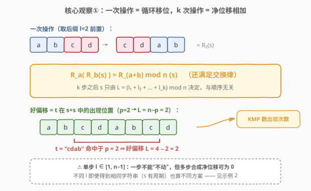
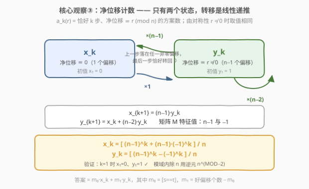
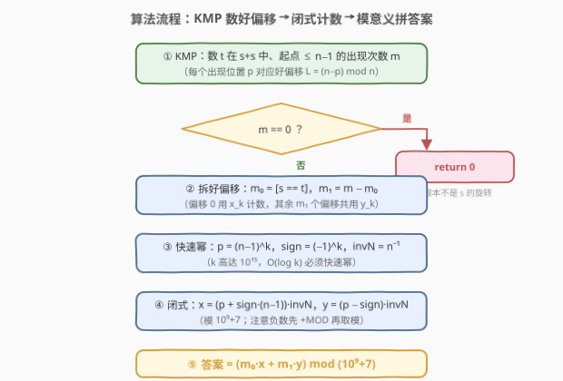
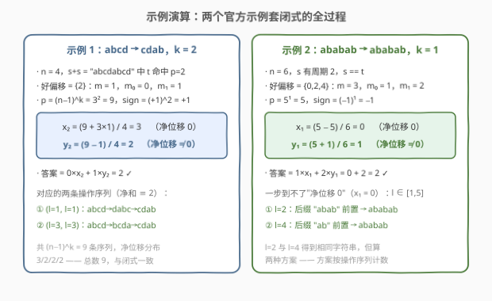

# 字符串转换

- **题目名称**：字符串转换
- **链接**：[2851. 字符串转换](https://leetcode.cn/problems/string-transformation/)
- **难度**：困难
- **标签**：数学、字符串、动态规划、字符串匹配

## 1. 题目概述

给你两个长度都为 `n` 的字符串 `s` 和 `t`。你可以对字符串 `s` 执行以下操作：

- 将 `s` 长度为 `l`（`0 < l < n`）的**后缀字符串**删除，并将它添加在 `s` 的开头。
- 比方说，`s = 'abcd'`，那么一次操作中，你可以删除后缀 `'cd'`，并将它添加到 `s` 的开头，得到 `s = 'cdab'`。

给你一个整数 `k`，请你返回**恰好** `k` 次操作将 `s` 变为 `t` 的方案数。由于答案可能很大，返回答案对 $10^9 + 7$ 取余后的结果。

**示例 1**：

```text
输入：s = "abcd", t = "cdab", k = 2
输出：2
解释：方案一：两次都取 index=3 开始的后缀（l=1），abcd → dabc → cdab；
     方案二：两次都取 index=1 开始的后缀（l=3），abcd → bcda → cdab。
```

**示例 2**：

```text
输入：s = "ababab", t = "ababab", k = 1
输出：2
解释：取 index=2 开始的后缀（l=4）或 index=4 开始的后缀（l=2），
     两种操作都得到 "ababab" 本身，计 2 种方案。
```

**约束条件**：

- `2 <= s.length <= 5 * 10^5`
- `1 <= k <= 10^15`
- `s.length == t.length`
- `s` 和 `t` 都只包含小写英文字母。

> 💡 三个关键信号：① 操作是"后缀前置"——这本质是**循环移位**，而循环移位的复合是**可加、可交换**的，`k` 步后的字符串只由总位移决定，与中间过程无关；② `k` 高达 $10^{15}$——计数绝不能一步步递推，必须**闭式或矩阵快速幂**；③ `n` 高达 $5\times10^5$——"哪些位移能变成 `t`"要用**线性时间字符串匹配**（KMP/Z 函数）一次性数出来。

---

## 2. 解题思路

### 2.1 暴力思路：按字符串做 k 轮 BFS

把"当前字符串"当作状态做 `k` 轮转移：每轮从每个状态出发尝试 `n-1` 种后缀长度 `l`。注意任何时刻 `s` 都是原串的某个旋转，状态数至多 `n` 个，因此总时间为 $O(k \cdot n^2)$——`k = 10^{15}` 直接天文数字。即使把转移写成 `n×n` 矩阵用快速幂优化到 $O(n^3 \log k)$，`n = 5\times10^5` 依然毫无希望。

> ⚠️ 瓶颈在于状态太"具体"：记住了是**哪个字符串**，却没利用"旋转的复合只与位移之和有关"这一结构。把状态压缩成**净位移 mod n**，计数问题立刻与字符串内容解耦。

### 2.2 核心观察：旋转可加 + KMP 数好偏移 + 两值 DP 闭式

**观察一：一次操作 = 循环移位，k 次操作 = 净位移相加。**

记 $R_l(s) = s[n{-}l:] + s[:n{-}l]$（把长度 `l` 的后缀搬到开头）。直接验证可得复合律：

$$R_a(R_b(s)) = R_{(a+b) \bmod n}(s)$$

（把 `s` 想象成写在圆环上的字符，两种切法转到的位置一致。）于是 `k` 步操作后 $s = R_L(s)$，其中 $L = (l_1 + \cdots + l_k) \bmod n$，**与操作顺序无关**。问题变成纯计数：

> 数序列 $(l_1,\dots,l_k)$，每个 $l_i \in [1, n-1]$，且 $\sum l_i \equiv L \pmod n$ 的个数。

两个易错点：**单步不能"不动"**（$l \in [1,n-1]$，不含 $0$ 与 $n$），但多步合成的净位移可以是 $0$；**不同 $l$ 序列即使每步字符串相同（`s` 有小周期）也算不同方案**——示例 2 中 `l=2` 与 `l=4` 都得到原串，各计一次，答案 2 正是印证。



**观察二：好偏移集合用 KMP 在 s+s 中一次数出。**

$R_L(s) = t \iff t$ 在 $s+s$ 中出现且起点 $p = (n-L) \bmod n$。用 KMP（或 Z 函数）在长度 $2n$ 的文本 `s+s` 里匹配 `t`，统计**起点 $\le n-1$** 的出现次数 $m$——`s+s` 中位置 `p` 与 `p+n` 是同一个旋转，只数一圈恰好对应 `n` 个互异偏移。若 $m = 0$，`t` 根本不是 `s` 的旋转，直接返回 `0`。再记 $m_0 = [s = t]$（偏移 $0$ 是否是好偏移），$m_1 = m - m_0$。

**观察三：净位移计数只需两个状态，转移是 2×2 线性递推。**

设 $a_k(r)$ = 恰好 `k` 步、净位移 $\equiv r \pmod n$ 的序列数。由**平移对称性**（对任意 $r \ne 0$，"最后一步落在 `r`"的转移结构完全相同），$a_k(r)$ 在所有 $r \ne 0$ 上取同一个值，记 $y_k$；记 $x_k = a_k(0)$。枚举最后一步 $l$：

- $x_{k+1} = \sum_{l=1}^{n-1} a_k(-l) = (n-1)\,y_k$（上一步落在任一非零偏移，最后一步恰好转回 $0$）；
- $y_{k+1} = \sum_{l=1}^{n-1} a_k(r-l) = x_k + (n-2)\,y_k$（$r \ne 0$ 时 $r-l$ 恰好遍历除 $r$ 外的全部剩余类）。

初值 $x_1 = 0$（一步不可能净位移 $0$）、$y_1 = 1$。写成矩阵 $\begin{pmatrix} x \\ y \end{pmatrix}_{k+1} = \begin{pmatrix} 0 & n{-}1 \\ 1 & n{-}2 \end{pmatrix}\begin{pmatrix} x \\ y \end{pmatrix}_k$，其特征值为 $n-1$ 与 $-1$（由 $\lambda^2 - (n-2)\lambda - (n-1) = 0$ 解出），解出**闭式**：

$$x_k = \frac{(n-1)^k + (n-1)(-1)^k}{n}, \qquad y_k = \frac{(n-1)^k - (-1)^k}{n}$$

代入 $k=1$ 验证：$x_1 = 0$、$y_1 = 1$ ✓。最终答案：

$$\text{ans} = m_0 \cdot x_k + m_1 \cdot y_k \pmod{10^9+7}$$



### 2.3 算法流程图



**完整步骤**：

1. `text = s + s`，对模式 `t` 建 KMP `fail` 数组。
2. 在 `text` 上跑 KMP，统计起点 $\le n-1$ 的完整匹配次数 $m$；`m == 0` 返回 `0`。
3. $m_0 = [s = t]$，$m_1 = m - m_0$。
4. 快速幂求 $p = (n-1)^k \bmod (10^9+7)$、$n^{-1} \bmod (10^9+7)$，$\mathit{sign} = (-1)^k$。
5. $x = (p + \mathit{sign}\cdot(n-1)) \cdot n^{-1}$，$y = (p - \mathit{sign}) \cdot n^{-1}$（模意义），答案 $= (m_0 x + m_1 y) \bmod (10^9+7)$。

### 2.4 示例演算



- **示例 1**（$n=4, k=2$）：`t="cdab"` 在 `"abcdabcd"` 中命中于 $p=2$ → 好偏移 $\{2\}$，$m=1,\ m_0=0,\ m_1=1$；$p = 3^2 = 9$，$\mathit{sign}=+1$；$x_2 = (9+3)/4 = 3$，$y_2 = (9-1)/4 = 2$；答案 $= 0\times3 + 1\times2 = \mathbf{2}$ ✓。9 条序列按净位移分布恰为 $3/2/2/2$（位移 0,1,2,3），两条净位移 $\equiv 2$ 的序列 $(1,1)$ 与 $(3,3)$ 正是官方解释的两种方案。
- **示例 2**（$n=6, k=1$）：`s` 有周期 2 且 $s=t$，好偏移 $\{0,2,4\}$，$m=3,\ m_0=1,\ m_1=2$；$p = 5$，$\mathit{sign}=-1$；$x_1 = (5-5)/6 = 0$，$y_1 = (5+1)/6 = 1$；答案 $= 1\times0 + 2\times1 = \mathbf{2}$ ✓。$x_1 = 0$ 印证"一步无法净位移 0"，而 `l=2`、`l=4` 两条路径虽产生相同字符串仍计两种方案。

---

## 3. 参考代码

### C++

```cpp
class Solution {
    static constexpr long long MOD = 1'000'000'007;

    long long qpow(long long a, long long e) {
        long long r = 1;
        a %= MOD;
        while (e) {
            if (e & 1) r = r * a % MOD;
            a = a * a % MOD;
            e >>= 1;
        }
        return r;
    }

public:
    int numberOfWays(string s, string t, long long k) {
        int n = s.size();
        string text = s + s;                        // t 是 s 的旋转 ⟺ t 在 s+s 中出现

        vector<int> fail(n);                        // KMP 失配数组
        for (int i = 1, j = 0; i < n; i++) {
            while (j && t[i] != t[j]) j = fail[j - 1];
            if (t[i] == t[j]) j++;
            fail[i] = j;
        }

        long long m = 0;                            // 好偏移个数（起点 <= n-1 的出现次数）
        for (int i = 0, j = 0; i < 2 * n; i++) {
            while (j && text[i] != t[j]) j = fail[j - 1];
            if (text[i] == t[j]) j++;
            if (j == n) {
                if (i - n + 1 <= n - 1) m++;        // 起点 n 与起点 0 是同一旋转，只数一圈
                j = fail[j - 1];
            }
        }
        if (m == 0) return 0;                       // t 不是 s 的旋转

        long long m0 = (s == t) ? 1 : 0;            // 偏移 0 是否为好偏移
        long long m1 = m - m0;                      // 其余好偏移个数，共用 y_k

        long long p = qpow(n - 1, k);               // (n-1)^k
        long long sign = (k & 1) ? -1 : 1;          // (-1)^k
        long long invN = qpow(n, MOD - 2);          // n 的逆元（n < MOD 保证存在）

        long long x = ((p + sign * (n - 1)) % MOD + MOD) % MOD * invN % MOD;  // 净位移 0
        long long y = ((p - sign) % MOD + MOD) % MOD * invN % MOD;            // 净位移 ≠ 0
        return (m0 * x + m1 % MOD * y) % MOD;
    }
};
```

### Python

```python
class Solution:
    def numberOfWays(self, s: str, t: str, k: int) -> int:
        MOD = 10 ** 9 + 7
        n = len(s)
        text = s + s                             # t 是 s 的旋转 ⟺ t 在 s+s 中出现

        fail = [0] * n                           # KMP 失配数组
        j = 0
        for i in range(1, n):
            while j and t[i] != t[j]:
                j = fail[j - 1]
            if t[i] == t[j]:
                j += 1
            fail[i] = j

        m = 0                                    # 好偏移个数（起点 <= n-1 的出现次数）
        j = 0
        for i, ch in enumerate(text):
            while j and ch != t[j]:
                j = fail[j - 1]
            if ch == t[j]:
                j += 1
            if j == n:
                if i - n + 1 <= n - 1:           # 起点 n 与起点 0 是同一旋转，只数一圈
                    m += 1
                j = fail[j - 1]
        if m == 0:
            return 0

        m0 = 1 if s == t else 0                  # 偏移 0 是否为好偏移
        m1 = m - m0                              # 其余好偏移个数，共用 y_k

        sign = -1 if k % 2 else 1                # (-1)^k
        inv_n = pow(n, MOD - 2, MOD)             # n 的逆元（n < MOD 保证存在）
        p = pow(n - 1, k, MOD)                   # (n-1)^k
        x = (p + sign * (n - 1)) * inv_n % MOD   # 净位移 0（Python 取模自动处理负数）
        y = (p - sign) * inv_n % MOD             # 净位移 ≠ 0
        return (m0 * x + m1 * y) % MOD
```

> 💡 两版结构一致：**KMP 数好偏移 + 闭式计数**。C++ 里 `sign * (n-1)` 可能为负，需 `+MOD` 再取模；Python 的 `%` 对负数天然返回非负结果，直接写即可。除以 `n` 用费马小定理求逆元——`n ≤ 5×10^5 < MOD`，`gcd(n, MOD) = 1` 保证逆元存在；闭式在整数意义下本就整除（由 DP 递推的整值性归纳可得），模逆元算出的就是真值 mod MOD。

---

## 4. 复杂度分析

| 维度 | 复杂度 | 说明 |
|------|--------|------|
| **时间** | $O(n + \log k)$ | KMP 匹配 $2n$ 长文本 $O(n)$；三次快速幂各 $O(\log k)$，$k \le 10^{15}$ 时约 50 次乘法 |
| **空间** | $O(n)$ | `fail` 数组 + 拼接文本 `s+s`（$2n$ 字符） |

$n = 5\times10^5$ 时 KMP 约 $10^6$ 次字符比较，闭式部分常数级——相比暴力 $O(k n^2)$ 与矩阵幂 $O(n^3 \log k)$，是"结构洞察"带来的指数级降维。

---

## 5. 扩展：单位根卷积视角与一般化

**闭式从哪来？——循环卷积与单位根。** $a_{k+1}(r) = \sum_l a_k(r - l)\, c(l)$ 是循环卷积（$c(l) = [1 \le l \le n-1]$ 是单步位移的指示函数），对序列做 $n$ 点 DFT 后卷积变逐点乘：$\hat{a}_k(j) = \hat c(j)^k$。而 $\hat c(0) = n - 1$、$\hat c(j \ne 0) = \sum_{l=1}^{n-1}\omega^{jl} = -1$ 只取两个值，做逆 DFT 时分子里只剩 $(n-1)^k$ 与 $(-1)^k$ 两项——这正是 $x_k, y_k$ 闭式的来源，特征根 $n-1$ 与 $-1$ 就是这两个值的化身。

**一般化**：若单步允许的位移集合换成任意 $S \subseteq \{0,\dots,n-1\}$，同一框架仍然成立——$a_k = \text{IDFT}(\hat c(j)^k)$，但 $\hat c(j)$ 一般不再只有两个值，得做 $n$ 点数论 NTT 或 $O(n^2)$ 卷积；把 $a_k$ 的递推整体写成 $n \times n$ 循环矩阵用快速幂也是 $O(n \log k)$ 级（循环矩阵幂仍循环，配合 NTT 可 $O(n\log n\log k)$）。本题的"单步禁 0、其余全允许"恰好让频谱塌缩成两点，是出题人留的甜点。

**若允许单步不动（$l \in [0, n-1]$）**：则 $\hat c(j) \equiv n$，$a_k(r) = n^{k-1}$ 对所有 $r$ 成立，问题退化到平凡——"禁 0"正是本题非平凡性的全部来源（对比 $x_k$ 与 $y_k$ 公式中 $\pm(-1)^k$ 的差异）。

> 💡 一句话总结：2851 = 循环移位的可加性（把字符串问题降为位移计数）+ KMP 数旋转匹配（线性求好偏移集合）+ 两值 DP 闭式（快速幂扛 $k = 10^{15}$）。

---

## 6. 面试要点

1. **为什么 k 步操作只由净位移决定？**

   一次操作 $R_l$ 把长度 $l$ 的后缀前置，是循环移位；直接验证 $R_a(R_b(s)) = R_{(a+b) \bmod n}(s)$，且满足交换律。所以 $k$ 步后 $s = R_{\sum l_i \bmod n}(s)$，与顺序无关——方案数就是"每项 $l_i \in [1,n-1]$、和 $\equiv L \pmod n$ 的序列个数"。

2. **不同操作产生相同字符串时怎么计数？示例 2 为什么是 2？**

   按**操作序列**计数而非按字符串轨迹计数：`l=2` 与 `l=4` 作用于 `"ababab"` 得到同一个串，但是两个不同的选择，计 2 种。这也说明计数对象是 $l$ 序列，与 `s` 的周期无关——闭式 $y_k$ 只依赖 $n$ 与 $k$。

3. **为什么 $a_k(r)$ 对所有 $r \ne 0$ 取同一个值？**

   归纳论证：转移 $y_{k+1} = \sum_{l=1}^{n-1} a_k(r - l)$ 中，当 $r \ne 0$ 时 $r - l$ 恰好遍历除 $r$ 外的全部剩余类，对每个非零 $r$ 结构相同，因此只要 $a_k$ 在非零剩余类上取值相同，$a_{k+1}$ 就相同；基态 $a_1(r) = [r \ne 0]$ 满足对称性。也可用 DFT 频谱塌缩解释。

4. **闭式里的除以 n，在模意义下怎么处理？为什么合法？**

   用费马小定理 $n^{-1} = n^{MOD-2} \bmod MOD$（$n < MOD$ 且均为质数域内元素）。合法性有两层：DP 递推 $x_{k+1} = (n-1)y_k$、$y_{k+1} = x_k + (n-2)y_k$ 的每一步都是整数，故闭式分子必被 $n$ 整除；模域中乘逆元与整数除法结果一致（同余的传递性）。

5. **KMP 数出现次数时为什么要限定起点 $\le n-1$？**

   `s+s` 长度 $2n$，`t` 出现的起点范围是 $[0, n]$；起点 $p$ 与 $p+n$ 对应同一个旋转（本题中只有 $p=0$ 与 $p=n$ 这一对），若不截断会把 $s=t$ 时的偏移 $0$ 数两次。统计时以"匹配终点 $\le 2n-2$"等价实现即可。

---

## 7. 同类练习题

- [796. 旋转字符串](https://leetcode.cn/problems/rotate-string/)：判断 `t` 是否为 `s` 的旋转，`s+s` 技巧的入门版，本题观察二的独立练习
- [459. 重复的子串模式](https://leetcode.cn/problems/repeated-substring-pattern/)：`s+s` 去头去尾找 `s` 判周期，与本题"好偏移不止一个"（`s` 有小周期）同源
- [28. 找出字符串中第一个匹配项的下标](https://leetcode.cn/problems/find-the-index-of-the-first-occurrence-in-a-string/)：KMP 匹配模板题，本题匹配部分的基础
- [214. 最短回文串](https://leetcode.cn/problems/shortest-palindrome/)：KMP `fail` 数组"最长相等前后缀"的经典应用，另一面旗帜
- [552. 学生出勤记录 II](https://leetcode.cn/problems/student-attendance-record-ii/)：同为"数长度 k 的受限序列 mod 1e9+7"，大 k 用矩阵快速幂/闭式，与本题观察三呼应
