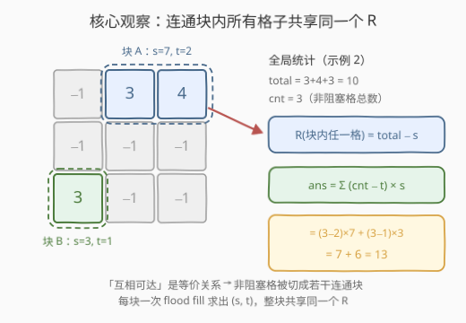
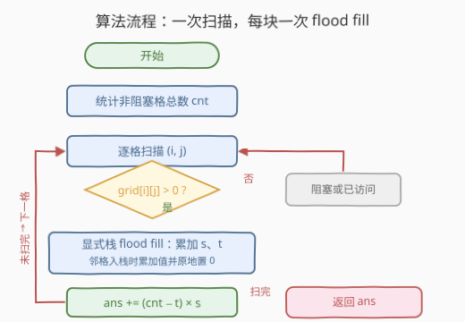
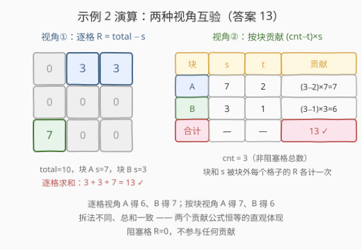

# LeetCode 所有单元格的远离程度之和 题解

## 1. 题目概述

- **标题 / 题号**：所有单元格的远离程度之和（#2852，medium）
- **链接**：https://leetcode.cn/problems/sum-of-remoteness-of-all-cells/
- **难度**：中等
- **标签**：深度优先搜索、广度优先搜索、并查集、数组、矩阵

> ⚠️ 本题为 LeetCode 付费题，题意描述根据官方示例用例与 hints 重建（已与社区镜像题面核对），可能与官方题面有出入。

**题意**：给定一个下标从 **0** 开始、大小为 `n * n` 的矩阵 `grid`，其中每个单元格的值 `grid[i][j]` 要么是**正整数**，要么是 `-1` 表示该格**阻塞**。你可以从一个非阻塞单元格移动到与其共享边的任意非阻塞单元格（四方向，不许穿越阻塞格）。

对任意单元格 `(i, j)`，定义其**远离程度** `R[i][j]`：

- 若 `(i, j)` 非阻塞：`R[i][j]` 是所有满足「**不存在**从非阻塞单元格 `(x, y)` 到 `(i, j)` 的路径」的 `grid[x][y]` 之和——连通关系是对称的，等价于"从 `(i, j)` 出发走不到的那些非阻塞格子的值之和"；
- 若 `(i, j)` 阻塞：`R[i][j] = 0`。

返回所有单元格的 `R[i][j]` 之和。

**示例 1**：

```text
输入：grid = [[-1,1,-1],[5,-1,4],[-1,3,-1]]
输出：39
解释：四个非阻塞格 1、5、4、3 互不连通，各自成块。
      R[0][1]=5+4+3=12，R[1][0]=1+4+3=8，R[1][2]=1+5+3=9，R[2][1]=1+5+4=10，
      阻塞格 R=0，总和 12+8+9+10=39。
```

**示例 2**：

```text
输入：grid = [[-1,3,4],[-1,-1,-1],[3,-1,-1]]
输出：13
解释：{(0,1),(0,2)} 连通成块 A（值和 7），{(2,0)} 单独成块 B（值和 3）。
      块 A 中每格只到不了 (2,0)，R=3（共两格）；块 B 的 R=3+4=7。
      总和 3+3+7=13。
```

**示例 3**：

```text
输入：grid = [[1]]
输出：0
解释：唯一格子 (0,0) 没有走不到的格子，R[0][0]=0。
```

**约束**：

- `1 <= n <= 300`
- `1 <= grid[i][j] <= 10^6` 或 `grid[i][j] == -1`

## 2. 解题思路

### 2.1 暴力思路：逐格 flood fill

按定义模拟：先扫一遍求出全网格非阻塞格值之和 $\text{total}$；然后对每个非阻塞格 `(i, j)` 做一次 BFS/DFS，求出它能走到的所有格子（含自身）的值和 $s_{\text{reach}}$，则 $R[i][j] = \text{total} - s_{\text{reach}}$。单次 flood fill $O(n^2)$，共 $n^2$ 个格子，总时间 $O(n^4)$——`n=300` 时约 $8.1 \times 10^9$ 次操作，必然超时。

> ⚠️ 暴力法做了大量重复劳动：彼此连通的格子可达集合**完全一样**，却各自 flood fill 了一遍——这正是下一步优化的切入点。

### 2.2 核心观察：连通块内共享同一个 R，按块整体贡献

「互相可达」在非阻塞格子上是**等价关系**（自反、对称、传递），它把所有非阻塞格划分成若干**连通块**。三条关键推论：

1. **块内任一格的可达集合 = 整个块**——块内两两互通；而块外任何一格都到不了（否则它就该并入本块了）；
2. 于是块内每个格子的 $R$ **完全相同**，都等于 $\text{total} - s$，其中 $s$ 为该块的值和；
3. 设块大小为 $t$（格数）、非阻塞格总数为 $cnt$，整块贡献 $t \times (\text{total} - s)$；换个视角恒等：该块的值和 $s$ 会被**块外**每个格子的 $R$ 各计一次，共 $(cnt - t) \times s$。

$$\text{ans} = \sum_{\text{块}}\ t \cdot (\text{total} - s) = \sum_{\text{块}}\ (cnt - t) \cdot s$$

两种写法恒等（$\sum t = cnt$，$\sum s = \text{total}$）。这样一来，只需对每个连通块做**一次** flood fill，统计出二元组 $(s, t)$ 套公式即可，全网格每格至多进出栈一次，总时间 $O(n^2)$。



> ⚠️ **溢出提醒**：`n=300` 时 $\text{total}$ 上界 $9\times10^4 \times 10^6 = 9\times10^{10}$，早已超出 `int32`；答案上界约 $\text{total} \times cnt \approx 8.1\times10^{15}$。C++ 必须用 `long long`（Python 天然大数无虞）。

### 2.3 算法流程图



**完整步骤**：

1. **统计**：扫一遍 `grid`，数出非阻塞格总数 `cnt`（即 `grid[i][j] > 0` 的格子数）。
2. **找块**：再次逐格扫描，遇到未访问的非阻塞格 → 从它出发 flood fill（显式栈/队列）：
   - 沿途累加**块值和** `s`、计数**块大小** `t`；
   - 访问标记**原地**完成：格子入栈时置 `0`——输入值域是 $\ge 1$ 或 $-1$，`0` 不可能是原始值，天然可当 visited 哨兵。
3. **累计贡献**：每完成一块，`ans += (cnt - t) * s`。
4. 扫描完全部格子，返回 `ans`。

> 💡 flood fill 骨架与[岛屿数量](https://leetcode.cn/problems/number-of-islands/)完全同构，只是从"数块的个数"升级为"每块聚合两个统计量（值和、大小）再按公式贡献"。

### 2.4 示例演算

以示例 2 `grid = [[-1,3,4],[-1,-1,-1],[3,-1,-1]]` 为例：total = 3+4+3 = 10，cnt = 3，共两个连通块：

| 连通块 | 格子 | 值和 s | 大小 t | 逐格视角 $R=\text{total}-s$ | 按块贡献 $(cnt-t)\times s$ |
|--------|------|--------|--------|------------------------------|-----------------------------|
| A | (0,1)=3, (0,2)=4 | 7 | 2 | 每格 R=3，共 2×3=**6** | (3−2)×7 = **7** |
| B | (2,0)=3 | 3 | 1 | 每格 R=7，共 **7** | (3−1)×3 = **6** |

两种视角各自加总：逐格求和 $3+3+7=13$，按块求和 $7+6=13$，答案 **13** ✓



> 💡 注意两种视角对**同一块**的拆法并不对应：逐格视角下 A 贡献 6、B 贡献 7；按块视角下 A 贡献 7、B 贡献 6——各自内部拆法不同但总和一致，这正是 2.2 节两个公式恒等的直观体现。

## 3. 参考代码

### C++

```cpp
class Solution {
public:
    long long sumRemoteness(vector<vector<int>>& grid) {
        int n = grid.size();
        int cnt = 0;                                  // 非阻塞格总数
        for (auto& row : grid)
            for (int x : row) cnt += x > 0;

        long long ans = 0;
        int dirs[5] = {-1, 0, 1, 0, -1};
        stack<pair<int,int>> st;
        for (int i = 0; i < n; ++i)
            for (int j = 0; j < n; ++j)
                if (grid[i][j] > 0) {                 // 发现新连通块
                    long long s = grid[i][j];         // 块值和
                    int t = 1;                        // 块大小
                    grid[i][j] = 0;                   // 原地标记已访问
                    st.push({i, j});
                    while (!st.empty()) {
                        auto [x, y] = st.top(); st.pop();
                        for (int k = 0; k < 4; ++k) {
                            int nx = x + dirs[k], ny = y + dirs[k + 1];
                            if (0 <= nx && nx < n && 0 <= ny && ny < n && grid[nx][ny] > 0) {
                                s += grid[nx][ny];    // 入栈时累加并标记
                                ++t;
                                grid[nx][ny] = 0;
                                st.push({nx, ny});
                            }
                        }
                    }
                    ans += (long long)(cnt - t) * s;  // 块和被块外每格各计一次
                }
        return ans;
    }
};
```

### Python

```python
class Solution:
    def sumRemoteness(self, grid: List[List[int]]) -> int:
        n = len(grid)
        cnt = sum(v > 0 for row in grid for v in row)  # 非阻塞格总数

        ans = 0
        for i in range(n):
            for j in range(n):
                if grid[i][j] > 0:                     # 发现新连通块
                    s, t = grid[i][j], 1               # 块值和 / 块大小
                    grid[i][j] = 0                     # 原地标记已访问
                    stack = [(i, j)]
                    while stack:
                        x, y = stack.pop()
                        for nx, ny in ((x-1, y), (x+1, y), (x, y-1), (x, y+1)):
                            if 0 <= nx < n and 0 <= ny < n and grid[nx][ny] > 0:
                                s += grid[nx][ny]      # 入栈时累加并标记
                                t += 1
                                grid[nx][ny] = 0
                                stack.append((nx, ny))
                    ans += (cnt - t) * s               # 按块整体贡献
        return ans
```

> 💡 两版都用**显式栈**而非递归：`n=300` 时蛇形连通块的递归深度可达 $9\times10^4$，C++ 有爆栈风险，Python 直接 `RecursionError`（默认上限 1000）。另外值在**入栈时**累加并置 0，出栈后只负责扩展邻居，避免"先置 0 再取值"的先后矛盾。

## 4. 复杂度分析

| 维度 | 复杂度 | 说明 |
|------|--------|------|
| **时间复杂度** | $O(n^2)$ | 统计 `cnt` 线性扫一遍；flood fill 每格至多入栈/出栈一次，四邻检查 $O(1)$ |
| **空间复杂度** | $O(n^2)$ | 显式栈最坏存下整块（全网格连通时 $9\times10^4$ 格）；visited 原地标记，不额外开数组 |

> ⚠️ 若按定义逐格 flood fill 则是 $O(n^4)$（`n=300` 约 $8.1\times10^9$），必然超时——按连通块聚合正是把这 $n^2$ 次重复搜索合并成每块一次的关键。

## 5. 扩展：并查集写法

连通块统计也可用**并查集**完成：把每个非阻塞格与它的**右邻、下邻**（若也非阻塞）union，最后按根节点聚合出每块的 $s$ 与 $t$，套同一贡献公式。flood fill 是"碰到块才搜"，并查集是"先把所有边并起来再统一盘点"，复杂度 $O(n^2 \alpha)$，渐近同阶。

```python
from collections import defaultdict

class Solution:
    def sumRemoteness(self, grid: List[List[int]]) -> int:
        n = len(grid)
        fa = list(range(n * n))

        def find(x):
            while fa[x] != x:
                fa[x] = fa[fa[x]]                      # 路径压缩
                x = fa[x]
            return x

        cnt = 0
        for i in range(n):
            for j in range(n):
                if grid[i][j] > 0:
                    cnt += 1
                    if i + 1 < n and grid[i+1][j] > 0:  # 只需向右、向下 union
                        fa[find(i*n+j)] = find((i+1)*n+j)
                    if j + 1 < n and grid[i][j+1] > 0:
                        fa[find(i*n+j)] = find(i*n+j+1)

        s, t = defaultdict(int), defaultdict(int)
        for i in range(n):
            for j in range(n):
                if grid[i][j] > 0:
                    r = find(i*n + j)
                    s[r] += grid[i][j]
                    t[r] += 1
        return sum((cnt - t[r]) * s[r] for r in s)
```

> 💡 并查集版多了"编号 + 聚合"两步，代码更长，但不需要考虑递归/栈深；若面试官追问"不用搜索怎么做"，这就是标准备选。

## 6. 面试要点

1. **为什么连通块内所有格子的 R 一定相同？**

   - 「互相可达」是等价关系：块内任意两格互通，所以从块内任一格出发的可达集合都恰好是整块；不可达集合恰好是"其余所有块的并"，$R = \text{total} - s$ 与具体出发格无关。

2. **$(cnt-t)\times s$ 与 $t\times(\text{total}-s)$ 两个公式怎么来的？等价吗？**

   - 前者是"向外看"：块和 $s$ 会被块外每个格子的 $R$ 各计一次，共 $cnt-t$ 次；后者是"向内看"：块内每格的 $R$ 都是 $\text{total}-s$，共 $t$ 格。由 $\sum t = cnt$、$\sum s = \text{total}$ 可证两式恒等；实现中用前者只需统计 `cnt`，少维护一个 `total`。

3. **为什么必须用 64 位整数？**

   - $\text{total}$ 上界 $300^2 \times 10^6 = 9\times10^{10}$ 超 `int32`；答案上界约 $\text{total}\times cnt \approx 8.1\times10^{15}$，`long long` 安全。C++ 中 `(cnt - t)` 是 `int`，与 `long long` 的 `s` 相乘前先显式转换，避免误解（本题数量级下 `int` 相乘部分不会先截断，但显式转换是好习惯）。

4. **递归 DFS 有什么坑？**

   - 最坏情况（蛇形满连通）递归深度 $9\times10^4$：C++ 默认栈空间可能爆栈，Python 必然 `RecursionError`。显式栈/队列的迭代写法是网格 flood fill 的稳妥默认。

5. **原地置 0 当 visited 为什么合法？**

   - 输入值域只有 $\{-1\} \cup [1, 10^6]$，`0` 不可能是原始值，可放心充当哨兵，省掉 $O(n^2)$ 的 vis 数组；代价是修改了入参数组——面试中补一句"若需保留原 grid 可换 vis 数组"更稳妥。

> 💡 **一句话总结**：2852 = 网格连通块统计（岛屿家族同款 flood fill）+ 贡献公式 $(cnt-t)\cdot s$。核心是把逐格 $O(n^4)$ 的重复搜索按"等价类"聚合到每块一次，$O(n^2)$ 收官；工程细节盯住 64 位溢出与迭代化 flood fill。

## 同类练习题

| # | 题目 | 与本题的关联 |
|---|------|-------------|
| 200 | [岛屿数量](https://leetcode.cn/problems/number-of-islands/) | 网格 flood fill 连通块计数的母题，本题的地基 |
| 695 | [岛屿的最大面积](https://leetcode.cn/problems/max-area-of-island/) | 对每块聚合统计量（面积取 max），与本题聚合 (s,t) 最近亲 |
| 827 | [最大人工岛](https://leetcode.cn/problems/making-a-large-island/) | 块和统计 + 相邻块合并，块贡献思想的进阶变体 |
| 1020 | [飞地的数量](https://leetcode.cn/problems/number-of-enclaves/) | 从边界反推"可达/不可达"集合，与本题的不可达视角互补 |
