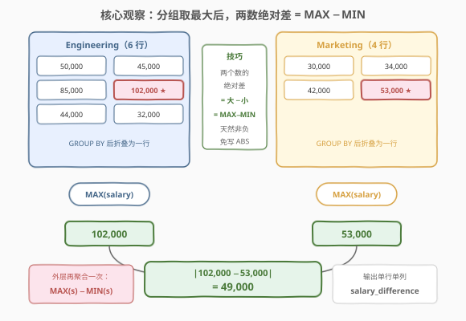
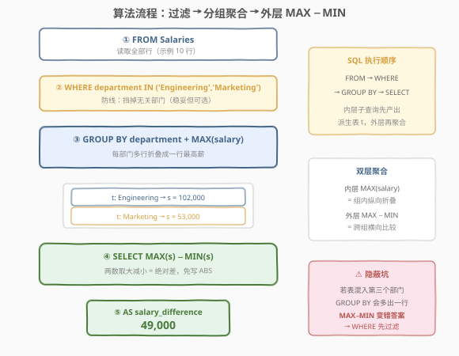
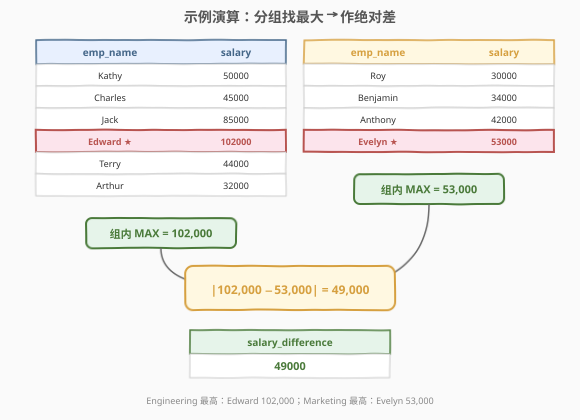

# 最高薪水差异

- **题目名称**：最高薪水差异
- **链接**：[2853. 最高薪水差异](https://leetcode.cn/problems/highest-salaries-difference/)
- **难度**：简单
- **标签**：数据库、SQL、`GROUP BY`、`MAX`、派生表、条件聚合、LeetCode 锁题

## 1. 题目概述

> ⚠️ 本题为 LeetCode 付费题，题意描述根据官方示例用例与外部资料重建，可能与官方题面有出入。

**表结构**：`Salaries`

| 列名 | 类型 |
|------|------|
| emp_name | varchar |
| department | varchar |
| salary | int |

- `(emp_name, department)` 是该表的主键（具有唯一值的列的组合）。
- 每行包含员工姓名 `emp_name`、部门 `department` 和薪水 `salary`。
- 工程部门和市场部门至少各有一条记录。

**目标**：写一条 SQL 查询，计算**市场部门**和**工程部门**中**最高**工资之间的差异，输出工资的**绝对差异**，结果为单行单列 `salary_difference`。

**示例 1**：

```text
输入：
Salaries 表:
+----------+-------------+--------+
| emp_name | department  | salary |
+----------+-------------+--------+
| Kathy    | Engineering | 50000  |
| Roy      | Marketing   | 30000  |
| Charles  | Engineering | 45000  |
| Jack     | Engineering | 85000  |
| Benjamin | Marketing   | 34000  |
| Anthony  | Marketing   | 42000  |
| Edward   | Engineering | 102000 |
| Terry    | Engineering | 44000  |
| Evelyn   | Marketing   | 53000  |
| Arthur   | Engineering | 32000  |
+----------+-------------+--------+

输出：
+-------------------+
| salary_difference |
+-------------------+
| 49000             |
+-------------------+

解释：
- 工程部门和市场部门的最高工资分别为 102,000 和 53,000，绝对差异为 49,000。
```

**解释拆解**：

| 部门 | 组内薪水 | 最高薪水 | 持有者 |
|------|----------|----------|--------|
| Engineering | 50000, 45000, 85000, **102000**, 44000, 32000 | 102000 | Edward |
| Marketing | 30000, 34000, 42000, **53000** | 53000 | Evelyn |

绝对差异 = $|102000 - 53000| = 49000$。

**约束条件**：

- `(emp_name, department)` 为主键——同名员工可在不同部门各占一行。
- `salary` 为整数。
- **两个目标部门保证至少各一条记录**——这是个隐藏的「免兜底」条款：`MAX` 不会遇到空组，无需 `IFNULL`。
- 输出仅单行单列 `salary_difference`。

> 💡 **审题关键**：① 「每个部门的最高」→ `GROUP BY department` + `MAX(salary)`；② 「绝对差异」→ 两个最高薪**谁大谁小未知**，要么 `ABS(a - b)`，要么用 **`MAX − MIN` 技巧**（两个数的绝对差恰好等于大者减小者，天然非负，连 `ABS` 都不用写）；③ 「两部门至少一条记录」保证了聚合不返回 `NULL`。掌握这三点，本题就是一道双层聚合入门题。

---

## 2. 解题思路

### 2.1 暴力思路：两个标量子查询直译题意

最直觉的写法是把题目直译成两个「问价」子查询，再作差：

```sql
SELECT ABS(
    (SELECT MAX(salary) FROM Salaries WHERE department = 'Engineering') -
    (SELECT MAX(salary) FROM Salaries WHERE department = 'Marketing')
) AS salary_difference;
```

逻辑完全正确，能过。但有三个可优化点：

1. **两趟扫描**：两个子查询各自独立扫一遍表；
2. **手写 `ABS`**：正确性依赖「记得取绝对值」——漏写就可能输出负数（哪个部门更高事先未知）；
3. **部门名写了两遍**：条件分散，题目若改成别的部门对比要改多处。

### 2.2 核心观察：分组聚合降维 + MAX−MIN 即绝对差



把问题拆成两层：

1. **内层聚合（降维）**：`GROUP BY department` + `MAX(salary)` 把每个部门的多行折叠成一行——10 行原始数据降成 2 行「每部门最高薪」，问题从「跨行比较两组人」降维成「比较两个数」。
2. **外层求差（取绝对值）**：对这仅有的两个数 $a$、$b$，有恒等式

$$|a - b| = \max(a, b) - \min(a, b)$$

外层直接 `MAX(s) - MIN(s)`——大者减小者，结果**天然非负**，一个 `ABS` 都不用写。这就是官方题解的精髓：**用外层聚合同时解决「作差」和「取绝对值」两件事**。

> ⚠️ **`GROUP BY department` 会给表中所有部门各产出一行**。题面只保证两个目标部门存在、并未排除其它部门——若混入第三个部门，内层会产出 3 行，外层 `MAX − MIN` 就变成「最高部门 vs 最低部门」的错误答案。稳妥起见内层先 `WHERE department IN ('Engineering', 'Marketing')` 过滤；若数据里确实只有这两个部门，该过滤是空操作，不影响结果。这是本题最隐蔽的坑。

> 💡 **双层聚合**结构值得细品：内层 `MAX(salary)` 是**组内纵向折叠**（把同部门多行压成一行），外层 `MAX(s) − MIN(s)` 是**跨组横向比较**（在各部门结果之间取最值）。两层聚合语义不同、互不干扰，是「先分组汇总、再全局比较」类问题的通用骨架（619「只出现一次的最大数字」同款结构）。

### 2.3 算法流程图



**逻辑执行步骤**：

| 步骤 | 子句 | 作用 |
|------|------|------|
| ① | `FROM Salaries` | 读取全部行（示例 10 行） |
| ② | `WHERE department IN (...)` | 防线：只留两个目标部门（稳妥但可选） |
| ③ | `GROUP BY department` + `MAX(salary)` | 每部门折叠出一行最高薪（2 行） |
| ④ | 外层 `SELECT MAX(s) - MIN(s)` | 两数取大减小 = 绝对差 |
| ⑤ | `AS salary_difference` | 命名输出列 |

> 💡 **SQL 子句执行顺序**：`FROM` → `WHERE` → `GROUP BY` → `SELECT`。本题的派生表结构是「先完整执行内层子查询产出 `t`，外层 `SELECT` 再对 `t` 聚合」——理解「内层分组聚合先物化、外层再全局聚合」的先后关系，是看懂双层聚合的关键。

### 2.4 示例演算

以示例 1 的 10 行数据为例，跟踪两层聚合：



**内层：`GROUP BY department` + `MAX(salary)`（组内纵向折叠）**

Engineering 组逐行维护当前最大值：

| 扫描到 | salary | 当前组内 MAX |
|--------|--------|--------------|
| Kathy | 50000 | 50000 |
| Charles | 45000 | 50000（不换） |
| Jack | 85000 | 85000（换） |
| Edward | 102000 | **102000（换，最终）** |
| Terry | 44000 | 102000（不换） |
| Arthur | 32000 | 102000（不换） |

Marketing 组：30000 → 34000 → 42000 → **53000**（Evelyn，最终）。

内层产出派生表 `t`（2 行）：

| department | s |
|------------|--------|
| Engineering | 102000 |
| Marketing | 53000 |

**外层：`MAX(s) − MIN(s)`（跨组横向比较）**

- `MAX(s)` = 102000，`MIN(s)` = 53000
- `salary_difference` = 102000 − 53000 = **49000**

> 💡 外层这一步同时完成了「作差」与「取绝对值」：因为 `MAX ≥ MIN` 恒成立，结果天然非负。若改用 `ABS(102000 - 53000)` 也能得 49000，但 `MAX − MIN` 少写一个函数、且不依赖「记得套绝对值」的自觉。

---

## 3. 参考代码

### SQL（解法 A：派生表 + `MAX − MIN`，推荐）

```sql
# Write your MySQL query statement below
SELECT MAX(s) - MIN(s) AS salary_difference
FROM (
    SELECT MAX(salary) AS s
    FROM Salaries
    WHERE department IN ('Engineering', 'Marketing')
    GROUP BY department
) AS t;
```

> 💡 **写法要点**：
> - 内层 `GROUP BY department` + `MAX(salary)`：每部门折叠出一行最高薪；
> - `WHERE department IN (...)`：挡掉潜在的第 3 个部门，保证外层恰好比较两个数——比裸 `GROUP BY` 更稳；
> - 外层 `MAX(s) - MIN(s)`：两数绝对差 = 大减小，免写 `ABS`；
> - `AS salary_difference`：列别名与题目要求的输出列名一致。

### SQL（解法 B：条件聚合，单趟扫描无子查询）

```sql
SELECT ABS(
    MAX(CASE WHEN department = 'Engineering' THEN salary END) -
    MAX(CASE WHEN department = 'Marketing'   THEN salary END)
) AS salary_difference
FROM Salaries;
```

> 💡 **条件聚合（行转列）**：`CASE WHEN ... THEN salary END` 对不匹配的行产生 `NULL`，而 **`MAX` 忽略 `NULL`**——于是「Engineering 行的 salary」与「Marketing 行的 salary」被折叠进两个不同的 `MAX` 列，一趟扫描、无子查询、无 `GROUP BY`。注意此处**必须 `ABS`**：两个标量谁大未知。该写法对「表中混有其它部门」天然免疫（其它部门的行在两个 `CASE` 里都是 `NULL`，被同时忽略）。

### SQL（解法 C：标量子查询直译）

```sql
SELECT ABS(
    (SELECT MAX(salary) FROM Salaries WHERE department = 'Engineering') -
    (SELECT MAX(salary) FROM Salaries WHERE department = 'Marketing')
) AS salary_difference;
```

> 💡 **解法 C 的定位**：最直白的「直译题意」版本，两个子查询各扫一遍表。逻辑清晰但两趟扫描、部门名重复出现两处；作为思路基准与解法 A/B 对照，能看出「聚合结构选择」对扫描次数和可维护性的影响。

### Pandas

```python
import pandas as pd


def salaries_difference(salaries: pd.DataFrame) -> pd.DataFrame:
    top = (
        salaries[salaries["department"].isin(["Engineering", "Marketing"])]
        .groupby("department")["salary"]
        .max()
    )
    return pd.DataFrame({"salary_difference": [int(top.max() - top.min())]})
```

> 💡 **pandas 对照**：布尔索引 + `isin` 对应 `WHERE department IN (...)`；`groupby("department")["salary"].max()` 对应内层 `GROUP BY + MAX`（得到以部门为索引、最高薪为值的 Series）；`top.max() - top.min()` 对应外层 `MAX − MIN`。返回单行 DataFrame，列名 `salary_difference` 与 SQL 输出对齐。

---

## 4. 复杂度分析

| 维度 | 复杂度 | 说明 |
|------|--------|------|
| **时间复杂度** | $O(n)$ | 单趟扫描（解法 A/B）；解法 C 两个子查询各扫一遍，也是 $O(n)$ 但常数翻倍 |
| **空间复杂度** | $O(k)$ | 派生表按部门聚合需 $O(k)$（$k$ 为部门数，本题 $k=2$）；解法 B 条件聚合仅 $O(1)$ |

> - $n$ 为 `Salaries` 行数，$k$ 为部门数。
> - **索引优化**：`department` 上有索引时，`WHERE department IN (...)` 可先定位目标分区；进一步建 `(department, salary)` 复合索引，`GROUP BY department` + `MAX(salary)` 可走 **loose index scan**（松散索引扫描）——每个部门直接读索引里该组的最后一条，无需扫描组内全部行，整体降至 $O(k \log n)$。
> - LeetCode SQL 题数据量小，三种解法均在毫秒级，差异主要体现在写法语义与扩展性上。

---

## 5. 扩展：条件聚合的「行转列」威力与变体

### 5.1 条件聚合是透视（pivot）的最小模板

解法 B 的骨架可以推广——「把行维度折叠成列维度」：

```sql
SELECT
    MAX(CASE WHEN department = 'Engineering' THEN salary END) AS eng_max,
    MAX(CASE WHEN department = 'Marketing'   THEN salary END) AS mkt_max,
    MAX(CASE WHEN department = 'Sales'       THEN salary END) AS sales_max
FROM Salaries;
```

一张宽表一次扫描，每个部门一列。若部门数不定，才需要换成 `GROUP BY`（行式输出）或动态 SQL。**判断口诀**：目标列固定且少 → 条件聚合（列式）；目标行随分组值变化 → `GROUP BY`（行式）。

### 5.2 两个数绝对差的三种等价表达

| 写法 | 说明 |
|------|------|
| `ABS(a - b)` | 直译「绝对差」，标量场景首选 |
| `MAX(a, b) - MIN(a, b)` | 聚合场景：把两数收进集合再取大减小，免 `ABS`（本题外层用法） |
| `GREATEST(a, b) - LEAST(a, b)` | 标量版的 MAX/MIN（MySQL 方言），语义同上 |

三者数学上恒等，区别只在「数据当前是标量还是集合」以及方言可用性。

### 5.3 变体：若题目不保证部门有记录

「两部门至少一条记录」是隐藏的免兜底条款。若放开该保证，某部门为空时 `MAX` 返回 `NULL`，而 `NULL` 参与减法结果为 `NULL`（不是 0 也不是报错）——与 2837「`SUM` 空集返回 `NULL`」是同一个坑。此时需 `IFNULL` 兜底：

```sql
SELECT ABS(
    IFNULL(MAX(CASE WHEN department = 'Engineering' THEN salary END), 0) -
    IFNULL(MAX(CASE WHEN department = 'Marketing'   THEN salary END), 0)
) AS salary_difference
FROM Salaries;
```

> ⚠️ 兜底语义要与业务对齐：空部门按 0 算（上例）还是直接输出 `NULL`（不兜底），两种需求都真实存在。面试中主动指出「聚合对空集返回 `NULL`」这个边界，是加分项。

---

## 6. 面试要点

1. **为什么 `MAX(s) - MIN(s)` 等价于绝对差？**

   > 对任意两个数 $a, b$，恒有 $|a - b| = \max(a,b) - \min(a,b) \ge 0$——绝对差本身就是「大者减小者」。本题内层恰好产出两个数（两部门最高薪），外层 `MAX − MIN` 取大减小，结果天然非负，省掉 `ABS`。**注意该技巧的前提是集合里恰好两个数**：一旦内层混入第三个部门的组，`MAX − MIN` 变成「最高组 vs 最低组」，语义就错了。

2. **内层 `GROUP BY department` 不加 `WHERE` 过滤会怎样？**

   > 若表里只有 Engineering 和 Marketing 两个部门，没问题；但题面只保证两目标部门存在，未排除其它部门——混入第三个部门时派生表多一行，`MAX(s) − MIN(s)` 算的是「所有部门中最高 vs 最低」，答案错。稳妥写法是内层先 `WHERE department IN ('Engineering', 'Marketing')`。这是本题最隐蔽的坑，面试中主动提「我会加过滤」体现边界意识。

3. **条件聚合（解法 B）里 `MAX` 是怎么处理 `CASE` 产生的 `NULL` 的？**

   > `CASE WHEN ... THEN salary END` 缺省 `ELSE NULL`，不匹配的行产生 `NULL`；而 `MAX` 与 `SUM`、`COUNT(col)` 一样**忽略 `NULL`**，只聚合非 NULL 值。于是「Engineering 部门的薪水」被单独聚进第一个 `MAX`，其余行全是 `NULL` 被跳过——这正是条件聚合能做「行转列」的根基。注意 `COUNT(*)` 是唯一不忽略 NULL 的例外（数所有行）。

4. **表很大（百万行）时如何优化？**

   > 建 `(department, salary)` 复合索引：`WHERE department IN (...)` 先按索引前缀定位目标部门分区；`GROUP BY department` + `MAX(salary)` 可走 loose index scan——索引内每组按 `(department, salary)` 有序，每组最大值就是索引中该组的最后一条，直接跳跃读取，无需扫组内全部行，整体 $O(k \log n)$。且查询只访问索引不回表，是 index-only scan。面试说到「复合索引 + 松散索引扫描求每组 MAX」即可。

5. **如果两个部门可能缺席，结果会怎样？怎么处理？**

   > 空部门使 `MAX` 返回 `NULL`；`NULL` 参与减法传播为 `NULL`，输出一行 `NULL` 而非报错。若业务要求空部门按 0 计，用 `IFNULL(MAX(...), 0)` 兜底（聚合外套，不是套在里面）；若业务要求「缺数据就输出 NULL」则不兜底。这与 2837 的 `IFNULL(SUM(distance), 0)` 是同一个「聚合空集 → NULL」知识点的两面。

> 💡 **一句话总结**：2853 是「**双层聚合**」入门招牌题——内层 `GROUP BY department` + `MAX(salary)` 把每部门折叠成一行，外层 `MAX(s) − MIN(s)` 同时完成「作差」与「取绝对值」。三个考点：**MAX−MIN 绝对差技巧**（两数时恒等免 ABS）、**过滤防第三部门**（GROUP BY 会给所有部门产出组）、**聚合空集返回 NULL**（本题免兜底是题目保证换来的）。掌握这套「先分组汇总、再全局比较」骨架，可平推 619、586 一类题目。

---

## 7. 同类练习题

- [184. 部门工资最高的员工](https://leetcode.cn/problems/department-highest-salary/)：同款 `GROUP BY department` + `MAX(salary)`，多一步 JOIN 回表取部门名和人名——「分组聚合 + 连接」组合
- [586. 订单最多的客户](https://leetcode.cn/problems/customer-placing-the-largest-number-of-orders/)（[题解](../0501-0600/586_订单最多的客户.md)）：分组计数后再取全局最值，双层聚合的「内层 COUNT、外层 MAX」变体
- [619. 只出现一次的最大数字](https://leetcode.cn/problems/biggest-single-number/)（[题解](../0601-0700/619_只出现一次的最大数字.md)）：外层 `MAX` 套内层 `GROUP BY + HAVING`，与本题完全同构的「内层分组折叠、外层全局取最值」结构
- [570. 至少有5名直接下属的经理](https://leetcode.cn/problems/managers-with-at-least-5-direct-reports/)（[题解](../0501-0600/570_至少有5名直接下属的经理.md)）：`GROUP BY` + `HAVING` 组级条件过滤，补齐分组聚合的另一半工具箱
- [2820. 选举结果](https://leetcode.cn/problems/election-results/)（[题解](../2801-2900/2820_选举结果.md)）：同区间 SQL 题，CTE + `RANK` 窗口在分组内排名后取最值——分组聚合的窗口函数进化版
