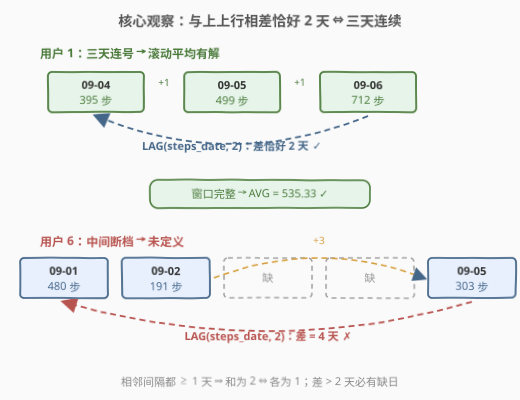
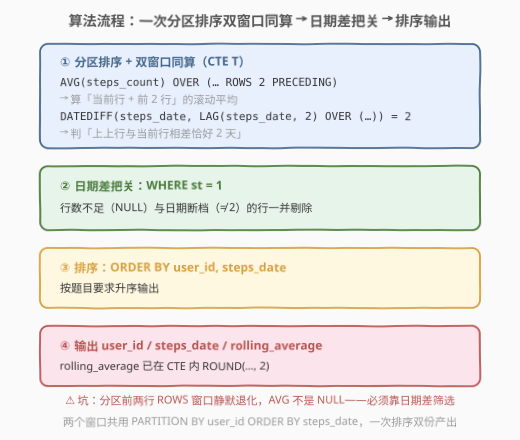
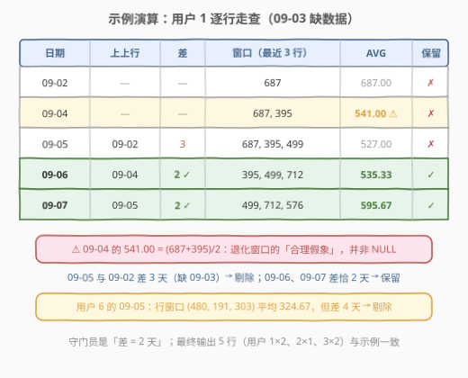

# LeetCode 滚动平均步数 题解

## 1. 题目概述

- **标题 / 题号**：滚动平均步数（#2854，medium）
- **链接**：https://leetcode.cn/problems/rolling-average-steps/
- **难度**：中等
- **标签**：数据库、SQL、窗口函数、`LAG()`、`AVG() OVER`、`DATEDIFF`、CTE

> ⚠️ 本题为 LeetCode 付费题（Plus 会员专享），题意描述根据官方示例用例与外部资料重建，可能与官方题面有出入。

**表结构**：`Steps`

| 列名 | 类型 |
|------|------|
| user_id | int |
| steps_count | int |
| steps_date | date |

- `(user_id, steps_date)` 是该表的主键。
- 每行包含用户 id、当日步数与日期。

**目标**：编写一个解决方案，计算每个用户的 **3 天滚动平均步数**。**n 天滚动平均值**的定义如下：

- 对于每一天，若以该天为结尾的 $n$ 个**连续自然日**的数据全部可用，则计算这 $n$ 天步数的平均值；否则，该天的 $n$ 天滚动平均值**未定义**（不输出该行）。

输出 `user_id`、`steps_date` 和 `rolling_average`（四舍五入到**两位小数**），结果按 `user_id`、`steps_date` **升序**排序。

**示例 1**：

```text
输入：
Steps 表:
+---------+-------------+------------+
| user_id | steps_count | steps_date |
+---------+-------------+------------+
| 1       | 687         | 2021-09-02 |
| 1       | 395         | 2021-09-04 |
| 1       | 499         | 2021-09-05 |
| 1       | 712         | 2021-09-06 |
| 1       | 576         | 2021-09-07 |
| 2       | 153         | 2021-09-06 |
| 2       | 171         | 2021-09-07 |
| 2       | 530         | 2021-09-08 |
| 3       | 945         | 2021-09-04 |
| 3       | 120         | 2021-09-07 |
| 3       | 557         | 2021-09-08 |
| 3       | 840         | 2021-09-09 |
| 3       | 627         | 2021-09-10 |
| 5       | 382         | 2021-09-05 |
| 6       | 480         | 2021-09-01 |
| 6       | 191         | 2021-09-02 |
| 6       | 303         | 2021-09-05 |
+---------+-------------+------------+

输出：
+---------+------------+-----------------+
| user_id | steps_date | rolling_average |
+---------+------------+-----------------+
| 1       | 2021-09-06 | 535.33          |
| 1       | 2021-09-07 | 595.67          |
| 2       | 2021-09-08 | 284.67          |
| 3       | 2021-09-09 | 505.67          |
| 3       | 2021-09-10 | 674.67          |
+---------+------------+-----------------+
```

**解释**：
- 用户 1：截至 2021-09-06 的三天连续数据可用（09-04、09-05、09-06），滚动平均 = (395 + 499 + 712) / 3 = 535.33；截至 09-07 = (499 + 712 + 576) / 3 = 595.67。注意 09-03 无数据，截至 09-04、09-05 的三天窗口不完整，未定义。
- 用户 2：截至 09-08 = (153 + 171 + 530) / 3 = 284.67。
- 用户 3：截至 09-09 = (120 + 557 + 840) / 3 = 505.67；截至 09-10 = (557 + 840 + 627) / 3 = 674.67。
- 用户 5 只有 1 天数据；用户 6 的 09-01、09-02、09-05 不连续——均无法计算。

> 💡 **审题关键**：① 「3 天」指**连续自然日**（$d-2$、$d-1$、$d$），不是「按行数的最近 3 条记录」——中间断一天就不算；② 窗口不完整的那天**直接不输出**（不是补 0，也不是取部分平均）；③ 主键 `(user_id, steps_date)` 保证同一用户日期两两不同，这是后续判定的前提。

## 2. 解题思路

### 2.1 暴力思路：自连接拼出「前 1 天 + 前 2 天」

最直白的想法：对每行 `a`，去同一用户里找「恰好早 1 天」的行 `b` 和「恰好早 2 天」的行 `c`，三者找齐才算平均：

```sql
SELECT a.user_id, a.steps_date,
       ROUND((a.steps_count + b.steps_count + c.steps_count) / 3, 2) AS rolling_average
FROM Steps a
JOIN Steps b ON b.user_id = a.user_id AND DATEDIFF(a.steps_date, b.steps_date) = 1
JOIN Steps c ON c.user_id = a.user_id AND DATEDIFF(a.steps_date, c.steps_date) = 2
ORDER BY 1, 2;
```

- **正确性**：没问题——INNER JOIN 找不齐 `b`、`c` 的行自动消失，天然完成「窗口不完整则不输出」。
- **效率**：两次自连接，无索引时是 $O(n^2)$ 级逐行探测，数据量大时吃力。
- **扩展性差**：改成 7 天滚动平均就要连接 6 张表，写法随 $n$ 线性膨胀。

> ⚠️ 瓶颈在于把「向前看 $k$ 天」当成**逐个日期的连接条件**去验证。突破口是一次排序内**同时拿到「最近 3 行的平均」与「和上上行的日期差」**——这正是窗口函数的主场。

### 2.2 核心观察：`LAG(d, 2)` 相差恰好 2 天 ⇔ 三天连续



把同一用户的行按 `steps_date` 升序排列。主键保证日期**两两不同**，故相邻行日期**严格递增**，相邻两个间隔都 $\ge 1$ 天。于是对第 $i$ 行：

$$d_i - d_{i-2} = \underbrace{(d_i - d_{i-1})}_{\ge 1\ \text{天}} + \underbrace{(d_{i-1} - d_{i-2})}_{\ge 1\ \text{天}}$$

- **差恰好 = 2 天** ⇔ 两个间隔都是 1 天 ⇔ $d_{i-2}, d_{i-1}, d_i$ 是**三个连续自然日**，窗口完整，滚动平均有定义；
- **差 > 2 天**（或上上行不存在）⇔ 中间至少缺一天，窗口不完整，未定义。

SQL 中用 `LAG(steps_date, 2) OVER (PARTITION BY user_id ORDER BY steps_date)` 一次取出上上行日期，`DATEDIFF` 相减即判定：

$$\boxed{\texttt{DATEDIFF(steps\_date,\ LAG(steps\_date, 2) OVER w) = 2}}$$

**平均值怎么算？** 同一个 `OVER` 子句里换聚合：`AVG(steps_count) OVER (PARTITION BY user_id ORDER BY steps_date ROWS 2 PRECEDING)`——按**行**取「当前行 + 前 2 行」的平均。关键联动在于：**当且仅当日期差判定通过时，「最近 3 行」恰好就是「最近 3 个连续自然日」**（上上行是严格早于当前行的第二大日期；它与当前行相差 2 天时，三天必然连号）。**行窗口负责算数，日期差负责把关，一次分区排序一箭双雕**。

> ⚠️ **本题最大的坑**：`ROWS 2 PRECEDING` 对每个分区的前两行会**静默退化**成 1 行 / 2 行的窗口——`AVG` 照样返回一个「看起来合理」的数（如用户 1 的 09-04 行会算出 (687 + 395) / 2 = 541.00），**并不是 NULL**！所以绝不能靠「平均值是否为 NULL」来筛，必须显式用日期差判定把关。

### 2.3 算法流程图



**逻辑执行步骤**：

| 步骤 | 表达式 | 作用 |
|------|--------|------|
| ① 分区排序 | `PARTITION BY user_id ORDER BY steps_date` | 每个用户内部按日期升序，窗口独立计算 |
| ② 行窗口平均 | `AVG(steps_count) OVER (... ROWS 2 PRECEDING)` | 最近 3 行的平均值（可能退化，先不筛） |
| ③ 日期差把关 | `DATEDIFF(steps_date, LAG(steps_date, 2) OVER (...)) = 2` | 与上上行相差恰 2 天 ⇔ 三天连续 |
| ④ 筛选 | `WHERE st = 1` | 剔除行数不足（NULL）与日期断档（≠2）的行 |
| ⑤ 排序 | `ORDER BY user_id, steps_date` | 按题目要求升序输出 |

> 💡 `LAG(..., 2)` 在每个分区的前两行返回 `NULL`，`DATEDIFF(date, NULL)` 结果也是 `NULL`，而 `NULL = 2` 不为真——**行数不足的行天然被 `WHERE` 过滤**，无需额外判空兜底。

### 2.4 示例演算



以用户 1（687@09-02，395@09-04，499@09-05，712@09-06，576@09-07）逐行走查：

| steps_date | 上上行日期 | 日期差 | 三天连续？ | ROWS 2 PRECEDING 窗口 | AVG | 保留 |
|------------|-----------|--------|-----------|----------------------|-----|------|
| 09-02 | NULL | — | ✗ | 687 | 687.00 | ✗ |
| 09-04 | NULL | — | ✗ | 687, 395 | 541.00 ⚠️ | ✗ |
| 09-05 | 09-02 | 3 | ✗ | 687, 395, 499 | 527.00 | ✗ |
| 09-06 | 09-04 | **2** | ✓ | 395, 499, 712 | **535.33** | ✓ |
| 09-07 | 09-05 | **2** | ✓ | 499, 712, 576 | **595.67** | ✓ |

> ⚠️ 注意 09-04 行：行窗口退化成 2 行，AVG = 541.00 是个**伪装得很好的错误答案**——若漏了日期差把关，它会混进输出。用户 6 的 09-05 行同理：行窗口 (480, 191, 303) 平均 324.67，但与上上行 09-01 相差 4 天，必须剔除。

用户 2、3 同法：用户 2 只有 09-08 一行过关（与 09-06 恰差 2 天）；用户 3 的 09-09（与 09-07 差 2 天）、09-10（与 09-08 差 2 天）过关，09-08 因与 09-04 差 4 天被剔除。最终 5 行输出与示例一致。

## 3. 参考代码

### SQL（解法 A：`LAG` + `AVG OVER ROWS`，推荐）

```sql
# Write your MySQL query statement below
WITH
    T AS (
        SELECT
            user_id,
            steps_date,
            ROUND(
                AVG(steps_count) OVER (
                    PARTITION BY user_id
                    ORDER BY steps_date
                    ROWS 2 PRECEDING
                ),
                2
            ) AS rolling_average,
            DATEDIFF(
                steps_date,
                LAG(steps_date, 2) OVER (
                    PARTITION BY user_id
                    ORDER BY steps_date
                )
            ) = 2 AS st
        FROM Steps
    )
SELECT
    user_id,
    steps_date,
    rolling_average
FROM T
WHERE st = 1
ORDER BY 1, 2;
```

> 💡 **写法要点**：
> - 两个窗口函数共用同一套 `PARTITION BY user_id ORDER BY steps_date`，一次排序同时产出「平均值」与「判定标志」，代价摊薄。
> - `ROWS 2 PRECEDING` 是**物理行窗**（当前行 + 前 2 行）；`LAG(x, 2)` 是**逻辑位移**（上上行的值）。两者窗口语义不同，本题靠日期差判定把它们联动起来。
> - `st` 是布尔表达式（MySQL 中真为 1、假为 0、缺失为 NULL），`WHERE st = 1` 一刀切掉「行数不足」与「日期断档」两类行。
> - `ROUND(..., 2)` 放在窗口内或最外层均可，这里在 CTE 里完成，外层只做筛选与排序，结构清爽。

### SQL（解法 B：自连接，思路直白）

```sql
SELECT
    a.user_id,
    a.steps_date,
    ROUND((a.steps_count + b.steps_count + c.steps_count) / 3, 2) AS rolling_average
FROM Steps a
JOIN Steps b
  ON b.user_id = a.user_id
 AND DATEDIFF(a.steps_date, b.steps_date) = 1
JOIN Steps c
  ON c.user_id = a.user_id
 AND DATEDIFF(a.steps_date, c.steps_date) = 2
ORDER BY 1, 2;
```

> 💡 **写法要点**：
> - 「点名式」语义最直观：给每天找齐前 1 天与前 2 天的同伙，找不齐则整行消失（INNER JOIN 自动完成筛选）。
> - 缺点是两次自连接的 $O(n^2)$ 级探测（除非对 `(user_id, steps_date)` 建索引走范围查找），且推广到 $n$ 天要连接 $n-1$ 张表。
> - ⚠️ 若同一天可能有多行（本题主键已排除此情况），自连接会产生重复组合放大，需先按天去重/聚合。

### Python（pandas）

```python
import pandas as pd


def rolling_average_steps(steps: pd.DataFrame) -> pd.DataFrame:
    steps = steps.sort_values(["user_id", "steps_date"]).reset_index(drop=True)
    steps["steps_date"] = pd.to_datetime(steps["steps_date"])

    prev2 = steps.groupby("user_id")["steps_date"].shift(2)
    avg3 = steps.groupby("user_id")["steps_count"].transform(
        lambda s: s.rolling(3).mean()
    )

    mask = (steps["steps_date"] - prev2) == pd.Timedelta(days=2)
    res = steps[mask].copy()
    res["rolling_average"] = avg3[mask].round(2)
    return res[["user_id", "steps_date", "rolling_average"]].reset_index(drop=True)
```

> 💡 **pandas 对照**：
> - `.sort_values` + `.groupby().shift(2)` 对应 `LAG(x, 2) OVER (PARTITION BY ... ORDER BY ...)`。
> - `.transform(lambda s: s.rolling(3).mean())` 对应 `AVG() OVER (... ROWS 2 PRECEDING)`——同样是「行窗口」，组内前两行得 `NaN`，与 SQL 的「退化窗口」是两个方言里的同一个坑。
> - 布尔掩码 `mask` 对应 `WHERE st = 1`；`(date - NaT) == Timedelta` 为 `False`，行数不足的行天然落选，与 SQL 的 NULL 传播殊途同归。

## 4. 复杂度分析

| 维度 | 复杂度 | 说明 |
|------|--------|------|
| **时间复杂度** | $O(n \log n)$ | 窗口排序主导：按 `(user_id, steps_date)` 排序 $O(n \log n)$；`AVG`/`LAG` 沿排序结果单趟扫描 $O(n)$ |
| **空间复杂度** | $O(n)$ | CTE `T` 物化 $n$ 行中间结果（含两列窗口输出） |
| **解法 B（自连接）** | $O(n^2)$ | 两次自连接逐行探测；对 `(user_id, steps_date)` 建索引可降为 $O(n \log n)$ |

> - $n$ = `Steps` 行数。
> - 若表按主键 `(user_id, steps_date)` 组织（InnoDB 聚簇索引天然有序），窗口排序可省，整体退化为 $O(n)$。
> - `ROWS` 帧滑动平均是**增量可维护**的（窗口和减去移出行、加上进入行），数据库与 pandas 的 `rolling` 均按此实现，单窗摊还 $O(1)$。

## 5. 扩展：RANGE INTERVAL 帧与 n 天泛化

### 5.1 用「日期帧」一步到位：`RANGE BETWEEN INTERVAL 2 DAY PRECEDING`

`ROWS` 按**行数**开窗，`RANGE` 按**排序键的值域**开窗。MySQL 8.0+ 允许 RANGE 帧搭配 `INTERVAL`，可以把「最近 3 个自然日」直接写进帧定义：

```sql
WITH
    T AS (
        SELECT
            user_id,
            steps_date,
            ROUND(
                AVG(steps_count) OVER (
                    PARTITION BY user_id
                    ORDER BY steps_date
                    RANGE BETWEEN INTERVAL 2 DAY PRECEDING AND CURRENT ROW
                ),
                2
            ) AS rolling_average,
            COUNT(steps_count) OVER (
                PARTITION BY user_id
                ORDER BY steps_date
                RANGE BETWEEN INTERVAL 2 DAY PRECEDING AND CURRENT ROW
            ) AS cnt
        FROM Steps
    )
SELECT user_id, steps_date, rolling_average
FROM T
WHERE cnt = 3
ORDER BY 1, 2;
```

**为什么 `cnt = 3` 就等价于窗口完整？** 帧覆盖值域 $[d - 2\ \text{天}, d]$，而日期两两不同 ⇒ 帧内至多 3 行；恰有 3 行 ⇔ $d-2$、$d-1$、$d$ 三天**全部有数据**。判定与求值统一在同一个是**日期语义**的帧里，不再需要 `LAG` + `DATEDIFF` 的联动论证——代价是依赖 MySQL 8.0+ 的 INTERVAL 帧语法（部分数据库或旧版本不支持）。

### 5.2 n 天滚动平均的泛化

| 解法 | 改动点 |
|------|--------|
| 解法 A（ROWS 行窗） | `LAG(d, n−1)` + `DATEDIFF = n−1` + `ROWS (n−1) PRECEDING` |
| 解法 B（自连接） | 连接 $n-1$ 张表（不推荐） |
| RANGE INTERVAL 帧 | `INTERVAL (n−1) DAY PRECEDING` + `COUNT = n`（只改两个常数，最优雅） |

> 💡 面试若被追问「改成 7 天怎么办」，答 RANGE INTERVAL 版最加分：帧定义即业务语义（「最近 7 个自然日」），`COUNT` 把关窗口完整性，两个常数一改即成。

## 6. 面试要点

**Q1：为什么「与上上行相差恰好 2 天」就能断定三天连续？**

> 主键保证同一用户日期两两不同，按日期升序后相邻行严格递增，两个相邻间隔都 $\ge 1$ 天。两个间隔之和恰为 2 ⇔ 每个间隔都是 1 天 ⇔ 三个日期连号。若差为 3 天以上，则中间至少缺一个自然日，三天窗口不完整。

**Q2：`ROWS 2 PRECEDING` 在每个分区的前两行会发生什么？为什么是坑？**

> 窗口**静默退化**成 1 行 / 2 行，`AVG` 依然返回具体数值而非 NULL。例如用户 1 的 09-04 行会得到 (687 + 395) / 2 = 541.00 这个「合理假象」。因此不能用「平均值是否为 NULL」筛选，必须靠日期差判定把关——这是本题最核心的辨析点。

**Q3：`LAG(steps_date, 2)` 返回 NULL 时，`DATEDIFF(...) = 2` 的结果是什么？**

> `DATEDIFF(date, NULL)` 按 NULL 传播规则得 NULL，`NULL = 2` 不为真，该行被 `WHERE` 过滤。所以「行数不足」的行天然不会漏进结果，无需 `IFNULL` 兜底后再比较。

**Q4：`ROWS` 与 `RANGE` 帧在本题中的本质区别是什么？**

> `ROWS 2 PRECEDING` 是物理行窗——不看日期值只数行数，断档时算的是「跳过缺失日的 3 条记录」，语义错，需外部日期差纠正。`RANGE BETWEEN INTERVAL 2 DAY PRECEDING` 是逻辑值窗——严格取 $[d-2, d]$ 值域内的行，天然与「连续自然日」对齐，配 `COUNT = 3` 即自证完整。行窗直白通用但需联动判定，值窗自洽但依赖方言支持。

**Q5：若主键放开、同一用户同一天可能有多条记录，解法 A 会怎样？**

> `ROWS 2 PRECEDING` 可能取到同日的多行，平均被重复计数污染；`LAG` 的日期差判定也会失真。需先 `GROUP BY user_id, steps_date` 聚合（如取 `SUM` 或 `AVG`）压成「每人每天一行」再进窗口——这是一切「按天连续性」问题的标准预处理。

> 💡 **一句话总结**：2854 是**「滚动窗口 + 连续性判定」的窗口函数双打题**——`AVG() OVER (ROWS 2 PRECEDING)` 负责算，`DATEDIFF(steps_date, LAG(steps_date, 2) OVER ...) = 2` 负责筛，一次分区排序一箭双雕。最大坑点：**行窗口不足 3 行时静默退化而非置 NULL**。进阶姿势：RANGE INTERVAL 帧让「最近 3 个自然日」直接成为窗口语义。

## 同类练习题

| # | 题目 | 与本题的关联 |
|---|------|-------------|
| 197 | [上升温度](https://leetcode.cn/problems/rising-temperature/) | `DATEDIFF` + `LAG` 比较相邻行日期的入门题，本题判定逻辑的最小单元 |
| 180 | [连续出现的数字](https://leetcode.cn/problems/consecutive-numbers/) | `LAG(x, 1)` 连用两次判定「连续出现 3 次」，与本题 `LAG(d, 2)` 的定长连续判定同构 |
| 1454 | [活跃用户](https://leetcode.cn/problems/active-users/) | 连续 5 天活跃的行号差法判定，把本题「恰好 3 天」推广到「至少 5 天」 |
| 1204 | [最后一个能进入巴士的人](https://leetcode.cn/problems/last-person-to-fit-in-the-bus/) | `SUM() OVER (ORDER BY ...)` 滚动累计窗口，与本题滚动平均同属「窗口聚合家族」 |
| 1225 | [报告系统状态的连续日期](https://leetcode.cn/problems/report-contiguous-dates/) | Gaps and Islands 母题，连续日期段合并的进阶综合 |
