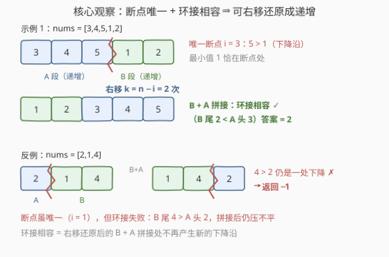
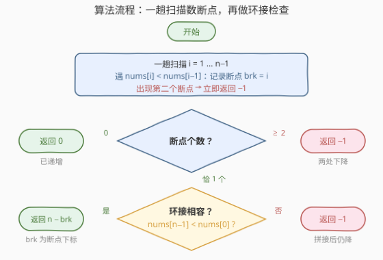
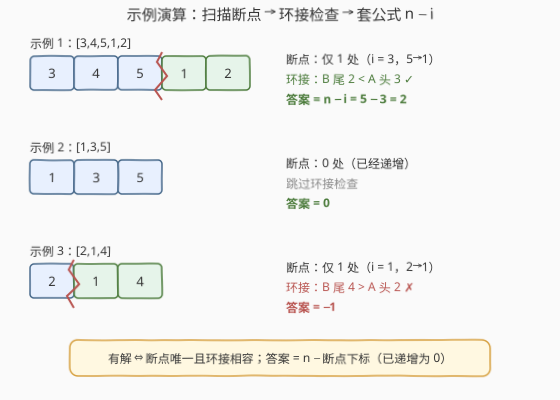

# LeetCode 使数组成为递增数组的最少右移次数 题解

## 1. 题目概述

- **标题 / 题号**：使数组成为递增数组的最少右移次数（#2855，easy）
- **链接**：https://leetcode.cn/problems/minimum-right-shifts-to-sort-the-array/
- **难度**：简单
- **标签**：数组

**题意**：给你一个长度为 $n$、下标从 **0** 开始的数组 `nums`，数组中的元素为**互不相同**的正整数。请你返回让 `nums` 成为**递增数组**的**最少右移次数**，如果无法得到递增数组，返回 $-1$。

一次**右移**指的是同时对所有下标进行操作，将下标为 $i$ 的元素移动到下标 $(i + 1) \bmod n$ 处。

**示例 1**：

```text
输入：nums = [3,4,5,1,2]
输出：2
解释：第一次右移后，nums = [2,3,4,5,1]。第二次右移后，nums = [1,2,3,4,5]。
现在 nums 是递增数组了，所以答案为 2。
```

**示例 2**：

```text
输入：nums = [1,3,5]
输出：0
解释：nums 已经是递增数组了，所以答案为 0。
```

**示例 3**：

```text
输入：nums = [2,1,4]
输出：-1
解释：无法将数组变为递增数组。
```

**约束**：

- $1 \le \text{nums.length} \le 100$
- $1 \le \text{nums}[i] \le 100$
- `nums` 中的整数互不相同。

> 💡 读题关键：「右移」就是**循环右移（旋转）**——末尾元素绕回开头。右移 $k$ 次后，原下标 $i$ 的元素恰好落在 $(i+k) \bmod n$ 处。于是问题改写成：`nums` 是不是某个递增数组旋转出来的？如果是，转回去最少要几步？

## 2. 解题思路

### 2.1 暴力思路

$k$ 的取值只有 $0 \sim n-1$（右移 $n$ 次等于没移），最直接的做法是**逐个枚举**：对每个 $k$ 构造右移 $k$ 次后的数组——右移 $k$ 次意味着新数组的开头是原数组的末 $k$ 个元素，即 $\text{rotated}[j] = \text{nums}[(j - k) \bmod n]$——再花 $O(n)$ 检查是否严格递增，取第一个可行的 $k$。

总时间 $O(n^2)$，本题 $n \le 100$ 必然能过。但它完全没有利用「旋转」的结构性质：能否有解、答案是几，其实由数组自身的两个特征一次扫描就能读出来。

### 2.2 核心观察：断点唯一 + 环接相容



**观察 1（什么时候有解）**：旋转不改变元素在环上的相邻关系。一个递增数组首尾相接后，环上**只有一处下降沿**（尾元素绕回头部那一下）；反过来，只有「环上恰好一处下降」的数组才可能旋转成递增数组。用线性视角描述，就是：

- 沿下标 $1 \sim n-1$ 扫描，**下降沿**（$\text{nums}[i] < \text{nums}[i-1]$）**至多一处**；
- 若恰有一处（记断点下标为 $i$），数组被切成 $A = \text{nums}[0..i-1]$ 与 $B = \text{nums}[i..n-1]$ 两段，各自内部递增；右移还原后的数组是 $B + A$ 拼接，还要求**环接相容**：$B$ 的最大值（$\text{nums}[n-1]$）小于 $A$ 的最小值（$\text{nums}[0]$）。

反例就是示例 3 的 $[2,1,4]$：断点唯一（$i=1$），但 $B$ 尾 $4 > A$ 头 $2$，强行拼成 $[1,4,2]$ 仍有一处下降——怎么转都压不平，返回 $-1$。元素互不相同，保证一次比较就能判完环接。

**观察 2（答案是几）**：断点处的元素 $\text{nums}[i]$ 正是全数组的**最小值**（环接相容时 $B$ 段整体小于 $A$ 段，而 $B$ 段自身递增）。递增数组的开头必须是最小值，而右移 $k$ 次把下标 $i$ 的元素送到 $(i+k) \bmod n$：令 $(i + k) \bmod n = 0$，解得

$$k = n - i$$

示例 1 中断点 $i = 3$、$n = 5$，答案 $5 - 3 = 2$，与示例一致。

> 💡 一句话：**有解 ⇔ 断点唯一且环接相容（或本来就没有断点）；有解时答案 = $n - i$（$i$ 为断点下标），已递增则答案为 0。**

### 2.3 算法流程图



整个算法一趟扫描 + 一次比较：

1. **扫描**：$i$ 从 $1$ 到 $n-1$，数下降沿个数并记录首个断点下标 `brk`；一旦出现第二个下降沿，立即返回 $-1$；
2. **分派**：断点 $0$ 个 → 返回 $0$；恰 $1$ 个 → 检查 $\text{nums}[n-1] < \text{nums}[0]$，成立返回 $n - \text{brk}$，否则 $-1$。

### 2.4 示例演算



| 示例 | 数组 | 下降沿 | 断点数 | 环接检查（$\text{nums}[n-1]$ vs $\text{nums}[0]$） | 答案 |
|------|------|--------|--------|------|------|
| 1 | $[3,4,5,1,2]$ | $5 \to 1$（$i=3$） | 1 | $2 < 3$ ✓ | $n - i = 2$ |
| 2 | $[1,3,5]$ | 无 | 0 | 跳过（已递增） | $0$ |
| 3 | $[2,1,4]$ | $2 \to 1$（$i=1$） | 1 | $4 > 2$ ✗ | $-1$ |

## 3. 参考代码

### C++

```cpp
class Solution {
public:
    int minimumRightShifts(vector<int>& nums) {
        int n = nums.size(), brk = -1;
        for (int i = 1; i < n; i++) {
            if (nums[i] < nums[i - 1]) {   // 下降沿
                if (brk != -1) return -1;  // 第二个断点：判死
                brk = i;                   // 记录首个断点
            }
        }
        if (brk == -1) return 0;           // 本来就递增
        return nums[n - 1] > nums[0] ? -1  // 环接失败
                                     : n - brk;
    }
};
```

### Python

```python
class Solution:
    def minimumRightShifts(self, nums: List[int]) -> int:
        n, brk = len(nums), -1
        for i in range(1, n):
            if nums[i] < nums[i - 1]:      # 下降沿
                if brk != -1:
                    return -1              # 第二个断点：判死
                brk = i                    # 记录首个断点
        if brk == -1:
            return 0                       # 本来就递增
        return -1 if nums[-1] > nums[0] else n - brk
```

> 💡 $n = 1$ 时循环不执行、`brk` 保持 $-1$，自然返回 $0$，无需特判。

## 4. 复杂度分析

| 维度 | 复杂度 | 说明 |
|------|--------|------|
| 时间复杂度 | $O(n)$ | 一趟扫描数下降沿，再加一次环接比较 |
| 空间复杂度 | $O(1)$ | 只维护断点下标 `brk` |

> 💡 对比：暴力枚举每个 $k$ 再逐个检查是 $O(n^2)$；一次扫描把「判定」（断点计数 + 环接）与「求解」（$n - \text{brk}$）一并完成。旋转类题目的通用心法：**别模拟旋转，先在环上找断点。**

## 5. 扩展：环上视角的统一写法

把数组首尾相接看成一个环，环上恰有 $n$ 对相邻元素——比线性视角多出 $(\text{nums}[n-1], \text{nums}[0])$ 这对「缝」。元素互异时：

> **数组能旋转成递增数组 ⇔ 环上下降沿恰好 1 个。**

本来就递增的数组，唯一的下降沿正好落在缝上（尾 $>$ 头）；被旋转过的数组，唯一下降沿落在断点处（缝是上升的）。于是「数断点」和「环接检查」合并成了同一个计数器，唯一的下降沿位置还直接给出答案：

```python
class Solution:
    def minimumRightShifts(self, nums: List[int]) -> int:
        n = len(nums)
        desc, pos = 0, 0
        for i in range(1, n + 1):           # 环上 n 对相邻元素各查一次
            if nums[i % n] < nums[(i - 1) % n]:
                desc += 1
                pos = i
        if desc == 0:                        # 环上无下降 → 只可能 n == 1
            return 0
        if desc > 1:
            return -1
        return (n - pos % n) % n
```

下降沿落在缝上（`pos % n == 0`）对应「已递增」，公式 $(n - 0) \bmod n = 0$ 自动给出答案 $0$——两个判定、一个公式，全被环的对称性吃掉了。

> ⚠️ 这套「环上恰好一处下降」的判定依赖元素互异。若允许重复：目标是**严格递增**时有重复必为 $-1$，问题退化；放宽为「非降」后「严格下降沿 $\le 1$」依然成立，但相等的相邻对会让**二分找断点**失效（[154. 寻找旋转排序数组中的最小值 II](https://leetcode.cn/problems/find-minimum-in-rotated-sorted-array-ii/) 的经典坑），那是另一条故事线了。

## 6. 面试要点

1. **为什么下降沿至多一处？两处为什么无解？**

   > 递增数组环上只有一处下降（尾绕回头）。旋转只改变起点、不改变环上的相邻关系，所以能旋转成递增的数组环上也只能有一处下降；线性方向出现两处下降意味着环上至少两处，怎么转都压不平。

2. **断点唯一就一定有解吗？环接检查防的是什么？**

   > 不一定，$[2,1,4]$ 就是反例。断点把数组切成 $A$、$B$ 两段，各自递增；右移还原后的数组是 $B + A$，还必须 $B$ 的最大值小于 $A$ 的最小值。元素互异时这恰好是一次比较 $\text{nums}[n-1] < \text{nums}[0]$。

3. **答案为什么是 $n - i$ 而不是 $i$？**

   > 右移 $k$ 次把下标 $i$ 的元素送到 $(i+k) \bmod n$；断点处的元素是最小值，必须落到下标 $0$，解得 $k = n - i$。等价记忆：右移 $k$ 次后新数组的开头是原下标 $n-k$ 的元素，令 $n - k = i$ 同样得 $k = n - i$。

4. **$n = 1$ 会不会出问题？**

   > 不会。线性写法里循环不执行、断点数为 $0$，返回 $0$；环形写法里环上无下降（唯一一对是元素与自身的比较），也返回 $0$。两种写法都不需要特判。

5. **和 1752、153 是什么关系？**

   > 同属「旋转递增数组」家族：[1752. 检查数组是否经排序和轮转得到](https://leetcode.cn/problems/check-if-array-is-sorted-and-rotated/) 是本题的纯判定版（只问能否、不问次数，同款断点计数）；[153. 寻找旋转排序数组中的最小值](https://leetcode.cn/problems/find-minimum-in-rotated-sorted-array/) 反过来——**已知**是旋转递增数组，用二分 $O(\log n)$ 找最小值（断点）下标；本题要先判定结构，一趟线性扫描顺手把判定和求解都做完了。

## 同类练习题

| # | 题目 | 与本题的关联 |
|---|------|-------------|
| 1752 | [检查数组是否经排序和轮转得到](https://leetcode.cn/problems/check-if-array-is-sorted-and-rotated/) | 本题的纯判定版——只问「是否为某个递增数组的旋转」，同款断点计数 |
| 189 | [轮转数组](https://leetcode.cn/problems/rotate-array/) | 把「右移/轮转」这个操作本身作为考点，翻转三连的手写实现 |
| 153 | [寻找旋转排序数组中的最小值](https://leetcode.cn/problems/find-minimum-in-rotated-sorted-array/) | 已知结构找断点（最小值下标），二分 $O(\log n)$ 的招牌题 |
| 154 | [寻找旋转排序数组中的最小值 II](https://leetcode.cn/problems/find-minimum-in-rotated-sorted-array-ii/) | 153 的重复元素版，体会「元素互异」对本题判定有多重要 |
| 33 | [搜索旋转排序数组](https://leetcode.cn/problems/search-in-rotated-sorted-array/) | 旋转递增数组上二分查找目标值，先判哪半有序再砍区间 |
