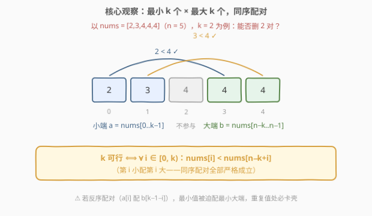
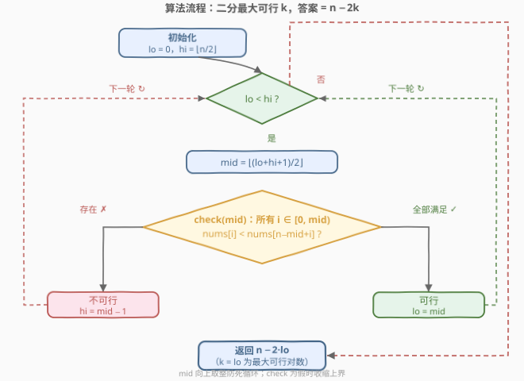
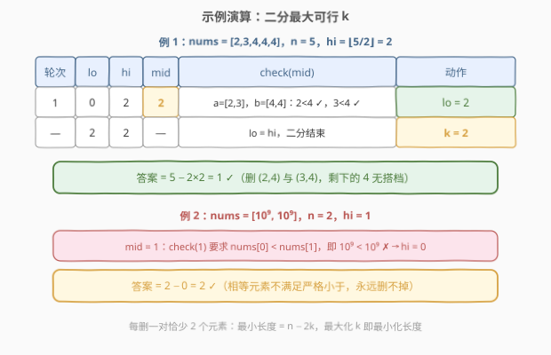
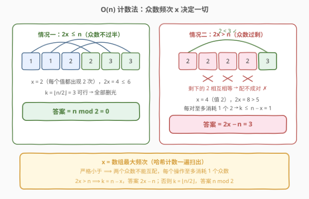

# 删除数对后的最小数组长度

- **题目名称**：删除数对后的最小数组长度
- **链接**：[2856. 删除数对后的最小数组长度](https://leetcode.cn/problems/minimum-array-length-after-pair-removals/)
- **难度**：中等
- **标签**：贪心、数组、哈希表、双指针、二分查找、计数

## 1. 题目概述

给你一个下标从 **0** 开始的**非递减**整数数组 `nums`。

你可以执行以下操作任意次：

- 选择**两个**下标 $i$ 和 $j$，满足 $nums[i] < nums[j]$（**严格小于**）。
- 将 `nums` 中下标在 $i$ 和 $j$ 处的元素删除。剩余元素按原来的顺序组成新的数组，下标重新从 **0** 开始编号。

请你返回一个整数，表示执行以上操作任意次后（可以执行 **0** 次），`nums` 数组的**最小**数组长度。

**示例 1**：

```text
输入：nums = [1,2,3,4]
输出：0
解释：删除 (1,2) 后剩 [3,4]，再删除 (3,4)，数组为空。
```

**示例 2**：

```text
输入：nums = [1,1,2,2,3,3]
输出：0
解释：依次删除值对 (1,2)、(1,3)、(2,3)，数组为空。
```

**示例 3**：

```text
输入：nums = [1000000000,1000000000]
输出：2
解释：两个数字相等，不满足严格小于，不能删除它们。
```

**示例 4**：

```text
输入：nums = [2,3,4,4,4]
输出：1
解释：删除 (2,4) 和 (3,4)，剩下一个 4。
```

**约束条件**：

- $1 \le nums.length \le 10^5$
- $1 \le nums[i] \le 10^9$
- `nums` 是**非递减**数组。

> 💡 本题核心是「**二分答案 + 贪心配对**」。注意到每删一对就少 **2** 个元素，所以**最小长度 = $n - 2k$**，其中 $k$ 是最多能删除的对数——问题立刻从「模拟删除过程」转化为「求最大删除次数 $k$」，而 $k$ 的可行性关于大小**单调**（能删 $k$ 对必然能删 $k-1$ 对），天然适合**二分**。验证 $k$ 是否可行时，用「最小 $k$ 个 × 最大 $k$ 个**同序配对**」的贪心结构 $O(k)$ 判定。此外还有一个 $O(n)$ 的**频次计数**妙解（见第 5 节）。

---

## 2. 解题思路

### 2.1 暴力思路：模拟删除过程

最直觉的做法是逐步模拟：每轮挑出一对满足严格小于关系的元素删掉，直到删不动为止。但这有两个致命问题：

1. **删除顺序互相影响**：先删谁后删谁会导致剩余数组不同，「每轮挑当前最小和最大」这类朴素贪心**并不总是最优**，正确性难以论证；
2. **复杂度失控**：枚举所有删除方案是指数级；逐对模拟是 $O(n^2)$，$n \le 10^5$ 直接超时。

**换个视角**：设最终最多执行了 $k$ 次操作，则剩余长度为 $n - 2k$。要最小化长度，只需**最大化 $k$**。于是问题变成——**最多能删多少对？** 这是一类经典的「最大化操作次数」问题，标准工具就是**二分答案**。

### 2.2 核心观察：二分答案 + 同序配对

**观察 1（单调性，二分的合法性）**：若存在方案删掉 $k$ 对，则任取其中 $k-1$ 对也是合法方案。即 $k$ 的可行性随 $k$ 增大而单调不升——**满足二分答案的单调性前提**。

**观察 2（元素选取，交换论证）**：若某个方案能删 $k$ 对，则取**最小的 $k$ 个**值 $a = nums[0..k-1]$ 当「小端」，取**最大的 $k$ 个**值 $b = nums[n-k..n-1]$ 当「大端」，也能删 $k$ 对。道理是交换论证：把方案里某个小端元素换成更小的、某个大端元素换成更大的，$nums[i] < nums[j]$ 只会更容易满足。

**观察 3（配对方式）**：小端 $a$ 与大端 $b$ 各自升序，**同序配对** $a[i] \leftrightarrow b[i]$（第 $i$ 小配第 $i$ 大）是最优配对——若存在任何可行配对，同序配对必可行。直觉：同序配对让每一对的「富余量」分布最均匀，不会出现某一对「大端太小」卡壳。



于是得到 $O(k)$ 的**验证函数**：

$$\text{check}(k):\quad \forall\, i \in [0,\, k),\ \ nums[i] < nums[n-k+i]$$

在 $[0,\ \lfloor n/2 \rfloor]$ 上二分最大可行 $k$，答案即 $n - 2k$。

> ⚠️ 注意配对方向必须是「同序」：$a$ 的第 $i$ 个配 $b$ 的第 $i$ 个，即下标 $i$ 对下标 $n-k+i$。若写成 $a[i]$ 配 $b[k-1-i]$（反序），最小值会被迫去配最小的大端值，重复元素多时极易误判。

### 2.3 算法流程图



**完整步骤**：

1. **初始化**：二分区间 $lo = 0$（删 0 对恒可行），$hi = \lfloor n/2 \rfloor$（每次删 2 个，对数上限）
2. **循环**：当 $lo < hi$ 时，取 $mid = \lfloor (lo+hi+1)/2 \rfloor$（向上取整，避免死循环）
3. **验证** $\text{check}(mid)$：逐位判断 $nums[i] < nums[n-mid+i]$ 对所有 $i \in [0, mid)$ 是否成立
4. **收缩**：可行则 $lo = mid$，否则 $hi = mid - 1$
5. **返回** $n - 2 \cdot lo$

### 2.4 示例演算

以示例 4 $nums = [2,3,4,4,4]$（$n = 5$，$hi = \lfloor 5/2 \rfloor = 2$）为例：



| 轮次 | lo | hi | mid | check(mid) | 动作 |
|------|----|----|-----|-----------|------|
| 1 | 0 | 2 | 2 | $a = [2,3]$，$b = [4,4]$：$2<4$ ✓，$3<4$ ✓ | 可行，$lo = 2$ |
| — | 2 | 2 | — | $lo = hi$，循环结束 | $k = 2$ |

答案 $= 5 - 2 \times 2 = 1$ ✓。对应删除方案：$(2, 4)$ 与 $(3, 4)$，剩下的那个 $4$ 再无不同的搭档，只能保留。

再看示例 3 $nums = [10^9, 10^9]$：$hi = 1$，$\text{check}(1)$ 要求 $nums[0] < nums[1]$，即 $10^9 < 10^9$，**不成立** → $hi = 0$，$k = 0$，答案 $2$ ✓——两个相等元素无法配对，正是「严格小于」约束的体现。

> 💡 示例 2 $[1,1,2,2,3,3]$：$\text{check}(3)$ 中 $a = [1,1,2]$，$b = [2,3,3]$，三对 $1<2$、$1<3$、$2<3$ 全部成立，$k = 3$，答案 $0$ ✓。可见**重复元素并非不能删**——只要有更大的值「接得住」即可。

---

## 3. 参考代码

### C++

```cpp
class Solution {
public:
    int minLengthAfterRemovals(vector<int>& nums) {
        int n = nums.size();
        // check(k): 最小 k 个与最大 k 个同序配对，每对都满足严格小于
        auto check = [&](int k) -> bool {
            for (int i = 0; i < k; i++) {
                if (nums[i] >= nums[n - k + i]) return false;
            }
            return true;
        };
        int lo = 0, hi = n / 2;          // k 的范围 [0, n/2]
        while (lo < hi) {                 // 二分最大可行 k
            int mid = lo + (hi - lo + 1) / 2;
            if (check(mid)) lo = mid;
            else hi = mid - 1;
        }
        return n - 2 * lo;                // 最小长度 = n - 2k
    }
};
```

### Python

```python
class Solution:
    def minLengthAfterRemovals(self, nums: List[int]) -> int:
        n = len(nums)

        def check(k: int) -> bool:      # 最小 k 个 × 最大 k 个同序配对
            return all(nums[i] < nums[n - k + i] for i in range(k))

        lo, hi = 0, n // 2              # k 的范围 [0, n//2]
        while lo < hi:                  # 二分最大可行 k
            mid = (lo + hi + 1) // 2
            if check(mid):
                lo = mid
            else:
                hi = mid - 1
        return n - 2 * lo               # 最小长度 = n - 2k
```

> 💡 两版逻辑完全一致：`check` 里 `nums[i]` 与 `nums[n-k+i]` 正是「同序配对」的下标形态；二分用「向上取整 mid + 可行则抬 lo」的模板求**最大可行值**，避免 `lo = mid` 死循环。数组已非递减，**无需排序**。

---

## 4. 复杂度分析

| 维度 | 复杂度 | 说明 |
|------|--------|------|
| **时间复杂度** | $O(n \log n)$ | 二分 $O(\log n)$ 轮，每轮 `check` 至多 $O(n)$ |
| **空间复杂度** | $O(1)$ | 仅常数个变量，原地判断 |

> ⚠️ 若输入不是有序数组，需先排序（$O(n \log n)$），总复杂度不变。本题白送了非递减条件，`check` 直接用下标即可。

---

## 5. 扩展：哈希计数 O(n) 妙解

换个角度想：什么情况下会「删不动」？**只有某个值出现太多**。设数组中出现次数最多的值频次为 $x$（众数）：

**情况一：$2x > n$（众数过半）**

每次操作删掉的两个元素满足严格小于，**两个众数永远不能配对**，所以每次操作至多消耗 1 个众数。设共删 $k$ 对、其中消耗 $d$ 个众数，则 $d \le k$；非众数共 $n - x$ 个，删掉 $2k - d \le n - x$ 个。于是

$$2k = d + (2k - d) \le k + (n - x) \implies k \le n - x$$

而 $k = n - x$ 恰好可以达到：把每个非众数与一个众数配对（比众数小的当小端、比众数大的当大端）。因此

$$\text{答案} = n - 2(n - x) = 2x - n$$

**情况二：$2x \le n$（众数不过半）**

没有瓶颈值了：$\text{check}(\lfloor n/2 \rfloor)$ 必然成立（若失败，意味着某个值在长度 $\lfloor n/2 \rfloor + 1$ 以上的连续区间内全部相等，即 $x > n/2$，矛盾）。所以能删满 $\lfloor n/2 \rfloor$ 对：

$$\text{答案} = n - 2\lfloor n/2 \rfloor = n \bmod 2$$



```cpp
class Solution {
public:
    int minLengthAfterRemovals(vector<int>& nums) {
        int n = nums.size();
        unordered_map<int, int> cnt;
        int x = 0;                       // 最大频次
        for (int v : nums) x = max(x, ++cnt[v]);
        return 2 * x > n ? 2 * x - n     // 众数过半：删不完
                         : n % 2;        // 众数不过半：删到只剩奇偶性
    }
};
```

```python
class Solution:
    def minLengthAfterRemovals(self, nums: List[int]) -> int:
        n = len(nums)
        x = max(Counter(nums).values())
        return 2 * x - n if 2 * x > n else n % 2
```

时间 $O(n)$、空间 $O(n)$。两法互验：示例 4 中 $x = 3 > 5/2$，答案 $2 \times 3 - 5 = 1$ ✓；示例 2 中 $x = 2 \le 3$，答案 $6 \bmod 2 = 0$ ✓。

> 💡 还可以更省：非递减数组的众数频次也可以用**中位数计数**求——排序后 $nums[n/2]$ 必是众数（频次过半时），二分找其左右边界即得 $x$，空间降到 $O(1)$。

---

## 6. 面试要点

1. **为什么本题适合二分答案？**

   - 关键单调性：「能删 $k$ 对」蕴含「能删 $k-1$ 对」（任取 $k-1$ 对子方案即可）。可行性随 $k$ 单调不升，且答案形态是 $n - 2k$（最大化 $k$），正是二分答案的标准信号——**看到「最小化剩余 / 最大化操作次数」，先想单调性**。

2. **为什么「最小 k 个 × 最大 k 个」是最优选取？**

   - 交换论证：任何可行方案中，把某个小端元素换成严格更小的元素、某个大端换成严格更大的元素，配对的严格小于关系只会更宽松，方案仍可行。反复交换后，任何可行方案都能改造成「最小 $k$ 个当小端、最大 $k$ 个当大端」的形态。

3. **为什么配对方向必须同序？check 里下标怎么对应？**

   - 小端 $a$ 与大端 $b$ 都升序，同序配对 $a[i] \leftrightarrow b[i]$ 让每对的差值「均匀分布」；若反序，最小值被迫配最小的大端，重复值场景下必卡壳。落到下标上就是 $nums[i]$ 对 $nums[n-k+i]$（$i \in [0, k)$），写成 $nums[n-1-i]$ 是常见笔误。

4. **如何想到 O(n) 计数解？两种解法何时等价？**

   - 从「瓶颈」角度切入：删除要求严格小于，说明**相等值互斥**，唯一的障碍是某值出现过多。设最大频次 $x$：$2x > n$ 时众数删不完，答案 $2x - n$；否则无瓶颈，删到只剩 $n \bmod 2$。它与二分解完全等价——$2x > n$ 时 $k_{\max} = n - x$，否则 $k_{\max} = \lfloor n/2 \rfloor$。

5. **$n$ 为奇数时答案可能是 0 吗？**

   - 不可能。每次操作恰好删 2 个元素，奇数长度的数组无论怎么删都剩奇数个，答案至少为 1。计数解里这体现为 $n \bmod 2 = 1$。

> 💡 **一句话总结**：最小长度 $= n - 2k$，把问题翻转为最大化删除对数 $k$；可行性单调 → 二分，验证用「最小 $k$ 个 × 最大 $k$ 个同序配对」；再看穿一层，唯一的瓶颈是众数频次 $x$——$2x > n$ 时答案 $2x - n$，否则 $n \bmod 2$，$O(n)$ 收工。

---

## 7. 同类练习题

- [2870. 使数组为空的最少操作次数](https://leetcode.cn/problems/minimum-number-of-operations-to-make-array-empty/)：同为「频次计数决定删除操作」的贪心题，按频次 $f$ 分摊为 2/3 的删除组合
- [1338. 数组大小减半](https://leetcode.cn/problems/reduce-array-size-to-the-half/)：按频次从高到低贪心选取，频次计数家族的入门题
- [767. 重构字符串](../0701-0800/767_重构字符串.md)：频次瓶颈思想同构——出现最多的字符决定可行性，与本题「众数频次决定答案」如出一辙
- [875. 爱吃香蕉的珂珂](../0801-0900/875_爱吃香蕉的珂珂.md)：二分答案 + $O(n)$ 验证的标准模板题，与主解法同一范式
