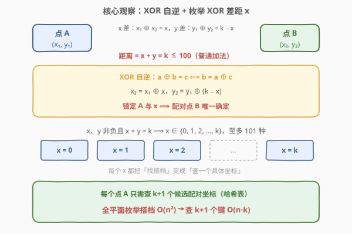
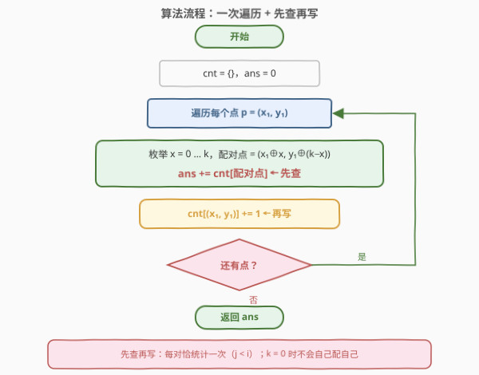
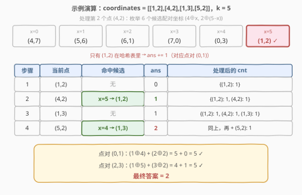

# LeetCode 统计距离为k的点对 题解

## 1. 题目概述

- **标题 / 题号**：统计距离为 k 的点对（#2857，medium）
- **链接**：https://leetcode.cn/problems/count-pairs-of-points-with-distance-k/
- **难度**：中等
- **标签**：位运算、数组、哈希表

**题意**：给你一个**二维**整数数组 `coordinates` 和一个整数 `k`，其中 `coordinates[i] = [x_i, y_i]` 表示第 `i` 个点在二维平面里的坐标。

我们定义两个点 $(x_1, y_1)$ 和 $(x_2, y_2)$ 的**距离**为 $(x_1 \oplus x_2) + (y_1 \oplus y_2)$，其中 $\oplus$ 指的是按位异或运算。

请你返回满足 $i < j$ 且点 $i$ 和点 $j$ 之间距离为 $k$ 的点对数目。

**示例 1**：

```text
输入：coordinates = [[1,2],[4,2],[1,3],[5,2]], k = 5
输出：2
解释：以下点对距离为 k：
- (0, 1)：(1 XOR 4) + (2 XOR 2) = 5。
- (2, 3)：(1 XOR 5) + (3 XOR 2) = 5。
```

**示例 2**：

```text
输入：coordinates = [[1,3],[1,3],[1,3],[1,3],[1,3]], k = 0
输出：10
解释：任何两个点之间的距离都为 0，所以总共有 10 组点对。
```

**约束**：

- $2 \le \text{coordinates.length} \le 5 \times 10^4$
- $0 \le x_i, y_i \le 10^6$
- $0 \le k \le 100$

> ⚠️ 两个关键线索：其一，$n$ 最大 $5 \times 10^4$，暴力 $O(n^2)$ 约 $1.25 \times 10^9$ 次配对判断会超时；其二，$k \le 100$ 非常小——正解的枚举量正由它封顶。

## 2. 解题思路

### 2.1 暴力思路：枚举所有点对

双重循环枚举 $i < j$，逐对计算 $(x_i \oplus x_j) + (y_i \oplus y_j)$ 并与 $k$ 比较。时间复杂度 $O(n^2)$，$n = 5 \times 10^4$ 时约 $1.25 \times 10^9$ 次判断，必然超时。

> ⚠️ 暴力法的硬伤：对每个点都在「整个点集」里线性扫描搭档。而配对条件其实可以**反解**——给定一个点和距离约束，搭档的坐标只有少数几种可能——这正是哈希查找的切入点，与 [1. 两数之和](../0001-0100/1_两数之和.md) 把「找 $k - v$」交给哈希表如出一辙。

### 2.2 核心观察：XOR 自逆 + 枚举差距



**观察一：异或是自己的逆运算**。对任意整数 $a, b, c$：

$$a \oplus b = c \iff b = a \oplus c$$

于是「B 与 A 的 XOR 差距为 $x$」可以直接反解出 B 的坐标：$x_2 = x_1 \oplus x$。

**观察二：$k \le 100$ 封住了差距的取值**。记 $x = x_1 \oplus x_2$、$y = y_1 \oplus y_2$，距离条件即 $x + y = k$（**普通加法**）。由 $x, y \ge 0$ 得 $x \in [0, k]$，至多 $101$ 种取值。

两条观察合起来：**固定点 A 与差距 $x$，配对点 B 的坐标被唯一确定**：

$$B = (x_1 \oplus x,\; y_1 \oplus (k - x))$$

> 💡 **关键转化**：「在点集里找距离为 $k$ 的搭档」变成「查 $k+1$ 个具体坐标在哈希表里出现过几次」。[1. 两数之和](../0001-0100/1_两数之和.md) 对每个数查 1 个键（$k - v$），本题对每个点查 $k+1$ 个键——键数由配对条件反解出的取值集合大小决定。

**不重不漏**：

- **不漏**：任何距离为 $k$ 的点对 $(i, j)$（$i < j$），其真实差距 $x = x_i \oplus x_j \in [0, k]$，处理 $j$ 时必被枚举到，且此时 $i$ 已在表中；
- **不重**：不同候选 $x$ 反解出的配对点横坐标不同（$x_1 \oplus x = x_1 \oplus x' \iff x = x'$），同一搭档至多被计一次。

> ⚠️ **子掩码误区**：看到异或容易条件反射地去枚举 $k$ 的二进制子掩码，但这里 $x + y = k$ 是**普通加法**——$x$ 完全可以含有 $k$ 中不存在的位。例如 $k = 5 = (101)_2$ 时，$x = 2 = (010)_2$、$y = 3 = (011)_2$ 完全合法（点 $(0,0)$ 与 $(2,3)$ 的距离恰为 $2 + 3 = 5$）。枚举子掩码会漏解，必须老老实实枚举 $x = 0, 1, \dots, k$。

### 2.3 算法流程图



**完整步骤**：

1. **初始化**：哈希表 `cnt` 为空，答案 `ans = 0`
2. **遍历**每个点 $p = (x_1, y_1)$：
   - **枚举** $x = 0, 1, \dots, k$：计算配对点 $(x_1 \oplus x,\; y_1 \oplus (k - x))$，`ans += cnt[配对点]`（**先查**）
   - `cnt[(x_1, y_1)] += 1`（**再写**）
3. **返回** `ans`

> ⚠️ **顺序不能颠倒**：查询时哈希表里必须只有下标更小的点。尤其 $k = 0$ 时唯一候选 $x = 0$ 的配对点就是**自己**，若先把当前点写入再查询，会把「自己配自己」也计入——示例 2 会从 10 错成 15（多出 5 个自身对）。

### 2.4 示例演算

以示例 1 `coordinates = [[1,2],[4,2],[1,3],[5,2]], k = 5` 为例：



处理第 2 个点 $(4,2)$ 时的 6 个候选：$(4,7)$、$(5,6)$、$(6,1)$、$(7,0)$、$(0,3)$、$(1,2)$——只有 $(1,2)$ 在表中，命中点对 $(0,1)$。

| 步骤 | 当前点 $(x_1, y_1)$ | 命中候选 | ans | 处理后的 cnt |
|------|---------------------|----------|-----|--------------|
| 1 | (1,2) | 无 | 0 | {(1,2): 1} |
| 2 | (4,2) | x=5 → (1,2) | 1 | {(1,2): 1, (4,2): 1} |
| 3 | (1,3) | 无 | 1 | {(1,2): 1, (4,2): 1, (1,3): 1} |
| 4 | (5,2) | x=4 → (1,3) | 2 | 同上，再 + (5,2): 1 |

两次命中恰好对应两个合法点对：

- 步骤 2：$(1 \oplus 4) + (2 \oplus 2) = 5 + 0 = 5$ ✓
- 步骤 4：$(5 \oplus 1) + (2 \oplus 3) = 4 + 1 = 5$ ✓

最终答案为 `2`。

> 💡 示例 2（五个重合点、$k = 0$）同法演算：唯一候选 $x = 0$，配对点就是自己；处理第 $i$ 个副本（从 1 计）时表中有 $i-1$ 个相同点，累计 $0+1+2+3+4 = 10$，与 $\binom{5}{2} = 10$ 一致——重合点对与「先查再写」的配合天然正确。

## 3. 参考代码

### C++

```cpp
class Solution {
  public:
    int countPairs(vector<vector<int>>& coordinates, int k) {
        long long ans = 0;
        unordered_map<long long, int> cnt;               // 坐标 → 出现次数
        for (const auto& p : coordinates) {
            int x1 = p[0], y1 = p[1];
            for (int x = 0; x <= k; ++x) {               // 枚举 XOR 差距 x
                long long key = ((long long)(x1 ^ x) << 20) | (y1 ^ (k - x));
                auto it = cnt.find(key);
                if (it != cnt.end()) ans += it->second;  // 先查
            }
            ++cnt[((long long)x1 << 20) | y1];           // 再写
        }
        return ans;
    }
};
```

### Python

```python
class Solution:
    def countPairs(self, coordinates: List[List[int]], k: int) -> int:
        cnt = Counter()
        ans = 0
        for x1, y1 in coordinates:
            for x in range(k + 1):                       # 枚举 XOR 差距 x
                ans += cnt[(x1 ^ x, y1 ^ (k - x))]       # 先查
            cnt[(x1, y1)] += 1                           # 再写
        return ans
```

> 💡 两版逻辑一致。C++ 用 `long long` 把坐标对编码成单键：由 $x_i, y_i \le 10^6 < 2^{20}$ 且 $k \le 100 < 2^7$，两个分量异或后仍小于 $2^{20}$，`(px << 20) | py` 无重叠地拼进 40 bit。Python 直接用元组作键，`Counter` 对缺失键返回 0，无需判空。答案上限 $\binom{5 \times 10^4}{2} \approx 1.25 \times 10^9$，虽未超过 `int` 上限，用 `long long` 累计更稳妥。

## 4. 复杂度分析

| 维度 | 复杂度 | 说明 |
|------|--------|------|
| **时间复杂度** | $O(n(k+1))$ | 每个点枚举 $k+1 \le 101$ 个候选，每次哈希查询 / 写入均摊 $O(1)$；$n = 5 \times 10^4$ 时约 $5 \times 10^6$ 次操作 |
| **空间复杂度** | $O(n)$ | 哈希表至多存 $n$ 个不同坐标 |

## 5. 扩展：「一次遍历哈希数对计数」家族

本题属于「配对条件反解 + 哈希一次遍历」家族，家族成员的差异只在**反解出的取值集合大小**：

| 题目 | 配对条件 | 给定一侧反解另一侧 | 查键数 |
|------|----------|--------------------|--------|
| [1. 两数之和](../0001-0100/1_两数之和.md) | $a + b = k$ | $b = k - a$ | 1 |
| [2006. 差的绝对值为 K 的数对数目](../2001-2100/2006_差的绝对值为K的数对数目.md) | $\lvert a - b \rvert = k$ | $b = a \pm k$ | 2 |
| [1679. K 和数对的最大数目](../1601-1700/1679_K和数对的最大数目.md) | $a + b = k$（消费型） | $b = k - a$ | 1 |
| [1010. 总持续时间可被 60 整除的歌曲](../1001-1100/1010_总持续时间可被60整除的歌曲对.md) | $(a + b) \bmod 60 = 0$ | $b \bmod 60 = (60 - a \bmod 60) \bmod 60$ | 1（键空间仅 60 个余数） |
| **2857（本题）** | $(x_1 \oplus x_2) + (y_1 \oplus y_2) = k$ | $(x_2, y_2) = (x_1 \oplus x,\, y_1 \oplus (k - x))$ | $k + 1$ |

> 💡 家族骨架只有三句话：**把配对条件反解成「给定一侧，另一侧的取值集合」；用哈希表存已出现的一侧；先查再写一次遍历**。本题的新意有二：XOR 自逆性让「反解」直接落到坐标级映射（$a \oplus b = c \iff b = a \oplus c$）；而 $k \le 100$ 保证了取值集合（$k+1$ 个）小到可以逐一枚举。若把距离换成曼哈顿距离 $\lvert x_1 - x_2 \rvert + \lvert y_1 - y_2 \rvert = k$，同款思路仍然成立——枚举 $\Delta x \in [-k, k]$，配对点为 $(x_1 + \Delta x,\, y_1 \pm (k - \lvert \Delta x \rvert))$，依旧 $O(n \cdot k)$。

## 6. 面试要点

1. **枚举 $x \in [0, k]$ 为什么不重不漏？**

   - 不漏：距离为 $k$ 的点对满足 $x + y = k$，其真实差距 $x = x_1 \oplus x_2$ 必落在 $[0, k]$ 内，处理较大下标的点时必被枚举到。不重：若 $x_1 \oplus x = x_1 \oplus x'$，两边再异或 $x_1$ 得 $x = x'$，不同候选反解出不同横坐标，同一搭档至多计一次。

2. **为什么必须「先查再写」？**

   - 查询时表里只有严格更早的点，天然保证只按 $j < i$ 一个方向统计。更关键的是 $k = 0$ 的边界：此时唯一候选 $x = 0$ 的配对点就是**自己**，若先把当前点写入再查询，会把「自己配自己」计入——示例 2 会从 10 错成 15（多出 5 个自身对）。先查再写让当前点查询时还不在表中，从根上排除自配对。

3. **为什么不能只枚举 $k$ 的二进制子掩码？**

   - 因为 $x + y = k$ 是普通加法而非按位异或。$k = 5 = (101)_2$ 时 $x = 2 = (010)_2$、$y = 3$ 完全合法（如 $(0,0)$ 与 $(2,3)$ 距离为 5），但 2 不是 5 的子掩码——枚举子掩码会漏掉这类点对。看到异或先想想运算到底发生在哪一层，别条件反射。

4. **C++ 里哈希键为什么要编码成 `long long`？**

   - 坐标分量 $x_i, y_i \le 10^6 < 2^{20}$，与 $\le 100$ 的差距异或后仍 $< 2^{20}$，`(px << 20) | py` 把两个分量无重叠地拼进 40 bit，比 `pair<int, int>` 作键（需要自定义哈希）更省事也更块。若坐标上界未知，应先确认上界再选位移位数，或改用自定义哈希的 `unordered_map<pair, int>`。

5. **答案规模与复杂度如何？**

   - 点对数上限 $\binom{n}{2} \approx 1.25 \times 10^9$，勉强在 `int` 范围内但很贴边，累计变量用 `long long` 更稳。时间 $O(n(k+1)) \approx 5 \times 10^6$ 次哈希操作，空间 $O(n)$。

> 💡 **一句话总结**：异或的自逆性让「找 XOR 差距为 $x$ 的搭档」反解成「查坐标 $(x_1 \oplus x,\, y_1 \oplus (k - x))$」，$k \le 100$ 让候选只有 $k+1$ 个——哈希表先查再写，一次遍历 $O(n \cdot k)$ 收工。

## 同类练习题

| # | 题目 | 与本题的关联 |
|---|------|-------------|
| 1 | [两数之和](https://leetcode.cn/problems/two-sum/)（[题解](../0001-0100/1_两数之和.md)） | 一次遍历哈希查配对的母题，本题是其「查 $k+1$ 个键」的二维 XOR 推广 |
| 2006 | [差的绝对值为 K 的数对数目](https://leetcode.cn/problems/count-number-of-pairs-with-absolute-difference-k/)（[题解](../2001-2100/2006_差的绝对值为K的数对数目.md)） | 同样是「反解配对条件查哈希」，绝对差条件反解出 2 个键 |
| 1679 | [K 和数对的最大数目](https://leetcode.cn/problems/max-number-of-k-sum-pairs/)（[题解](../1601-1700/1679_K和数对的最大数目.md)） | 和条件反解 1 个键，多了「配对后消费」的变体 |
| 1010 | [总持续时间可被 60 整除的歌曲](https://leetcode.cn/problems/pairs-of-songs-with-total-durations-divisible-by-60/)（[题解](../1001-1100/1010_总持续时间可被60整除的歌曲对.md)） | 模条件下的数对计数，配对条件被压缩到 60 个余数桶 |
| 2001 | [可互换矩形的组数](https://leetcode.cn/problems/number-of-pairs-of-interchangeable-rectangles/)（[题解](../2001-2100/2001_可互换矩形的数对.md)） | 等值配对的哈希计数版，配对条件化为「宽高比相等」 |
