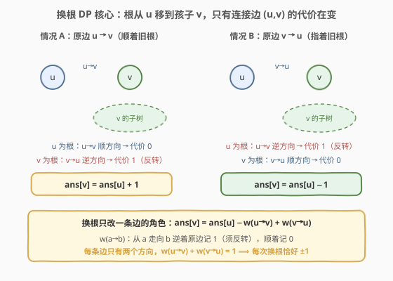
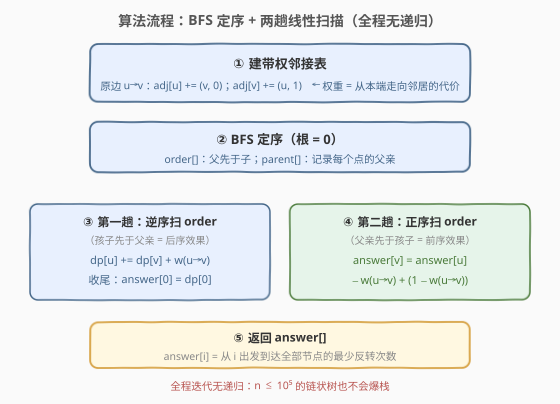
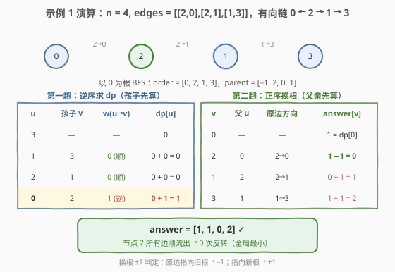

# 可以到达每一个节点的最少边反转次数

- **题目名称**：可以到达每一个节点的最少边反转次数
- **链接**：[2858. 可以到达每一个节点的最少边反转次数](https://leetcode.cn/problems/minimum-edge-reversals-so-every-node-is-reachable/)
- **难度**：困难
- **标签**：树、深度优先搜索、动态规划、换根 DP

## 1. 题目概述

给定一个 $n$ 个节点的**简单有向图**（没有重复边的有向图）——若把所有边视为双向，它是一棵**树**。节点编号 $0$ 到 $n-1$，`edges[i] = [u_i, v_i]` 表示一条从 $u_i$ 指向 $v_i$ 的**有向边**。

**边反转**指把一条边的方向掉头：$u \to v$ 变成 $v \to u$。

对 $[0, n-1]$ 中的每个节点 $i$，**独立**计算：从 $i$ 出发，经过一系列有向边，要能到达**所有**节点，最少需要多少次边反转。返回长度为 $n$ 的数组 `answer`。

**示例 1**：

```text
输入：n = 4, edges = [[2,0],[2,1],[1,3]]
输出：[1,1,0,2]
解释：有向结构形如 0 ← 2 → 1 → 3。
- answer[0] = 1：反转 [2,0]，从 0 出发可达所有节点；
- answer[1] = 1：反转 [2,1]，从 1 出发可达所有节点；
- answer[2] = 0：从 2 出发本就可达所有节点；
- answer[3] = 2：反转 [1,3] 和 [2,1]，从 3 出发可达所有节点。
```

**示例 2**：

```text
输入：n = 3, edges = [[1,2],[2,0]]
输出：[2,0,1]
```

**约束条件**：

- $2 \le n \le 10^5$
- `edges.length == n - 1`
- `edges[i].length == 2`
- $0 \le u_i, v_i < n$，$u_i \ne v_i$
- 边视为双向时构成一棵树

> 💡 题眼在「对**每个**节点独立求最少反转次数」——$n$ 个起点各自遍历一遍是 $O(n^2)$，而 $n = 10^5$。突破口是**相邻节点的答案只差 1** 这一换根递推关系，两趟线性遍历即可 $O(n)$ 求出全部答案。

---

## 2. 解题思路

### 2.1 暴力思路：逐起点遍历

固定起点 $r$：由于底层是一棵树，每个非根节点 $v$ 都经由**唯一的树边** $(parent(v), v)$ 被到达，这条边必须指向 $parent(v) \to v$ 才能让 $r$ 走到 $v$——若原边方向恰好是 $v \to parent(v)$（指着根），就必须反转一次。所以：

$$\text{answer}[r] = \sum_{\text{以 } r \text{ 为根的树边 } (p, c)} [\text{原边方向为 } c \to p]$$

即统计「方向指向根一侧」的边数。单次遍历 $O(n)$，对 $n$ 个起点各做一次，总计 $O(n^2)$。$n = 10^5$ 时约 $10^{10}$ 次操作，必然超时。瓶颈在于：**换一个起点时，绝大多数边的判定结果不变，暴力法却每次从零重算**。

### 2.2 核心观察：换根 DP（Rerooting DP）

关键洞察：**根从 $u$ 移到相邻节点 $v$ 时，只有连接边 $(u, v)$ 的代价发生变化，且变化量恰好是 $\pm 1$**。

先以 $0$ 为根，定义 $dp[u]$ = 使 $u$ 能到达**自己子树内**所有节点的最少反转次数。自底向上（后序）计算：

$$dp[u] = \sum_{v \in children(u)} \big(dp[v] + w(u \to v)\big)$$

其中 $w(a \to b) = 0$ 若原边方向为 $a \to b$（顺方向，不用反转），否则为 $1$（逆方向，须反转一次）。

显然 $\text{answer}[0] = dp[0]$（根的子树就是全树）。再把根从 $u$ 移到孩子 $v$：

- 边 $(u,v)$ 在 $\text{answer}[u]$ 中的贡献是 $w(u \to v)$（$u$ 要走到 $v$ 一侧）；
- 在 $\text{answer}[v]$ 中的贡献是 $w(v \to u)$（$v$ 要走到 $u$ 一侧）；
- **其余所有边的角色都不变**——子树内部、子树外部的父子关系原地不动，各自的最优方案原样沿用。

由于每条边只有两个方向，$w(u \to v) + w(v \to u) = 1$，于是：

$$\text{answer}[v] = \text{answer}[u] - w(u \to v) + w(v \to u) = \text{answer}[u] \pm 1$$

- 原边 $u \to v$（顺着旧根方向）：换根后恰好逆着新根方向，须反转 → $\text{answer}[v] = \text{answer}[u] + 1$
- 原边 $v \to u$（指着旧根）：换根后恰好顺着新根方向，白捡一次 → $\text{answer}[v] = \text{answer}[u] - 1$



> 💡 **与 834 树中距离之和同源**：834 的换根增量是 $-\text{count}[v] + (n - \text{count}[v])$，本题把「距离」换成「方向代价」，每条边贡献固定 $\pm 1$，框架完全一致。换根 DP 的本质都是「一次换根、只更新跨过连接边的贡献」。

### 2.3 算法流程图

两趟遍历配合完成。为规避 $n = 10^5$ 链状树的深递归（C++ 爆栈 / Python 递归上限），用一次 **BFS 定序 + 两次循环**代替递归 DFS：BFS 序天然「父先于子」，正序扫 = 前序效果，逆序扫 = 后序效果。



**完整步骤**：

1. **建带权邻接表**：对每条有向边 $u \to v$，`adj[u]` 加入 $(v, 0)$（顺方向），`adj[v]` 加入 $(u, 1)$（逆方向）。
2. **BFS 定序**：从 $0$ 出发得到 `order[]`（父先于子）与 `parent[]`。
3. **第一趟（`order` 逆序，孩子先算）**：逐点累加 $dp[u] = \sum (dp[v] + w(u \to v))$。
4. **根答案**：`answer[0] = dp[0]`。
5. **第二趟（`order` 正序，父亲先算）**：对每个孩子 $v$ 递推 $\text{answer}[v] = \text{answer}[u] - w(u \to v) + (1 - w(u \to v))$。
6. **返回** `answer`。

> ⚠️ **方向约定别绕晕**：`adj[u]` 里存的权重 $w$ 统一表示「从 $u$ 走向邻居」的代价——顺原边方向为 0，逆原边方向为 1。第一趟向下累加时用 $w(u \to v)$，第二趟换根时改成 $-w(u \to v) + (1 - w(u \to v))$（即 $w(v \to u)$），两处用同一个 $w$，方向体系始终一致。

### 2.4 示例演算

以示例 1 为例：$n = 4$，`edges = [[2,0],[2,1],[1,3]]`，有向结构 `0 ← 2 → 1 → 3`，以 $0$ 为根。

**BFS 定序**：`order = [0, 2, 1, 3]`，`parent = [−1, 2, 0, 1]`。

**第一趟（逆序 3 → 1 → 2 → 0，求 dp）**：

| $u$ | 孩子 $v$ | $w(u \to v)$ | 判定 | $dp[u]$ |
|-----|---------|-------------|------|---------|
| 3 | — | — | 叶子 | 0 |
| 1 | 3 | 0 | 边 1→3 顺方向 | $0 + 0 = 0$ |
| 2 | 1 | 0 | 边 2→1 顺方向 | $0 + 0 = 0$ |
| 0 | 2 | 1 | 边 2→0 逆方向，须反转 | $0 + 1 = 1$ |

**answer[0] = dp[0] = 1** ✓

**第二趟（正序 0 → 2 → 1 → 3，换根）**：

| $v$ | 父 $u$ | 原边方向 | 换根判定 | $\text{answer}[v]$ |
|-----|--------|---------|---------|-------------------|
| 0 | — | — | $= dp[0]$ | 1 |
| 2 | 0 | $2 \to 0$ | 指旧根 → $-1$ | $1 - 1 = 0$ |
| 1 | 2 | $2 \to 1$ | 指新根 → $+1$ | $0 + 1 = 1$ |
| 3 | 1 | $1 \to 3$ | 指新根 → $+1$ | $1 + 1 = 2$ |

最终 `answer = [1, 1, 0, 2]`，与示例一致 ✓



> 💡 **观察**：answer 最小的节点正是「所有边都从它指出去」的节点（示例中的 2）——它是这棵伪有向树的流出源头；离源头越「逆流而上」，要反转的边越多。

---

## 3. 参考代码

### C++

```cpp
class Solution {
public:
    vector<int> minEdgeReversals(int n, vector<vector<int>>& edges) {
        // 带权邻接表：adj[u] = {(v, w)}，w 为「从 u 走向 v」的代价
        // 原边 u→v：adj[u] 记 (v, 0)，adj[v] 记 (u, 1)
        vector<vector<pair<int, int>>> adj(n);
        for (auto& e : edges) {
            adj[e[0]].push_back({e[1], 0});
            adj[e[1]].push_back({e[0], 1});
        }

        // BFS 定序：order 中父先于子；同时记录 parent
        vector<int> order, parent(n, -1), visited(n, 0);
        queue<int> q;
        q.push(0);
        visited[0] = 1;
        while (!q.empty()) {
            int u = q.front(); q.pop();
            order.push_back(u);
            for (auto& [v, w] : adj[u]) {
                if (!visited[v]) {
                    visited[v] = 1;
                    parent[v] = u;
                    q.push(v);
                }
            }
        }

        // 第一趟：逆序扫 order（孩子先于父亲）求 dp
        // dp[u] = u 到达自己子树内全部节点的最少反转次数
        vector<int> dp(n, 0), ans(n, 0);
        for (int i = n - 1; i >= 0; i--) {
            int u = order[i];
            for (auto& [v, w] : adj[u]) {
                if (v != parent[u]) dp[u] += dp[v] + w;
            }
        }

        // 第二趟：正序扫 order（父亲先于孩子）换根
        // 连接边代价从 w(u→v) 变为 w(v→u) = 1 − w
        ans[0] = dp[0];
        for (int i = 0; i < n; i++) {
            int u = order[i];
            for (auto& [v, w] : adj[u]) {
                if (v == parent[u]) continue;
                ans[v] = ans[u] - w + (1 - w);
            }
        }
        return ans;
    }
};
```

### Python

```python
class Solution:
    def minEdgeReversals(self, n: int, edges: List[List[int]]) -> List[int]:
        adj = [[] for _ in range(n)]
        for u, v in edges:
            adj[u].append((v, 0))   # 顺方向，代价 0
            adj[v].append((u, 1))   # 逆方向，代价 1

        # BFS 定序：order 中父先于子
        parent = [-1] * n
        visited = [False] * n
        visited[0] = True
        order = []
        q = deque([0])
        while q:
            u = q.popleft()
            order.append(u)
            for v, _ in adj[u]:
                if not visited[v]:
                    visited[v] = True
                    parent[v] = u
                    q.append(v)

        # 第一趟：逆序（孩子先于父亲）求 dp
        dp = [0] * n
        for u in reversed(order):
            for v, w in adj[u]:
                if v != parent[u]:
                    dp[u] += dp[v] + w

        # 第二趟：正序（父亲先于孩子）换根
        ans = [0] * n
        ans[0] = dp[0]
        for u in order:
            for v, w in adj[u]:
                if v != parent[u]:
                    ans[v] = ans[u] - w + (1 - w)
        return ans
```

> ⚠️ **为什么用 BFS 序迭代而非递归 DFS**：$n \le 10^5$，链状树递归深度达 $10^5$——C++ 有爆栈风险（默认栈约 8 MB），Python 超出默认递归上限且深递归可能段错误。BFS 序「父先于子」：正序扫 = 前序效果（先算父亲），逆序扫 = 后序效果（先算孩子），两趟循环完美替代两趟 DFS。

> 💡 **答案上界**：每条边至多反转一次，$\text{answer}[i] \le n - 1 < 10^5$，C++ `int` 绰绰有余，无需 `long long`。

---

## 4. 复杂度分析

| 维度 | 复杂度 | 说明 |
|------|--------|------|
| **时间复杂度** | $O(n)$ | 建邻接表 $O(n)$、BFS 定序 $O(n)$、两趟循环各把每条无向边的两个方向访问一次，总计 $O(n)$ |
| **空间复杂度** | $O(n)$ | 带权邻接表共 $2(n-1)$ 条记录、`order`/`parent`/`dp`/`ans` 各 $O(n)$、BFS 队列 $O(n)$，迭代实现无递归栈开销 |

> ⚠️ 本题已是最优——$n$ 个节点的答案都必须逐一输出，$\Omega(n)$ 是下界。换根 DP 用「一次定序 + 两趟线性扫描」替代 $n$ 次独立遍历，把 $O(n^2)$ 压到 $O(n)$。

---

## 5. 扩展：递归版两趟 DFS 与「指向根的边数」等价视角

### 递归版（题目 hints 的原始形态）

两趟 DFS 递归写法，递推式与上文完全一致，仅实现形式不同：

```python
def minEdgeReversals_recursive(n, edges):
    adj = [[] for _ in range(n)]
    for u, v in edges:
        adj[u].append((v, 0))
        adj[v].append((u, 1))

    dp = [0] * n
    def dfs1(u, parent):
        for v, w in adj[u]:
            if v != parent:
                dfs1(v, u)
                dp[u] += dp[v] + w
    dfs1(0, -1)

    ans = [0] * n
    ans[0] = dp[0]
    def dfs2(u, parent):
        for v, w in adj[u]:
            if v != parent:
                ans[v] = ans[u] - w + (1 - w)
                dfs2(v, u)
    dfs2(0, -1)
    return ans
```

链状树深度可达 $10^5$，实际提交请用主代码的迭代版。

### 「指向根的边数」等价视角

固定根 $r$ 时，$\text{answer}[r]$ 等于以 $r$ 为根的树中**方向指向根一侧**（即 $c \to p$，逆着 $r \to c$ 路径方向）的边数。换根 $u \to v$ 时，恰好只有连接边 $(u,v)$ 的「是否指向根」发生翻转，故答案变化 $\pm 1$——这正是 2.2 递推式的另一副面孔。[2581. 统计可能的树根数目](https://leetcode.cn/problems/count-number-of-possible-root-nodes/) 用的也是同一套「以 0 为根统计 + 换根 ±1 增量」框架，只是把「反转代价」换成了「guess 命中数」。

---

## 6. 面试要点

1. **为什么不能对每个起点独立遍历？**

   - 单次遍历 $O(n)$，$n$ 个起点共 $O(n^2)$；$n = 10^5$ 时约 $10^{10}$ 次操作必然超时。相邻起点的答案只差 1，这一增量信息没有被利用。

2. **换根递推式 $\text{answer}[v] = \text{answer}[u] \pm 1$ 怎么推导？**

   - 根从 $u$ 换到孩子 $v$，只有连接边 $(u,v)$ 的角色变化：旧根答案里它须指向 $u \to v$（代价 $w(u \to v)$），新根答案里须指向 $v \to u$（代价 $w(v \to u)$）。两个方向代价之和恒为 1，一增一减，故答案变化恰为 $\pm 1$。

3. **有向边如何存进统一的邻接表？**

   - 0/1 带权技巧：原边 $u \to v$，则 `adj[u]` 记 $(v, 0)$、`adj[v]` 记 $(u, 1)$，权重 = 从本端走向邻居是否逆着原边方向。一次建表，两趟遍历共用，无需分别维护正反两个邻接表。

4. **`dp[u]` 的定义为什么限定在子树内？**

   - 换根 DP 的标准拆分：第一趟只算「向下」的子问题（$u$ 到达子树内全部节点），自底向上合并；「向上/向外」的部分留给第二趟从父节点答案增量继承。若第一趟就把全局答案算进去，换根时无法 O(1) 拆出连接边的贡献。

5. **为什么用 BFS 序迭代而不是递归 DFS？**

   - $n \le 10^5$，链状树递归深度 $10^5$：C++ 有爆栈风险，Python 超默认递归上限且 C 栈可能崩溃。BFS 序正序遍历 = 前序（父先于子），逆序遍历 = 后序（子先于父），两趟循环等价替代两趟 DFS，还省掉递归开销。

> 💡 **一句话总结**：2858 是 834 的有向边版换根 DP——0/1 权邻接表统一编码方向，BFS 逆序求子树代价 `dp`，正序换根每步 $\text{answer}[v] = \text{answer}[u] \pm 1$，$O(n)$ 时间、$O(n)$ 空间一次求出全部起点答案。

---

## 7. 同类练习题

- [834. 树中距离之和](https://leetcode.cn/problems/sum-of-distances-in-tree/)：换根 DP 母题，结构与本题完全同构，只是增量从 $\pm 1$ 变成 $-\text{count}[v] + (n - \text{count}[v])$
- [2581. 统计可能的树根数目](https://leetcode.cn/problems/count-number-of-possible-root-nodes/)：以 0 为根统计 guess 命中数 + 换根 ±1 增量，两趟遍历框架与本题逐行对应
- [310. 最小高度树](https://leetcode.cn/problems/minimum-height-trees/)：换根 DP 求每个根的树高后取最小，也可用逐层剥叶求解
- [2246. 相邻字符不同的最长路径](https://leetcode.cn/problems/longest-path-with-different-adjacent-characters/)：换根 DP 维护子树最大/次大贡献，父侧贡献向下传递，换根时同样只改连接边贡献
