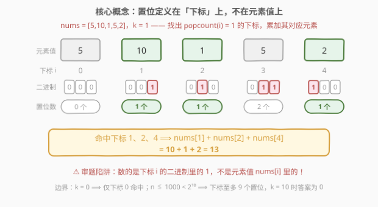
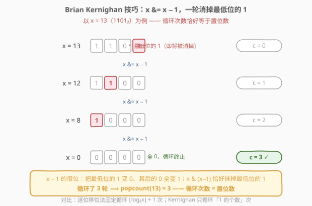
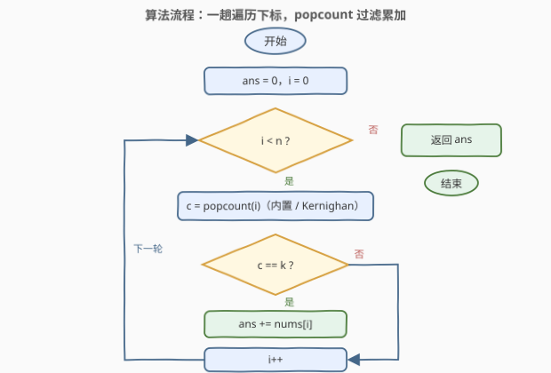
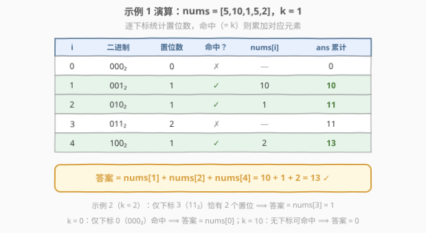

# 计算 K 置位下标对应元素的和

- **题目名称**：计算 K 置位下标对应元素的和
- **链接**：[2859. 计算 K 置位下标对应元素的和](https://leetcode.cn/problems/sum-of-values-at-indices-with-k-set-bits/)
- **难度**：简单
- **标签**：位运算、数组

## 1. 题目概述

给你一个下标从 **0** 开始的整数数组 `nums` 和一个整数 `k`。

请你用整数形式返回 `nums` 中的特定元素之**和**，这些特定元素满足：其**对应下标**的二进制表示中恰存在 `k` 个**置位**。

整数的二进制表示中的 `1` 就是这个整数的**置位**。例如，$21$ 的二进制表示为 $10101$，其中有 $3$ 个置位。

**示例 1**：

```text
输入：nums = [5,10,1,5,2], k = 1
输出：13
解释：下标的二进制表示是：
0 = 000₂，1 = 001₂，2 = 010₂，3 = 011₂，4 = 100₂
下标 1、2 和 4 的二进制表示中都恰有 k = 1 个置位。
因此，答案为 nums[1] + nums[2] + nums[4] = 13。
```

**示例 2**：

```text
输入：nums = [4,3,2,1], k = 2
输出：1
解释：只有下标 3（11₂）的二进制表示中恰有 2 个置位。
因此，答案为 nums[3] = 1。
```

**约束条件**：

- $1 \le nums.length \le 1000$
- $1 \le nums[i] \le 10^5$
- $0 \le k \le 10$

> 💡 本题是「**popcount（数二进制中 1 的个数，即汉明重量）**」的直接应用：扫一遍**下标**，置位数恰好等于 $k$ 就把对应元素累加进答案。考的是**审题**（置位在**下标**上而非元素值上）与**位运算基本功**（手写或调用 popcount）。注意 $k$ 的上界 10 暗藏一个小边界：$n \le 1000 < 2^{10}$，下标置位数最多 $9$ 个，$k = 10$ 时答案恒为 $0$。

---

## 2. 解题思路

### 2.1 朴素思路：逐位移位计数

最直接的写法是对每个下标 $i$ 做一遍「逐位检查」：

```text
c = 0
while x > 0:
    c += x & 1     # 看最低位是不是 1
    x >>= 1        # 右移一位
```

每个下标固定循环 $\lfloor \log_2 i \rfloor + 1$ 次（连高位的 0 也要陪跑），总时间 $O(n \log n)$。$n \le 1000$ 时至多约 $10^4$ 次位操作，毫无压力——**这就是本题的正解骨架**。既然如此，本题真正的考点就落在两处：

1. **审题**：判断的对象是**下标** $i$ 的二进制，不是元素值 $nums[i]$ 的二进制；
2. **写好 popcount**：语言内置原语信手拈来，被要求手写时能立刻给出 Kernighan 法。

### 2.2 核心观察：popcount 过滤 + Brian Kernighan 消 1

**观察 1（问题即 popcount 过滤）**：「下标二进制中恰有 $k$ 个置位」就是 $\operatorname{popcount}(i) = k$。整趟算法就是一句话：

$$\text{ans} = \sum_{i=0}^{n-1} nums[i] \cdot [\operatorname{popcount}(i) = k]$$



**观察 2（Kernighan 消 1）**：手写 popcount 的标准姿势是 Brian Kernighan 技巧 `x &= x - 1`——每执行一次，**恰好消去最低位的那个 1**：

- $x - 1$ 的借位过程：把 $x$ 最低位的 $1$ 变成 $0$，其后的 $0$ 全部变成 $1$，更高位不变；
- 再与 $x$ 相与，最低位的 $1$ 及其以下的所有位整体清零，其余位原样保留。

因此**循环执行次数恰好等于置位数**，对置位稀疏的数明显快于逐位移位（后者连 0 也要逐位陪跑）。



> 💡 各语言都有现成原语：C++ 的 `__builtin_popcount`（映射到 CPU 的 POPCNT 硬件指令）/ C++20 `<bit>` 头的 `std::popcount`、Java 的 `Integer.bitCount`、Python 3.10+ 的 `int.bit_count()`。面试先给内置版，再主动补一句「手写用 `x &= x - 1`」即可。

**边界自查**：

- $k = 0$：只有下标 $0$（$000₂$）的置位数为 $0$，答案就是 $nums[0]$，**不是 0**；
- $k = 10$：$n \le 1000 < 2^{10}$，下标置位数最多 $9$ 个（如 $511 = 111111111₂$），无下标可命中，答案为 $0$。

### 2.3 算法流程图



**完整步骤**：

1. **初始化**：$ans = 0$；
2. **遍历**：下标 $i$ 从 $0$ 到 $n - 1$；
3. **计数**：计算 $c = \operatorname{popcount}(i)$（内置或 Kernighan 手写）；
4. **过滤累加**：若 $c = k$，则 $ans \mathrel{+}= nums[i]$；
5. **返回** $ans$。

### 2.4 示例演算

以示例 1 $nums = [5,10,1,5,2]$、$k = 1$ 为例：



| $i$ | 二进制 | 置位数 | 命中（$=k$？） | 取值 | $ans$ 累计 |
|-----|--------|--------|---------------|------|-----------|
| 0 | $000_2$ | 0 | ✗ | — | 0 |
| 1 | $001_2$ | 1 | ✓ | 10 | 10 |
| 2 | $010_2$ | 1 | ✓ | 1 | 11 |
| 3 | $011_2$ | 2 | ✗ | — | 11 |
| 4 | $100_2$ | 1 | ✓ | 2 | 13 |

最终 $ans = 13$ ✓。示例 2（$k = 2$）中仅下标 $3$（$11_2$）有 2 个置位，答案 $nums[3] = 1$ ✓。

---

## 3. 参考代码

### C++

```cpp
class Solution {
public:
    int sumIndicesWithKSetBits(vector<int>& nums, int k) {
        int ans = 0;
        for (int i = 0; i < (int)nums.size(); i++) {
            if (__builtin_popcount(i) == k) {   // 下标置位数恰为 k
                ans += nums[i];
            }
        }
        return ans;
    }
};
```

面试若要求不依赖内置函数，手写 Kernighan 版：

```cpp
class Solution {
public:
    int sumIndicesWithKSetBits(vector<int>& nums, int k) {
        int ans = 0;
        for (int i = 0; i < (int)nums.size(); i++) {
            int x = i, c = 0;
            while (x) {          // Kernighan：每轮消去最低位的 1
                x &= x - 1;
                c++;
            }
            if (c == k) ans += nums[i];
        }
        return ans;
    }
};
```

### Python

```python
class Solution:
    def sumIndicesWithKSetBits(self, nums: List[int], k: int) -> int:
        return sum(v for i, v in enumerate(nums) if i.bit_count() == k)
```

Python 3.10 以下没有 `int.bit_count()`，用 `bin(i).count('1')` 兜底：

```python
class Solution:
    def sumIndicesWithKSetBits(self, nums: List[int], k: int) -> int:
        return sum(v for i, v in enumerate(nums) if bin(i).count('1') == k)
```

> 💡 两版逻辑完全一致：`enumerate` 同时拿到下标与元素，**置位数算在下标上**，命中才累加元素值。`k = 0` 时 `0.bit_count() == 0` 自然命中下标 0，无需特判。

---

## 4. 复杂度分析

| 维度 | 复杂度 | 说明 |
|------|--------|------|
| **时间复杂度** | $O(n \log n)$（上界） | 每个下标至多检查 $\lfloor \log_2 n \rfloor + 1$ 位；Kernighan 版每下标仅循环 $\operatorname{popcount}(i)$ 次，总量 $\sum_i \operatorname{popcount}(i)$，约为逐位法的一半；内置版对每个下标是 $O(1)$ 字操作（硬件 POPCNT），整体近似 $O(n)$ |
| **空间复杂度** | $O(1)$ | 仅常数个变量，原地累加 |

> ⚠️ 本题 $n \le 1000$，任何写法都是瞬间完成；复杂度讨论的价值在于把它当作 popcount 的模板题说清楚。

---

## 5. 扩展：O(n) 递推预处理 与 Gosper's Hack

### 5.1 递推预处理（338 同款）

若需要对同一数组**反复查询不同的 $k$**（或干脆不想碰 popcount），可以一趟递推预处理每个下标的置位数。右移一位丢掉最低位、其余位保留，于是

$$\operatorname{cnt}[i] = \operatorname{cnt}[i \gg 1] + (i \,\&\, 1)$$

预处理严格 $O(n)$（每次 $O(1)$），之后再按需过滤。进一步还可以按置位数分桶求前缀和，把每次查询压到 $O(1)$。

```cpp
class Solution {
public:
    int sumIndicesWithKSetBits(vector<int>& nums, int k) {
        int n = nums.size(), ans = 0;
        vector<int> cnt(n, 0);                  // cnt[i] = popcount(i)
        for (int i = 0; i < n; i++) {
            if (i) cnt[i] = cnt[i >> 1] + (i & 1);
            if (cnt[i] == k) ans += nums[i];    // k=0 时下标 0 自然命中
        }
        return ans;
    }
};
```

### 5.2 Gosper's Hack：直接枚举「恰有 k 个 1」的下标

反过来想：与其扫描**全部**下标再过滤，不如**直接生成**所有置位数恰为 $k$ 的下标。最小的一个是 $m_0 = (1 \ll k) - 1$（即 $k$ 个连续的 1），用 **Gosper's Hack** 可以 $O(1)$ 求出「比 $m$ 大且置位数仍为 $k$ 的最小数」：

$$\text{next} = \left(m + c\right) \,\Big|\, \left(\frac{m \oplus (m + c)}{c} \gg 2\right),\quad c = m \,\&\, (-m)$$

其中 $c$ 是 $m$ 的最低位 1。枚举量从 $n$ 降到 $\binom{\lfloor \log_2 n \rfloor}{k}$：$k = 1$ 时只需枚举约 10 个数（$1, 2, 4, \dots, 512$）。本题 $n \le 1000$ 收益有限，但当 $n$ 巨大、$k$ 很小时优势明显。

```cpp
class Solution {
public:
    int sumIndicesWithKSetBits(vector<int>& nums, int k) {
        int n = nums.size(), ans = 0;
        if (k == 0) return nums[0];             // 只有下标 0 的置位数为 0
        for (unsigned m = (1u << k) - 1; m < (unsigned)n; ) {
            ans += nums[m];
            unsigned c = m & -m, r = m + c;     // Gosper's Hack
            m = r | (((m ^ r) / c) >> 2);       // 下一个恰有 k 个 1 的数
        }
        return ans;                             // k=10 时 m0=1023 ≥ n，循环不执行，返回 0
    }
};
```

> ⚠️ $k = 0$ 必须特判：Gosper 公式里 $c = 0$ 会导致除零；而 $(1 \ll 0) - 1 = 0$ 恰好说明「置位数为 0 的数只有 0 本身」。$k \ge 10$ 无需特判——$m_0 = 1023 \ge 1000$，循环体一次都不进，自然返回 0。

---

## 6. 面试要点

1. **什么是「置位」？和汉明重量是什么关系？**

   - 置位（set bit）就是二进制表示中的 $1$；一个数中 $1$ 的个数叫 popcount，也称**汉明重量**（Hamming weight）。本题即「过滤出 $\operatorname{popcount}(i) = k$ 的下标，累加其元素值」。

2. **手写 popcount 的标准写法？为什么 `x &= x − 1` 能消掉一个 1？**

   - Kernighan 法：`x &= x - 1` 每轮消去**最低位**的 1，循环次数恰为置位数。原理是 $x - 1$ 的借位：最低位的 1 变 0、其后的 0 全变 1；相与后这部分整体清零、高位不变。

3. **本题有什么容易踩的坑？**

   - 审题：置位数定义在**下标**上，不是元素值上；$k = 0$ 时只有下标 0 命中（答案 $nums[0]$，**不是 0**）；$k$ 超过下标位宽（本题 $k = 10 > \lfloor \log_2 1000 \rfloor = 9$）时无下标命中，答案为 0。

4. **各语言数置位的内置手段？**

   - C++：GCC/Clang 的 `__builtin_popcount`（映射硬件 POPCNT 指令）、C++20 `<bit>` 的 `std::popcount`；Java：`Integer.bitCount`；Python 3.10+：`int.bit_count()`，旧版本 `bin(x).count('1')`。

5. **如果要对同一数组支持海量不同 $k$ 的查询，怎么优化？**

   - 预处理 338 式递推 $\operatorname{cnt}[i] = \operatorname{cnt}[i \gg 1] + (i \,\&\, 1)$，再按置位数分桶求前缀和，单次查询 $O(1)$；或者用 Gosper's Hack 直接枚举命中下标，$k$ 小时候枚举量 $\binom{\lfloor \log_2 n \rfloor}{k}$ 极小。

> 💡 **一句话总结**：扫一遍下标，`popcount(i) == k` 就累加 `nums[i]`——手写用 Kernighan 的 `x &= x − 1` 每轮消一个 1，循环次数恰为置位数；切记置位在**下标**上，$k = 0$ 时答案是 `nums[0]`，$k$ 超过下标位宽时答案是 0。

---

## 7. 同类练习题

- [191. 位 1 的个数](../0001-0100/191_位1的个数.md)：popcount 母题，`n & (n−1)` 消 1 技巧的出处，本题核心观察的原型
- [338. 比特位计数](../0301-0400/338_比特位计数.md)：`cnt[i] = cnt[i>>1] + (i&1)` 的 O(n) 递推，即第 5.1 节扩展解法
- [231. 2 的幂](../0201-0300/231_2的幂.md)：`n & (n−1) == 0` 判「恰有 1 个置位」，同一技巧的单点特例应用
- [78. 子集](../0001-0100/78_子集.md)：位掩码枚举子集的主场，Gosper's Hack 枚举「恰有 k 个 1 的掩码」正是它的进阶玩法
