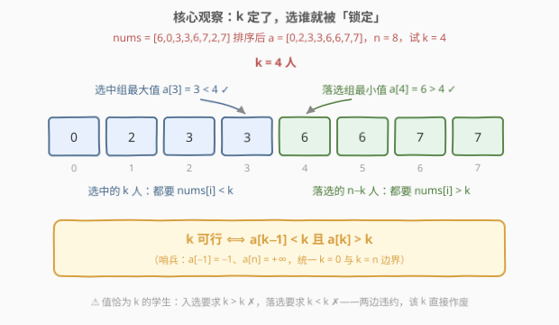
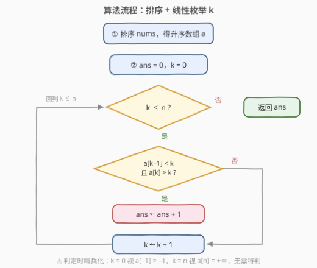
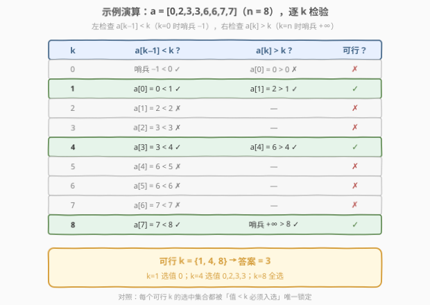

# LeetCode 让所有学生保持开心的分组方法数 题解

## 1. 题目概述

- **标题 / 题号**：让所有学生保持开心的分组方法数（#2860，medium）
- **链接**：https://leetcode.cn/problems/happy-students/
- **难度**：中等
- **标签**：数组、排序、枚举

**题意**：给你一个下标从 **0** 开始、长度为 `n` 的整数数组 `nums`，其中 `n` 是班级中学生的总数。班主任希望选出一组学生，使得**所有**学生都保持开心。第 `i` 位学生开心的条件是**以下两者之一**：

- 这位学生**被选中**，并且被选中的学生人数**严格大于** $nums[i]$；
- 这位学生**没有被选中**，并且被选中的学生人数**严格小于** $nums[i]$。

返回能够让所有学生保持开心的**分组方法数目**。

**示例 1**：

```text
输入：nums = [1,1]
输出：2
解释：两种可行方法：不选任何学生；选中所有学生。
若只选一个学生，则两人都无法开心，故仅存在两种可行方法。
```

**示例 2**：

```text
输入：nums = [6,0,3,3,6,7,2,7]
输出：3
解释：三种可行方法：
只选中下标为 1 的学生；
选中下标为 1、2、3、6 的学生；
选中所有学生。
```

**约束**：

- $1 \le nums.length \le 10^5$
- $0 \le nums[i] < nums.length$

> 💡 本题核心是「**排序 + 枚举分组人数**」。开心与否只取决于**选中学生的人数 $k$** 与每人 $nums[i]$ 的大小关系：选中的人要求 $nums[i] < k$，落选的人要求 $nums[i] > k$。一旦 $k$ 确定，**谁被选中就被完全锁定**（值小于 $k$ 的必须入选），于是「数分组方案」退化为「数可行的 $k$」——排序后只需看 $a[k-1]$、$a[k]$ 两个端点，即可 $O(1)$ 判定每个 $k$。

## 2. 解题思路

### 2.1 暴力思路：枚举子集

最直觉的做法是枚举 `nums` 的所有子集（每个学生选/不选共 $2^n$ 种），对每个子集逐一检查 $2n$ 个开心条件。复杂度 $O(2^n \cdot n)$，$n \le 10^5$ 时是天文数字，完全不可行。

**换个视角**：每个学生的开心条件里只出现**选中学生的人数** $k$ 和他自己的 $nums[i]$——与「具体选了哪些人」无关。那么先固定 $k$，再看谁必须进组、谁必须出局：

- 被选中的学生要求 $nums[i] < k$（人数严格大于他的值）；
- 未被选中的学生要求 $nums[i] > k$（人数严格小于他的值）。

于是「枚举子集」可以降维成「枚举 $k \in [0, n]$」，一共只有 $n+1$ 个候选。

### 2.2 核心观察：k 一旦确定，选中集合被唯一锁定

**观察 1（选中集合被锁定）**：固定 $k$ 后——

- 值满足 $nums[i] < k$ 的学生**必须入选**：他若落选，落选要求 $k < nums[i]$，与 $nums[i] < k$ 矛盾；
- 值满足 $nums[i] > k$ 的学生**必须落选**：他若入选，入选要求 $nums[i] < k$，矛盾；
- 值恰好等于 $k$ 的学生**两边不讨好**：入选要求 $k < k$ ✗，落选也要求 $k < k$ ✗——只要存在 $nums[i] = k$，该 $k$ 直接作废。

所以对每个 $k$，合法的选中集合只有**唯一候选**：全部值 $< k$ 的学生。它恰好凑够 $k$ 人时，$k$ 才可行。**分组方法数 = 可行 $k$ 的个数**，而非组合数。

**观察 2（排序后 $O(1)$ 判定）**：把数组升序排序成 $a$。「值 $< k$ 的学生恰好 $k$ 个，且没有人值 $= k$」等价于两个端点检查：

$$k \text{ 可行} \iff a[k-1] < k \ \text{且} \ a[k] > k$$

- $a[k-1] < k$：选中组里**值最大**的那位（第 $k$ 小）也严格小于 $k$——由单调性，前 $k$ 个全部 $< k$；
- $a[k] > k$：落选组里**值最小**的那位（第 $k+1$ 小）也严格大于 $k$——它同时排除了「还有值 $< k$ 的学生没进组」和「有人值恰好 $= k$」两种失败形态。

> ⚠️ 边界用**哨兵**统一：$k = 0$ 时约定 $a[-1] = -1$（值域最小是 $0$，恒小于任何 $k$），$k = n$ 时约定 $a[n] = +\infty$（右边已无人需要落选）。判定式对 $k \in [0, n]$ 全体成立，代码无需特判分支。



### 2.3 算法流程图



**完整步骤**：

1. **排序**：将 `nums` 升序排序得到 $a$；
2. **枚举**：$k$ 从 $0$ 到 $n$ 逐一尝试（共 $n+1$ 个候选人数）；
3. **判定**：哨兵化后检查 $a[k-1] < k < a[k]$；
4. **计数**：条件成立则答案加一，枚举完毕返回总数。

### 2.4 示例演算

以示例 2 $nums = [6,0,3,3,6,7,2,7]$ 为例：排序后 $a = [0,2,3,3,6,6,7,7]$，$n = 8$，逐一检验 $k = 0 \sim 8$：



| k | 左检查 $a[k-1] < k$ | 右检查 $a[k] > k$ | 可行？ |
|---|------------------|------------------|--------|
| 0 | 哨兵 $-1 < 0$ ✓ | $a[0]=0 > 0$ ✗ | ✗ |
| 1 | $a[0]=0 < 1$ ✓ | $a[1]=2 > 1$ ✓ | ✓ |
| 2 | $a[1]=2 < 2$ ✗ | — | ✗ |
| 3 | $a[2]=3 < 3$ ✗ | — | ✗ |
| 4 | $a[3]=3 < 4$ ✓ | $a[4]=6 > 4$ ✓ | ✓ |
| 5 | $a[4]=6 < 5$ ✗ | — | ✗ |
| 6 | $a[5]=6 < 6$ ✗ | — | ✗ |
| 7 | $a[6]=7 < 7$ ✗ | — | ✗ |
| 8 | $a[7]=7 < 8$ ✓ | 哨兵 $+\infty > 8$ ✓ | ✓ |

共 3 个可行 $k$：$k=1$（只选值为 $0$ 的那位，即下标 1）、$k=4$（选值为 $0,2,3,3$ 的四位，即下标 1、6、2、3）、$k=8$（全选），与示例答案一致 ✓。

再看示例 1 $nums = [1,1]$：$k=0$ 时右检查 $a[0]=1 > 0$ ✓ 可行（无人入选）；$k=1$ 时左检查 $a[0]=1 < 1$ ✗；$k=2$ 时 $a[1]=1 < 2$ ✓ 且右哨兵成立 → 可行（全员入选）。答案 $2$ ✓。

## 3. 参考代码

### C++

```cpp
class Solution {
public:
    int countWays(vector<int>& nums) {
        int n = nums.size();
        sort(nums.begin(), nums.end());
        int ans = 0;
        for (int k = 0; k <= n; k++) {
            // 左哨兵：k == 0 视为 a[-1] = -1 < k，恒成立
            bool leftOk  = (k == 0) || (nums[k - 1] < k);
            // 右哨兵：k == n 视为 a[n] = +inf > k，恒成立
            bool rightOk = (k == n) || (nums[k] > k);
            if (leftOk && rightOk) ans++;
        }
        return ans;
    }
};
```

### Python

```python
class Solution:
    def countWays(self, nums: List[int]) -> int:
        nums.sort()
        n = len(nums)
        ans = 0
        for k in range(n + 1):
            left_ok = k == 0 or nums[k - 1] < k   # 选中的 k 人都要 nums[i] < k
            right_ok = k == n or nums[k] > k      # 落选的人都要 nums[i] > k
            if left_ok and right_ok:
                ans += 1
        return ans
```

> 💡 两版逻辑一致：主循环跑 $n+1$ 次，每次 $O(1)$ 判定；排序是唯一的热点。注意 `k == 0` / `k == n` 的短路判断就是哨兵的代码化。

## 4. 复杂度分析

| 维度 | 复杂度 | 说明 |
|------|--------|------|
| **时间复杂度** | $O(n \log n)$ | 排序主导；枚举 $n+1$ 个 $k$，每个 $O(1)$ 判定 |
| **空间复杂度** | $O(\log n)$ | 原地排序的递归栈开销，无额外数组 |

## 5. 扩展：O(n) 计数排序与「裂缝」视角

**值域就是 $[0, n)$**：约束 $0 \le nums[i] < n$ 意味着所有值都能塞进 $n$ 个桶——用**计数排序**替代比较排序，整体降到 $O(n)$。判定条件改写成计数语言：值 $< k$ 的学生**恰好 $k$ 个**（滚动前缀维护），且**无人值 $= k$**（查桶 `cnt[k]`）：

```python
class Solution:
    def countWays(self, nums: List[int]) -> int:
        n = len(nums)
        cnt = [0] * n
        for v in nums:
            cnt[v] += 1
        ans = 0
        less = 0                          # 值严格小于 k 的学生数
        for k in range(n + 1):
            if less == k and (k == n or cnt[k] == 0):
                ans += 1                  # 值 <k 恰好 k 个，且无人值 = k
            if k < n:
                less += cnt[k]            # 滚动维护：值 < k+1 的数量
        return ans
```

**「裂缝」视角**：把判定式写成 $a[k-1] < k < a[k]$，会发现可行 $k$ 恰好是**落在排序数组第 $k$ 个位置「裂缝」里的整数**——$k$ 比左边的最大值大、比右边的最小值小，一条缝里挤不进相等的值。这个视角与 **H 指数**（274：最大的 $h$ 使 $a[n-h] \ge h$）同构，都是「排序数组上，位置下标与该位置的值比大小」的边界问题；275（H 指数 II）进一步展示了有序输入下如何用二分加速同类判定。

## 6. 面试要点

1. **为什么本题不用枚举子集？方案数为什么不是组合数？**

   - 每个学生的开心条件只与分组**人数 $k$** 有关。固定 $k$ 后，值 $< k$ 的必须入选、值 $> k$ 的必须落选、值 $= k$ 的无解——选中集合被唯一锁定。因此每个可行的 $k$ 恰好对应 **1** 种分组，答案 = 可行 $k$ 的计数，与组合数无关。

2. **为什么只检查 $a[k-1]$ 和 $a[k]$ 两个位置就够了？**

   - 排序带来单调性：$a[k-1]$ 是选中组的**最大值**，管住「前 $k$ 个都 $< k$」；$a[k]$ 是落选组的**最小值**，管住「后 $n-k$ 个都 $> k$，且没有值 $= k$」。两个极端卡住，中间的元素自动满足。

3. **$k = 0$ 和 $k = n$ 的边界如何优雅处理？**

   - 哨兵法：左边界约定 $a[-1] = -1$（值域最小为 $0$，恒 $< k$），右边界约定 $a[n] = +\infty$（右侧无人）。判定式统一为 $a[k-1] < k < a[k]$，代码用 `k == 0 ||` / `k == n ||` 短路实现，避免散落的特判分支。

4. **「严格」不等号在本题里扮演什么角色？**

   - 两处严格性都关键：入选要求人数**严格大于** $nums[i]$，落选要求人数**严格小于** $nums[i]$——于是 $nums[i] = k$ 的学生两边都违约，直接判死该 $k$。若改成非严格，判定式变为 $a[k-1] \le k \le a[k]$，可行 $k$ 会变多，语义完全不同。

5. **能不能做到 $O(n)$？**

   - 能。约束保证值域 $[0, n)$，用计数排序（桶计数 + 滚动前缀）代替比较排序即可，判定部分本就是线性扫描。面试中先给 $O(n \log n)$ 主解，再主动提这一步是加分项。

> 💡 **一句话总结**：开心只看人数——固定 $k$ 后选中集合被「值 $< k$ 必须入选」唯一锁定；排序后用 $a[k-1] < k < a[k]$ 一判，数出可行 $k$ 的个数即为答案。

## 同类练习题

| # | 题目 | 与本题的关联 |
|---|------|-------------|
| 274 | [H 指数](https://leetcode.cn/problems/h-index/) | 同为「排序数组上位置与值比大小」的边界判定，找最大的 $h$ 使 $a[n-h] \ge h$ |
| 275 | [H 指数 II](https://leetcode.cn/problems/h-index-ii/) | 274 的有序输入版，用二分把边界判定加速到 $O(\log n)$ |
| 976 | [三角形的最大周长](https://leetcode.cn/problems/largest-perimeter-triangle/) | 排序后从大到小枚举相邻三元组判定，同属「排序 + 枚举断点」范式 |
| 2144 | [打折购买糖果的最小开销](https://leetcode.cn/problems/minimum-cost-of-buying-candies-with-discount/) | 排序后按「买大送小」贪心配对，排序暴露结构的思想一致 |
| 2587 | [重排数组以得到最大前缀分数](https://leetcode.cn/problems/rearrange-array-to-maximize-prefix-score/) | 排序 + 前缀统计数正数个数，同为「排序后线性扫判定」的计数题 |
