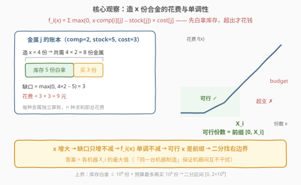
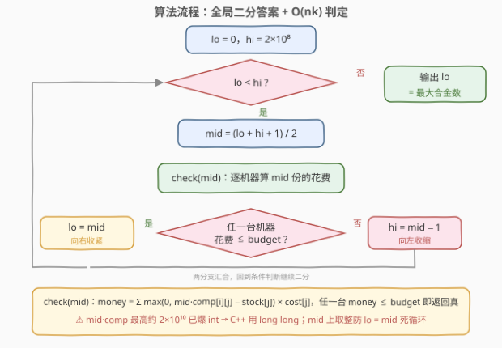
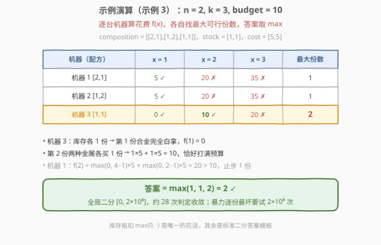

# LeetCode 最大合金数 题解

## 1. 题目概述

- **标题 / 题号**：最大合金数（#2861，medium）
- **链接**：https://leetcode.cn/problems/maximum-number-of-alloys/
- **难度**：中等
- **标签**：数组、二分查找

**题意**：你是合金制造公司的老板：共有 `n` 种金属和 `k` 台机器。第 `i` 台机器制造一份合金需要 `composition[i][j]` 份第 `j` 种金属。最初你拥有 `stock[j]` 份第 `j` 种金属，每购入一份第 `j` 种金属需要花费 `cost[j]` 的金钱。

在预算不超过 `budget` 的前提下，**最大化**公司制造合金的数量，返回最大合金数。

> ⚠️ **两个易错点**：① 「**所有合金必须由同一台机器制造**」——这是「逐台机器独立最大化、再取 max」合法性的来源；② 本题 $n$ 是**金属种类数**、$k$ 是**机器台数**，`composition` 是 $k \times n$ 矩阵（**行是机器、列是金属**），与「n 台机器」的直觉相反，读题要慢。

**示例 1**：

```text
输入：n = 3, k = 2, budget = 15, composition = [[1,1,1],[1,1,10]], stock = [0,0,0], cost = [1,2,3]
输出：2
解释：用第 1 台机器造 2 份：购买 2×1 + 2×2 + 2×3 = 12 ≤ 15；造 3 份需 18 > 15。
```

**示例 2**：

```text
输入：n = 3, k = 2, budget = 15, composition = [[1,1,1],[1,1,10]], stock = [0,0,100], cost = [1,2,3]
输出：5
解释：改用第 2 台机器：第 3 种金属库存 100 份足够，只需买 5×1 + 5×2 = 15 ≤ 15。
```

**示例 3**：

```text
输入：n = 2, k = 3, budget = 10, composition = [[2,1],[1,2],[1,1]], stock = [1,1], cost = [5,5]
输出：2
解释：用第 3 台机器：库存白拿第 1 份，第 2 份买 2 种金属各 1 份共 10 ≤ 10。
```

**约束**：

- $1 \le n, k \le 100$
- $0 \le \text{budget} \le 10^8$
- $\text{composition.length} = k$，$\text{composition}[i].\text{length} = n$
- $1 \le \text{composition}[i][j] \le 100$
- $\text{stock.length} = \text{cost.length} = n$
- $0 \le \text{stock}[i] \le 10^8$
- $1 \le \text{cost}[i] \le 100$

> 💡 **关键约束**：`budget` 与 `stock` 都能到 $10^8$，而 `composition`、`cost` 极小（均 $\ge 1$）——答案（合金份数）最大可达 $2 \times 10^8$：库存可以白拿 $10^8$ 份，预算最多再买 $10^8$ 份。**答案值域巨大、但「给定份数判可行性」只要 $O(nk)$**，这是二分答案最典型的体感特征。

## 2. 解题思路

### 2.1 暴力思路

逐台机器、从 1 份开始一份一份地造：每多造一份就结算一次增量花费（库存优先抵扣、缺口按单价购买），直到累计花费超出预算。单步 $O(n)$ 不贵，但答案可达 $2 \times 10^8$ 份——仅一台机器就要循环 $2 \times 10^8$ 次，总量 $10^{12}$ 量级，必然超时。

反向提问即可破局：**不一份一份试，直接给定总份数 $x$，能否快速判定「机器 $i$ 造 $x$ 份是否超预算」？**能，而且只要 $O(n)$：金属 $j$ 总共需要 $x \cdot \text{comp}[i][j]$ 份，库存抵扣后缺口为 $\max(0,\ x \cdot \text{comp}[i][j] - \text{stock}[j])$，乘单价再求和就是最低花费。**判定便宜 + 可行性关于 $x$ 单调**，二分答案的标准信号齐了。

### 2.2 核心观察：二分答案



**花费公式**（机器 $i$ 造 $x$ 份的最低花费）：

$$
f_i(x) = \sum_{j=1}^{n} \max\bigl(0,\ x \cdot \text{composition}[i][j] - \text{stock}[j]\bigr) \times \text{cost}[j]
$$

- `max(0, ·)` 就是**库存抵扣**：先用免费的 `stock[j]`，缺口部分才按 `cost[j]` 购买；
- $f_i(x)$ 关于 $x$ **单调不减**：$x$ 变大只会让缺口变大、从不变小；
- 于是 $\{\, x : f_i(x) \le \text{budget} \,\}$ 是一个**前缀区间** $[0, X_i]$——可行解扎堆左端，二分入场券到手。

**答案** $= \max\limits_{i} X_i$。由于「所有合金由同一台机器制造」，机器之间互不干扰，两种写法等价：

- **写法 A**：逐台机器二分各自的最大份数，取最大值；
- **写法 B（本文采用）**：全局二分 $x$，判定函数为「**存在**一台机器 $f_i(x) \le \text{budget}$」。

两者每次判定成本同为 $O(nk)$，写法 B 代码更短、循环次数更少。

**三个工程细节**：

| 细节 | 说明 |
|------|------|
| **上界取 $2 \times 10^8$** | 白拿部分 $\le \min_j \lfloor \text{stock}[j] / \text{comp} \rfloor \le 10^8$；购买部分每份至少花 $1$ 元（$\text{comp} \ge 1$、$\text{cost} \ge 1$、金属种数 $\ge 1$），故 $\le \text{budget} \le 10^8$ |
| **必须 64 位整数** | $x \cdot \text{comp}$ 最高约 $2 \times 10^{10}$，早已爆 `int`；乘单价、累加 $n$ 项后约 $2 \times 10^{14}$——C++ 全程 `long long`，`max(0LL, ...)` 的字面量别写错 |
| **$n$、$k$ 别搞反** | $n$ = 金属种类数，$k$ = 机器台数；`composition` 是 $k \times n$——**行是机器**，与 `stock`/`cost`（长度 $n$，按金属索引）按位对齐 |

### 2.3 算法流程图



流程要点：

1. 二分区间 $[0, 2 \times 10^8]$，找**最后一个**可行的 $x$（可行 = 存在机器花费不超预算）；
2. `check(x)`：遍历 $k$ 台机器，对每台按金属累加 $\max(0,\ x \cdot \text{comp} - \text{stock}) \cdot \text{cost}$，任一台不超预算立即返回真；
3. `mid = (lo + hi + 1) / 2` **上取整**，配合 `lo = mid` 防止死循环；
4. `check(0)` 恒为真（0 份合金花费 0 元，而 $\text{budget} \ge 0$），不变式天然成立，循环结束时 `lo` 即答案。

### 2.4 示例演算



以示例 3 为例（$n=2,\ k=3,\ \text{budget}=10$，`composition=[[2,1],[1,2],[1,1]]`，`stock=[1,1]`，`cost=[5,5]`），逐台机器列出 $x = 1, 2, 3$ 份的花费：

| 机器（配方） | $f(1)$ | $f(2)$ | $f(3)$ | 最大份数 |
|---|---|---|---|---|
| 机器 1 `[2,1]` | $5$ ✓ | $20$ ✗ | $35$ ✗ | $1$ |
| 机器 2 `[1,2]` | $5$ ✓ | $20$ ✗ | $35$ ✗ | $1$ |
| 机器 3 `[1,1]` | $0$ ✓ | $10$ ✓ | $20$ ✗ | $\mathbf{2}$ |

- 机器 1：$f(2) = \max(0,\, 4{-}1) \times 5 + \max(0,\, 2{-}1) \times 5 = 20$ 超支，止步 1 份；
- 机器 3：库存各 1 份让第 1 份合金**完全白拿**（$f(1) = 0$）；第 2 份两种金属各买 1 份，$5 + 5 = 10$ 恰好打满预算；
- 答案 $= \max(1, 1, 2) = 2$ ✓。全局二分只需 $\lceil \log_2(2 \times 10^8) \rceil = 28$ 次判定即可锁定。

## 3. 参考代码

### C++

```cpp
class Solution {
public:
    int maxNumberOfAlloys(int n, int k, int budget,
                          vector<vector<int>>& composition,
                          vector<int>& stock, vector<int>& cost) {
        // check(x)：是否存在一台机器能在预算内造出 x 份合金
        auto check = [&](long long x) -> bool {
            for (auto& machine : composition) {      // 行 = 机器，列 = 金属
                long long money = 0;
                for (int j = 0; j < n; j++)          // x*comp 最高 2e10，必须 long long
                    money += max(0LL, x * machine[j] - stock[j]) * cost[j];
                if (money <= budget) return true;    // 这台机器造得起
            }
            return false;
        };
        long long lo = 0, hi = 200000000;  // 上界：库存白拿 <= 1e8 份 + 预算最多再买 1e8 份
        while (lo < hi) {                  // 找最后一个 check 为真的 x
            long long mid = lo + (hi - lo + 1) / 2;  // 上取整，防 lo = mid 死循环
            if (check(mid)) lo = mid;
            else hi = mid - 1;
        }
        return lo;
    }
};
```

### Python

```python
class Solution:
    def maxNumberOfAlloys(self, n: int, k: int, budget: int,
                          composition: List[List[int]], stock: List[int], cost: List[int]) -> int:
        def check(x: int) -> bool:          # 是否存在一台机器能在预算内造 x 份
            for machine in composition:     # 行 = 机器，列 = 金属
                money = sum(max(0, x * c - s) * w
                            for c, s, w in zip(machine, stock, cost))
                if money <= budget:
                    return True
            return False

        lo, hi = 0, 2 * 10 ** 8             # 白拿 <= 1e8 份 + 预算最多再买 1e8 份
        while lo < hi:                      # 找最后一个可行的 x（可行 x 是前缀）
            mid = (lo + hi + 1) // 2        # 上取整，防 lo = mid 死循环
            if check(mid):
                lo = mid
            else:
                hi = mid - 1
        return lo
```

> 💡 两处细节：① C++ 的 `check` 用 `long long x` 接收 `mid`，配合 `max(0LL, ...)` 保证乘加全程 64 位——`max(0, ...)` 会按 `int` 参与运算而溢出；② 「找最后一个可行 x」必须配合**上取整**的 `mid`，若 `mid` 下取整且 `lo = mid` 会死循环。Python 整数无溢出，照抄公式即可。

## 4. 复杂度分析

| 维度 | 复杂度 | 说明 |
|------|--------|------|
| **时间** | $O(nk\log U)$ | $U = 2 \times 10^8$，$\lceil \log_2 U \rceil = 28$；每次 `check` 遍历 $k$ 台机器 × $n$ 种金属，总计约 $2.8 \times 10^5$ 次基本运算，毫秒级 |
| **空间** | $O(1)$ | 仅常数个累加器（不计输入） |

## 5. 扩展：凸性与「不用二分」的解法

$f_i(x)$ 其实是**凸的分段线性函数**：每个金属项 $\max(0,\ x c_j - s_j) w_j$ 是「斜率 0」与「斜率 $c_j w_j$」两段线性的凸函数，断点在库存耗尽处 $x = s_j / c_j$；求和仍凸，且斜率随断点逐个激活而**递增**——先平后陡，正好对应「库存白拿、超库存后越造越贵」的直觉。

理论上可以不做二分：把一台机器的 $n$ 个断点排序后逐段解线性方程 $f_i(x) = \text{budget}$，每台机器 $O(n \log n)$ 直接得到精确解。但断点的去重、边界归属、浮点转整数的取整都容易写错，收益只是省掉一个 $\log U \approx 28$ 的因子——**面试与竞赛中都优先二分**。

两个实用的小优化：

- **check 内提前剪枝**：`money` 累计一旦超过 `budget` 即可 `break`，对判定结果无影响，纯省时间；
- **上界收紧**：`hi = budget + min(stock)` 也是合法上界（白拿部分 $\le \min_j \text{stock}[j]$、购买部分 $\le \text{budget}$），量级不变但更贴合数据。

## 6. 面试要点

**Q1：如何论证本题可以二分答案？**
> 固定机器 $i$，花费 $f_i(x) = \sum_j \max(0,\ x \cdot \text{comp}[i][j] - \text{stock}[j]) \cdot \text{cost}[j]$ 中每一项都随 $x$ 单调不减，故 $f_i$ 单调不减；于是满足 $f_i(x) \le \text{budget}$ 的 $x$ 构成前缀区间 $[0, X_i]$。「存在一台机器可行」同样随 $x$ 形成前缀——判定单调，即可二分找右边界。

**Q2：二分上界 $2 \times 10^8$ 是怎么定出来的？**
> 答案 = 白拿份数 + 购买份数。白拿部分要求所有金属都被库存覆盖，至多 $\min_j \lfloor \text{stock}[j] / \text{comp} \rfloor \le 10^8$ 份；购买部分每份至少花费 $1$ 元（$\text{comp} \ge 1$、$\text{cost} \ge 1$、金属种数 $\ge 1$），至多 $\text{budget} \le 10^8$ 份。相加得 $2 \times 10^8$。

**Q3：哪些地方会整数溢出？**
> C++ 里 `mid * composition[i][j]` 最高约 $2 \times 10^{10}$，早爆 `int`；再乘 `cost`、累加 $n$ 项可达约 $2 \times 10^{14}$——中途必须全程 `long long`，且 `max(0LL, ...)` 的字面量必须是 `0LL`，否则 `int` 与 `long long` 混算仍先按 `int` 溢出。Python 无此虑。

**Q4：「所有合金由同一台机器制造」这个条件起了什么作用？**
> 它保证机器之间互不干扰：选定机器后 `stock` 由它独占使用，各机器可独立求最大产量再取 max。若去掉该条件，多台机器共享库存、每份合金可选不同机器，「独立最大化」不再成立，需要完全不同的建模——上述单调性论证也随之失效。

**Q5：check 为什么是 $O(n)$，而不是逐份模拟？**
> $\max(0,\ x \cdot \text{comp} - \text{stock})$ 一步算出「$x$ 份总需求减库存」的缺口，花费是缺口的线性表达式；逐份模拟是 $O(xn)$，在答案可达 $2 \times 10^8$ 时完全不可行。**「给定答案判定便宜 + 可行性关于答案单调」= 二分答案**，与 875/1011 一脉相承。

## 同类练习题

| # | 题目 | 与本题的关联 |
|---|------|-------------|
| 875 | [爱吃香蕉的珂珂](https://leetcode.cn/problems/koko-eating-bananas/)（[题解](../0801-0900/875_爱吃香蕉的珂珂.md)） | 二分答案 + $O(n)$ 验证的经典模板，验证函数同为「速率→耗时」的单调映射 |
| 1011 | [在 D 天内送达包裹的能力](https://leetcode.cn/problems/capacity-to-ship-packages-within-d-days/)（[题解](../1001-1100/1011_在D天内送达包裹的能力.md)） | 二分运力 + 贪心验证，「最小化能力」与本题「最大化产量」互为镜像 |
| 1802 | [有界数组中指定下标处的最大值](https://leetcode.cn/problems/maximum-value-at-a-given-index-in-a-bounded-array/) | 二分峰值 + 等差数列求和把验证从 $O(n)$ 优化到 $O(1)$ 的范例 |
| 2064 | [分配给商店的最少商品数](https://leetcode.cn/problems/minimized-maximum-of-products-distributed-to-any-store/) | 二分「单店最大商品数」+ 贪心验证，同为竞赛中段的二分答案应用 |
| 2141 | [同时运行 N 台电脑的最长时间](https://leetcode.cn/problems/maximum-running-time-of-n-computers/) | 二分运行时长 + 电池贪心验证，「最大化时间」与「最大化产量」同构 |
