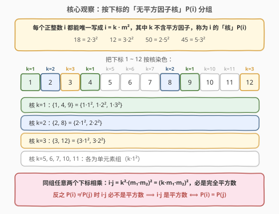
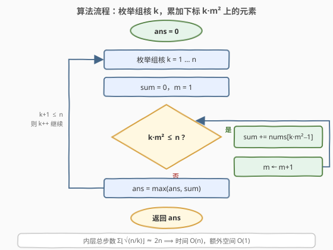
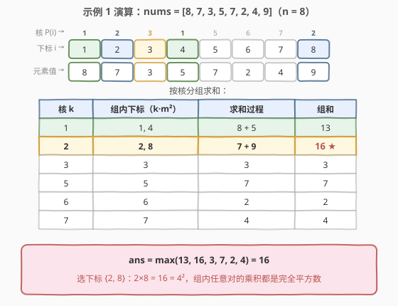

# 完全子集的最大元素和

- **题目名称**：完全子集的最大元素和
- **链接**：[2862. 完全子集的最大元素和](https://leetcode.cn/problems/maximum-element-sum-of-a-complete-subset-of-indices/)
- **难度**：困难
- **标签**：数组、数学、数论

## 1. 题目概述

给你一个下标从 **1** 开始、由 $n$ 个整数组成的数组 `nums`。你需要从 `nums` 选择一个**完全子集**，其中**每对**元素下标的乘积都是一个**完全平方数**——例如选择 $a_i$ 和 $a_j$，则 $i \cdot j$ 一定是完全平方数。

返回**完全子集**所能取到的**最大元素和**。

**示例 1**：

```text
输入：nums = [8,7,3,5,7,2,4,9]
输出：16
解释：我们选择下标为 2 和 8 的元素，并且 2 * 8 = 16 是一个完全平方数。
```

**示例 2**：

```text
输入：nums = [8,10,3,8,1,13,7,9,4]
输出：20
解释：我们选择下标为 1, 4, 9 的元素。1 * 4, 1 * 9, 4 * 9 都是完全平方数。
```

**约束条件**：

- $1 \le n = \text{nums.length} \le 10^4$
- $1 \le \text{nums}[i] \le 10^9$

> 💡 题眼在「**每对**下标的乘积都是完全平方数」——这是一个定义在整个子集上的两两配对条件。$n = 10^4$ 排除了枚举子集，突破口是把配对条件升级为**等价关系**：同组（等价类）内任意两点天然相容，答案就是某个等价类的元素和。

---

## 2. 解题思路

### 2.1 暴力思路：枚举子集

最直接的做法是枚举 `nums` 的所有 $2^n$ 个子集，对每个子集检查所有 $\binom{|S|}{2}$ 对下标的乘积是否为完全平方数，取合法子集的最大和。时间复杂度 $O(2^n \cdot n^2)$，$n = 10^4$ 时是天文数字。

即使想到「单元素子集天然合法，从最大元素开始贪心地扩充集合」，配对条件也不具备贪心所需要的序结构——选了 $i$ 再选 $j$ 是否合法，取决于**两者下标的核**（见下文），与元素值无关，局部最优推不出全局最优。

> ⚠️ 瓶颈的根源：我们把「相容性」当成**两两独立的约束**来处理，每次扩集都要重新检查所有旧成员。若能发现相容性其实是**等价关系**（同组则全体相容、异组则必不相容），问题瞬间从「$2^n$ 个子集里搜索」坍缩为「$O(n)$ 个等价类里挑最大的」。

### 2.2 核心观察：按「无平方因子核」分组

从平方数的判定入手。设 $i = \prod_p p^{\alpha_p}$，$j = \prod_p p^{\beta_p}$，则

$$i \cdot j \text{ 是完全平方数} \iff \forall p:\ \alpha_p + \beta_p \equiv 0 \pmod 2 \iff \forall p:\ \alpha_p \equiv \beta_p \pmod 2$$

也就是说，**两个下标相容 ⟺ 它们对每个质数的指数奇偶性完全相同**。把「奇偶性模板」提取成一个数——定义 $P(x)$ 为 $x$ 的质因数分解中**指数为奇数**的质数之积（称为 $x$ 的**无平方因子核** / squarefree part）：

$$P(18) = P(2^1 \cdot 3^2) = 2,\quad P(45) = P(3^2 \cdot 5^1) = 5,\quad P(50) = P(2^1 \cdot 5^2) = 2$$

于是得到本题的**中心引理**：

$$\boxed{i \cdot j \text{ 是完全平方数} \iff P(i) = P(j)}$$

**证明**：把每个正整数唯一地写成 $x = P(x) \cdot a^2$（把每个质数的偶数次部分整体开方提出来）。

- 若 $P(i) = P(j) = k$，设 $i = k a^2$、$j = k b^2$，则 $i \cdot j = k^2 (ab)^2 = (kab)^2$，是完全平方数；
- 反之若 $P(i) \ne P(j)$，存在质数 $p$ 恰在其中一个核中出现（核是无平方因子的，各质数至多出现一次），于是 $p$ 在 $i \cdot j$ 中的指数为**奇数**，$i \cdot j$ 不是完全平方数。$\blacksquare$

**推论**：定义 $i \sim j \iff P(i) = P(j)$，这是等价关系（自反、对称、传递显然成立）。「完全子集」当且仅当「某个等价类的子集」。由于 $nums[i] \ge 1$ 全为正数，最优解必是**完整的等价类**。而固定核 $k$ 的等价类恰是

$$\{\, i \le n : P(i) = k \,\} = \{\, k \cdot m^2 \le n : m = 1, 2, 3, \dots \,\}$$

——因为 $P(k \cdot m^2) = k$（$k$ 无平方因子，$m^2$ 全是偶数次质数）。



> 💡 **直观记忆**：把每个下标剥掉所有平方因子，剩下的「核」就是它的身份证。身份证相同的人才两两相乘得平方数。例如 $8 = 2 \cdot 2^2$ 与 $2 = 2 \cdot 1^2$ 同核，故 $2 \times 8 = 16 = 4^2$。

### 2.3 算法流程图

实现有**两个等价视角**：

- **视角一（正向生成）**：枚举核 $k = 1 \dots n$，对每个 $k$ 累加下标 $k \cdot 1^2, k \cdot 2^2, k \cdot 3^2, \dots$ 上的元素值，取组和最大——$O(n)$ 时间、$O(1)$ 空间；
- **视角二（反向归类）**：对每个下标 $i$ 试除平方因子求出 $P(i)$，哈希表按核分组累加——$O(n\sqrt n)$ 时间、$O(n)$ 空间。



**完整步骤（视角一）**：

1. 初始化 $ans = 0$；
2. 枚举组核 $k = 1 \dots n$；
3. 对每个 $k$，令 $sum = 0$，从 $m = 1$ 起枚举 $i = k \cdot m^2$，只要 $i \le n$ 就执行 $sum \mathrel{+}= nums[i-1]$、$m \mathrel{+}= 1$；
4. 用 $sum$ 更新 $ans = \max(ans, sum)$；
5. 所有 $k$ 枚举完后返回 $ans$。

> ⚠️ **不必判断 $k$ 是否无平方因子**：核为 $k' = P(k)$ 的完整类包含 $\{k \cdot m^2\}$（因为 $k \cdot m^2 = k' \cdot (\text{某数})^2$），所以非无平方因子的 $k$ 枚举出的集合是某个完整类的**子集**，其和不会超过该类，不影响 $\max$ 的正确性——只是少量重复劳动，换来的是省去判断逻辑。

### 2.4 示例演算

以示例 1 为例：`nums = [8,7,3,5,7,2,4,9]`，$n = 8$。

先给下标 $1 \dots 8$ 求核：$1, 4$ 的核是 $1$（$4 = 1 \cdot 2^2$）；$2, 8$ 的核是 $2$（$8 = 2 \cdot 2^2$）；$3, 5, 6, 7$ 各自成单元素组。



| 核 $k$ | 组内下标（$k \cdot m^2$） | 求和过程 | 组和 |
|--------|--------------------------|----------|------|
| 1 | 1, 4 | $8 + 5$ | 13 |
| 2 | 2, 8 | $7 + 9$ | **16 ★** |
| 3 | 3 | $3$ | 3 |
| 5 | 5 | $7$ | 7 |
| 6 | 6 | $2$ | 2 |
| 7 | 7 | $4$ | 4 |

$ans = \max(13, 16, 3, 7, 2, 4) = 16$ ✓。验证示例 2 同理：核 1 的组是 $\{1, 4, 9\}$（$1 \cdot 1^2, 1 \cdot 2^2, 1 \cdot 3^2$），和为 $8 + 8 + 4 = 20$，恰为答案。

## 3. 参考代码

### C++（视角一：枚举核 $k \cdot m^2$）

```cpp
class Solution {
public:
    long long maximumSum(vector<int>& nums) {
        int n = nums.size();
        long long ans = 0;
        for (int k = 1; k <= n; k++) {                    // 枚举组核 k
            long long sum = 0;
            for (long long m = 1; k * m * m <= n; m++) {  // 组内下标 k*m^2
                sum += nums[k * m * m - 1];
            }
            ans = max(ans, sum);
        }
        return ans;
    }
};
```

### Python（视角二：求核 + 哈希分组）

```python
from collections import defaultdict

class Solution:
    def maximumSum(self, nums: List[int]) -> int:
        n = len(nums)
        groups = defaultdict(int)             # 核 P(i) -> 组内元素和
        for i in range(1, n + 1):
            k = i
            d = 2
            while d * d <= k:                 # 不断整除平方因子，剩下的就是核
                while k % (d * d) == 0:
                    k //= d * d
                d += 1
            groups[k] += nums[i - 1]
        return max(groups.values())
```

## 4. 复杂度分析

| 维度 | 复杂度 | 说明 |
|------|--------|------|
| 时间（枚举法） | $O(n)$ | 双层循环的总访问次数 $\sum_{k=1}^{n} \lfloor\sqrt{n/k}\rfloor \approx \sqrt{n}\sum_{k=1}^{n} k^{-1/2} \approx 2n$（$p = 1/2$ 的调和级数收敛） |
| 空间（枚举法） | $O(1)$ | 只需 `ans`、`sum` 等常数个变量 |
| 时间（求核哈希法） | $O(n\sqrt n)$ | 每个下标 $i$ 试除到 $\sqrt i$ 去平方因子 |
| 空间（求核哈希法） | $O(n)$ | 哈希表最多存 $n$ 个组的和 |

> 💡 枚举法的 $O(n)$ 不是直觉上的 $O(n\sqrt n)$：内层步数是 $\sqrt{n/k}$ 而非 $\sqrt n$，随 $k$ 增大递减，求和收敛到约 $2n$——这正是视角一「正向生成」相对视角二「逐个求核」的优势所在。

## 5. 扩展：两个视角的对照与实现细节

**枚举法的 Python 对照版**（与 C++ 版逻辑一致）：

```python
class Solution:
    def maximumSum(self, nums: List[int]) -> int:
        n = len(nums)
        ans = 0
        for k in range(1, n + 1):
            s, m = 0, 1
            while k * m * m <= n:
                s += nums[k * m * m - 1]
                m += 1
            ans = max(ans, s)
        return ans
```

几个值得注意的实现细节：

1. **下标偏移**：题目下标从 1 开始而数组从 0 开始，访问 `nums[k*m*m - 1]`，易错点是漏写 `-1`；
2. **溢出**：组和最大 $10^4 \times 10^9 = 10^{13}$，超出 32 位整数范围，必须用 64 位（C++ 的 `long long`）；内层判断 $k \cdot m^2 \le n$ 中间乘积在边界处也会略超 $n$，C++ 中让 $m$ 走 64 位最稳妥；
3. **两视角的取舍**：枚举法理论复杂度更优且无哈希开销，是竞赛首选；求核哈希法更贴近「引理」的推导过程，当问题变形为「输出每组的构成」「按核做其他聚合统计」时更通用；
4. **数论背景**：无平方因子核 $P(x)$ 即 $x$ 在商群 $\mathbb{Q}^+ / (\mathbb{Q}^+)^2$ 中的代表元。「$i \cdot j$ 是平方数」的等价类正是该商群的陪集结构，这一视角在 Pell 方程、二次域等专题中反复出现。

## 6. 面试要点

- **为什么「两两乘积为平方数」不能直接 DP 或贪心？**
  它是定义在子集上的全局配对条件，不具备贪心所需的序结构，朴素 DP 的状态也无法压缩（子集太大）。正确姿势是证明相容性是**等价关系**，把「选子集」变成「选等价类」，组合搜索坍缩为分组统计。

- **如何自然地想到「无平方因子核」？**
  从平方数判定出发：$i \cdot j$ 是平方数 ⟺ 每个质数的指数之和为偶 ⟺ 两者指数**奇偶性逐质数相同**。奇偶性模板编码成一个数就是 $P(x)$。面试中先写质因数分解的奇偶条件，再「顺手」定义核，推导链最顺。

- **枚举 $k$ 的双重循环为什么是 $O(n)$ 而不是 $O(n\sqrt n)$？**
  内层步数是 $\lfloor\sqrt{n/k}\rfloor$ 而非 $\sqrt n$，总步数 $\sum_k \sqrt{n/k} = \sqrt n \sum_k k^{-1/2} \approx 2n$。可类比「调和级数 $\sum 1/k \approx \ln n$」——这里是 $p = 1/2$ 版本。

- **不判断 $k$ 是否无平方因子，会不会算错？**
  不会。核为 $k' = P(k)$ 的完整类包含 $\{k \cdot m^2\}$ 这个子集，故非无平方因子 $k$ 的和必不超过其核的完整类，$\max$ 不受影响；最坏也只是常数级别的重复访问。

- **实现上有哪些坑？**
  下标从 1 开始（`nums[k*m*m - 1]`）；元素和最大约 $10^{13}$ 必须 64 位；C++ 里 $k \cdot m \cdot m$ 的中间乘积建议用 64 位变量承载，避免边界溢出。

## 7. 同类练习题

- [633. 平方数之和](https://leetcode.cn/problems/sum-of-square-numbers/)：判定 $c = a^2 + b^2$ 是否成立，同属完全平方数主题的经典练习；
- [2521. 数组乘积中的不同质因数数目](https://leetcode.cn/problems/distinct-prime-factors-of-product-of-array/)：对一组数做质因数分解统计，练习本题 $P(x)$ 计算的基础工具；
- [1735. 生成乘积数组的方案数](https://leetcode.cn/problems/count-ways-to-make-array-with-product/)：按质因子指数分组分配计数，「指数奇偶性模板」思想的进阶应用；
- [204. 计数质数](https://leetcode.cn/problems/count-primes/)：埃氏筛，数论题的基础工具箱，配合试除法使用。
