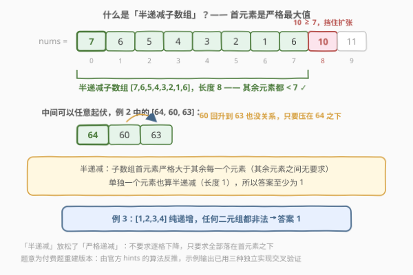
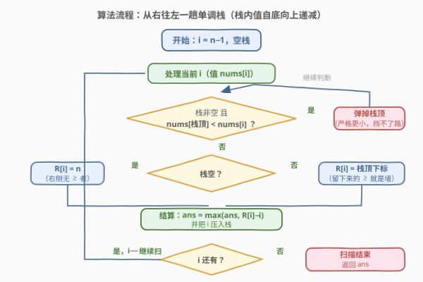

# LeetCode 最长半递减子数组的长度 题解

## 1. 题目概述

- **标题 / 题号**：最长半递减子数组的长度（#2863，medium）
- **链接**：https://leetcode.cn/problems/maximum-length-of-semi-decreasing-subarrays/
- **难度**：中等
- **标签**：栈、数组、排序、单调栈

> ⚠️ 本题为 LeetCode 付费题，题意描述根据官方示例用例与 hints 重建，可能与官方题面有出入。

**题意**：给定一个下标从 0 开始的整数数组 `nums`。我们称一个子数组是**半递减**（semi-decreasing）的，当且仅当它的**首元素严格大于其余每一个元素**——其余元素之间的大小关系不做任何要求。单独一个元素也算半递减子数组。

求 `nums` 中半递减子数组的**最大长度**，函数签名 `maxSubarrayLength(nums)`。

**示例 1**：

```text
输入：nums = [7,6,5,4,3,2,1,6,10,11]
输出：8
解释：子数组 [7,6,5,4,3,2,1,6]（下标 0..7）是半递减的：
     6,5,4,3,2,1,6 都严格小于首元素 7；中间先一路下降再回升到 6 也没关系。
     再向右扩一格会把 10 圈进来（10 ≥ 7），失去半递减性质，故最长为 8。
```

**示例 2**：

```text
输入：nums = [57,55,50,60,61,58,63,59,64,60,63]
输出：3
解释：[57,55,50] 与 [64,60,63] 都是长度 3 的半递减子数组，
     且不存在更长的：例如 [61,58,63,59,64,...] 中 64 > 61，扩张即失效。
```

**示例 3**：

```text
输入：nums = [1,2,3,4]
输出：1
解释：数组严格递增，任何长度 ≥ 2 的子数组首元素都是最小值，
     只能取单个元素，答案为 1。
```

**约束条件**（付费题未公开，按同类题常规规模推测）：

- $1 \le \text{nums.length} \le 10^5$
- $1 \le \text{nums}[i] \le 10^9$
- 元素可能重复（官方 hint 明确先假设互异、再要求去掉该假设，说明存在重复值用例）

> 💡 「半递减」是对「严格递减」的放松：不要求逐格下降，只要求所有元素都**压在首元素之下**。判定只看首元素与其余元素的相对大小，与中段起伏无关——这是解题的钥匙。

## 2. 解题思路

### 2.1 暴力思路

枚举每个起点 $i$，向右逐格扩张：只要 $\text{nums}[k] < \text{nums}[i]$ 就继续，遇到第一个不小于 $\text{nums}[i]$ 的元素立即停下：

```python
# O(n^2) 暴力：枚举起点，向右扩张
ans = 0
for i in range(n):
    k = i
    while k + 1 < n and nums[k + 1] < nums[i]:
        k += 1
    ans = max(ans, k - i + 1)
```

瓶颈在极端数据：**严格递减数组**（如 $[n, n-1, \dots, 1]$）中每个起点都能一路扩张到末尾，第 $i$ 个起点要扫描 $n - i$ 格，总代价

$$\sum_{i=0}^{n-1}(n-i) = \frac{n(n+1)}{2} = O(n^2)$$

$n = 10^5$ 时约 $5 \times 10^9$ 次比较，必然超时。

### 2.2 核心观察：右侧第一个「不小于」的元素是墙



对每个下标 $i$ 定义：

$$R[i] = \min\{\, j > i : \text{nums}[j] \ge \text{nums}[i] \,\}$$

即 $i$ **右侧第一个大于或等于** $\text{nums}[i]$ 的下标；不存在时记 $R[i] = n$（哨兵）。

三条观察：

1. **墙内畅通**：子数组 $\text{nums}[i .. R[i]-1]$ 中，$i$ 之后的元素全都严格小于 $\text{nums}[i]$（否则那个元素下标更小，与 $R[i]$ 的「第一个」矛盾）——它是一个合法的半递减子数组，长度 $R[i] - i$。

2. **墙外受阻**：任何从 $i$ 出发、长度超过 $R[i] - i$ 的子数组必然包含 $\text{nums}[R[i]] \ge \text{nums}[i]$，首元素失去严格最大值身份，非法。所以 $R[i] - i$ 恰是**从 $i$ 出发能达到的最大长度**。

3. **左边无关**：合法性只取决于 $i$ **右侧**的元素，$i$ 左边有什么完全不影响——因此每个 $i$ 都可以直接作为候选起点，无需任何筛选。

![核心观察：R[i] = 右侧第一个不小于 nums[i] 的下标](../images/p2863_next_ge_stack.svg)

于是答案塌缩成一个干净的公式：

$$\text{ans} = \max_{0 \le i < n} \bigl( R[i] - i \bigr)$$

而「批量求每个位置的**下一个更大或相等元素**」正是**单调栈**的招牌场景，与 [739. 每日温度](../0701-0800/739_每日温度.md)（下一个更大）、[2832. 每个元素为最大值的最大范围](../2801-2900/2832_每个元素为最大值的最大范围.md)（两侧最近更大）同一家族。

从右往左扫描，维护一个**栈内对应值自底向上递减**的栈（栈里存下标）：

- 遍历到 $i$ 时，把栈顶所有**值严格小于** $\text{nums}[i]$ 的下标弹掉——它们挡不住 $i$，且 $i$ 比它们更靠左、值又不小，以后更不可能被用到；
- 弹完后的栈顶（若存在）就是 $R[i]$，栈空则 $R[i] = n$；
- 结算 $\text{ans} = \max(\text{ans},\ R[i] - i)$，再把 $i$ 压栈。

> 💡 弹栈条件是**严格小于**而非「小于等于」：本题要找的是「下一个 $\ge$」，相等的元素也要当墙留下。这与 [2832. 每个元素为最大值的最大范围](../2801-2900/2832_每个元素为最大值的最大范围.md) 恰好互补——那题找「下一个 $>$」，弹的是「$\le$」。比较类单调栈题务必先想清楚**相等元素挡不挡路**。

### 2.3 算法流程图



一趟扫描，弹出、读墙、结算、压栈，循环往复；扫描结束后 `ans` 即答案。

### 2.4 示例演算

![示例演算：nums = [7,6,5,4,3,2,1,6,10,11] 的单调栈轨迹](../images/p2863_example_walkthrough.svg)

以示例 1 `nums = [7,6,5,4,3,2,1,6,10,11]` 为例，从右往左（$i = 9 \to 0$），关键几步：

| i | nums[i] | 弹栈动作 | R[i] | R[i]−i | 子数组 |
|---|---------|----------|------|--------|--------|
| 9 | 11 | 栈空 | 10 = $n$ | 1 | [11] |
| 8 | 10 | 11 ≥ 10 不弹 | 9 | 1 | [10] |
| 5 | 2 | 弹出 6（值 1） | 7 | 2 | [2,1] |
| 1 | 6 | 弹出 2（值 5）；**6 = 6 不弹** | 7 | 6 | [6,5,4,3,2,1,6] |
| 0 | 7 | 弹出 1、7（值 6）；10 ≥ 7 停 | **8** | **8** | [7,6,5,4,3,2,1,6] |

全部结算值为 $\{1,1,1,1,2,3,4,5,6,8\}$，$\text{ans} = 8$，与预期一致。注意 $i=1$ 行：右侧下标 7 处还有一个相等的 6，它**不被弹出**、恰好充当 $R[1]$ 的墙——「相等也挡路」正是付费题面里重复值用例的考点。

## 3. 参考代码

### C++

```cpp
class Solution {
public:
    int maxSubarrayLength(vector<int>& nums) {
        int n = nums.size();
        int ans = 0;
        stack<int> stk;                        // 栈内下标对应值自底向上递减
        for (int i = n - 1; i >= 0; --i) {     // 从右往左：求右侧第一个 >= nums[i]
            while (!stk.empty() && nums[stk.top()] < nums[i]) stk.pop();
            int r = stk.empty() ? n : stk.top();   // 哨兵 n 统一"右侧没有墙"的情况
            ans = max(ans, r - i);
            stk.push(i);
        }
        return ans;
    }
};
```

### Python

```python
class Solution:
    def maxSubarrayLength(self, nums: List[int]) -> int:
        n = len(nums)
        ans = 0
        stk = []                               # 栈内下标对应值自底向上递减
        for i in range(n - 1, -1, -1):         # 从右往左：求右侧第一个 >= nums[i]
            while stk and nums[stk[-1]] < nums[i]:
                stk.pop()
            r = stk[-1] if stk else n          # 哨兵 n 统一"右侧没有墙"的情况
            ans = max(ans, r - i)
            stk.append(i)
        return ans
```

> 💡 $R[i]$ 无需存进数组，结算完即可丢弃——空间里只留下一个栈。哨兵 $n$ 把「右侧无墙」和「有墙」两种情况合并成同一个表达式，免特判。

## 4. 复杂度分析

| 维度 | 复杂度 | 说明 |
|------|--------|------|
| 时间复杂度 | $O(n)$ | **均摊分析**：每个下标至多入栈一次、出栈一次，内层 `while` 的总弹出次数 $\le n$，加上外层一趟扫描，总操作数为 $O(n)$ 的常数倍 |
| 空间复杂度 | $O(n)$ | 栈内最多同时存放 $n$ 个下标（严格递减数组时全体滞留栈中）；$R$ 值即时结算不落盘 |

> 💡 `for` 套 `while` 的均摊论证与 [739. 每日温度](../0701-0800/739_每日温度.md)、[901. 股票价格跨度](../0901-1000/901_股票价格跨度.md) 完全同款：每次弹栈都永久消耗一个早已入栈的下标，总入栈 $= n$，总出栈 $\le n$。

## 5. 扩展：官方 hint 的排序法 $O(n \log n)$

官方提示给出另一条路：**按值从大到小排序后扫描，维护已见过的最小下标**。

```python
class Solution:
    def maxSubarrayLength(self, nums: List[int]) -> int:
        n = len(nums)
        # 值降序；同值时下标降序（关键！）
        order = sorted(range(n), key=lambda i: (-nums[i], -i))
        ans = 0
        min_index = n                          # 哨兵：还没有更大元素被见过
        for x in order:
            ans = max(ans, min_index - x)      # 更大（或同值更右）元素中的最小下标
            min_index = min(min_index, x)
        return ans
```

原理：处理到 $(\text{nums}[x], x)$ 时，先前迭代过的都是**值更大**的元素（同值时只见过**下标更大**的那些），`min_index` 即「所有 $\ge \text{nums}[x]$ 且该挡路的元素」的最小下标。若它 $> x$，说明 $x$ 右侧到 `min_index` 之前全部 $< \text{nums}[x]$，得到候选长度 `min_index - x`；若它 $< x$，说明左边已有更大元素压着，候选为负自动作废（这类起点无论如何不会成为最优——把起点左移到那个更大元素只会更长）。

**同值按下标降序**是去重假设（hint 第 1 条与最后一条）的答案：相等的元素也会挡路，处理 $x$ 前必须先见过它**右侧**的同值元素、且不能让它**左侧**的同值元素提前污染 `min_index`。单测中重复值较多的用例（如示例 2 的两个 63、两个 60）正考察此处——若同值按下标升序排，`[5,5,3,1]` 会错算成 4（正确答案 3：`[5,3,1]`，第二个 5 不再严格小于首元素）。

两种写法已用暴力 $O(n^2)$ 在数千组含重复值的随机数据上交叉验证一致。排序法多一个 $\log$ 因子且边界更绕，单调栈法更值得首选；但「排序 + 维护最小下标」的视角在离线批量比较类问题中很常见，值得收录。

## 6. 面试要点

1. **为什么答案是 $\max(R[i] - i)$，起点不需要任何筛选？**

   > 对任意 $i$，$[i .. R[i]-1]$ 内 $i$ 之后全严格小于 $\text{nums}[i]$，天然合法；再长一步就会圈进 $\text{nums}[R[i]] \ge \text{nums}[i]$ 而非法。合法性只由 $i$ 的右侧决定，所以每个 $i$ 都贡献一个「从它出发的最优候选」，取全局最大即可。对比排序法隐含「起点须是前缀最大值」的筛选，栈写法把这个筛选省掉了。

2. **弹栈条件为什么是「严格小于」？写成「小于等于」会怎样？**

   > 本题的墙是「下一个**大于或等于**」，相等元素也必须挡路。若弹掉相等元素，`[5,5,3,1]` 中 $R[0]$ 会被误判为更远的位置，把 $[5,5,3,1]$ 整段错认成半递减（第二个 5 并不严格小于 5）。口诀：**先问相等挡不挡路，再定弹栈带不带等号**——本题找 $\ge$ 弹 `<`，2832 找 $>$ 弹 `<=`，方向正好相反。

3. **从右往左扫、从左往右扫有区别吗？**

   > 都能做，但方向决定栈内形态：求「右侧下一个 $\ge$」时从右往左扫，读墙在压栈之前自然完成；若坚持从左往右，则要用「弹出即结算」——下标 $j$ 被 $i$ 弹出意味着 $R[j] = i$，注意相等元素不触发弹出，得靠末尾哨兵收尾，细节更多。面试推荐前者。

4. **`for` 里嵌 `while`，为什么是 $O(n)$ 而不是 $O(n^2)$？**

   > 均摊：每个下标恰好入栈一次，出栈至多一次，`while` 的总步数被总入栈数 $n$ 封顶。嵌套循环不等于嵌套复杂度，看的是**每个元素一生被操作几次**。

5. **答案的下界是多少？为什么示例 3 返回 1 而不是 0？**

   > 单元素子数组 vacuously 满足「首元素严格大于其余所有元素」（没有其余元素），故任何非空数组的答案 $\ge 1$。严格递增数组里长度 $\ge 2$ 的子数组首元素都是最小值，只剩单元素可选，因此示例 3 输出 1。这一点也由官方 hint 算法印证：`min_index` 初始化为 $n$，首元素（全局最大）自然结算出 $n - i$，单元素候选不会被漏掉。

## 同类练习题

| # | 题目 | 与本题的关联 |
|---|------|-------------|
| 2832 | [每个元素为最大值的最大范围](https://leetcode.cn/problems/maximal-range-that-each-element-is-maximum-in-it/)（[题解](../2801-2900/2832_每个元素为最大值的最大范围.md)） | 同为付费题、同用单调栈找「墙」，那题两侧最近**更大**夹区间、本题单侧「更大或相等」定长度，弹栈等号方向恰好相反 |
| 739 | [每日温度](https://leetcode.cn/problems/daily-temperatures/)（[题解](../0701-0800/739_每日温度.md)） | 求右侧最近更大元素的距离，本题的入门版（距离语义完全一致，等号处理不同） |
| 901 | [股票价格跨度](https://leetcode.cn/problems/online-stock-span/)（[题解](../0901-1000/901_股票价格跨度.md)） | 左侧最近更大元素决定跨度，「弹出即结算」与均摊分析的出处 |
| 496 | [下一个更大元素 I](https://leetcode.cn/problems/next-greater-element-i/)（[题解](../0401-0500/496_下一个更大元素 I.md)） | 单调栈 + 哈希求下一个更大元素的「值」，把本题的墙从下标换成值 |
| 503 | [下一个更大元素 II](https://leetcode.cn/problems/next-greater-element-ii/)（[题解](../0501-0600/503_下一个更大元素 II.md)） | 循环数组上的下一个更大元素，单调栈 + 取模二倍长度的经典变体 |
