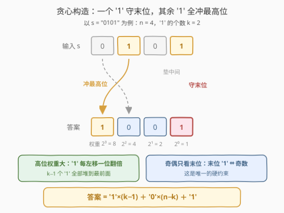
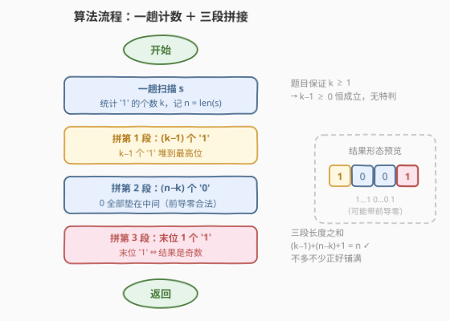
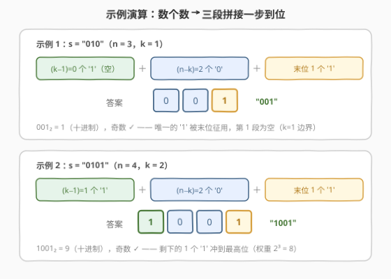

# LeetCode 最大二进制奇数 题解

## 1. 题目概述

- **标题 / 题号**：最大二进制奇数（#2864，easy）
- **链接**：https://leetcode.cn/problems/maximum-odd-binary-number/
- **难度**：简单
- **标签**：贪心、数学、字符串

**题意**：给你一个**二进制**字符串 $s$，其中至少包含一个 `'1'`。

你必须按某种方式**重排**字符串中的位，使得得到的二进制数字是可以由该组合生成的**最大二进制奇数**。

以字符串形式表示并返回可以由给定组合生成的最大二进制奇数。

**注意**：返回的结果字符串**可以**含前导零。

**示例 1**：

```text
输入：s = "010"
输出："001"
解释：因为字符串 s 中仅有一个 '1'，其必须出现在最后一位上。所以答案是 "001"。
```

**示例 2**：

```text
输入：s = "0101"
输出："1001"
解释：其中一个 '1' 必须出现在最后一位上。而由剩下的数字可以生产的最大数字是 "100"。所以答案是 "1001"。
```

**约束**：

- $1 \le s.length \le 100$
- $s$ 仅由 `'0'` 和 `'1'` 组成
- $s$ 中至少包含一个 `'1'`

> 💡 读题关键：两个关键词拆开看——「**奇数**」只由**末位**决定（末位 1 即奇）；「**最大**」由**高位**决定（'1' 放得越靠左数值越大）。两个约束互不抢位：一个 '1' 看守末位，剩下的 '1' 全部冲向最高位。至于前导零，题目明确放行。

## 2. 解题思路

### 2.1 暴力思路

最朴素的想法是**枚举所有重排**：生成 $s$ 的全部排列，过滤出末位为 `'1'` 的排列，再在其中取数值最大者。长度为 $n$ 的字符串最多有 $O(n!)$ 个排列，$n = 100$ 时是天文数字，直接爆炸。

稍作收敛可以想到**排序**：把 $s$ 降序排序得到 `1…10…0`（所有 '1' 冲到最前，这已经是「最大」的架势），但末位是 `'0'`，不满足奇数约束——还得把最后一个 '1' 挪到末尾去。这个思路已经非常接近正解，但它绕了「排序」这个弯路：**我们其实根本不关心每个字符的原始位置，只需要知道 '1' 和 '0' 各有几个。**

### 2.2 核心观察：计数构造——「守末位 + 冲高位」



**观察 1（奇数约束 ⇔ 末位是 '1'）**：二进制数 $\sum_i b_i 2^i$ 中，$i \ge 1$ 的项全是 2 的倍数，奇偶性完全取决于最低位 $b_0$。所以答案的**末位必须是一个 '1'**：从 $k$ 个 '1' 里**扣下一个**看守末位。

**观察 2（最大化 ⇔ '1' 冲高位）**：同样个数的 '1'，放在权重越大的位贡献越大；任何「高位是 0、低位是 1」的安排，把两者交换都会严格变大。所以剩下的 $k-1$ 个 '1' 应当**全部堆到最前面**。

**观察 3（'0' 的归宿）**：剩下的 $n-k$ 个 '0' 只能垫在中间——而题目**明确允许前导零**，连「开头不能是 0」这条最后的美学约束也被豁免了。

三个观察合起来，答案的形态是唯一的：

$$\text{答案} = \underbrace{11\cdots1}_{k-1\ \text{个}} + \underbrace{00\cdots0}_{n-k\ \text{个}} + 1$$

> 💡 本质上这是一道**披着字符串外衣的贪心构造题**：约束「奇数」钉死末位，目标「最大」钉死其余 '1' 的位置，'0' 无处可去只能填中间。整个解法不依赖原串的任何顺序信息——**数一遍个数就够了**。

### 2.3 算法流程图



整个算法只有「一趟计数 + 三段拼接」：

1. 扫描 $s$，统计 `'1'` 的个数 $k$（$n$ 为串长）；
2. 依次拼接：$(k-1)$ 个 `'1'` → $(n-k)$ 个 `'0'` → 末位一个 `'1'`；
3. 返回拼接结果。

题目保证 $k \ge 1$，因此 $k - 1 \ge 0$ 恒成立，**无需任何特判**——连「全 0」这种边界都被约束排除掉了。

### 2.4 示例演算



| 步骤 | 示例 1：s = "010" | 示例 2：s = "0101" |
|------|-------------------|--------------------|
| 统计 | $n = 3$，$k = 1$ | $n = 4$，$k = 2$ |
| 拼第 1 段（$k-1$ 个 '1'） | `""`（0 个） | `"1"`（1 个） |
| 拼第 2 段（$n-k$ 个 '0'） | `"00"`（2 个） | `"00"`（2 个） |
| 拼第 3 段（末位 '1'） | `"1"` | `"1"` |
| 结果 | `"001"`（= 1，奇数 ✓） | `"1001"`（= 9，奇数 ✓） |

示例 1 是 $k = 1$ 的**边界情形**：唯一的 '1' 被末位征用，第 1 段为空串，答案就是一串前导零 + 末位 1。

## 3. 参考代码

### C++

```cpp
class Solution {
public:
    string maximumOddBinaryNumber(string s) {
        int n = s.size();
        int k = count(s.begin(), s.end(), '1');   // 一趟计数
        return string(k - 1, '1') + string(n - k, '0') + '1';
    }
};
```

### Python

```python
class Solution:
    def maximumOddBinaryNumber(self, s: str) -> str:
        k = s.count('1')                          # 一趟计数
        return '1' * (k - 1) + '0' * (len(s) - k) + '1'
```

> 💡 两行代码的关键是 `string(cnt, ch)` / `ch * cnt` 的**字符重复构造**：三段各自直接生成，连循环都不用手写。

## 4. 复杂度分析

| 维度 | 复杂度 | 说明 |
|------|--------|------|
| 时间复杂度 | $O(n)$ | 一趟扫描计数 $O(n)$ + 构造结果串 $O(n)$ |
| 空间复杂度 | $O(n)$ | 存放返回的答案字符串（语言层面不可避免；额外辅助空间为 $O(1)$） |

## 5. 扩展：一次遍历的「原地重排」写法

计数法构造了新串；如果想展示「重排」本身的操作感（面试口述时的加分写法），可以**在原串上双指针交换**，只用 $O(1)$ 额外空间：

```cpp
class Solution {
public:
    string maximumOddBinaryNumber(string s) {
        int n = s.size();
        if (s[n - 1] != '1') {                    // 第一步：征用一个 '1' 守末位
            for (int i = 0; i < n; i++) {
                if (s[i] == '1') { swap(s[i], s[n - 1]); break; }
            }
        }
        int j = 0;                                // 第二步：其余 '1' 全部冒到最前
        for (int i = 0; i < n - 1; i++) {
            if (s[i] == '1') swap(s[i], s[j++]);
        }
        return s;
    }
};
```

```python
class Solution:
    def maximumOddBinaryNumber(self, s: str) -> str:
        s = list(s)
        n = len(s)
        if s[n - 1] != '1':                       # 第一步：征用一个 '1' 守末位
            for i in range(n):
                if s[i] == '1':
                    s[i], s[n - 1] = s[n - 1], s[i]
                    break
        j = 0                                     # 第二步：其余 '1' 全部冒到最前
        for i in range(n - 1):
            if s[i] == '1':
                s[i], s[j] = s[j], s[i]
                j += 1
        return ''.join(s)
```

两步恰好对应两个观察：**先满足约束**（末位放 '1'），**再贪心优化**（'1' 冲高位）。与 2.2 的计数构造殊途同归，时间同为 $O(n)$。

顺带一提 2.1 中排序思路的正确落地：降序排序得 `1…10…0` 后，把下标 $k-1$ 处的 '1' 与末位 '0' 交换即可，$O(n \log n)$，能过但绕路。

## 6. 面试要点

1. **为什么答案末位必须是 '1'？**

   > 二进制数值 $= b_0 + 2\sum_{i \ge 1} b_i 2^{i-1}$，除 $b_0$ 外全是 2 的倍数。奇偶性由最低位 $b_0$ 独占——末位 1 即奇数，末位 0 即偶数，与其余位无关。

2. **为什么剩下的 '1' 全堆最前面就一定最大？怎么证明？**

   > 交换论证：设某可行解（末位已为 '1'）中存在位置 $a$、$b$ 满足 $a$ 比 $b$ 高（$2^a > 2^b$，且 $b$ 不是末位），高位 $a$ 处是 '0'、低位 $b$ 处是 '1'。交换两处后数值增加 $2^a - 2^b > 0$，严格变大，且末位不动、奇偶性不变。因此最优解中除末位外不存在「高位 0 压着低位 1」的逆置——即 '1' 必须全部连续贴在最前面。

3. **前导零不影响数值吗？**

   > 不影响。`"001"` 与 `"1"` 表示同一个数 1；题目还专门声明允许前导零，等于是把 $k = 1$ 时的答案合法化（唯一 '1' 守末位后，前面必然全是 0）。

4. **如果改成求「最大二进制偶数」呢？**

   > 末位换成 '0'：答案是 `'1' × k + '0' × (n-k)`，即 $k$ 个 '1' 冲高位、其余 '0' 垫后。但当 $n = k$（全 1）时**不存在偶数**，需按题意返回空串或特殊标记——本题「至少一个 1」对奇数版本恰好无此坑（$k \ge 1$ 保证末位一定有 '1' 可用）。

5. **这题和「排序后交换」的解法是什么关系？**

   > 降序排序后交换 `s[k-1]` 与 `s[n-1]` 也能得到答案，$O(n \log n)$。但它多做了功：排序重排的是「字符的顺序」，而答案只依赖「字符的计数」——识别出顺序信息冗余、把问题降维到计数，正是本题唯一的思维含量。

## 同类练习题

| # | 题目 | 与本题的关联 |
|---|------|-------------|
| 942 | [增减字符串匹配](https://leetcode.cn/problems/di-string-match/) | 按 I/D 指令双端贪心构造排列，与本题同属「约束钉死一端 + 贪心堆另一端」的构造套路 |
| 1323 | [6 和 9 组成的最大数字](https://leetcode.cn/problems/maximum-69-number/) | 最多把一个 6 换成 9 使数最大，位值贪心「最小改动换最大收益」 |
| 2160 | [拆分数位后四位数字的最小和](https://leetcode.cn/problems/minimum-sum-of-four-digit-number-after-splitting-digits/) | 重排数位后求最小和，本题「最大化」的镜像版 |
| 179 | [最大数](https://leetcode.cn/problems/largest-number/) | 重排数字串使拼接出的数最大，贪心构造家族的进阶（需自定义比较器证明传递性） |
